# ⚙️ Panel de Administración (Actualizado)

Panel de administración para gestión avanzada de productos, pedidos, usuarios, clientes, cupones, categorías, unidades, tags y más.

## Tabla de Endpoints y Permisos por Rol

| Endpoint                        | Descripción                        | Lectura | Creación | Modificación | Eliminación | Roles Permitidos           |
|----------------------------------|------------------------------------|---------|----------|--------------|-------------|----------------------------|
| `/api/admin/products`            | Gestión de productos               |   ✅    |   ✅     |     ✅       |     ✅      | ADMIN, SUPER_ADMIN         |
| `/api/admin/categories`          | Gestión de categorías              |   ✅    |   ✅     |     ✅       |     ✅      | ADMIN, SUPER_ADMIN         |
| `/api/admin/orders`              | Gestión de pedidos                 |   ✅    |   ❌     |     ✅       |     ✅      | ADMIN, SUPER_ADMIN         |
| `/api/admin/users`               | Gestión de usuarios                |   ✅    |   ✅     |     ✅       |     ✅      | SUPER_ADMIN                |
| `/api/admin/coupons`             | Gestión de cupones                 |   ✅    |   ✅     |     ✅       |     ✅      | ADMIN, SUPER_ADMIN         |
| `/api/admin/payments`            | Gestión de pagos                   |   ✅    |   ❌     |     ✅       |     ✅      | ADMIN, SUPER_ADMIN         |
| `/api/admin/reports`             | Reportes y métricas                |   ✅    |   ❌     |     ❌       |     ❌      | ADMIN, SUPER_ADMIN         |
| `/api/admin/units`               | Gestión de unidades                |   ✅    |   ✅     |     ✅       |     ✅      | ADMIN, SUPER_ADMIN         |
| `/api/admin/tags`                | Gestión de etiquetas               |   ✅    |   ✅     |     ✅       |     ✅      | ADMIN, SUPER_ADMIN         |
| `/api/admin/neighborhoods`       | Gestión de barrios                 |   ✅    |   ✅     |     ✅       |     ✅      | ADMIN, SUPER_ADMIN         |
| `/api/admin/cities`              | Gestión de ciudades                |   ✅    |   ✅     |     ✅       |     ✅      | ADMIN, SUPER_ADMIN         |
| `/api/admin/chat-sessions`       | Gestión de sesiones de chat        |   ✅    |   ❌     |     ✅       |     ✅      | SUPER_ADMIN                |
| `/api/admin/embeddings`          | Gestión de embeddings IA           |   ✅    |   ✅     |     ✅       |     ✅      | SUPER_ADMIN                |
| `/api/admin/seed`                | Ejecutar seeders                   |   ❌    |   ✅     |     ❌       |     ❌      | SUPER_ADMIN                |

**Notas:**
- El rol `ADMIN` tiene acceso completo excepto a usuarios, chat y embeddings (solo `SUPER_ADMIN`).
- El rol `SUPER_ADMIN` tiene acceso total a todos los endpoints.
- El rol `USER` no tiene acceso a ningún endpoint bajo `/api/admin/*`.
- Los endpoints pueden requerir permisos adicionales según la lógica de negocio.

## 📑 Índice

- [Endpoints y Estructura Real](#endpoints-y-estructura-real)
- [Autorización y Roles](#autorización-y-roles)
- [Flujo de Autorización (Mermaid)](#flujo-de-autorización-mermaid)
- [Ejemplo de Rutas y Códigos de Respuesta](#ejemplo-de-rutas-y-códigos-de-respuesta)
- [Notas y Discrepancias Detectadas](#notas-y-discrepancias-detectadas)

---

## Endpoints y Estructura Real

### Prefijo de todas las rutas de administración

```
/api/admin/*
```

**Todas las rutas están protegidas por:**
- `AuthMiddleware.validateJwt`
- `AuthMiddleware.checkRole(['ADMIN_ROLE'])`

### Subrutas disponibles (según código real):

- `/products` → Gestión de productos (CRUD, búsqueda, por categoría)
- `/categories` → Gestión de categorías
- `/units` → Gestión de unidades
- `/tags` → Gestión de tags
- `/orders` → Gestión de pedidos (ventas)
- `/customers` → Gestión de clientes
- `/users` → Gestión de usuarios administrativos
- `/coupons` → Gestión de cupones
- `/cities` → Gestión de ciudades
- `/neighborhoods` → Gestión de barrios
- `/telegram` → Integración Telegram (notificaciones)

#### Ejemplo de endpoints reales para productos

| Método | Endpoint | Descripción | Body/Query | Respuesta |
|--------|----------|-------------|------------|-----------|
| GET    | `/api/admin/products` | Listar productos | `?page,limit,search` | `{ items: Product[], total: number }` |
| GET    | `/api/admin/products/search` | Buscar productos | `?q=texto` | `{ items: Product[], total: number }` |
| GET    | `/api/admin/products/by-category/:categoryId` | Productos por categoría |  | `{ items: Product[], total: number }` |
| GET    | `/api/admin/products/:id` | Obtener producto por ID |  | `Product` |
| POST   | `/api/admin/products` | Crear producto | `multipart/form-data` (campos + imagen opcional) | `Product` |
| PUT    | `/api/admin/products/:id` | Actualizar producto | `multipart/form-data` (campos + imagen opcional) | `Product` |
| DELETE | `/api/admin/products/:id` | Eliminar producto |  | `{ message: string }` |

#### Ejemplo de endpoints reales para usuarios

| Método | Endpoint | Descripción | Body/Query | Respuesta |
|--------|----------|-------------|------------|-----------|
| GET    | `/api/admin/users` | Listar usuarios | `?page,limit,role,search,isActive` | `{ users: User[], total, page, limit, totalPages }` |
| GET    | `/api/admin/users/:id` | Obtener usuario por ID |  | `User` |
| PUT    | `/api/admin/users/:id` | Actualizar usuario (roles, datos) | `{ name, email, roles, ... }` | `User` |
| DELETE | `/api/admin/users/:id` | Eliminar usuario |  | `{ message: string }` |

#### Ejemplo de endpoints reales para pedidos

| Método | Endpoint | Descripción | Body/Query | Respuesta |
|--------|----------|-------------|------------|-----------|
| GET    | `/api/admin/orders` | Listar ventas/pedidos | `?page,limit,status,dateFrom,dateTo` | `{ items: Order[], total }` |
| GET    | `/api/admin/orders/:id` | Obtener pedido por ID |  | `Order` |
| PATCH  | `/api/admin/orders/:id/status` | Actualizar estado de pedido | `{ statusId, notes, notifyCustomer, trackingNumber }` | `Order` |
| PUT    | `/api/admin/orders/:id` | Actualización completa de pedido | `{ ... }` | `Order` |

> **Nota:** No existen endpoints `/dashboard/metrics`, `/dashboard/charts`, `/dashboard/activity`, `/settings`, `/reports`, `/analytics` en el código real. Si el frontend los requiere, deben implementarse.

---

## Autorización y Roles

- **Header requerido en todas las rutas admin:**
  ```
  Authorization: Bearer <jwt-token>
  ```
- **Roles válidos:** `ADMIN_ROLE`, `SUPER_ADMIN_ROLE` (consultar backend para más granularidad)
- **Campo de roles en usuario:** `roles: string[]`

### Ejemplo de error 403

```json
{
  "error": "Acceso denegado. Requiere rol: ADMIN_ROLE o SUPER_ADMIN_ROLE"
}
```

---

## Flujo de Autorización (Mermaid)

```mermaid
flowchart TD
    A[Request a endpoint /api/admin/*] --> B{JWT válido?}
    B -- No --> E[401 Unauthorized]
    B -- Sí --> C{Rol ADMIN_ROLE?}
    C -- No --> F[403 Forbidden]
    C -- Sí --> D[Acceso concedido]
```



---

## Ejemplo de Rutas y Códigos de Respuesta

### Crear producto (con imagen opcional)

```http
POST /api/admin/products
Authorization: Bearer <admin-jwt-token>
Content-Type: multipart/form-data

Body:
- name: string
- price: number
- categoryId: string
- image: file (opcional)
```

**Respuesta 201:**
```json
{
  "id": "64a7f8c9b123456789abcdef",
  "name": "Producto X",
  "price": 100,
  "category": { ... },
  "imageUrl": "https://cloudinary.com/...",
  ...
}
```

### Listar usuarios

```http
GET /api/admin/users?page=1&limit=20&role=USER_ROLE&search=juan&isActive=true
Authorization: Bearer <admin-jwt-token>
```

**Respuesta 200:**
```json
{
  "users": [
    {
      "id": "64a7f8c9b123456789abcdef",
      "name": "Juan Pérez",
      "email": "juan@email.com",
      "roles": ["USER_ROLE"],
      "isActive": true,
      ...
    }
  ],
  "total": 456,
  "page": 1,
  "limit": 20,
  "totalPages": 23
}
```

---

## Notas y Discrepancias Detectadas

- **No existen endpoints de dashboard, settings, analytics ni reportes en el backend actual.** Si el frontend los necesita, deben implementarse.
- **No existen endpoints de importación/exportación de productos ni de stock batch/alerts.** Solo CRUD básico y búsqueda.
- **No hay endpoints de actividad reciente ni gráficos.**
- **La estructura de rutas y controladores es modular y separada por entidad.**
- **Todos los endpoints admin están bajo `/api/admin` y requieren JWT + rol.**
- **El campo de roles es siempre `roles: string[]`.**
- **Las rutas de productos usan `multipart/form-data` para imagen.**
- **No hay endpoints para cambiar estado de usuario vía PATCH, solo PUT para actualizar.**

---

## Recomendaciones

- Si el frontend requiere endpoints de dashboard, reportes, import/export, stock batch, etc., deben ser desarrollados en el backend.
- Mantener la documentación sincronizada con el código fuente real.
- Usar los nombres y estructuras de endpoints, parámetros y respuestas exactamente como están en el backend para evitar errores de integración.

---

¿Deseas que se agreguen ejemplos específicos de alguna entidad o que se amplíe la documentación técnica?

#### Obtener Datos para Gráficos
```http
GET /api/admin/dashboard/charts?type=sales&period=30d&groupBy=day
Authorization: Bearer <admin-jwt-token>
```

**Respuesta Exitosa (200):**
```json
{
  "chartData": {
    "type": "sales",
    "period": "30d",
    "groupBy": "day",
    "data": [
      {
        "date": "2024-01-01",
        "value": 2340.50,
        "count": 8
      },
      {
        "date": "2024-01-02",
        "value": 1890.25,
        "count": 6
      }
    ],
    "summary": {
      "total": 45600.75,
      "average": 1520.03,
      "peak": 3456.80,
      "peakDate": "2024-01-15"
    }
  }
}
```

#### Obtener Actividad Reciente
```http
GET /api/admin/dashboard/activity?limit=20
Authorization: Bearer <admin-jwt-token>
```

### Gestión de Usuarios

#### Listar Todos los Usuarios
```http
GET /api/admin/users?page=1&limit=20&role=USER_ROLE&search=juan&isActive=true
Authorization: Bearer <admin-jwt-token>
```

**Roles permitidos:** `ADMIN_ROLE`, `SUPER_ADMIN_ROLE`

**Header requerido:**
```
Authorization: Bearer <jwt-token>
```

**Respuesta Exitosa (200):**
```json
{
  "users": [
    {
      "id": "64a7f8c9b123456789abcdef",
      "name": "Juan Pérez",
      "email": "juan@email.com",
      "roles": ["USER_ROLE"],
      "isActive": true,
      "lastLogin": "2024-01-15T09:30:00.000Z",
      "customer": {
        "id": "64a7f8c9b123456789abcde0",
        "totalOrders": 5,
        "totalSpent": 2340.50
      },
      "createdAt": "2024-01-10T08:00:00.000Z"
    }
  ],
  "total": 456,
  "page": 1,
  "limit": 20,
  "totalPages": 23
}
```

**Ejemplo de error 403:**
```json
{
  "error": "Acceso denegado. Requiere rol: ADMIN_ROLE o SUPER_ADMIN_ROLE"
}
```

#### Crear Usuario Administrativo
```http
POST /api/admin/users
Authorization: Bearer <admin-jwt-token>
Content-Type: application/json

{
  "name": "Admin Usuario",
  "email": "admin@empresa.com",
  "password": "AdminPass123",
  "roles": ["ADMIN_ROLE"],
  "permissions": ["manage_products", "manage_orders", "view_reports"]
}
```

**Nota:** El campo correcto es `roles: string[]` (array), no `role` (string).

#### Actualizar Estado de Usuario
```http
PATCH /api/admin/users/:id/status
Authorization: Bearer <admin-jwt-token>
Content-Type: application/json

{
  "isActive": false,
  "reason": "Violación de términos de servicio"
}
```

**Roles permitidos:** `ADMIN_ROLE`, `SUPER_ADMIN_ROLE`

#### Obtener Estadísticas de Usuario
```http
GET /api/admin/users/:id/stats
Authorization: Bearer <admin-jwt-token>
```

**Roles permitidos:** `ADMIN_ROLE`, `SUPER_ADMIN_ROLE`

### Gestión Avanzada de Productos

#### Importar Productos en Lote
```http
POST /api/admin/products/import
Authorization: Bearer <admin-jwt-token>
Content-Type: multipart/form-data

Form Data:
- file: products.xlsx
- options: {"updateExisting": true, "validateOnly": false}
```

**Respuesta Exitosa (200):**
```json
{
  "import": {
    "total": 150,
    "created": 120,
    "updated": 25,
    "skipped": 3,
    "errors": 2
  },
  "errors": [
    {
      "row": 45,
      "error": "Categoría 'Electronics' no encontrada",
      "data": {"name": "Producto X", "category": "Electronics"}
    }
  ],
  "warnings": [
    {
      "row": 67,
      "warning": "Precio muy bajo para la categoría",
      "data": {"name": "Producto Y", "price": 10}
    }
  ]
}
```

#### Exportar Productos
```http
GET /api/admin/products/export?format=xlsx&category=electronics
Authorization: Bearer <admin-jwt-token>
```

#### Actualizar Stock en Lote
```http
PATCH /api/admin/products/stock/batch
Authorization: Bearer <admin-jwt-token>
Content-Type: application/json

{
  "updates": [
    {"productId": "64a7f8c9b123456789abcdef", "stock": 50, "operation": "set"},
    {"productId": "64a7f8c9b123456789abcde0", "stock": 10, "operation": "add"},
    {"productId": "64a7f8c9b123456789abcde1", "stock": 5, "operation": "subtract"}
  ]
}
```

#### Obtener Alertas de Stock
```http
GET /api/admin/products/stock/alerts?threshold=10
Authorization: Bearer <admin-jwt-token>
```

**Respuesta Exitosa (200):**
```json
{
  "alerts": [
    {
      "type": "low_stock",
      "product": {
        "id": "64a7f8c9b123456789abcdef",
        "name": "iPhone 15 Pro",
        "stock": 5,
        "threshold": 10
      },
      "severity": "warning",
      "daysToStockout": 3
    },
    {
      "type": "out_of_stock",
      "product": {
        "id": "64a7f8c9b123456789abcde0",
        "name": "Samsung Galaxy S24",
        "stock": 0
      },
      "severity": "critical",
      "lastSold": "2024-01-14T15:30:00.000Z"
    }
  ],
  "summary": {
    "lowStock": 8,
    "outOfStock": 3,
    "critical": 3,
    "warning": 8
  }
}
```

### Administración de Pedidos

#### Listar Pedidos con Filtros Avanzados
```http
GET /api/admin/orders?page=1&limit=20&status=PENDING&dateFrom=2024-01-01&dateTo=2024-01-15&minAmount=100&paymentStatus=pending
Authorization: Bearer <admin-jwt-token>
```

**Roles permitidos:** `ADMIN_ROLE`, `SUPER_ADMIN_ROLE`

#### Actualizar Estado de Pedido
```http
PATCH /api/admin/orders/:id/status
Authorization: Bearer <admin-jwt-token>
Content-Type: application/json

{
  "statusId": "64a7f8c9b123456789abcdef",
  "notes": "Pedido preparado para envío",
  "notifyCustomer": true,
  "trackingNumber": "TR123456789"
}
```

**Roles permitidos:** `ADMIN_ROLE`, `SUPER_ADMIN_ROLE`

#### Procesar Pedidos en Lote
```http
POST /api/admin/orders/batch-process
Authorization: Bearer <admin-jwt-token>
Content-Type: application/json

{
  "orderIds": ["64a7f8c9b123456789abcdef", "64a7f8c9b123456789abcde0"],
  "action": "mark_as_shipped",
  "data": {
    "shippingProvider": "Correo Argentino",
    "notifyCustomers": true
  }
}
```

**Roles permitidos:** `ADMIN_ROLE`, `SUPER_ADMIN_ROLE`

### Reportes y Analytics

#### Generar Reporte de Ventas
```http
POST /api/admin/reports/sales
Authorization: Bearer <admin-jwt-token>
Content-Type: application/json

{
  "period": {
    "start": "2024-01-01",
    "end": "2024-01-31"
  },
  "groupBy": "day",
  "metrics": ["revenue", "orders", "customers"],
  "filters": {
    "categories": ["electronics", "clothing"],
    "paymentMethods": ["mercadopago", "cash"]
  },
  "format": "pdf"
}
```

**Respuesta Exitosa (200):**
```json
{
  "report": {
    "id": "rep_64a7f8c9b123456789abcdef",
    "type": "sales",
    "period": {
      "start": "2024-01-01",
      "end": "2024-01-31"
    },
    "summary": {
      "totalRevenue": 145680.75,
      "totalOrders": 234,
      "averageOrderValue": 622.48,
      "uniqueCustomers": 156
    },
    "data": [
      {
        "date": "2024-01-01",
        "revenue": 4560.25,
        "orders": 12,
        "customers": 8
      }
    ],
    "downloadUrl": "/api/admin/reports/rep_64a7f8c9b123456789abcdef/download",
    "generatedAt": "2024-01-15T10:30:00.000Z"
  }
}
```

#### Obtener Top Productos
```http
GET /api/admin/analytics/top-products?period=30d&metric=revenue&limit=10
Authorization: Bearer <admin-jwt-token>
```

#### Análisis de Clientes
```http
GET /api/admin/analytics/customers?segment=high_value&period=90d
Authorization: Bearer <admin-jwt-token>
```

### Configuraciones del Sistema

#### Obtener Configuraciones
```http
GET /api/admin/settings
Authorization: Bearer <admin-jwt-token>
```

**Respuesta Exitosa (200):**
```json
{
  "settings": {
    "general": {
      "siteName": "StartUp E-commerce",
      "siteUrl": "https://tu-sitio.com",
      "adminEmail": "admin@tu-sitio.com",
      "currency": "ARS",
      "timezone": "America/Argentina/Buenos_Aires"
    },
    "payments": {
      "mercadoPagoEnabled": true,
      "cashOnDeliveryEnabled": true,
      "minimumOrderAmount": 500
    },
    "shipping": {
      "freeShippingThreshold": 2000,
      "defaultShippingCost": 350,
      "shippingZones": ["CABA", "GBA", "Interior"]
    },
    "notifications": {
      "emailEnabled": true,
      "telegramEnabled": true,
      "smsEnabled": false
    },
    "inventory": {
      "lowStockThreshold": 10,
      "autoHideOutOfStock": false,
      "allowBackorders": false
    }
  }
}
```

#### Actualizar Configuraciones
```http
PATCH /api/admin/settings
Authorization: Bearer <admin-jwt-token>
Content-Type: application/json

{
  "payments": {
    "minimumOrderAmount": 750
  },
  "shipping": {
    "freeShippingThreshold": 2500
  }
}
```

## 📊 Dashboard y Estadísticas

### Métricas en Tiempo Real

```typescript
// src/domain/use-cases/admin/dashboard-metrics.use-case.ts
export class DashboardMetricsUseCase {
  constructor(
    private readonly orderRepository: OrderRepository,
    private readonly customerRepository: CustomerRepository,
    private readonly productRepository: ProductRepository,
    private readonly paymentRepository: PaymentRepository
  ) {}

  async execute(period: string = '7d'): Promise<DashboardMetrics> {
    const dateRange = this.calculateDateRange(period);
    const previousDateRange = this.calculatePreviousDateRange(period);

    // Obtener métricas actuales
    const currentMetrics = await Promise.all([
      this.getSalesMetrics(dateRange),
      this.getOrderMetrics(dateRange),
      this.getCustomerMetrics(dateRange),
      this.getProductMetrics()
    ]);

    // Obtener métricas anteriores para calcular crecimiento
    const previousMetrics = await Promise.all([
      this.getSalesMetrics(previousDateRange),
      this.getOrderMetrics(previousDateRange),
      this.getCustomerMetrics(previousDateRange)
    ]);

    // Obtener alertas
    const alerts = await this.getSystemAlerts();

    return {
      metrics: {
        sales: {
          ...currentMetrics[0],
          growth: this.calculateGrowth(currentMetrics[0].total, previousMetrics[0].total)
        },
        orders: {
          ...currentMetrics[1],
          growth: this.calculateGrowth(currentMetrics[1].total, previousMetrics[1].total)
        },
        customers: {
          ...currentMetrics[2],
          growth: this.calculateGrowth(currentMetrics[2].new, previousMetrics[2].new)
        },
        products: currentMetrics[3]
      },
      alerts,
      period,
      generatedAt: new Date()
    };
  }

  private async getSalesMetrics(dateRange: DateRange): Promise<SalesMetrics> {
    const orders = await this.orderRepository.findByDateRange(dateRange);
    const completedOrders = orders.filter(o => o.status.name === 'COMPLETED');
    
    const total = completedOrders.reduce((sum, order) => sum + order.total, 0);
    const count = completedOrders.length;
    const average = count > 0 ? total / count : 0;

    return {
      total: Math.round(total * 100) / 100,
      count,
      average: Math.round(average * 100) / 100,
      currency: 'ARS'
    };
  }

  private async getOrderMetrics(dateRange: DateRange): Promise<OrderMetrics> {
    const orders = await this.orderRepository.findByDateRange(dateRange);
    
    const statusCounts = orders.reduce((acc, order) => {
      const status = order.status.name.toLowerCase();
      acc[status] = (acc[status] || 0) + 1;
      return acc;
    }, {} as Record<string, number>);

    return {
      total: orders.length,
      pending: statusCounts.pending || 0,
      completed: statusCounts.completed || 0,
      cancelled: statusCounts.cancelled || 0
    };
  }

  private async getSystemAlerts(): Promise<SystemAlert[]> {
    const alerts: SystemAlert[] = [];

    // Alertas de stock bajo
    const lowStockProducts = await this.productRepository.findLowStock(10);
    if (lowStockProducts.length > 0) {
      alerts.push({
        type: 'low_stock',
        severity: 'warning',
        message: `${lowStockProducts.length} productos con stock bajo`,
        count: lowStockProducts.length
      });
    }

    // Alertas de pagos pendientes
    const pendingPayments = await this.paymentRepository.findByStatus('pending');
    if (pendingPayments.length > 0) {
      alerts.push({
        type: 'payment_pending',
        severity: 'info',
        message: `${pendingPayments.length} pagos pendientes de confirmación`,
        count: pendingPayments.length
      });
    }

    return alerts;
  }

  private calculateGrowth(current: number, previous: number): number {
    if (previous === 0) return current > 0 ? 100 : 0;
    return Math.round(((current - previous) / previous) * 100 * 100) / 100;
  }
}
```

### Generador de Reportes

```typescript
// src/domain/use-cases/admin/generate-report.use-case.ts
export class GenerateReportUseCase {
  constructor(
    private readonly orderRepository: OrderRepository,
    private readonly reportService: ReportService,
    private readonly fileStorageService: FileStorageService
  ) {}

  async execute(reportRequest: GenerateReportDto): Promise<ReportResult> {
    const { type, period, groupBy, metrics, filters, format } = reportRequest;

    // Obtener datos según el tipo de reporte
    let data: any[];
    switch (type) {
      case 'sales':
        data = await this.getSalesData(period, groupBy, filters);
        break;
      case 'products':
        data = await this.getProductsData(period, filters);
        break;
      case 'customers':
        data = await this.getCustomersData(period, filters);
        break;
      default:
        throw CustomError.badRequest('Tipo de reporte no válido');
    }

    // Generar el reporte en el formato solicitado
    const reportBuffer = await this.reportService.generateReport({
      type,
      data,
      period,
      metrics,
      format
    });

    // Guardar el archivo
    const filename = `${type}-report-${Date.now()}.${format}`;
    const filePath = await this.fileStorageService.save(filename, reportBuffer);

    // Crear registro del reporte
    const reportId = generateId();
    const report = {
      id: reportId,
      type,
      period,
      summary: this.calculateSummary(data, metrics),
      data: format === 'json' ? data : undefined,
      downloadUrl: `/api/admin/reports/${reportId}/download`,
      generatedAt: new Date(),
      filePath
    };

    return report;
  }

  private async getSalesData(period: DateRange, groupBy: string, filters: any): Promise<SalesDataPoint[]> {
    const orders = await this.orderRepository.findByDateRangeWithFilters(period, filters);
    
    return this.groupOrdersByPeriod(orders, groupBy).map(group => ({
      date: group.date,
      revenue: group.orders.reduce((sum, o) => sum + o.total, 0),
      orders: group.orders.length,
      customers: new Set(group.orders.map(o => o.customerId)).size
    }));
  }

  private calculateSummary(data: any[], metrics: string[]): ReportSummary {
    const summary: ReportSummary = {};

    if (metrics.includes('revenue')) {
      summary.totalRevenue = data.reduce((sum, item) => sum + (item.revenue || 0), 0);
    }

    if (metrics.includes('orders')) {
      summary.totalOrders = data.reduce((sum, item) => sum + (item.orders || 0), 0);
    }

    if (metrics.includes('customers')) {
      const allCustomers = new Set();
      data.forEach(item => {
        if (item.customers) {
          if (typeof item.customers === 'number') {
            // Para datos agregados, no podemos calcular únicos exactos
          } else if (Array.isArray(item.customers)) {
            item.customers.forEach(c => allCustomers.add(c));
          }
        }
      });
      summary.uniqueCustomers = allCustomers.size;
    }

    if (summary.totalRevenue && summary.totalOrders) {
      summary.averageOrderValue = summary.totalRevenue / summary.totalOrders;
    }

    return summary;
  }
}
```

## 💡 Ejemplos de Uso

### Dashboard Administrativo en React

```javascript
// Componente principal del dashboard
const AdminDashboard = () => {
  const [metrics, setMetrics] = useState(null);
  const [chartData, setChartData] = useState(null);
  const [alerts, setAlerts] = useState([]);
  const [period, setPeriod] = useState('7d');
  const [loading, setLoading] = useState(true);

  useEffect(() => {
    loadDashboardData();
  }, [period]);

  const loadDashboardData = async () => {
    setLoading(true);
    try {
      const [metricsResponse, chartsResponse] = await Promise.all([
        authenticatedFetch(`/api/admin/dashboard/metrics?period=${period}`),
        authenticatedFetch(`/api/admin/dashboard/charts?type=sales&period=${period}&groupBy=day`)
      ]);

      const metricsData = await metricsResponse.json();
      const chartsData = await chartsResponse.json();

      setMetrics(metricsData.metrics);
      setAlerts(metricsData.alerts);
      setChartData(chartsData.chartData);
    } catch (error) {
      console.error('Error loading dashboard:', error);
    } finally {
      setLoading(false);
    }
  };

  const formatCurrency = (amount) => {
    return new Intl.NumberFormat('es-AR', {
      style: 'currency',
      currency: 'ARS'
    }).format(amount);
  };

  const getGrowthColor = (growth) => {
    if (growth > 0) return 'text-green-600';
    if (growth < 0) return 'text-red-600';
    return 'text-gray-600';
  };

  if (loading) return <DashboardSkeleton />;

  return (
    <div className="admin-dashboard">
      {/* Header */}
      <div className="dashboard-header">
        <h1>Panel de Administración</h1>
        <div className="period-selector">
          <select value={period} onChange={(e) => setPeriod(e.target.value)}>
            <option value="7d">Últimos 7 días</option>
            <option value="30d">Últimos 30 días</option>
            <option value="90d">Últimos 90 días</option>
            <option value="1y">Último año</option>
          </select>
        </div>
      </div>

      {/* Alertas */}
      {alerts.length > 0 && (
        <div className="alerts-section">
          {alerts.map((alert, index) => (
            <div key={index} className={`alert alert-${alert.severity}`}>
              <span className="alert-icon">
                {alert.severity === 'warning' ? '⚠️' : 'ℹ️'}
              </span>
              <span>{alert.message}</span>
              <button className="alert-action">Ver detalles</button>
            </div>
          ))}
        </div>
      )}

      {/* Métricas principales */}
      <div className="metrics-grid">
        <div className="metric-card">
          <h3>Ventas</h3>
          <div className="metric-value">
            {formatCurrency(metrics.sales.total)}
          </div>
          <div className={`metric-growth ${getGrowthColor(metrics.sales.growth)}`}>
            {metrics.sales.growth > 0 ? '↗' : '↘'} {Math.abs(metrics.sales.growth)}%
          </div>
          <div className="metric-subtitle">
            {metrics.sales.count} pedidos • Promedio: {formatCurrency(metrics.sales.average)}
          </div>
        </div>

        <div className="metric-card">
          <h3>Pedidos</h3>
          <div className="metric-value">{metrics.orders.total}</div>
          <div className={`metric-growth ${getGrowthColor(metrics.orders.growth)}`}>
            {metrics.orders.growth > 0 ? '↗' : '↘'} {Math.abs(metrics.orders.growth)}%
          </div>
          <div className="metric-breakdown">
            <span>Pendientes: {metrics.orders.pending}</span>
            <span>Completados: {metrics.orders.completed}</span>
          </div>
        </div>

        <div className="metric-card">
          <h3>Clientes</h3>
          <div className="metric-value">{metrics.customers.total}</div>
          <div className={`metric-growth ${getGrowthColor(metrics.customers.growth)}`}>
            {metrics.customers.growth > 0 ? '↗' : '↘'} {Math.abs(metrics.customers.growth)}%
          </div>
          <div className="metric-subtitle">
            {metrics.customers.new} nuevos • {metrics.customers.active} activos
          </div>
        </div>

        <div className="metric-card">
          <h3>Productos</h3>
          <div className="metric-value">{metrics.products.total}</div>
          <div className="metric-alerts">
            {metrics.products.lowStock > 0 && (
              <span className="text-orange-600">
                {metrics.products.lowStock} con stock bajo
              </span>
            )}
            {metrics.products.outOfStock > 0 && (
              <span className="text-red-600">
                {metrics.products.outOfStock} sin stock
              </span>
            )}
          </div>
        </div>
      </div>

      {/* Gráfico de ventas */}
      <div className="chart-section">
        <h3>Tendencia de Ventas</h3>
        <SalesChart data={chartData} />
      </div>

      {/* Productos más vendidos */}
      <div className="top-products-section">
        <h3>Productos Más Vendidos</h3>
        <div className="products-list">
          {metrics.products.mostSold.map((product, index) => (
            <div key={product.id} className="product-item">
              <span className="product-rank">#{index + 1}</span>
              <span className="product-name">{product.name}</span>
              <span className="product-sales">{product.sales} ventas</span>
              <span className="product-revenue">
                {formatCurrency(product.revenue)}
              </span>
            </div>
          ))}
        </div>
      </div>

      {/* Acciones rápidas */}
      <div className="quick-actions">
        <h3>Acciones Rápidas</h3>
        <div className="actions-grid">
          <button onClick={() => navigate('/admin/products/new')}>
            ➕ Nuevo Producto
          </button>
          <button onClick={() => navigate('/admin/orders?status=pending')}>
            📦 Pedidos Pendientes
          </button>
          <button onClick={() => navigate('/admin/reports')}>
            📊 Generar Reporte
          </button>
          <button onClick={() => navigate('/admin/coupons/new')}>
            🎫 Nuevo Cupón
          </button>
        </div>
      </div>
    </div>
  );
};

// Componente para el gráfico de ventas
const SalesChart = ({ data }) => {
  const chartOptions = {
    responsive: true,
    plugins: {
      legend: {
        position: 'top',
      },
      title: {
        display: true,
        text: 'Ventas por Día'
      }
    },
    scales: {
      y: {
        beginAtZero: true,
        ticks: {
          callback: function(value) {
            return '$' + value.toLocaleString();
          }
        }
      }
    }
  };

  const chartData = {
    labels: data.data.map(item => 
      new Date(item.date).toLocaleDateString('es-AR', { 
        month: 'short', 
        day: 'numeric' 
      })
    ),
    datasets: [
      {
        label: 'Ventas',
        data: data.data.map(item => item.value),
        borderColor: 'rgb(59, 130, 246)',
        backgroundColor: 'rgba(59, 130, 246, 0.1)',
        tension: 0.1
      }
    ]
  };

  return <Line options={chartOptions} data={chartData} />;
};
```

### Gestión de Productos en Lote

```javascript
// Componente para importación de productos
const ProductBulkImport = () => {
  const [file, setFile] = useState(null);
  const [importing, setImporting] = useState(false);
  const [result, setResult] = useState(null);
  const [dragOver, setDragOver] = useState(false);

  const handleFileSelect = (selectedFile) => {
    if (selectedFile.type.includes('spreadsheet') || selectedFile.name.endsWith('.xlsx')) {
      setFile(selectedFile);
    } else {
      toast.error('Solo se permiten archivos Excel (.xlsx)');
    }
  };

  const handleDrop = (e) => {
    e.preventDefault();
    setDragOver(false);
    const droppedFile = e.dataTransfer.files[0];
    handleFileSelect(droppedFile);
  };

  const importProducts = async () => {
    if (!file) return;

    setImporting(true);
    const formData = new FormData();
    formData.append('file', file);
    formData.append('options', JSON.stringify({
      updateExisting: true,
      validateOnly: false
    }));

    try {
      const response = await authenticatedFetch('/api/admin/products/import', {
        method: 'POST',
        body: formData
      });

      const data = await response.json();
      setResult(data);

      if (data.import.created > 0 || data.import.updated > 0) {
        toast.success(`Importación completada: ${data.import.created} creados, ${data.import.updated} actualizados`);
      }
    } catch (error) {
      toast.error('Error durante la importación');
    } finally {
      setImporting(false);
    }
  };

  const downloadTemplate = () => {
    window.open('/api/admin/products/import/template', '_blank');
  };

  return (
    <div className="bulk-import">
      <div className="import-header">
        <h2>Importación de Productos en Lote</h2>
        <button onClick={downloadTemplate} className="btn-secondary">
          📥 Descargar Plantilla
        </button>
      </div>

      {/* Zona de arrastre de archivos */}
      <div 
        className={`file-drop-zone ${dragOver ? 'drag-over' : ''}`}
        onDrop={handleDrop}
        onDragOver={(e) => { e.preventDefault(); setDragOver(true); }}
        onDragLeave={() => setDragOver(false)}
      >
        {file ? (
          <div className="file-selected">
            <span className="file-icon">📄</span>
            <span className="file-name">{file.name}</span>
            <span className="file-size">({(file.size / 1024 / 1024).toFixed(2)} MB)</span>
            <button onClick={() => setFile(null)} className="remove-file">✕</button>
          </div>
        ) : (
          <div className="file-placeholder">
            <span className="upload-icon">📤</span>
            <p>Arrastra tu archivo Excel aquí o haz clic para seleccionar</p>
            <input
              type="file"
              accept=".xlsx,.xls"
              onChange={(e) => handleFileSelect(e.target.files[0])}
              style={{ display: 'none' }}
              id="file-input"
            />
            <label htmlFor="file-input" className="btn-primary">
              Seleccionar Archivo
            </label>
          </div>
        )}
      </div>

      {/* Opciones de importación */}
      <div className="import-options">
        <h3>Opciones de Importación</h3>
        <label>
          <input type="checkbox" defaultChecked />
          Actualizar productos existentes
        </label>
        <label>
          <input type="checkbox" />
          Solo validar (no importar)
        </label>
        <label>
          <input type="checkbox" />
          Crear categorías automáticamente
        </label>
      </div>

      {/* Botón de importación */}
      <div className="import-actions">
        <button 
          onClick={importProducts}
          disabled={!file || importing}
          className="btn-primary"
        >
          {importing ? (
            <>
              <span className="spinner"></span>
              Importando...
            </>
          ) : (
            'Importar Productos'
          )}
        </button>
      </div>

      {/* Resultados de la importación */}
      {result && (
        <div className="import-results">
          <h3>Resultados de la Importación</h3>
          
          <div className="results-summary">
            <div className="result-stat">
              <span className="stat-value">{result.import.total}</span>
              <span className="stat-label">Total procesados</span>
            </div>
            <div className="result-stat success">
              <span className="stat-value">{result.import.created}</span>
              <span className="stat-label">Creados</span>
            </div>
            <div className="result-stat warning">
              <span className="stat-value">{result.import.updated}</span>
              <span className="stat-label">Actualizados</span>
            </div>
            <div className="result-stat error">
              <span className="stat-value">{result.import.errors}</span>
              <span className="stat-label">Errores</span>
            </div>
          </div>

          {/* Errores */}
          {result.errors && result.errors.length > 0 && (
            <div className="import-errors">
              <h4>Errores Encontrados</h4>
              {result.errors.map((error, index) => (
                <div key={index} className="error-item">
                  <span className="error-row">Fila {error.row}:</span>
                  <span className="error-message">{error.error}</span>
                </div>
              ))}
            </div>
          )}
        </div>
      )}
    </div>
  );
};
```

## ⚙️ Configuración

### Variables de Entorno para Administración

```env
# Configuración de administración
ADMIN_DEFAULT_PASSWORD=AdminPass123!
ADMIN_SESSION_TIMEOUT=7200000
ADMIN_MAX_LOGIN_ATTEMPTS=5

# Configuración de reportes
REPORTS_STORAGE_PATH=/var/www/reports
REPORTS_MAX_FILE_SIZE=10485760
REPORTS_CLEANUP_DAYS=30

# Configuración de importación/exportación
IMPORT_MAX_FILE_SIZE=52428800
IMPORT_BATCH_SIZE=100
EXPORT_TIMEOUT=300000

# Configuración de alertas
STOCK_LOW_THRESHOLD=10
STOCK_CRITICAL_THRESHOLD=5
ALERT_EMAIL_ENABLED=true
ALERT_TELEGRAM_ENABLED=true
### Permisos y Roles

```typescript
// src/configs/admin-permissions.ts
export const ADMIN_PERMISSIONS = {
  DASHBOARD: {
    VIEW_METRICS: 'dashboard:view_metrics',
    VIEW_CHARTS: 'dashboard:view_charts',
    VIEW_ALERTS: 'dashboard:view_alerts'
  },
  PRODUCTS: {
    VIEW: 'products:view',
    CREATE: 'products:create',
    UPDATE: 'products:update',
    DELETE: 'products:delete',
    IMPORT: 'products:import',
    EXPORT: 'products:export',
    MANAGE_STOCK: 'products:manage_stock'
  },
  ORDERS: {
    VIEW: 'orders:view',
    UPDATE_STATUS: 'orders:update_status',
    CANCEL: 'orders:cancel',
    REFUND: 'orders:refund',
    MANAGE_SHIPPING: 'orders:manage_shipping'
  },
  USERS: {
    VIEW: 'users:view',
    CREATE: 'users:create',
    UPDATE: 'users:update',
    DELETE: 'users:delete',
    MANAGE_ROLES: 'users:manage_roles'
  },
  REPORTS: {
    VIEW: 'reports:view',
    GENERATE: 'reports:generate',
    EXPORT: 'reports:export',
    VIEW_ANALYTICS: 'reports:view_analytics'
  },
  SETTINGS: {
    VIEW: 'settings:view',
    UPDATE: 'settings:update',
    MANAGE_INTEGRATIONS: 'settings:manage_integrations'
  }
};

export const ADMIN_ROLES = {
  SUPER_ADMIN: {
    name: 'Super Administrador',
    permissions: Object.values(ADMIN_PERMISSIONS).flatMap(p => Object.values(p))
  },
  ADMIN: {
    name: 'Administrador',
    permissions: [
      ...Object.values(ADMIN_PERMISSIONS.DASHBOARD),
      ...Object.values(ADMIN_PERMISSIONS.PRODUCTS),
      ...Object.values(ADMIN_PERMISSIONS.ORDERS),
      ADMIN_PERMISSIONS.USERS.VIEW,
      ...Object.values(ADMIN_PERMISSIONS.REPORTS)
    ]
  },
  MANAGER: {
    name: 'Gerente',
    permissions: [
      ...Object.values(ADMIN_PERMISSIONS.DASHBOARD),
      ADMIN_PERMISSIONS.PRODUCTS.VIEW,
      ADMIN_PERMISSIONS.PRODUCTS.UPDATE,
      ...Object.values(ADMIN_PERMISSIONS.ORDERS),
      ADMIN_PERMISSIONS.REPORTS.VIEW,
      ADMIN_PERMISSIONS.REPORTS.GENERATE
    ]
  },
  OPERATOR: {
    name: 'Operador',
    permissions: [
      ADMIN_PERMISSIONS.DASHBOARD.VIEW_METRICS,
      ADMIN_PERMISSIONS.PRODUCTS.VIEW,
      ADMIN_PERMISSIONS.ORDERS.VIEW,
      ADMIN_PERMISSIONS.ORDERS.UPDATE_STATUS
    ]
  }
};
```
  }
};
```

---

## 🔗 Enlaces Relacionados

- [📊 Monitoreo y Logs](./monitoring.md)
- [🧪 Testing](./testing.md)
- [📦 Gestión de Productos](./api-products.md)
- [🛒 Carrito y Pedidos](./api-orders.md)
- [👥 Gestión de Clientes](./api-customers.md)
- [💰 Pagos y MercadoPago](./api-payments.md)

---

---

## Autorización y Roles: Resumen para Frontend

- Todos los endpoints protegidos requieren el header:
  ```
  Authorization: Bearer <jwt-token>
  ```
- El campo de roles en usuario es SIEMPRE `roles: string[]`.
- Los roles válidos y sus permisos están definidos en el backend (`src/configs/roles.ts`).
- Ejemplo de error 403:
  ```json
  {
    "error": "Acceso denegado. Requiere rol: ADMIN_ROLE o SUPER_ADMIN_ROLE"
  }
  ```
- Consultar la documentación de roles para mantener consistencia.

```mermaid
flowchart TD
    A[Request a endpoint protegido] --> B{JWT válido?}
    B -- No --> E[401 Unauthorized]
    B -- Sí --> C{Rol permitido?}
    C -- No --> F[403 Forbidden]
    C -- Sí --> D[Acceso concedido]
```



*Última actualización: Julio 2025*
