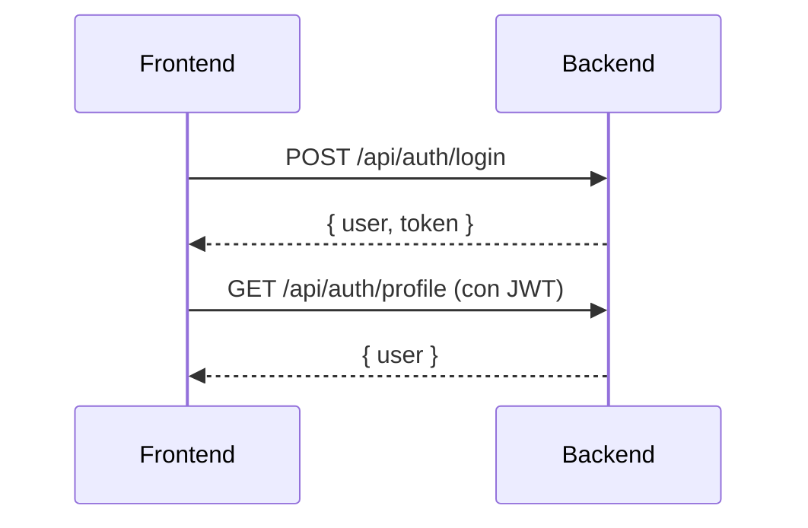
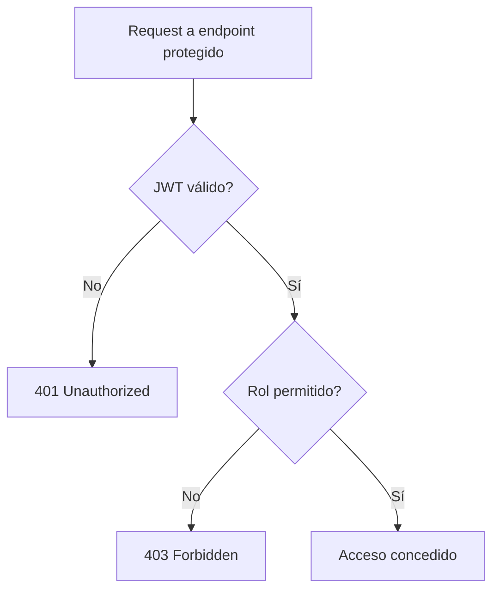

# 🔐 Documentación de Autenticación (`api-auth.md`)

> **Backend E-commerce**  
> Arquitectura: Clean Architecture (Domain, Infrastructure, Presentation)  
> Stack: Node.js, Express, TypeScript, MongoDB, JWT, Bcrypt

---

## Índice

- Endpoints de Autenticación
- Ejemplo de DTO (`CreateUserDto`)
- Ejemplo de Middleware (`AuthMiddleware`)
- Flujos de Autenticación y Autorización (Mermaid)
- Notas y convenciones del proyecto

---

## Endpoints de Autenticación

### Registro de Usuario

```http
POST /api/auth/register
Content-Type: application/json

{
  "name": "Juan Pérez",
  "email": "juan@email.com",
  "password": "MiPassword123"
}
```

**Respuesta (201):**
```json
{
  "user": {
    "id": "64a7f8c9b123456789abcdef",
    "name": "Juan Pérez",
    "email": "juan@email.com",
    "roles": ["USER_ROLE"],
    "isActive": true,
    "createdAt": "2024-01-15T10:30:00.000Z"
  },
  "token": "eyJhbGciOiJIUzI1NiIsInR5cCI6IkpXVCJ9..."
}
```

### Login

```http
POST /api/auth/login
Content-Type: application/json

{
  "email": "juan@email.com",
  "password": "MiPassword123"
}
```

**Respuesta (200):**
```json
{
  "user": {
    "id": "64a7f8c9b123456789abcdef",
    "name": "Juan Pérez",
    "email": "juan@email.com",
    "roles": ["USER_ROLE"],
    "isActive": true
  },
  "token": "eyJhbGciOiJIUzI1NiIsInR5cCI6IkpXVCJ9..."
}
```

### Recuperar Contraseña

```http
POST /api/auth/forgot-password
Content-Type: application/json

{
  "email": "juan@email.com"
}
```

**Respuesta (200):**
```json
{
  "message": "Se ha enviado un enlace de recuperación a tu email"
}
```

### Restablecer Contraseña

```http
POST /api/auth/reset-password
Content-Type: application/json

{
 "token": "reset-token-here",
  "newPassword": "NuevaPassword123"
}
```

**Respuesta (200):**
```json
{
  "message": "Contraseña restablecida correctamente"
}
```

### Endpoints Protegidos (Requieren JWT)

#### Validar Token

```http
GET /api/auth/validate-token
Authorization: Bearer <jwt-token>
```

**Respuesta (200):**
```json
{
  "user": {
    "id": "64a7f8c9b123456789abcdef",
    "name": "Juan Pérez",
    "email": "juan@email.com",
    "roles": ["USER_ROLE"],
    "isActive": true
  }
}
```

#### Obtener Perfil

```http
GET /api/auth/profile
Authorization: Bearer <jwt-token>
```

**Respuesta (200):**
```json
{
  "user": {
    "id": "64a7f8c9b123456789abcdef",
    "name": "Juan Pérez",
    "email": "juan@email.com",
    "roles": ["USER_ROLE"],
    "isActive": true
  }
}
```

#### Actualizar Perfil

```http
PUT /api/auth/profile
Authorization: Bearer <jwt-token>
Content-Type: application/json

{
  "name": "Juan Carlos Pérez",
  "phone": "+54 11 1234-5678"
}
```

**Respuesta (200):**
```json
{
  "user": {
    "id": "64a7f8c9b123456789abcdef",
    "name": "Juan Carlos Pérez",
    "email": "juan@email.com",
    "roles": ["USER_ROLE"],
    "isActive": true
  }
}
```

#### Cambiar Contraseña

```http
POST /api/auth/change-password
Authorization: Bearer <jwt-token>
Content-Type: application/json

{
  "currentPassword": "MiPassword123",
  "newPassword": "NuevaPassword456"
}
```

**Respuesta (200):**
```json
{
  "message": "Contraseña cambiada correctamente"
}
```

### Endpoints de Administración (requieren ADMIN_ROLE)

#### Listar Usuarios

```http
GET /api/admin/users?page=1&limit=10
Authorization: Bearer <admin-jwt-token>
```

**Respuesta (200):**
```json
{
  "total": 1,
  "items": [
    {
      "id": "64a7f8c9b123456789abcdef",
      "name": "Juan Pérez",
      "email": "juan@email.com",
      "roles": ["USER_ROLE"],
      "isActive": true,
      "createdAt": "2024-01-15T10:30:00.000Z"
    }
  ]
}
```

#### Cambiar Estado de Usuario

```http
PATCH /api/admin/users/:id/status
Authorization: Bearer <admin-jwt-token>
Content-Type: application/json

{
  "isActive": false,
  "reason": "Violación de términos de servicio"
}
```

**Respuesta (200):**
```json
{
  "message": "Estado actualizado"
}
```

---

## Ejemplo de DTO: `CreateUserDto`

> Ubicación: `src/domain/dtos/auth/create-user.dto.ts`  
> Patrón: Factory con método estático `create()`.  
> Validación centralizada en el DTO.

```typescript
export class CreateUserDto {
  private constructor(
    public readonly name: string,
    public readonly email: string,
    public readonly password: string
  ) {}

  static create(obj: any): [string?, CreateUserDto?] {
    if (!obj.name || typeof obj.name !== 'string') return ['El nombre es requerido'];
    if (!obj.email || typeof obj.email !== 'string') return ['El email es requerido'];
    if (!obj.password || typeof obj.password !== 'string' || obj.password.length < 8)
      return ['La contraseña debe tener al menos 8 caracteres'];
    return [undefined, new CreateUserDto(obj.name, obj.email, obj.password)];
  }
}
```

## Ejemplo de Middleware: `AuthMiddleware`

> Ubicación: [`src/presentation/middlewares/auth.middleware.ts`](src/presentation/middlewares/auth.middleware.ts )  
> Usa `JwtAdapter` para validar tokens y roles.  
> Lanza errores claros y centralizados.

```typescript
import { Request, Response, NextFunction } from 'express';
import { JwtAdapter } from '../../configs/jwt';
import { CustomError } from '../../../domain/errors/custom.error';

export class AuthMiddleware {
  static async validateJwt(req: Request, res: Response, next: NextFunction) {
    const authHeader = req.headers.authorization;
    if (!authHeader || !authHeader.startsWith('Bearer '))
      return res.status(401).json({ message: 'Token requerido' });

    const token = authHeader.split(' ')[1];
    try {
      const payload = await JwtAdapter.validateToken(token);
      req.user = payload;
      next();
    } catch (e) {
      return res.status(401).json({ message: 'Token inválido' });
    }
  }

  static checkRole(roles: string[]) {
    return (req: Request, res: Response, next: NextFunction) => {
      if (!req.user || !roles.some(role => req.user.roles.includes(role)))
        return res.status(403).json({ message: 'Acceso denegado' });
      next();
    };
  }
}
```

## Flujos de Autenticación y Autorización

### Login y Validación de Token



### Autorización por Rol



---

## Notas y convenciones del proyecto

- **Arquitectura:** Clean Architecture (Domain, Infrastructure, Presentation).
- **DTOs:** Siempre usan método estático `create()` para validación y construcción.
- **Errores:** Usar `CustomError` para errores de negocio y validación.
- **Middlewares:** Centralizan la validación de JWT y roles.
- **Controllers:** Usan DTOs para validar entrada y `handleError` para errores.
- **Roles:** El campo de roles en usuario es siempre `roles: string[]`.
- **Paginación:** Usar `PaginationDto` y devolver `{ total, items }`.
- **Logging:** Usar el logger de [`src/configs/logger.ts`](src/configs/logger.ts ) en datasources, repositorios y use cases.
- **Seguridad:** Contraseñas con `BcryptAdapter`, tokens con `JwtAdapter`.
- **Rutas de admin:** Bajo `/api/admin`, protegidas con `AuthMiddleware.validateJwt` y `AuthMiddleware.checkRole(['ADMIN_ROLE'])`.
- **Testing:** Pruebas unitarias para DTOs, use cases, mappers y controllers siguiendo la estructura de `test/`.

---

¿Necesitas ejemplos de Use Case, Repository, Mapper o tests? Indícalo y los agrego.
