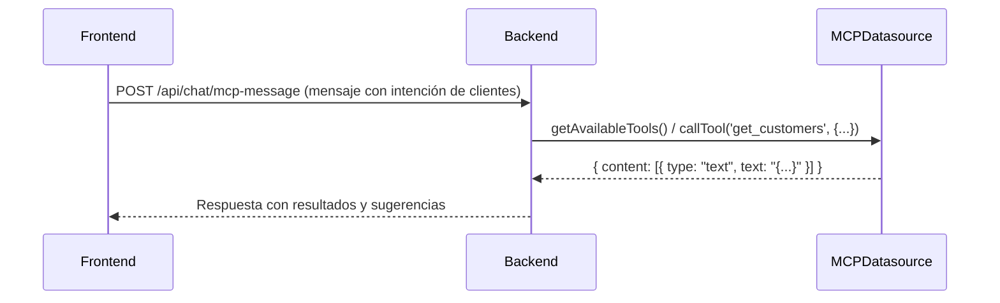
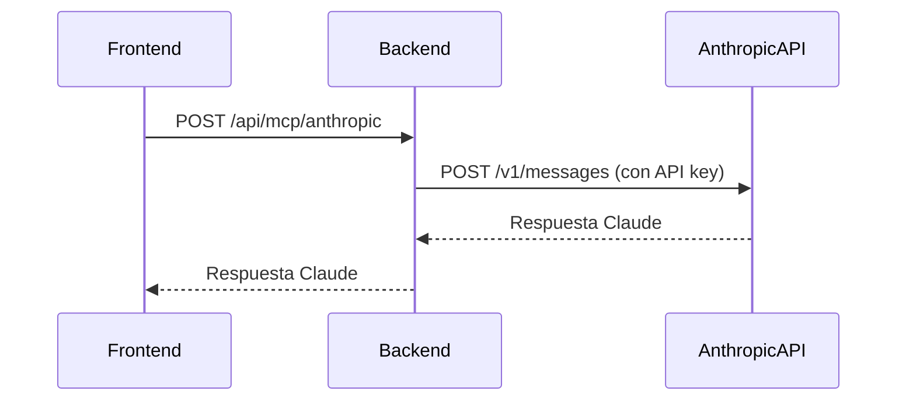

# 🌐 Model Context Protocol (MCP) – Documentación Actualizada

## 📑 Índice

- [🎯 Funcionalidades](#-funcionalidades)
- [📋 API Endpoints](#-api-endpoints)
- [🔧 Herramientas Disponibles](#-herramientas-disponibles)
- [🔌 Integración con LLMs](#-integración-con-llms)
- [💡 Ejemplos de Uso](#-ejemplos-de-uso)
- [⚙️ Configuración](#-configuración)
- [📊 Flujos de Uso (Mermaid)](#-flujos-de-uso-mermaid)

---

## 🎯 Funcionalidades

*(Sin cambios, sigue vigente)*

---

## 📋 API Endpoints

### 1. **Salud del Servicio MCP**
```http
GET /api/mcp/health
```
**Respuesta:**
```json
{
  "status": "OK",
  "service": "MCP Service",
  "timestamp": "2025-07-09T12:00:00.000Z",
  "anthropic_configured": true
}
```

### 2. **Proxy a Anthropic Claude**
```http
POST /api/mcp/anthropic
Content-Type: application/json

{
  "model": "claude-3-opus-20240229",
  "messages": [...],
  "max_tokens": 1024
}
```
**Headers:**
- No requiere autenticación, pero la API key de Anthropic debe estar configurada en el backend.

**Respuesta:** (Directa de Anthropic, formato variable)

---

### 3. **Listado de Herramientas MCP (INTERNAMENTE)**
> **Nota:** El endpoint `/mcp/tools/list` que figura en la documentación original **NO existe** en el backend real.  
> El listado de herramientas se obtiene a través de la capa de dominio/repositorio, no vía endpoint HTTP público.

---

### 4. **Ejecución de Herramientas MCP (INTERNAMENTE)**
> **Nota:** El endpoint `/mcp/tools/call` que figura en la documentación original **NO existe** en el backend real.  
> La ejecución de herramientas se realiza por la capa de dominio/repositorio, no vía endpoint HTTP público.

---

## 🔧 Herramientas Disponibles (según código real)

El backend expone las siguientes herramientas MCP (consultar por código, no por endpoint HTTP):

### 1. `get_customers`
- **Descripción:** Obtiene lista de clientes con filtros opcionales.
- **Parámetros:**
  - `page` (number, opcional, default: 1)
  - `limit` (number, opcional, default: 10)
  - `search` (string, opcional)

### 2. `get_customer_by_id`
- **Descripción:** Obtiene un cliente específico por ID.
- **Parámetros:**
  - `id` (string, requerido)

### 3. `get_products`
- **Descripción:** Obtiene lista de productos con filtros opcionales.
- **Parámetros:**
  - `page` (number, opcional, default: 1)
  - `limit` (number, opcional, default: 10)
  - `search` (string, opcional)
  - `categoryId` (string, opcional)
  - `minPrice` (number, opcional)
  - `maxPrice` (number, opcional)

### 4. `get_product_by_id`
- **Descripción:** Obtiene un producto específico por ID.
- **Parámetros:**
  - `id` (string, requerido)

### 5. `get_orders`
- **Descripción:** Obtiene lista de pedidos con filtros opcionales.
- **Parámetros:**
  - `page` (number, opcional, default: 1)
  - `limit` (number, opcional, default: 10)
  - `customerId` (string, opcional)
  - `status` (string, opcional)
  - `dateFrom` (string, opcional, formato YYYY-MM-DD)
  - `dateTo` (string, opcional, formato YYYY-MM-DD)

### 6. `search_database`
- **Descripción:** Búsqueda general en productos y clientes.
- **Parámetros:**
  - `query` (string, requerido)
  - `entities` (array de string, opcional, valores: "products", "customers")

---

## 📊 Flujos de Uso (Mermaid)

### Flujo de consulta de clientes



### Flujo de proxy a Anthropic



---

## ⚠️ Discrepancias Detectadas

- **No existen los endpoints `/mcp/tools/list` ni `/mcp/tools/call`** en la API HTTP pública. El acceso a herramientas MCP es interno, no vía REST.
- **Los nombres de herramientas y parámetros difieren**: la documentación original menciona `search_products`, `add_to_cart`, etc., pero el código real expone `get_products`, `get_customers`, etc.
- **No hay endpoints HTTP para manipular carrito, pedidos, cupones, etc.** vía MCP. Solo existen las herramientas listadas arriba.
- **El endpoint `/api/mcp/anthropic`** es un proxy directo a la API de Anthropic, no ejecuta herramientas MCP.
- **El endpoint `/api/mcp/health`** es solo para monitoreo.

---

## 💡 Ejemplo de Respuesta de Herramienta (formato real)

```json
{
  "content": [
    {
      "type": "text",
      "text": "{ \"total\": 2, \"page\": 1, \"limit\": 10, \"customers\": [ ... ] }"
    }
  ]
}
```
> El campo `text` contiene un string con un JSON serializado.

---

## ⚙️ Configuración

*(Sin cambios, sigue vigente)*

---

## 🔗 Enlaces Relacionados

*(Sin cambios, sigue vigente)*

---

**Última actualización: Julio 2025 (actualizada según código real)**

## 🔌 Integración con LLMs

### Configuración del Servidor MCP

```typescript
// src/infrastructure/adapters/mcp-server.adapter.ts
export class MCPServerAdapter {
  private tools: Map<string, MCPTool> = new Map();
  private logger = getLogger('MCPServer');

  constructor(
    private readonly productRepository: ProductRepository,
    private readonly cartRepository: CartRepository,
    private readonly orderRepository: OrderRepository,
    private readonly customerRepository: CustomerRepository
  ) {
    this.registerTools();
  }

  private registerTools(): void {
    // Registrar herramienta de búsqueda de productos
    this.tools.set('search_products', {
      name: 'search_products',
      description: 'Buscar productos en el catálogo',
      inputSchema: {
        type: 'object',
        properties: {
          query: { type: 'string', description: 'Término de búsqueda' },
          category: { type: 'string', description: 'Categoría específica' },
          minPrice: { type: 'number', description: 'Precio mínimo' },
          maxPrice: { type: 'number', description: 'Precio máximo' },
          tags: { type: 'array', items: { type: 'string' } },
          inStock: { type: 'boolean', description: 'Solo productos en stock' }
        },
        required: ['query']
      },
      handler: this.searchProducts.bind(this)
    });

    // Registrar herramienta de carrito
    this.tools.set('add_to_cart', {
      name: 'add_to_cart',
      description: 'Agregar producto al carrito',
      inputSchema: {
        type: 'object',
        properties: {
          productId: { type: 'string', description: 'ID del producto' },
          quantity: { type: 'number', minimum: 1, description: 'Cantidad' },
          userId: { type: 'string', description: 'ID del usuario' }
        },
        required: ['productId', 'quantity', 'userId']
      },
      handler: this.addToCart.bind(this)
    });

    // ... más herramientas
  }

  async listTools(): Promise<MCPToolsListResponse> {
    const toolsList = Array.from(this.tools.values()).map(tool => ({
      name: tool.name,
      description: tool.description,
      inputSchema: tool.inputSchema
    }));

    return { tools: toolsList };
  }

  async callTool(name: string, arguments_: any): Promise<MCPToolCallResponse> {
    const tool = this.tools.get(name);
    
    if (!tool) {
      return {
        content: [{
          type: 'text',
          text: `Error: Herramienta '${name}' no encontrada`
        }],
        isError: true
      };
    }

    try {
      // Validar argumentos usando JSON Schema
      const validation = this.validateArguments(tool.inputSchema, arguments_);
      if (!validation.valid) {
        return {
          content: [{
            type: 'text',
            text: `Error de validación: ${validation.errors.join(', ')}`
          }],
          isError: true
        };
      }

      // Ejecutar herramienta
      const startTime = Date.now();
      const result = await tool.handler(arguments_);
      const executionTime = Date.now() - startTime;

      this.logger.info(`Tool ${name} executed in ${executionTime}ms`);

      return {
        content: [{
          type: 'text',
          text: result
        }],
        isError: false,
        metadata: {
          executionTime: `${executionTime}ms`,
          timestamp: new Date().toISOString()
        }
      };
    } catch (error) {
      this.logger.error(`Error executing tool ${name}:`, error);
      
      return {
        content: [{
          type: 'text',
          text: `Error interno al ejecutar la herramienta: ${error.message}`
        }],
        isError: true
      };
    }
  }

  private async searchProducts(args: any): Promise<string> {
    const { query, category, minPrice, maxPrice, tags, inStock } = args;
    
    const filters: any = {};
    if (category) filters.categoryId = category;
    if (minPrice !== undefined) filters.minPrice = minPrice;
    if (maxPrice !== undefined) filters.maxPrice = maxPrice;
    if (tags && tags.length > 0) filters.tags = tags;
    if (inStock) filters.inStock = true;

    const products = await this.productRepository.search(query, filters, {
      limit: 10,
      page: 1
    });

    if (products.items.length === 0) {
      return `No se encontraron productos para la búsqueda "${query}"`;
    }

    let response = `Encontré ${products.total} productos para "${query}":\n\n`;
    
    products.items.forEach((product, index) => {
      response += `${index + 1}. **${product.name}** - $${product.price}\n`;
      if (product.description) {
        response += `   ${product.description.substring(0, 100)}\n`;
      }
      response += `   Stock: ${product.stock || 'No especificado'}\n`;
      response += `   ID: ${product.id}\n\n`;
    });

    response += `¿Te interesa información detallada sobre algún producto?`;
    
    return response;
  }

  private async addToCart(args: any): Promise<string> {
    const { productId, quantity, userId } = args;

    // Verificar que el producto existe
    const product = await this.productRepository.findById(productId);
    if (!product) {
      return `Error: Producto con ID ${productId} no encontrado`;
    }

    // Verificar stock
    if (product.stock !== undefined && product.stock < quantity) {
      return `Error: Stock insuficiente. Disponible: ${product.stock}, solicitado: ${quantity}`;
    }

    // Agregar al carrito
    await this.cartRepository.addItem(userId, {
      productId,
      quantity,
      price: product.price
    });

    return `✅ ${product.name} agregado al carrito (cantidad: ${quantity}).\nPrecio unitario: $${product.price}\nSubtotal: $${product.price * quantity}`;
  }

  private validateArguments(schema: any, args: any): { valid: boolean; errors: string[] } {
    // Implementar validación JSON Schema
    // Esta es una versión simplificada
    const errors: string[] = [];
    
    if (schema.required) {
      for (const field of schema.required) {
        if (!(field in args)) {
          errors.push(`Campo requerido '${field}' faltante`);
        }
      }
    }

    // Validaciones adicionales según el schema...

    return {
      valid: errors.length === 0,
      errors
    };
  }
}
```

### Use Case para Chat con MCP

```typescript
// src/domain/use-cases/chat/mcp-chat.use-case.ts
export class MCPChatUseCase {
  constructor(
    private readonly mcpServer: MCPServerAdapter,
    private readonly llmService: LLMService,
    private readonly chatRepository: ChatRepository
  ) {}

  async execute(request: MCPChatRequest): Promise<MCPChatResponse> {
    const { message, sessionId, enableTools = true } = request;

    // 1. Analizar el mensaje para identificar intenciones de herramientas
    const toolAnalysis = await this.analyzeToolIntent(message);
    
    let toolResults: ToolCallResult[] = [];
    let contextualInfo = '';

    // 2. Ejecutar herramientas si se detectaron intenciones
    if (enableTools && toolAnalysis.suggestedTools.length > 0) {
      toolResults = await this.executeTools(toolAnalysis.suggestedTools);
      contextualInfo = toolResults.map(r => r.result).join('\n\n');
    }

    // 3. Generar respuesta considerando los resultados de las herramientas
    const prompt = this.buildMCPPrompt(message, contextualInfo, toolResults);
    const llmResponse = await this.llmService.generateResponse(prompt);

    // 4. Guardar conversación
    await this.chatRepository.saveMessage({
      sessionId,
      type: 'user',
      content: message
    });

    await this.chatRepository.saveMessage({
      sessionId,
      type: 'assistant',
      content: llmResponse.text,
      metadata: {
        toolCalls: toolResults,
        mcpEnabled: enableTools
      }
    });

    return {
      sessionId,
      messageId: generateId(),
      response: {
        text: llmResponse.text,
        toolCalls: toolResults,
        finalResponse: llmResponse.text,
        suggestedActions: this.generateSuggestedActions(toolResults)
      },
      timestamp: new Date().toISOString()
    };
  }

  private async analyzeToolIntent(message: string): Promise<ToolAnalysis> {
    // Patrones para detectar intenciones de herramientas
    const patterns = [
      {
        pattern: /buscar|busca|encuentra|mostrar|ver/i,
        tool: 'search_products',
        extractors: {
          query: /buscar|busca (.+?)(?:\s|$)/i,
          category: /categoría|categoria (.+?)(?:\s|$)/i,
          price: /precio (.+?)(?:\s|$)/i
        }
      },
      {
        pattern: /agregar|añadir|comprar|carrito/i,
        tool: 'add_to_cart',
        extractors: {
          product: /agregar|añadir (.+?) al carrito/i,
          quantity: /cantidad (\d+)/i
        }
      },
      {
        pattern: /pedido|orden|estado/i,
        tool: 'get_order_status',
        extractors: {
          orderId: /pedido #?([A-Z0-9-]+)/i
        }
      }
    ];

    const suggestedTools: ToolSuggestion[] = [];

    for (const { pattern, tool, extractors } of patterns) {
      if (pattern.test(message)) {
        const arguments_: any = {};
        
        for (const [key, extractor] of Object.entries(extractors)) {
          const match = message.match(extractor);
          if (match) {
            arguments_[key] = match[1];
          }
        }

        suggestedTools.push({ tool, arguments: arguments_ });
      }
    }

    return {
      intent: this.classifyIntent(message),
      confidence: 0.8, // Simplificado
      suggestedTools
    };
  }

  private async executeTools(suggestions: ToolSuggestion[]): Promise<ToolCallResult[]> {
    const results: ToolCallResult[] = [];

    for (const suggestion of suggestions) {
      try {
        const result = await this.mcpServer.callTool(
          suggestion.tool,
          suggestion.arguments
        );

        results.push({
          toolName: suggestion.tool,
          arguments: suggestion.arguments,
          result: result.content[0].text,
          isError: result.isError,
          executionTime: result.metadata?.executionTime || '0ms'
        });
      } catch (error) {
        results.push({
          toolName: suggestion.tool,
          arguments: suggestion.arguments,
          result: `Error ejecutando herramienta: ${error.message}`,
          isError: true,
          executionTime: '0ms'
        });
      }
    }

    return results;
  }

  private buildMCPPrompt(
    userMessage: string,
    toolResults: string,
    toolCalls: ToolCallResult[]
  ): string {
    let prompt = `
Eres un asistente virtual especializado en e-commerce. 

MENSAJE DEL USUARIO: ${userMessage}

`;

    if (toolResults) {
      prompt += `
INFORMACIÓN OBTENIDA DE HERRAMIENTAS:
${toolResults}

`;
    }

    prompt += `
INSTRUCCIONES:
- Responde de manera útil basándote en la información disponible
- Si usaste herramientas, integra esa información naturalmente en tu respuesta
- Ofrece acciones concretas que el usuario puede tomar
- Mantén un tono amigable y profesional
- Si hay errores en las herramientas, explícalos de manera comprensible

RESPUESTA:`;

    return prompt;
  }

  private generateSuggestedActions(toolResults: ToolCallResult[]): string[] {
    const actions: string[] = [];

    for (const result of toolResults) {
      switch (result.toolName) {
        case 'search_products':
          if (!result.isError) {
            actions.push('Ver detalles de un producto');
            actions.push('Agregar producto al carrito');
            actions.push('Comparar productos');
          }
          break;
        case 'add_to_cart':
          if (!result.isError) {
            actions.push('Ver carrito completo');
            actions.push('Proceder al checkout');
            actions.push('Continuar comprando');
          }
          break;
        case 'get_order_status':
          if (!result.isError) {
            actions.push('Ver detalles del pedido');
            actions.push('Rastrear envío');
            actions.push('Contactar soporte');
          }
          break;
      }
    }

    return actions;
  }
}
```

## 💡 Ejemplos de Uso

### Integración con Claude Desktop

```json
// claude_desktop_config.json
{
  "mcpServers": {
    "startup-ecommerce": {
      "command": "node",
      "args": ["/path/to/your/mcp-server.js"],
      "env": {
        "NODE_ENV": "production",
        "MONGO_URL": "mongodb://localhost:27017/startup-ecommerce"
      }
    }
  }
}
```

### Cliente JavaScript para MCP

```javascript
// mcp-client.js
class MCPClient {
  constructor(baseUrl) {
    this.baseUrl = baseUrl;
  }

  async listTools() {
    const response = await fetch(`${this.baseUrl}/mcp/tools/list`, {
      method: 'POST',
      headers: {
        'Content-Type': 'application/json'
      },
      body: JSON.stringify({
        method: 'tools/list',
        params: {}
      })
    });

    return response.json();
  }

  async callTool(name, arguments_) {
    const response = await fetch(`${this.baseUrl}/mcp/tools/call`, {
      method: 'POST',
      headers: {
        'Content-Type': 'application/json'
      },
      body: JSON.stringify({
        method: 'tools/call',
        params: {
          name,
          arguments: arguments_
        }
      })
    });

    return response.json();
  }

  // Ejemplo de uso específico
  async searchProducts(query, filters = {}) {
    return this.callTool('search_products', {
      query,
      ...filters
    });
  }

  async addToCart(productId, quantity, userId) {
    return this.callTool('add_to_cart', {
      productId,
      quantity,
      userId
    });
  }
}

// Uso del cliente
const mcpClient = new MCPClient('http://localhost:3000');

// Buscar productos
const searchResult = await mcpClient.searchProducts('laptop gaming', {
  minPrice: 800,
  maxPrice: 1500,
  category: 'electronics'
});

console.log(searchResult.content[0].text);

// Agregar al carrito
const addResult = await mcpClient.addToCart(
  'product-id-123',
  2,
  'user-id-456'
);

console.log(addResult.content[0].text);
```

## ⚙️ Configuración

### Variables de Entorno para MCP

```env
# Configuración del servidor MCP
MCP_SERVER_PORT=3001
MCP_SERVER_HOST=localhost
MCP_TOOLS_ENABLED=true

# Configuración de herramientas
MCP_RATE_LIMIT_PER_MINUTE=60
MCP_MAX_TOOL_EXECUTION_TIME=30000

# Integración con LLMs
OPENAI_API_KEY=tu-openai-api-key
ANTHROPIC_API_KEY=tu-anthropic-api-key

# Configuración de logging
MCP_LOG_LEVEL=info
MCP_LOG_TOOL_CALLS=true
```

### Configuración del Servidor MCP

```typescript
// src/configs/mcp.config.ts
export const MCP_CONFIG = {
  server: {
    port: envs.MCP_SERVER_PORT || 3001,
    host: envs.MCP_SERVER_HOST || 'localhost',
    enabled: envs.MCP_TOOLS_ENABLED === 'true'
  },
  
  tools: {
    rateLimit: {
      windowMs: 60 * 1000, // 1 minuto
      max: envs.MCP_RATE_LIMIT_PER_MINUTE || 60
    },
    maxExecutionTime: envs.MCP_MAX_TOOL_EXECUTION_TIME || 30000,
    enabledTools: [
      'search_products',
      'add_to_cart',
      'remove_from_cart',
      'get_cart_contents',
      'apply_coupon',
      'get_order_status',
      'get_user_orders',
      'get_customer_info'
    ]
  },
  
  logging: {
    level: envs.MCP_LOG_LEVEL || 'info',
    logToolCalls: envs.MCP_LOG_TOOL_CALLS === 'true'
  }
};
```

---

## 🔗 Enlaces Relacionados

- [🤖 Chatbot e IA](./api-chatbot.md)
- [📦 Gestión de Productos](./api-products.md)
- [🛒 Carrito y Pedidos](./api-orders.md)
- [👥 Gestión de Clientes](./api-customers.md)
- [⚙️ Panel de Administración](./api-admin.md)

---

*Última actualización: Enero 2024*
