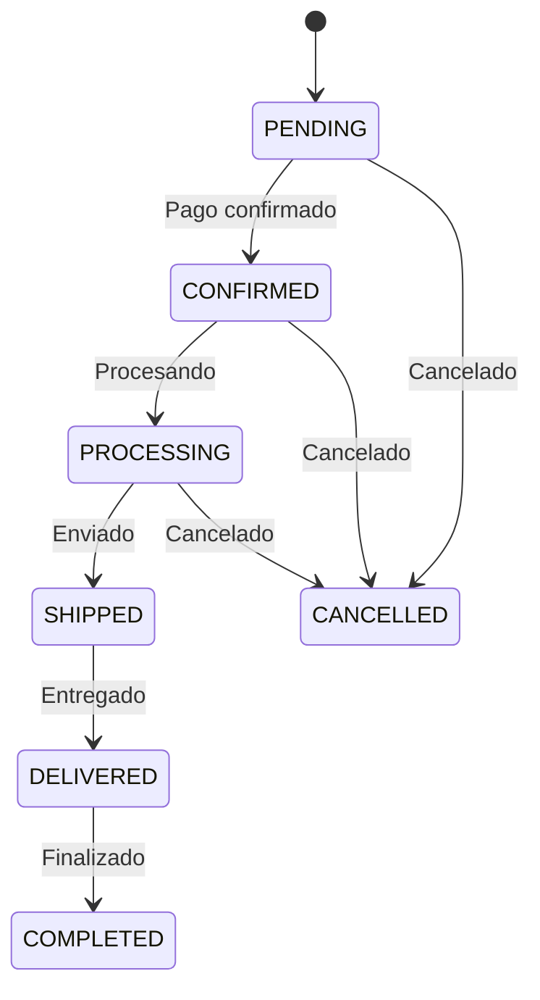

# 🛒 API de Carrito y Pedidos (Órdenes)

> Documentación actualizada a julio 2025. Esta referencia describe los endpoints reales del backend, sus parámetros, headers, respuestas y flujos. **Todos los endpoints requieren autenticación JWT** salvo que se indique lo contrario.

---

## Índice

- [Carrito de Compras (`/api/cart`)](#carrito-de-compras-apicart)
- [Órdenes/Pedidos (`/api/orders`)](#órdenespedidos-apiorders)
- [Estados de Pedido y Flujo](#estados-de-pedido-y-flujo)
- [Ejemplos de Uso Frontend](#ejemplos-de-uso-frontend)
- [Troubleshooting](#troubleshooting)
- [Mejores Prácticas](#mejores-prácticas)

---

## Carrito de Compras (`/api/cart`)

> **IMPORTANTE:** Todas las rutas requieren header `Authorization: Bearer <token>` (usuario autenticado). No hay soporte para carritos de invitados.

### Endpoints

#### `GET /api/cart` — Obtener carrito actual
**Headers:**
```
Authorization: Bearer <token>
```
**Respuesta:**
```json
{
  "id": "cartId",
  "userId": "userId",
  "items": [
    {
      "productId": "prodId",
      "quantity": 2,
      "unitPrice": 100,
      "subtotal": 200
    }
  ],
  "total": 200,
  "totalItems": 2,
  "totalTaxAmount": 42,
  "subtotalWithoutTax": 158,
  "createdAt": "2025-07-08T10:00:00Z",
  "updatedAt": "2025-07-08T10:10:00Z"
}
```

#### `POST /api/cart/items` — Agregar producto al carrito
**Headers:**
```
Authorization: Bearer <token>
Content-Type: application/json
```
**Body:**
```json
{
  "productId": "prodId",
  "quantity": 2
}
```
**Respuesta:**
```json
{
  "id": "cartId",
  "items": [ ... ],
  "total": 200,
  ...otros campos
}
```

#### `PUT /api/cart/items/:productId` — Actualizar cantidad de un producto
**Body:**
```json
{
  "quantity": 3
}
```
**Respuesta:** igual a `GET /api/cart`

#### `DELETE /api/cart/items/:productId` — Eliminar producto del carrito
**Respuesta:** igual a `GET /api/cart`

#### `DELETE /api/cart` — Vaciar carrito
**Respuesta:** igual a `GET /api/cart` (carrito vacío)

---

## Órdenes/Pedidos (`/api/orders`)

> **IMPORTANTE:** Todas las rutas requieren header `Authorization: Bearer <token>`. El endpoint de creación soporta tanto usuarios registrados como invitados (ver body).

### Endpoints

#### `POST /api/orders` — Crear pedido (checkout)

**Descripción:** Crea un nuevo pedido. Funciona tanto para usuarios registrados como invitados.

**IMPORTANTE:** El sistema detecta automáticamente si es un usuario registrado o invitado basándose en la presencia del token JWT.

---

### Para USUARIOS REGISTRADOS:

**Headers:**
```
Authorization: Bearer <token>
Content-Type: application/json
```

**Body:**
```json
{
  "items": [
    { 
      "productId": "6807f8e6022d7fe5f9d9620d", 
      "quantity": 2, 
      "unitPrice": 100 
    }
  ],
  "deliveryMethodId": "686b18f09808aab4814098cb",
  "notes": "Notas opcionales",
  "couponCode": "DESCUENTO10",
  
  // Solo para entrega a domicilio:
  "shippingRecipientName": "Juan Pérez",
  "shippingPhone": "+1234567890",
  "shippingStreetAddress": "Av. Principal 123",
  "shippingNeighborhoodId": "67dc9ed0e260c0eef5279179",
  "shippingCityId": "67dc9ed0e260c0eef5279178",
  "shippingPostalCode": "1000",
  "shippingAdditionalInfo": "Departamento 4B"
}
```

---

### Para USUARIOS INVITADOS (Guest Checkout):

**Headers:**
```
Content-Type: application/json
```
(❌ **NO incluir** `Authorization: Bearer <token>`)

**Body para retiro en local:**
```json
{
  "customerName": "Juan Pérez",
  "customerEmail": "juan@gmail.com",
  "items": [
    { 
      "productId": "6807f8e6022d7fe5f9d9620d", 
      "quantity": 2, 
      "unitPrice": 100 
    }
  ],
  "deliveryMethodId": "686b18f09808aab4814098cb",
  "notes": "Retiro por la tarde"
}
```

**Body para entrega a domicilio:**
```json
{
  "customerName": "María González",
  "customerEmail": "maria@example.com",
  "items": [
    { 
      "productId": "6807f8e6022d7fe5f9d9620d", 
      "quantity": 1, 
      "unitPrice": 150 
    }
  ],
  "deliveryMethodId": "686b18f09808aab4814098cc",
  "shippingRecipientName": "María González",
  "shippingPhone": "+1234567890",
  "shippingStreetAddress": "Av. Principal 123",
  "shippingNeighborhoodId": "67dc9ed0e260c0eef5279179",
  "shippingCityId": "67dc9ed0e260c0eef5279178",
  "shippingPostalCode": "1000",
  "shippingAdditionalInfo": "Departamento 4B",
  "notes": "Departamento con portero"
}
```

---

### Campos requeridos según método de entrega:

| Campo | Retiro en local | Entrega a domicilio |
|-------|:---------------:|:-------------------:|
| `customerName` (guest) | ✅ | ✅ |
| `customerEmail` (guest) | ✅ | ✅ |
| `items` | ✅ | ✅ |
| `deliveryMethodId` | ✅ | ✅ |
| `shippingRecipientName` | ❌ | ✅ |
| `shippingPhone` | ❌ | ✅ |
| `shippingStreetAddress` | ❌ | ✅ |
| `shippingNeighborhoodId` | ❌ | ✅ |
| `shippingCityId` | ❌ | ✅ |

---

### ✅ **Beneficios del Guest Checkout:**
- **Múltiples pedidos con mismo email** (sin restricciones)
- **No requiere registro** ni autenticación
- **Datos personales reutilizables** (nombre, teléfono, email)
- **Flujo simplificado** para compradores esporádicos

---

**Respuesta exitosa (201):**
```json
{
  "id": "68766f1171537bbcca28ab80",
  "customer": {
    "id": "68766f1171537bbcca28ab7a",
    "name": "Juan Pérez",
    "email": "juan@gmail.com",
    "phone": "00000000",
    "address": "dirección pendiente",
    "isActive": true,
    "userId": null
  },
  "items": [
    {
      "product": {
        "id": "6807f8e6022d7fe5f9d9620d",
        "name": "picada casera tipo 10",
        "price": 5.99
      },
      "quantity": 1,
      "unitPrice": 7.25,
      "subtotal": 7.25
    }
  ],
  "deliveryMethod": {
    "id": "686b18f09808aab4814098cb",
    "name": "Retiro en Local",
    "code": "PICKUP",
    "requiresAddress": false
  },
  "status": {
    "id": "status-id", 
    "name": "PENDING",
    "code": "PENDING"
  },
  "total": 7.25,
  "subtotal": 7.25,
  "taxAmount": 0,
  "discountRate": 0,
  "discountAmount": 0,
  "createdAt": "2025-07-15T15:09:05.000Z",
  "updatedAt": "2025-07-15T15:09:05.000Z"
}
```

---

### Errores comunes:

**400 - Campos faltantes:**
```json
{
  "error": "customerName is required for guest orders"
}
```

**400 - Producto inválido:**
```json
{
  "error": "Product with id '...' not found"
}
```

**400 - Método de entrega inválido:**
```json
{
  "error": "Delivery method with id '...' not found"
}
```

#### `GET /api/orders/my-orders` — Listar pedidos del usuario autenticado
**Query params:** `page`, `limit`
**Respuesta:**
```json
{
  "sales": [ { ... }, ... ],
  "total": 100,
  "page": 1,
  "limit": 10
}
```

#### `GET /api/orders` — Listar todos los pedidos (admin)
**Query params:** `page`, `limit`
**Respuesta:** igual a anterior

#### `GET /api/orders/:id` — Obtener pedido por ID
**Respuesta:**
```json
{
  "id": "orderId",
  "customer": { ... },
  "items": [ ... ],
  "status": "PENDING",
  ...otros campos
}
```

#### `PATCH /api/orders/:id/status` — Cambiar estado del pedido
**Body:**
```json
{
  "status": "CONFIRMED",
  "notes": "opcional"
}
```
**Respuesta:** pedido actualizado

#### `GET /api/orders/by-customer/:customerId` — Listar pedidos por cliente
**Query params:** `page`, `limit`

#### `POST /api/orders/by-date-range` — Listar pedidos por rango de fechas
**Body:**
```json
{
  "startDate": "2025-07-01",
  "endDate": "2025-07-08"
}
```
**Query params:** `page`, `limit`

#### `PUT /api/orders/:id` — Actualizar completamente un pedido
**Body:** igual a creación

#### `PATCH /api/orders/:orderId/payment-method` — Seleccionar método de pago
**Body:**
```json
{
  "paymentMethodCode": "MERCADOPAGO",
  "notes": "opcional"
}
**Respuesta:**
{
  "success": true,
  "message": "Método de pago seleccionado exitosamente",
  "data": { ...order }
}
```

---

## Estados de Pedido y Flujo

Los estados válidos de un pedido son:

- `PENDING`
- `CONFIRMED`
- `PROCESSING`
- `SHIPPED`
- `DELIVERED`
- `CANCELLED`
- `COMPLETED`

### Diagrama de flujo de estados



---

## Ejemplos de Uso Frontend

### Guest Checkout Completo (Invitado)
```js
// 1. Crear pedido como invitado (SIN token JWT)
const crearPedidoInvitado = async () => {
  try {
    const response = await fetch('/api/orders', {
      method: 'POST',
      headers: { 
        'Content-Type': 'application/json'
        // ❌ NO incluir Authorization para invitados
      },
      body: JSON.stringify({
        customerName: "Juan Pérez",
        customerEmail: "juan@gmail.com",
        items: [
          { 
            productId: "6807f8e6022d7fe5f9d9620d", 
            quantity: 2, 
            unitPrice: 100 
          }
        ],
        deliveryMethodId: "686b18f09808aab4814098cb",
        notes: "Retiro por la tarde"
      })
    });
    
    const order = await response.json();
    console.log('Pedido creado:', order);
    return order;
  } catch (error) {
    console.error('Error:', error);
  }
};

// 2. Segundo pedido con mismo email (✅ Permitido)
const segundoPedidoMismoEmail = async () => {
  const response = await fetch('/api/orders', {
    method: 'POST',
    headers: { 'Content-Type': 'application/json' },
    body: JSON.stringify({
      customerName: "Juan Pérez",
      customerEmail: "juan@gmail.com", // ✅ Mismo email es válido
      items: [
        { productId: "6807f8e6022d7fe5f9d9620d", quantity: 1, unitPrice: 50 }
      ],
      deliveryMethodId: "686b18f09808aab4814098cb"
    })
  });
  return await response.json();
};
```

### Checkout Usuario Registrado
```js
// 1. Usuario registrado con token
const crearPedidoRegistrado = async (token) => {
  const response = await fetch('/api/orders', {
    method: 'POST',
    headers: { 
      Authorization: `Bearer ${token}`,
      'Content-Type': 'application/json' 
    },
    body: JSON.stringify({
      items: [
        { productId: "6807f8e6022d7fe5f9d9620d", quantity: 1, unitPrice: 100 }
      ],
      deliveryMethodId: "686b18f09808aab4814098cb",
      notes: "Pedido de usuario registrado"
    })
  });
  return await response.json();
};
```

### Obtener Métodos de Entrega
```js
const obtenerMetodosEntrega = async () => {
  const response = await fetch('/api/delivery-methods');
  const methods = await response.json();
  
  // Filtrar por tipo
  const pickup = methods.find(m => m.code === 'PICKUP');
  const delivery = methods.find(m => m.code === 'DELIVERY');
  
  return { pickup, delivery };
};
```

### Obtener carrito (usuarios registrados)
```js
fetch('/api/cart', { headers: { Authorization: `Bearer ${token}` } })
  .then(res => res.json())
  .then(cart => { /* ... */ });
```

### Agregar producto al carrito (usuarios registrados)
```js
fetch('/api/cart/items', {
  method: 'POST',
  headers: { Authorization: `Bearer ${token}`, 'Content-Type': 'application/json' },
  body: JSON.stringify({ productId, quantity: 1 })
});
```

### Validación frontend para guest checkout
```js
const validarFormularioInvitado = (formData, deliveryMethodId) => {
  const errors = [];
  
  // Campos siempre requeridos
  if (!formData.customerName) errors.push('Nombre es requerido');
  if (!formData.customerEmail) errors.push('Email es requerido');
  if (!formData.items?.length) errors.push('Debe incluir al menos un producto');
  if (!deliveryMethodId) errors.push('Método de entrega es requerido');
  
  // Campos requeridos solo para entrega a domicilio
  const deliveryMethod = await obtenerMetodosEntrega();
  const isDelivery = deliveryMethod.delivery?.id === deliveryMethodId;
  
  if (isDelivery) {
    if (!formData.shippingRecipientName) errors.push('Nombre del destinatario requerido');
    if (!formData.shippingPhone) errors.push('Teléfono requerido');
    if (!formData.shippingStreetAddress) errors.push('Dirección requerida');
    if (!formData.shippingNeighborhoodId) errors.push('Barrio requerido');
    if (!formData.shippingCityId) errors.push('Ciudad requerida');
  }
  
  return errors;
};
```

---

## Troubleshooting

- **401 Unauthorized:** Verifica que el token JWT sea válido y esté presente en el header.
- **400 Bad Request:** Revisa los campos requeridos en el body (ver DTOs).
- **404 Not Found:** El recurso no existe o no pertenece al usuario autenticado.
- **409 Conflict:** Stock insuficiente o estado inválido para la transición.
- **500 Internal Server Error:** Error inesperado, revisar logs del backend.

---

## Mejores Prácticas

- Siempre validar el estado del carrito antes de hacer checkout.
- Usar paginación en listados grandes.
- Manejar correctamente los estados de pedido en el frontend.
- Sincronizar el carrito en todos los dispositivos del usuario.
- Consultar los estados válidos y transitions antes de cambiar el estado de una orden.

---

Para más información sobre otros módulos:
- [Gestión de Productos](./api-products.md)
- [Clientes y Direcciones](./api-customers.md)
- [Integración MercadoPago](./mercadopago.md)
- [Sistema de Webhooks](./webhooks.md)

#### `POST /api/cart/items` - Agregar Producto al Carrito
**Body:**
```json
{
  "productId": "prod123",
  "quantity": 2
}
```

**Respuesta:**
```json
{
  "message": "Producto agregado al carrito",
  "cartItem": {
    "id": "item1",
    "product": {...},
    "quantity": 2,
    "subtotal": 3000.00
  },
  "cartSummary": {
    "itemCount": 3,
    "total": 4130.00
  }
}
```

#### `PUT /api/cart/items/:itemId` - Actualizar Cantidad
**Body:**
```json
{
  "quantity": 3
}
```

#### `DELETE /api/cart/items/:itemId` - Eliminar Item del Carrito

#### `POST /api/cart/apply-coupon` - Aplicar Cupón
**Body:**
```json
{
  "couponCode": "DESCUENTO10"
}
```

**Respuesta:**
```json
{
  "message": "Cupón aplicado exitosamente",
  "coupon": {
    "code": "DESCUENTO10",
    "discountType": "percentage",
    "discountValue": 10,
    "description": "10% de descuento"
  },
  "discount": {
    "amount": 313.00,
    "appliedTo": "subtotal"
  },
  "newTotal": 3817.00
}
```

#### `DELETE /api/cart/coupon` - Remover Cupón

#### `DELETE /api/cart` - Vaciar Carrito

### Flujo de Carrito

#### 1. Usuario Registrado
```javascript
// El carrito se persiste en BD asociado al userId
const addToCart = async (productId, quantity) => {
  const response = await fetch('/api/cart/items', {
    method: 'POST',
    headers: {
      'Authorization': `Bearer ${token}`,
      'Content-Type': 'application/json'
    },
    body: JSON.stringify({ productId, quantity })
  });
  
  if (response.ok) {
    const data = await response.json();
    updateCartUI(data.cartSummary);
  }
};
```

#### 2. Usuario Invitado
```javascript
// Carrito temporal usando sessionId
const sessionId = localStorage.getItem('sessionId') || generateSessionId();
localStorage.setItem('sessionId', sessionId);

const addToCartGuest = async (productId, quantity) => {
  const response = await fetch('/api/cart/items', {
    method: 'POST',
    headers: {
      'X-Session-ID': sessionId,
      'Content-Type': 'application/json'
    },
    body: JSON.stringify({ productId, quantity })
  });
};
```

## 📦 Gestión de Pedidos

### API Endpoints - Ventas/Pedidos (`/api/sales`)

#### `POST /api/sales` - Crear Venta/Pedido (Checkout)
**El endpoint más importante del sistema**

**Body para Usuario Registrado:**
```json
{
  "customerId": "<mongoId>",
  "items": [
    { "productId": "<mongoId>", "quantity": 2, "unitPrice": 100 }
  ],
  "taxRate": 21,
  "discountRate": 0,
  "notes": "opcional"
}
```

**Body para Usuario Invitado:**
```json
{
  "customerData": {
    "name": "Invitado",
    "email": "guest@mail.com",
    "phone": "+123456789",
    "address": "Calle 123",
    "neighborhoodId": "<mongoId>"
  },
  "shippingAddress": {
    "street": "Calle 123",
    "cityId": "<mongoId>",
    "neighborhoodId": "<mongoId>"
  },
  "items": [
    { "productId": "<mongoId>", "quantity": 1, "unitPrice": 100 }
  ],
  "taxRate": 21,
  "discountRate": 0,
  "notes": "opcional"
}
```

**Respuesta exitosa (201):**
```json
{
  "id": "<saleId>",
  "customer": { ... },
  "items": [ ... ],
  "status": "PENDING",
  "total": 200,
  "...otros campos"
}
```

#### `GET /api/sales` - Listar Ventas (paginado)
**Query Parameters:**
```
page=1
limit=10
status=PENDING,COMPLETED,CANCELLED
sortBy=createdAt
sortOrder=desc
```

Respuesta:
```json
{
  "sales": [ { ... }, ... ],
  "total": 100,
  "page": 1,
  "limit": 10
}
```

#### `GET /api/sales/:id` - Obtener Venta/Pedido por ID
**Respuesta:**
```json
{
  "id": "<saleId>",
  "customer": { ... },
  "items": [ ... ],
  "status": "PENDING",
  "...otros campos"
}
```

#### `PATCH /api/sales/:id/status` - Cambiar Estado de la Venta
**Body:**
```json
{
  "status": "PENDING" | "PENDIENTE PAGADO" | "CONFIRMED" | "AWAITING_PAYMENT" | "COMPLETED" | "CANCELLED",
  "notes": "opcional"
}
```

<!-- El endpoint de tracking no está implementado en el backend actual -->

## 📊 Estados de Pedidos

El ciclo de vida de una venta/pedido sigue los estados definidos en el backend:

- `PENDING`
- `PENDIENTE PAGADO`
- `CONFIRMED`
- `AWAITING_PAYMENT`
- `COMPLETED`
- `CANCELLED`

Para una explicación completa, consulta el documento maestro:
**➡️ [Ver Documento: Flujo de Estados de una Orden](./order-status-flow.md)**


## 💡 Ejemplos de Uso

### E-commerce Frontend - Carrito Reactivo

```javascript
const CartComponent = () => {
  const [cart, setCart] = useState(null);
  const [loading, setLoading] = useState(false);

  // Cargar carrito al iniciar
  useEffect(() => {
    loadCart();
  }, []);

  const loadCart = async () => {
    try {
      const headers = {};
      if (isAuthenticated) {
        headers['Authorization'] = `Bearer ${token}`;
      } else {
        headers['X-Session-ID'] = getSessionId();
      }

      const response = await fetch('/api/cart', { headers });
      const data = await response.json();
      setCart(data.cart);
    } catch (error) {
      console.error('Error loading cart:', error);
    }
  };

  const addToCart = async (productId, quantity = 1) => {
    setLoading(true);
    try {
      const headers = {
        'Content-Type': 'application/json'
      };
      
      if (isAuthenticated) {
        headers['Authorization'] = `Bearer ${token}`;
      } else {
        headers['X-Session-ID'] = getSessionId();
      }

      const response = await fetch('/api/cart/items', {
        method: 'POST',
        headers,
        body: JSON.stringify({ productId, quantity })
      });

      if (response.ok) {
        await loadCart(); // Recargar carrito completo
        showNotification('Producto agregado al carrito');
      }
    } catch (error) {
      showError('Error al agregar producto');
    } finally {
      setLoading(false);
    }
  };

  const updateQuantity = async (itemId, quantity) => {
    if (quantity <= 0) {
      return removeItem(itemId);
    }

    try {
      const headers = {
        'Content-Type': 'application/json'
      };
      
      if (isAuthenticated) {
        headers['Authorization'] = `Bearer ${token}`;
      } else {
        headers['X-Session-ID'] = getSessionId();
      }

      const response = await fetch(`/api/cart/items/${itemId}`, {
        method: 'PUT',
        headers,
        body: JSON.stringify({ quantity })
      });

      if (response.ok) {
        await loadCart();
      }
    } catch (error) {
      showError('Error al actualizar cantidad');
    }
  };

  const removeItem = async (itemId) => {
    try {
      const headers = {};
      if (isAuthenticated) {
        headers['Authorization'] = `Bearer ${token}`;
      } else {
        headers['X-Session-ID'] = getSessionId();
      }

      const response = await fetch(`/api/cart/items/${itemId}`, {
        method: 'DELETE',
        headers
      });

      if (response.ok) {
        await loadCart();
        showNotification('Producto eliminado del carrito');
      }
    } catch (error) {
      showError('Error al eliminar producto');
    }
  };

  if (!cart) return <div>Cargando carrito...</div>;

  return (
    <div className="cart">
      <h2>Mi Carrito ({cart.summary.itemCount} items)</h2>
      
      {cart.items.map(item => (
        <div key={item.id} className="cart-item">
          
          <div className="item-details">
            <h3>{item.product.name}</h3>
            <p>${item.unitPriceWithTax.toFixed(2)}</p>
          </div>
          <div className="quantity-controls">
            <button onClick={() => updateQuantity(item.id, item.quantity - 1)}>-</button>
            <span>{item.quantity}</span>
            <button onClick={() => updateQuantity(item.id, item.quantity + 1)}>+</button>
          </div>
          <div className="item-total">
            ${item.subtotalWithTax.toFixed(2)}
          </div>
          <button onClick={() => removeItem(item.id)}>🗑️</button>
        </div>
      ))}
      
      <div className="cart-summary">
        <div>Subtotal: ${cart.summary.subtotal.toFixed(2)}</div>
        <div>Impuestos: ${cart.summary.taxAmount.toFixed(2)}</div>
        <div>Envío: ${cart.summary.shippingCost?.toFixed(2) || '0.00'}</div>
        <div className="total">Total: ${cart.summary.total.toFixed(2)}</div>
      </div>
      
      <button 
        className="checkout-btn"
        onClick={() => window.location.href = '/checkout'}
        disabled={cart.items.length === 0}
      >
        Proceder al Checkout
      </button>
    </div>
  );
};
```

### Panel Admin - Gestión de Pedidos

```javascript
const AdminOrders = () => {
  const [orders, setOrders] = useState([]);
  const [filters, setFilters] = useState({
    status: '',
    dateFrom: '',
    dateTo: '',
    search: '',
    page: 1
  });

  const loadOrders = async () => {
    const params = new URLSearchParams();
    Object.keys(filters).forEach(key => {
      if (filters[key]) {
        params.append(key, filters[key]);
      }
    });

    const response = await fetch(`/api/sales?${params}`, {
      headers: { 'Authorization': `Bearer ${adminToken}` }
    });
    
    const data = await response.json();
    setOrders(data.sales);
  };

  const updateOrderStatus = async (orderId, newStatus, note = '') => {
    try {
      const response = await fetch(`/api/sales/${orderId}/status`, {
        method: 'PUT',
        headers: {
          'Authorization': `Bearer ${adminToken}`,
          'Content-Type': 'application/json'
        },
        body: JSON.stringify({ status: newStatus, note })
      });

      if (response.ok) {
        await loadOrders(); // Recargar lista
        showNotification(`Pedido actualizado a ${newStatus}`);
      }
    } catch (error) {
      showError('Error al actualizar pedido');
    }
  };

  const addTracking = async (orderId, trackingData) => {
    try {
      const response = await fetch(`/api/sales/${orderId}/tracking`, {
        method: 'POST',
        headers: {
          'Authorization': `Bearer ${adminToken}`,
          'Content-Type': 'application/json'
        },
        body: JSON.stringify(trackingData)
      });

      if (response.ok) {
        await loadOrders();
        showNotification('Información de tracking agregada');
      }
    } catch (error) {
      showError('Error al agregar tracking');
    }
  };

  return (
    <div className="admin-orders">
      <h1>Gestión de Pedidos</h1>
      
      {/* Filtros */}
      <div className="filters">
        <select 
          value={filters.status} 
          onChange={(e) => setFilters({...filters, status: e.target.value})}
        >
          <option value="">Todos los estados</option>
          <option value="pending">Pendientes</option>
          <option value="processing">Procesando</option>
          <option value="shipped">Enviados</option>
          <option value="delivered">Entregados</option>
          <option value="cancelled">Cancelados</option>
        </select>
        
        <input 
          type="date" 
          value={filters.dateFrom}
          onChange={(e) => setFilters({...filters, dateFrom: e.target.value})}
        />
        
        <input 
          type="text" 
          placeholder="Buscar por número de orden..."
          value={filters.search}
          onChange={(e) => setFilters({...filters, search: e.target.value})}
        />
        
        <button onClick={loadOrders}>Filtrar</button>
      </div>
      
      {/* Lista de pedidos */}
      <div className="orders-list">
        {orders.map(order => (
          <div key={order.id} className="order-card">
            <div className="order-header">
              <h3>{order.orderNumber}</h3>
              <span className={`status ${order.status}`}>{order.status}</span>
            </div>
            
            <div className="order-details">
              <p><strong>Cliente:</strong> {order.customer.name}</p>
              <p><strong>Email:</strong> {order.customer.email}</p>
              <p><strong>Total:</strong> ${order.summary.total.toFixed(2)}</p>
              <p><strong>Fecha:</strong> {new Date(order.createdAt).toLocaleDateString()}</p>
            </div>
            
            <div className="order-actions">
              {order.status === 'pending' && (
                <button onClick={() => updateOrderStatus(order.id, 'processing')}>
                  Confirmar Pago
                </button>
              )}
              
              {order.status === 'processing' && (
                <button onClick={() => updateOrderStatus(order.id, 'shipped')}>
                  Marcar como Enviado
                </button>
              )}
              
              {order.status === 'shipped' && (
                <button onClick={() => updateOrderStatus(order.id, 'delivered')}>
                  Marcar como Entregado
                </button>
              )}
              
              <button onClick={() => viewOrderDetail(order.id)}>
                Ver Detalle
              </button>
            </div>
          </div>
        ))}
      </div>
    </div>  );
};
```

## 🚨 Troubleshooting

### Problemas Comunes

#### Error: "Carrito vacío"
**Síntoma:** `400 - Cart is empty`
**Causa:** Intento de hacer checkout sin productos en el carrito
**Solución:**
```javascript
// Validar carrito antes del checkout
const validateCartForCheckout = async (cartId) => {
  const cart = await Cart.findById(cartId).populate('items.productId');
  
  if (!cart || cart.items.length === 0) {
    throw new Error('El carrito está vacío');
  }
  
  // Verificar stock de cada producto
  for (const item of cart.items) {
    if (item.productId.stock < item.quantity) {
      throw new Error(`Stock insuficiente para ${item.productId.name}`);
    }
  }
  
  return cart;
};
```

#### Error: "Stock insuficiente"
**Síntoma:** `400 - Insufficient stock for product`
**Causa:** Producto agotado entre agregar al carrito y checkout
**Solución:**
```javascript
// Sistema de reserva temporal
const reserveStockForCart = async (cartId) => {
  const session = await mongoose.startSession();
  session.startTransaction();
  
  try {
    const cart = await Cart.findById(cartId).session(session);
    
    for (const item of cart.items) {
      const product = await Product.findById(item.productId).session(session);
      
      if (product.stock < item.quantity) {
        throw new Error(`Solo quedan ${product.stock} unidades de ${product.name}`);
      }
      
      // Reservar stock temporalmente
      await Product.findByIdAndUpdate(
        item.productId,
        { 
          $inc: { 
            stock: -item.quantity,
            reservedStock: item.quantity 
          }
        },
        { session }
      );
    }
    
    await session.commitTransaction();
  } catch (error) {
    await session.abortTransaction();
    throw error;
  } finally {
    session.endSession();
  }
};
```

#### Error: "Pago fallido"
**Síntoma:** `500 - Payment processing failed`
**Causa:** Error en la integración con MercadoPago
**Solución:**
```javascript
// Rollback automático en caso de error de pago
const processOrderWithRollback = async (orderData) => {
  const session = await mongoose.startSession();
  session.startTransaction();
  
  try {
    // Crear orden
    const order = await Order.create([orderData], { session });
    
    // Procesar pago
    const paymentResult = await mercadoPagoService.createPreference({
      orderId: order[0]._id,
      amount: order[0].summary.total
    });
    
    if (!paymentResult.success) {
      throw new Error('Error procesando el pago');
    }
    
    await session.commitTransaction();
    return { order: order[0], payment: paymentResult };
    
  } catch (error) {
    await session.abortTransaction();
    
    // Liberar stock reservado
    await releaseReservedStock(orderData.items);
    throw error;
  } finally {
    session.endSession();
  }
};
```

#### Error: "Cupón inválido"
**Síntoma:** `400 - Invalid coupon code`
**Causa:** Cupón expirado, agotado o mal aplicado
**Solución:**
```javascript
// Validación completa de cupones
const validateCoupon = async (couponCode, cartTotal, customerId) => {
  const coupon = await Coupon.findOne({ 
    code: couponCode,
    isActive: true 
  });
  
  if (!coupon) {
    throw new Error('Cupón no encontrado');
  }
  
  // Verificar fecha de vigencia
  const now = new Date();
  if (coupon.validFrom > now || coupon.validUntil < now) {
    throw new Error('Cupón expirado');
  }
  
  // Verificar monto mínimo
  if (coupon.minimumAmount && cartTotal < coupon.minimumAmount) {
    throw new Error(`Monto mínimo requerido: $${coupon.minimumAmount}`);
  }
  
  // Verificar usos restantes
  if (coupon.usageLimit && coupon.usedCount >= coupon.usageLimit) {
    throw new Error('Cupón agotado');
  }
  
  // Verificar uso por cliente
  if (coupon.oneTimePerCustomer) {
    const alreadyUsed = await Order.findOne({
      customerId,
      'appliedCoupons.couponId': coupon._id
    });
    
    if (alreadyUsed) {
      throw new Error('Ya has usado este cupón');
    }
  }
  
  return coupon;
};
```

#### Carritos Huérfanos
**Síntoma:** Carritos que no se limpian automáticamente
**Causa:** Falta de limpieza programada
**Solución:**
```javascript
// Limpieza automática con cron job
const cleanupAbandonedCarts = async () => {
  const cutoffDate = new Date(Date.now() - 24 * 60 * 60 * 1000); // 24 horas
  
  const abandonedCarts = await Cart.find({
    lastUpdated: { $lt: cutoffDate },
    sessionId: { $exists: true } // Solo carritos de invitados
  });
  
  console.log(`Limpiando ${abandonedCarts.length} carritos abandonados`);
  
  await Cart.deleteMany({
    _id: { $in: abandonedCarts.map(cart => cart._id) }
  });
};

// Ejecutar cada hora
setInterval(cleanupAbandonedCarts, 60 * 60 * 1000);
```

### Monitoreo y Alertas

```javascript
// Alertas de stock bajo
const checkLowStock = async () => {
  const lowStockProducts = await Product.find({
    stock: { $lt: 10 },
    isActive: true
  });
  
  if (lowStockProducts.length > 0) {
    await notificationService.sendAlert({
      type: 'LOW_STOCK',
      products: lowStockProducts.map(p => ({
        id: p._id,
        name: p.name,
        stock: p.stock
      }))
    });
  }
};

// Alertas de pedidos pendientes
const checkPendingOrders = async () => {
  const pendingOrders = await Order.find({
    status: 'pending',
    createdAt: { $lt: new Date(Date.now() - 60 * 60 * 1000) } // Más de 1 hora
  });
  
  if (pendingOrders.length > 0) {
    await notificationService.sendAlert({
      type: 'PENDING_ORDERS',
      count: pendingOrders.length
    });
  }
};
```

## ✅ Mejores Prácticas

### 🛒 Gestión de Carrito
- **Persistencia inteligente** - Usuario registrado vs sesión temporal
- **Sincronización** entre dispositivos para usuarios registrados
- **Validación en tiempo real** de stock y precios
- **Limpieza automática** de carritos abandonados

```javascript
// Sincronizar carrito entre dispositivos
const syncCartAcrossDevices = async (userId) => {
  const userCarts = await Cart.find({ userId }).sort({ lastUpdated: -1 });
  
  if (userCarts.length > 1) {
    const mainCart = userCarts[0];
    const otherCarts = userCarts.slice(1);
    
    // Fusionar productos de otros carritos
    for (const cart of otherCarts) {
      for (const item of cart.items) {
        await addToCart(mainCart._id, item.productId, item.quantity);
      }
      await cart.deleteOne();
    }
  }
};
```

### 📦 Procesamiento de Pedidos
- **Transacciones ACID** para operaciones críticas
- **Estados claros** y transiciones controladas
- **Logs detallados** de cada paso del proceso
- **Rollback automático** en caso de errores

```javascript
// Patrón de estado para pedidos
class OrderStateMachine {
  static transitions = {
    'pending': ['confirmed', 'cancelled'],
    'confirmed': ['processing', 'cancelled'],
    'processing': ['shipped', 'cancelled'],
    'shipped': ['delivered'],
    'delivered': ['completed'],
    'cancelled': [], // Estado final
    'completed': [] // Estado final
  };
  
  static canTransition(from, to) {
    return this.transitions[from]?.includes(to) || false;
  }
  
  static async updateOrderStatus(orderId, newStatus, userId) {
    const order = await Order.findById(orderId);
    
    if (!this.canTransition(order.status, newStatus)) {
      throw new Error(`No se puede cambiar de ${order.status} a ${newStatus}`);
    }
    
    order.status = newStatus;
    order.statusHistory.push({
      status: newStatus,
      changedBy: userId,
      changedAt: new Date()
    });
    
    await order.save();
    
    // Trigger notifications based on status
    await this.notifyStatusChange(order, newStatus);
  }
}
```

### 💳 Integración de Pagos
- **Webhooks confiables** para actualización de estados
- **Timeouts** y reintentos configurables
- **Logging** completo de transacciones
- **Reconciliación** automática de pagos

```javascript
// Sistema de reintentos para webhooks
const processWebhookWithRetry = async (webhookData, maxRetries = 3) => {
  let attempt = 0;
  
  while (attempt < maxRetries) {
    try {
      await processPaymentWebhook(webhookData);
      return; // Éxito, salir del bucle
    } catch (error) {
      attempt++;
      const delay = Math.pow(2, attempt) * 1000; // Backoff exponencial
      
      console.warn(`Webhook attempt ${attempt} failed:`, error.message);
      
      if (attempt >= maxRetries) {
        // Enviar a cola de fallos para revisión manual
        await failedWebhookQueue.add(webhookData);
        throw error;
      }
      
      await new Promise(resolve => setTimeout(resolve, delay));
    }
  }
};
```

### 🎯 Experiencia de Usuario
- **Feedback inmediato** en cada acción
- **Carga optimista** con rollback en errores
- **Estados de carga** claros e informativos
- **Recuperación automática** de carritos guardados

```javascript
// Actualización optimista del carrito
const optimisticCartUpdate = async (cartId, productId, quantity) => {
  // Actualizar UI inmediatamente
  updateCartUI(productId, quantity);
  
  try {
    // Sincronizar con backend
    const result = await api.updateCartItem(cartId, productId, quantity);
    return result;
  } catch (error) {
    // Revertir cambios en caso de error
    revertCartUI(productId);
    throw error;
  }
};
```

### 📊 Analytics y Métricas
- **Funnel de conversión** detallado
- **Productos abandonados** en carrito
- **Tiempo promedio** de checkout
- **Razones de cancelación**

```javascript
// Tracking de eventos de carrito
const trackCartEvent = async (event, data) => {
  await analytics.track({
    event,
    userId: data.userId,
    sessionId: data.sessionId,
    timestamp: new Date(),
    properties: {
      cartValue: data.cartValue,
      itemCount: data.itemCount,
      step: data.checkoutStep,
      ...data.customProperties
    }
  });
};

// Eventos: cart_item_added, cart_viewed, checkout_started, 
//          payment_initiated, order_completed, etc.
```

## ⚙️ Configuración

### Variables de Entorno

```env
# Configuración de carrito
CART_EXPIRATION_HOURS=24
MAX_ITEMS_PER_CART=50
GUEST_CART_CLEANUP_HOURS=48

# Configuración de pedidos
ORDER_TIMEOUT_MINUTES=30
AUTO_CANCEL_PENDING_ORDERS=true
DEFAULT_SHIPPING_COST=500
FREE_SHIPPING_THRESHOLD=5000

# Estados de pedidos
VALID_ORDER_STATUSES=pending,processing,shipped,delivered,cancelled,refunded
DEFAULT_ORDER_STATUS=pending

# Notificaciones
SEND_ORDER_CONFIRMATION_EMAIL=true
SEND_STATUS_UPDATE_EMAILS=true
SEND_TELEGRAM_NOTIFICATIONS=true
```

### Configuración de Stock

```typescript
// Reserva temporal de stock durante checkout
const STOCK_RESERVATION_MINUTES = 15;

// Configuración en el modelo
const productSchema = new Schema({
  stock: { type: Number, required: true, min: 0 },
  reservedStock: { type: Number, default: 0 }, // Stock temporalmente reservado
  // ...otros campos
});

// Virtual para stock disponible
productSchema.virtual('availableStock').get(function() {
  return this.stock - this.reservedStock;
});
```

### Índices de MongoDB

```javascript
// Optimizaciones para carrito
db.carts.createIndex({ "userId": 1 }, { unique: true, sparse: true });
db.carts.createIndex({ "sessionId": 1 }, { unique: true, sparse: true });
db.carts.createIndex({ "lastUpdated": 1 }); // Para limpieza automática

// Optimizaciones para pedidos
db.orders.createIndex({ "orderNumber": 1 }, { unique: true });
db.orders.createIndex({ "customerId": 1, "createdAt": -1 });
db.orders.createIndex({ "status": 1, "createdAt": -1 });
db.orders.createIndex({ "paymentDetails.transactionId": 1 });

// Para reportes y estadísticas
db.orders.createIndex({ "createdAt": -1, "status": 1 });
db.orders.createIndex({ "summary.total": -1 });
```

### Limpieza Automática

```javascript
// Limpiar carritos abandonados (diario)
const cleanupAbandonedCarts = async () => {
  const cutoffDate = new Date(Date.now() - 48 * 60 * 60 * 1000); // 48 horas
  
  await Cart.deleteMany({
    sessionId: { $exists: true }, // Solo carritos de invitados
    lastUpdated: { $lt: cutoffDate }
  });
};

// Liberar stock reservado (cada 5 minutos)
const releaseExpiredReservations = async () => {
  const cutoffDate = new Date(Date.now() - 15 * 60 * 1000); // 15 minutos
  
  const expiredReservations = await StockReservation.find({
    createdAt: { $lt: cutoffDate },
    status: 'active'
  });
  
  for (const reservation of expiredReservations) {
    await Product.findByIdAndUpdate(reservation.productId, {
      $inc: { reservedStock: -reservation.quantity }
    });
    
    reservation.status = 'expired';
    await reservation.save();
  }
};
```

---

Para más información sobre otros módulos:
- [📦 Gestión de Productos](./api-products.md)
- [👥 Clientes y Direcciones](./api-customers.md)
- [💳 Integración MercadoPago](./mercadopago.md)
- [🔗 Sistema de Webhooks](./webhooks.md)
