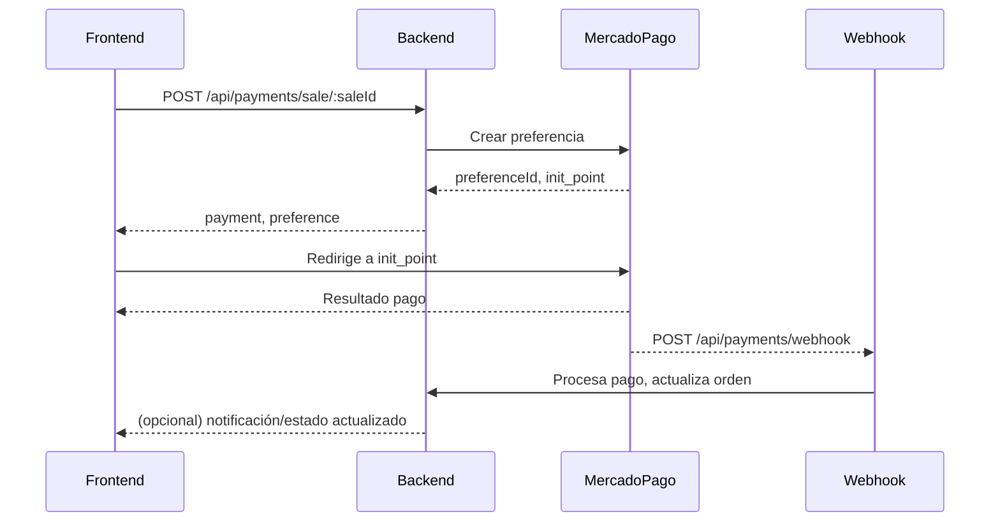

# 💰 API de Pagos y Cupones

> Documentación actualizada a julio 2025. Esta referencia describe los endpoints reales del backend, sus parámetros, headers, respuestas y flujos. **Todos los endpoints requieren autenticación JWT** salvo que se indique lo contrario.

---

## Índice

- [Pagos (`/api/payments`)](#pagos-apipayments)
- [Cupones (`/api/coupons`)](#cupones-apicoupons)
- [Flujo de Pagos y Webhooks](#flujo-de-pagos-y-webhooks)
- [Ejemplos de Uso Frontend](#ejemplos-de-uso-frontend)
- [Troubleshooting](#troubleshooting)
- [Mejores Prácticas](#mejores-prácticas)

---

## Pagos (`/api/payments`)

> **IMPORTANTE:** Todas las rutas requieren header `Authorization: Bearer <token>` salvo webhooks y callbacks.

### Endpoints

#### `POST /api/payments/sale/:saleId` — Crear preferencia de pago MercadoPago
**Headers:**
```
Authorization: Bearer <token>
```
**Respuesta:**
```json
{
  "payment": {
    "id": "string",
    "saleId": "string",
    "customerId": "string",
    "amount": 3000.00,
    "provider": "mercado_pago",
    "status": "pending",
    "externalReference": "sale-...",
    "providerPaymentId": "",
    "preferenceId": "...",
    "paymentMethod": "other",
    "createdAt": "2025-07-09T10:25:00.000Z",
    "updatedAt": "2025-07-09T10:25:00.000Z"
  },
  "preference": {
    "id": "string",
    "init_point": "https://www.mercadopago.com.ar/checkout/v1/redirect?pref_id=...",
    "sandbox_init_point": "https://sandbox.mercadopago.com.ar/checkout/v1/redirect?pref_id=..."
  }
}
```

#### `POST /api/payments/prueba/sale/:saleId` — Crear preferencia de pago (modo prueba)
**Headers:** igual a anterior
**Respuesta:** igual a anterior

#### `GET /api/payments/:id` — Obtener pago por ID
**Headers:** igual a anterior
**Respuesta:** objeto PaymentEntity

#### `GET /api/payments/by-sale/:saleId` — Obtener pagos por venta
**Headers:** igual a anterior
**Query params:** `page`, `limit`
**Respuesta:**
```json
{
  "total": 1,
  "items": [ { ... } ],
  "page": 1,
  "limit": 10
}
```

#### `GET /api/payments` — Listar historial de pagos
**Headers:** igual a anterior
**Query params:** `page`, `limit`, `status`, `saleId`
**Respuesta:** igual a anterior

#### `POST /api/payments/verify` — Verificar pago
**Headers:** igual a anterior
**Body:**
```json
{
  "paymentId": "...",
  "providerPaymentId": "..."
}
```
**Respuesta:** objeto PaymentEntity actualizado

#### `GET /api/payments/preference/:preferenceId` — Estado de preferencia
**Headers:** igual a anterior
**Respuesta:**
```json
{
  "success": true,
  "payment": { ... },
  "preferenceInfo": { ... }
}
```

#### `GET /api/payments/status/sale/:saleId` — Estado de pago por venta
**Headers:**
```
Authorization: Bearer <token>
```
**Respuesta:**
```json
{
  "success": true,
  "payment": { ... }
}
```

#### `POST /api/payments/manual-verify/:orderId` — Verificación manual de pagos
**Headers:** igual a anterior
**Respuesta:** objeto PaymentEntity actualizado

#### `POST /api/payments/webhook` — Webhook MercadoPago
**Headers:**
```
Content-Type: application/json
```
**Body:**
```json
{
  "id": 12345678901,
  "live_mode": false,
  "type": "payment",
  "date_created": "2025-07-09T10:30:00.000Z",
  "user_id": "123456789",
  "api_version": "v1",
  "action": "payment.updated",
  "data": { "id": "12345678901" }
}
```
**Respuesta:**
```json
{
  "message": "Notificación procesada exitosamente",
  "paymentStatus": "approved",
  "orderUpdated": true,
  "timestamp": "2025-07-09T10:31:00.000Z"
}
```

#### `GET /api/payments/mercadopago/payments` — Pagos hechos en MercadoPago (último año)
#### `GET /api/payments/mercadopago/charges` — Cobros hechos en MercadoPago (último año)

---

## Cupones (`/api/coupons`)

> **IMPORTANTE:** Todas las rutas requieren header `Authorization: Bearer <token>`. Se recomienda rol admin para crear, actualizar o eliminar cupones.

### Endpoints

#### `POST /api/coupons` — Crear cupón
**Headers:**
```
Authorization: Bearer <token>
Content-Type: application/json
```
**Body:**
```json
{
  "name": "Descuento Julio 2025",
  "code": "JULIO2025",
  "description": "Descuento especial para julio",
  "type": "PERCENTAGE",
  "value": 15,
  "minPurchaseAmount": 1000,
  "maxUsageCount": 100,
  "maxUsagePerUser": 1,
  "validFrom": "2025-07-01T00:00:00.000Z",
  "validUntil": "2025-07-31T23:59:59.999Z",
  "applicableCategories": ["catId1"],
  "isActive": true
}
```
**Respuesta:** objeto cupón creado

#### `GET /api/coupons` — Listar cupones
**Query params:** `page`, `limit`
**Respuesta:**
```json
{
  "total": 1,
  "items": [ { ... } ],
  "page": 1,
  "limit": 10
}
```

#### `GET /api/coupons/:id` — Obtener cupón por ID
**Respuesta:** objeto cupón

#### `PUT /api/coupons/:id` — Actualizar cupón
**Body:** igual a creación
**Respuesta:** objeto cupón actualizado

#### `DELETE /api/coupons/:id` — Eliminar/desactivar cupón
**Respuesta:**
```json
{
  "message": "Cupón eliminado (o desactivado)",
  "coupon": { ... }
}
```

---

## Flujo de Pagos y Webhooks

### Diagrama de flujo de pago con MercadoPago



---

## Ejemplos de Uso Frontend

### Crear preferencia de pago
```js
fetch('/api/payments/sale/123', {
  method: 'POST',
  headers: { Authorization: `Bearer ${token}` }
})
  .then(res => res.json())
  .then(data => window.location.href = data.preference.init_point);
```

### Consultar estado de pago por venta
```js
fetch('/api/payments/status/sale/123', {
  headers: { Authorization: `Bearer ${token}` }
})
  .then(res => res.json())
  .then(data => {
    if (data.payment.status === 'approved') {
      // mostrar éxito
    }
  });
```

---

## Troubleshooting

- **401 Unauthorized:** Verifica que el token JWT sea válido y esté presente en el header.
- **400 Bad Request:** Revisa los campos requeridos en el body (ver DTOs).
- **404 Not Found:** El recurso no existe o no pertenece al usuario autenticado.
- **409 Conflict:** Ya existe un pago pendiente para la venta.
- **500 Internal Server Error:** Error inesperado, revisar logs del backend.

---

## Mejores Prácticas

- Siempre validar el estado del pago antes de actualizar la UI.
- Usar paginación en listados grandes.
- Manejar correctamente los estados de pago en el frontend.
- Consultar el estado de la preferencia y del pago antes de mostrar éxito/fallo.
- Consultar los estados válidos y transitions antes de cambiar el estado de una orden.

---

Para más información sobre otros módulos:
- [Gestión de Pedidos](./api-orders.md)
- [Gestión de Productos](./api-products.md)
- [Clientes y Direcciones](./api-customers.md)
- [Sistema de Webhooks](./webhooks.md)

#### Verificación manual de pagos
```http
POST /api/payments/manual-verify/:orderId
Authorization: Bearer <jwt-token>
```
No se envía body, solo el parámetro `orderId` en la URL.
Devuelve el resultado de la verificación y actualización de pagos asociados a la orden.


#### Obtener historial de pagos
```http
GET /api/payments?page=1&limit=10&status=approved&saleId=64a7f8c9b123456789abcdef
Authorization: Bearer <jwt-token>
```
Respuesta:
```json
{
  "total": 1,
  "items": [
    {
      "id": "64a7f8c9b123456789abcdef",
      "saleId": "64a7f8c9b123456789abcde0",
      "customerId": "64a7f8c9b123456789abcde1",
      "amount": 3000.00,
      "provider": "mercado_pago",
      "status": "approved",
      "providerPaymentId": "12345678901",
      "externalReference": "sale-...",
      "preferenceId": "...",
      "paymentMethod": "other",
      "createdAt": "2024-01-15T10:25:00.000Z",
      "updatedAt": "2024-01-15T10:25:00.000Z"
    }
  ],
  "page": 1,
  "limit": 10
}
```

#### Obtener pagos por venta
```http
GET /api/payments/by-sale/:saleId
Authorization: Bearer <jwt-token>
```
Respuesta igual al historial, pero filtrado por venta.

#### Obtener pago por ID
```http
GET /api/payments/:id
Authorization: Bearer <jwt-token>
```
Respuesta: objeto PaymentEntity.

#### Verificar estado de preferencia
```http
GET /api/payments/preference/:preferenceId
Authorization: Bearer <jwt-token>
```
Respuesta:
```json
{
  "success": true,
  "payment": {
    "id": "...",
    "status": "pending",
    "externalReference": "...",
    "providerPaymentId": "...",
    "amount": 3000.00,
    "createdAt": "...",
    "updatedAt": "..."
  },
  "preferenceInfo": {
    "id": "...",
    "status": "approved",
    "isPaid": true,
    "paymentMethod": "...",
    "paymentDate": "..."
  }
}
```

#### Verificar estado de pago por venta
```http
GET /api/payments/status/sale/:saleId
Authorization: Bearer <jwt-token>
```
Respuesta:
```json
{
  "success": true,
  "payment": {
    "id": "...",
    "status": "approved",
    "amount": 3000.00,
    "providerPaymentId": "...",
    "lastVerified": "2024-01-15T10:30:00.000Z",
    "saleId": "..."
  }
}
```

#### Verificar pago manualmente
```http
POST /api/payments/manual-verify/:orderId
Authorization: Bearer <jwt-token>
```
Respuesta: verificación y actualización de pagos asociados a la orden.

#### Procesar Webhook de MercadoPago
```http
POST /api/payments/webhook
Content-Type: application/json

{
  "id": 12345678901,
  "live_mode": false,
  "type": "payment",
  "date_created": "2024-01-15T10:30:00.000Z",
  "user_id": "123456789",
  "api_version": "v1",
  "action": "payment.updated",
  "data": {
    "id": "12345678901"
  }
}
```

### Gestión de Cupones

#### Crear Cupón
```http
POST /api/coupons
Authorization: Bearer <admin-jwt-token>
Content-Type: application/json

{
  "name": "Descuento Enero 2024",
  "code": "ENERO2024",
  "description": "Descuento especial para enero",
  "type": "PERCENTAGE",
  "value": 15,
  "minPurchaseAmount": 1000,
  "maxUsageCount": 100,
  "maxUsagePerUser": 1,
  "validFrom": "2024-01-01T00:00:00.000Z",
  "validUntil": "2024-01-31T23:59:59.999Z",
  "applicableCategories": ["64a7f8c9b123456789abcdef"],
  "isActive": true
}
```

**Respuesta Exitosa (201):**
```json
{
  "id": "64a7f8c9b123456789abcdef",
  "name": "Descuento Enero 2024",
  "code": "ENERO2024",
  "description": "Descuento especial para enero",
  "type": "PERCENTAGE",
  "value": 15,
  "minPurchaseAmount": 1000,
  "maxUsageCount": 100,
  "maxUsagePerUser": 1,
  "currentUsageCount": 0,
  "validFrom": "2024-01-01T00:00:00.000Z",
  "validUntil": "2024-01-31T23:59:59.999Z",
  "applicableCategories": [
    {
      "id": "64a7f8c9b123456789abcdef",
      "name": "Electrónicos"
    }
  ],
  "isActive": true,
  "createdAt": "2024-01-10T09:00:00.000Z"
}
```

#### Validar Cupón
```http
POST /api/coupons/validate
Authorization: Bearer <jwt-token>
Content-Type: application/json

{
  "code": "ENERO2024",
  "cartTotal": 2500,
  "customerId": "64a7f8c9b123456789abcde0",
  "items": [
    {
      "productId": "64a7f8c9b123456789abcde1",
      "categoryId": "64a7f8c9b123456789abcdef",
      "price": 1500,
      "quantity": 1
    }
  ]
}
```

**Respuesta Exitosa (200):**
```json
{
  "valid": true,
  "coupon": {
    "id": "64a7f8c9b123456789abcdef",
    "code": "ENERO2024",
    "type": "PERCENTAGE",
    "value": 15
  },
  "discount": {
    "amount": 375,
    "percentage": 15,
    "applicableAmount": 2500
  },
  "finalTotal": 2125
}
```

#### Aplicar Cupón
```http
POST /api/coupons/apply
Authorization: Bearer <jwt-token>
Content-Type: application/json

{
  "code": "ENERO2024",
  "orderId": "64a7f8c9b123456789abcde0"
}
```

#### Listar Cupones Disponibles
```http
GET /api/coupons/available?customerId=64a7f8c9b123456789abcde0
Authorization: Bearer <jwt-token>
```

### Métodos de Pago


#### Listar métodos de pago activos
```http
GET /api/payment-methods/active
```
Respuesta:
```json
{
  "paymentMethods": [
    {
      "id": "64a7f8c9b123456789abcdef",
      "code": "MERCADO_PAGO",
      "name": "Mercado Pago",
      "description": "Pago online",
      "isActive": true,
      "defaultOrderStatusId": "id",
      "requiresOnlinePayment": true,
      "allowsManualConfirmation": false,
      "createdAt": "2024-01-01T00:00:00.000Z",
      "updatedAt": "2024-01-01T00:00:00.000Z"
    }
  ]
}
```

#### Crear Método de Pago (Solo Admin)
```http
POST /api/payment-methods
Authorization: Bearer <admin-jwt-token>
Content-Type: application/json

{
  "name": "Transferencia Bancaria",
  "description": "Transferencia directa a cuenta bancaria",
  "type": "transfer",
  "commission": 0,
  "config": {
    "bankAccount": "1234567890",
    "bankName": "Banco Ejemplo"
  },
  "isActive": true
}
```

## 💳 Integración MercadoPago

### Configuración Inicial

```typescript
// src/infrastructure/adapters/mercadopago.adapter.ts
import { MercadoPagoConfig, Preference, Payment } from 'mercadopago';

export class MercadoPagoAdapter {
  private client: MercadoPagoConfig;
  private preference: Preference;
  private payment: Payment;

  constructor() {
    this.client = new MercadoPagoConfig({
      accessToken: envs.MERCADO_PAGO_ACCESS_TOKEN,
      options: {
        timeout: 5000,
        idempotencyKey: 'abc'
      }
    });
    
    this.preference = new Preference(this.client);
    this.payment = new Payment(this.client);
  }

  async createPreference(preferenceData: any) {
    try {
      const preference = await this.preference.create({
        body: preferenceData
      });
      return preference;
    } catch (error) {
      throw new Error(`Error creating preference: ${error.message}`);
    }
  }

  async getPayment(paymentId: string) {
    try {
      const payment = await this.payment.get({
        id: paymentId
      });
      return payment;
    } catch (error) {
      throw new Error(`Error getting payment: ${error.message}`);
    }
  }
}
```

### Flujo de Pago Completo

```typescript
// Use Case: Crear preferencia de pago
export class CreatePaymentPreferenceUseCase {
  constructor(
    private readonly orderRepository: OrderRepository,
    private readonly mercadoPagoAdapter: MercadoPagoAdapter
  ) {}

  async execute(orderId: string): Promise<PaymentPreference> {
    // 1. Obtener orden
    const order = await this.orderRepository.findById(orderId);
    if (!order) throw CustomError.notFound('Orden no encontrada');

    // 2. Preparar items para MercadoPago
    const items = order.items.map(item => ({
      title: item.productName,
      quantity: item.quantity,
      currency_id: 'ARS',
      unit_price: item.price
    }));

    // 3. Configurar preferencia
    const preferenceData = {
      items,
      payer: {
        email: order.customer.email,
        name: order.customer.name,
        phone: order.customer.phone
      },
      back_urls: {
        success: `${envs.FRONTEND_URL}/payment/success`,
        failure: `${envs.FRONTEND_URL}/payment/failure`,
        pending: `${envs.FRONTEND_URL}/payment/pending`
      },
      auto_return: 'approved',
      external_reference: orderId,
      notification_url: `${envs.WEBSERVICE_URL}/api/payments/webhook`
    };

    // 4. Crear preferencia en MercadoPago
    const preference = await this.mercadoPagoAdapter.createPreference(preferenceData);

    return {
      preferenceId: preference.id,
      initPoint: preference.init_point,
      sandboxInitPoint: preference.sandbox_init_point
    };
  }
}
```

### Procesamiento de Webhooks

```typescript
// Use Case: Procesar webhook de MercadoPago
export class ProcessMercadoPagoWebhookUseCase {
  constructor(
    private readonly paymentRepository: PaymentRepository,
    private readonly orderRepository: OrderRepository,
    private readonly mercadoPagoAdapter: MercadoPagoAdapter,
    private readonly notificationService: NotificationService
  ) {}

  async execute(webhookData: any): Promise<void> {
    if (webhookData.type !== 'payment') return;

    const paymentId = webhookData.data.id;
    
    // 1. Obtener datos del pago desde MercadoPago
    const mpPayment = await this.mercadoPagoAdapter.getPayment(paymentId);
    
    // 2. Buscar orden por external_reference
    const orderId = mpPayment.external_reference;
    const order = await this.orderRepository.findById(orderId);
    
    if (!order) {
      logger.warn(`Orden no encontrada para payment: ${paymentId}`);
      return;
    }

    // 3. Crear o actualizar registro de pago
    const paymentData = {
      orderId: order.id,
      customerId: order.customerId,
      paymentMethodId: 'mercadopago-method-id',
      amount: mpPayment.transaction_amount,
      status: this.mapMpStatusToLocal(mpPayment.status),
      mpPaymentId: paymentId,
      mpStatus: mpPayment.status,
      mpStatusDetail: mpPayment.status_detail,
      description: `Pago MP - Orden ${order.orderNumber}`,
      transactionDate: new Date(mpPayment.date_created)
    };

    await this.paymentRepository.createOrUpdate(paymentData);

    // 4. Actualizar estado de la orden si corresponde
    if (mpPayment.status === 'approved') {
      await this.orderRepository.updateStatus(orderId, 'PAID');
      
      // 5. Enviar notificaciones
      await this.notificationService.sendPaymentConfirmation(order, mpPayment);
    }
  }

  private mapMpStatusToLocal(mpStatus: string): string {
    const statusMap = {
      'pending': 'pending',
      'approved': 'approved',
      'rejected': 'rejected',
      'cancelled': 'cancelled',
      'refunded': 'refunded'
    };
    
    return statusMap[mpStatus] || 'unknown';
  }
}
```

## 🎫 Sistema de Cupones

### Tipos de Cupones

```typescript
export enum CouponType {
  PERCENTAGE = 'PERCENTAGE',
  FIXED_AMOUNT = 'FIXED_AMOUNT',
  FREE_SHIPPING = 'FREE_SHIPPING'
}

export interface CouponEntity {
  id: string;
  name: string;
  code: string;
  description?: string;
  type: CouponType;
  value: number; // Porcentaje o monto fijo
  minPurchaseAmount?: number;
  maxDiscountAmount?: number; // Para cupones porcentuales
  maxUsageCount?: number;
  maxUsagePerUser?: number;
  currentUsageCount: number;
  validFrom: Date;
  validUntil: Date;
  applicableCategories?: string[]; // IDs de categorías
  excludedProducts?: string[]; // IDs de productos excluidos
  isActive: boolean;
  createdAt: Date;
  updatedAt: Date;
}
```

### Validación de Cupones

```typescript
export class ValidateCouponUseCase {
  constructor(
    private readonly couponRepository: CouponRepository,
    private readonly couponUsageRepository: CouponUsageRepository
  ) {}

  async execute(validationData: CouponValidationDto): Promise<CouponValidationResult> {
    const { code, cartTotal, customerId, items } = validationData;

    // 1. Buscar cupón por código
    const coupon = await this.couponRepository.findByCode(code);
    if (!coupon) {
      throw CustomError.notFound('Cupón no encontrado');
    }

    // 2. Validar estado del cupón
    if (!coupon.isActive) {
      throw CustomError.badRequest('Cupón no está activo');
    }

    // 3. Validar fechas de validez
    const now = new Date();
    if (now < coupon.validFrom || now > coupon.validUntil) {
      throw CustomError.badRequest('Cupón expirado o no válido aún');
    }

    // 4. Validar límite de uso general
    if (coupon.maxUsageCount && coupon.currentUsageCount >= coupon.maxUsageCount) {
      throw CustomError.badRequest('Cupón agotado');
    }

    // 5. Validar límite de uso por usuario
    if (coupon.maxUsagePerUser && customerId) {
      const userUsageCount = await this.couponUsageRepository.countByUserAndCoupon(
        customerId, 
        coupon.id
      );
      
      if (userUsageCount >= coupon.maxUsagePerUser) {
        throw CustomError.badRequest('Has alcanzado el límite de uso para este cupón');
      }
    }

    // 6. Validar monto mínimo de compra
    if (coupon.minPurchaseAmount && cartTotal < coupon.minPurchaseAmount) {
      throw CustomError.badRequest(
        `Monto mínimo de compra: $${coupon.minPurchaseAmount}`
      );
    }

    // 7. Calcular monto aplicable (productos en categorías válidas)
    const applicableAmount = this.calculateApplicableAmount(coupon, items);
    
    if (applicableAmount === 0) {
      throw CustomError.badRequest('El cupón no aplica a los productos en tu carrito');
    }

    // 8. Calcular descuento
    const discount = this.calculateDiscount(coupon, applicableAmount);

    return {
      valid: true,
      coupon: {
        id: coupon.id,
        code: coupon.code,
        type: coupon.type,
        value: coupon.value
      },
      discount: {
        amount: discount,
        percentage: coupon.type === CouponType.PERCENTAGE ? coupon.value : 0,
        applicableAmount
      },
      finalTotal: cartTotal - discount
    };
  }

  private calculateApplicableAmount(coupon: CouponEntity, items: CartItem[]): number {
    // Si no hay categorías específicas, aplica a todo
    if (!coupon.applicableCategories || coupon.applicableCategories.length === 0) {
      return items.reduce((total, item) => {
        // Verificar productos excluidos
        if (coupon.excludedProducts?.includes(item.productId)) {
          return total;
        }
        return total + (item.price * item.quantity);
      }, 0);
    }

    // Aplicar solo a productos de categorías específicas
    return items.reduce((total, item) => {
      if (coupon.excludedProducts?.includes(item.productId)) {
        return total;
      }
      
      if (coupon.applicableCategories!.includes(item.categoryId)) {
        return total + (item.price * item.quantity);
      }
      
      return total;
    }, 0);
  }

  private calculateDiscount(coupon: CouponEntity, applicableAmount: number): number {
    switch (coupon.type) {
      case CouponType.PERCENTAGE:
        let discount = (applicableAmount * coupon.value) / 100;
        
        // Aplicar límite máximo de descuento si existe
        if (coupon.maxDiscountAmount) {
          discount = Math.min(discount, coupon.maxDiscountAmount);
        }
        
        return Math.round(discount * 100) / 100; // Redondear a 2 decimales

      case CouponType.FIXED_AMOUNT:
        // No puede ser mayor al monto aplicable
        return Math.min(coupon.value, applicableAmount);

      case CouponType.FREE_SHIPPING:
        // El descuento del envío se maneja en otro lugar
        return 0;

      default:
        return 0;
    }
  }
}
```

## 💡 Ejemplos de Uso

### Cliente Frontend - Proceso de Pago Completo

```javascript
// 1. Crear preferencia de pago
const createPaymentPreference = async (orderId) => {
  try {
    const response = await authenticatedFetch('/api/payments/create-preference', {
      method: 'POST',
      body: JSON.stringify({ orderId })
    });

    const data = await response.json();

    if (response.ok) {
      return {
        success: true,
        preferenceId: data.preferenceId,
        initPoint: data.initPoint
      };
    } else {
      return { success: false, message: data.message };
    }
  } catch (error) {
    return { success: false, message: 'Error de conexión' };
  }
};

// 2. Redirigir a MercadoPago
const redirectToPayment = (initPoint) => {
  window.location.href = initPoint;
};

// 3. Proceso completo
const processPayment = async (orderId) => {
  const result = await createPaymentPreference(orderId);
  
  if (result.success) {
    redirectToPayment(result.initPoint);
  } else {
    alert('Error al procesar el pago: ' + result.message);
  }
};
```

### Validación y Aplicación de Cupones

```javascript
// Validar cupón antes de aplicar
const validateCoupon = async (couponCode, cartData) => {
  try {
    const response = await authenticatedFetch('/api/coupons/validate', {
      method: 'POST',
      body: JSON.stringify({
        code: couponCode,
        cartTotal: cartData.total,
        customerId: cartData.customerId,
        items: cartData.items
      })
    });

    const data = await response.json();
    return { success: response.ok, data };
  } catch (error) {
    return { success: false, message: 'Error de conexión' };
  }
};

// Aplicar cupón al carrito
const applyCouponToCart = async (couponCode) => {
  const cartData = getCartData(); // Función para obtener datos del carrito
  
  const validation = await validateCoupon(couponCode, cartData);
  
  if (validation.success) {
    // Actualizar UI con el descuento
    updateCartTotals({
      subtotal: cartData.total,
      discount: validation.data.discount.amount,
      total: validation.data.finalTotal,
      coupon: validation.data.coupon
    });
    
    return { success: true, discount: validation.data.discount };
  } else {
    return { success: false, message: validation.data?.message || 'Cupón inválido' };
  }
};

// Ejemplo de uso en React
const CouponSection = () => {
  const [couponCode, setCouponCode] = useState('');
  const [appliedCoupon, setAppliedCoupon] = useState(null);
  const [loading, setLoading] = useState(false);

  const handleApplyCoupon = async () => {
    setLoading(true);
    
    const result = await applyCouponToCart(couponCode);
    
    if (result.success) {
      setAppliedCoupon({
        code: couponCode,
        discount: result.discount
      });
      setCouponCode('');
    } else {
      alert(result.message);
    }
    
    setLoading(false);
  };

  return (
    <div className="coupon-section">
      {!appliedCoupon ? (
        <div>
          <input
            type="text"
            value={couponCode}
            onChange={(e) => setCouponCode(e.target.value)}
            placeholder="Código de cupón"
          />
          <button onClick={handleApplyCoupon} disabled={loading}>
            {loading ? 'Validando...' : 'Aplicar'}
          </button>
        </div>
      ) : (
        <div className="applied-coupon">
          <span>Cupón aplicado: {appliedCoupon.code}</span>
          <span>Descuento: -${appliedCoupon.discount.amount}</span>
          <button onClick={() => setAppliedCoupon(null)}>Quitar</button>
        </div>
      )}
    </div>
  );
};
```

## ⚙️ Configuración

### Variables de Entorno para Pagos

```env
# MercadoPago Configuration
MERCADO_PAGO_ACCESS_TOKEN=APP_USR-tu-access-token-aqui
MERCADO_PAGO_PUBLIC_KEY=APP_USR-tu-public-key-aqui
MERCADO_PAGO_WEBHOOK_SECRET=tu-webhook-secret

# URLs para callbacks
WEBSERVICE_URL=http://localhost:3000
FRONTEND_URL=http://localhost:4200

# Base de datos
MONGO_URL=mongodb://localhost:27017/startup-ecommerce
```

### Configuración de Webhooks

```typescript
// src/configs/mercadopago.config.ts
export const MERCADO_PAGO_CONFIG = {
  accessToken: envs.MERCADO_PAGO_ACCESS_TOKEN,
  publicKey: envs.MERCADO_PAGO_PUBLIC_KEY,
  webhookSecret: envs.MERCADO_PAGO_WEBHOOK_SECRET,
  
  // URLs de callback
  successUrl: `${envs.FRONTEND_URL}/payment/success`,
  failureUrl: `${envs.FRONTEND_URL}/payment/failure`,
  pendingUrl: `${envs.FRONTEND_URL}/payment/pending`,
  
  // URL para webhooks
  webhookUrl: `${envs.WEBSERVICE_URL}/api/payments/webhook`,
  
  // Configuraciones adicionales
  autoReturn: 'approved',
  binaryMode: true
};
```

---

## 🔗 Enlaces Relacionados

- [💳 Documentación Completa de MercadoPago](./mercadopago.md)
- [📦 Gestión de Productos](./api-products.md)
- [🛒 Carrito y Pedidos](./api-orders.md)
- [🔧 Sistema de Webhooks](./webhooks.md)
- [📧 Sistema de Notificaciones](./notifications.md)

---

*Última actualización: Enero 2024*
