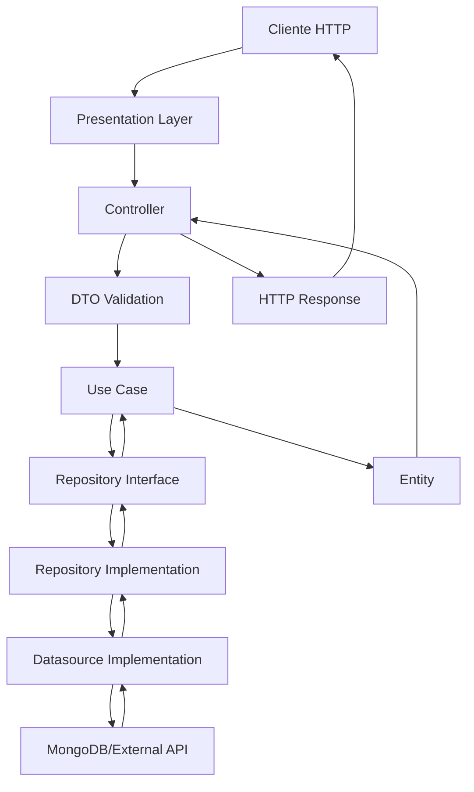

# 🏗️ Arquitectura del Proyecto

Documentación completa de la arquitectura Clean Architecture implementada en el backend del e-commerce, incluyendo patrones de diseño, estructura de carpetas y principios de desarrollo.

## 📑 Índice

- [🎯 Principios Arquitectónicos](#-principios-arquitectónicos)
- [📁 Estructura del Proyecto](#-estructura-del-proyecto)
- [🔄 Flujo de Datos](#-flujo-de-datos)
- [🎨 Patrones de Diseño](#-patrones-de-diseño)
- [🔧 Capas de la Arquitectura](#-capas-de-la-arquitectura)
- [📦 Gestión de Dependencias](#-gestión-de-dependencias)
- [💡 Ejemplos Prácticos](#-ejemplos-prácticos)
- [🔗 Integraciones](#-integraciones)

## 🎯 Principios Arquitectónicos

### ✅ Clean Architecture
- **Separación de responsabilidades** en capas bien definidas
- **Inversión de dependencias** hacia el núcleo de dominio
- **Independencia de frameworks** y librerías externas
- **Testabilidad** en todas las capas
- **Flexibilidad** para cambios futuros

### ✅ Principios SOLID
- **Single Responsibility Principle**: Cada clase tiene una sola razón para cambiar
- **Open/Closed Principle**: Abierto para extensión, cerrado para modificación
- **Liskov Substitution Principle**: Las implementaciones deben ser intercambiables
- **Interface Segregation Principle**: Interfaces específicas mejor que generales
- **Dependency Inversion Principle**: Depender de abstracciones, no de concreciones

### ✅ Mejores Prácticas
- **Immutabilidad** donde sea posible
- **Validación temprana** de datos
- **Manejo centralizado** de errores
- **Logging detallado** para debugging
- **Configuración externa** para flexibilidad

## 📁 Estructura del Proyecto

```
src/
├── configs/                    # Configuraciones globales
│   ├── bcrypt.ts              # Configuración de hashing
│   ├── envs.ts                # Variables de entorno
│   ├── jwt.ts                 # Configuración JWT
│   ├── logger.ts              # Configuración de logging
│   └── validators.ts          # Validadores comunes
│
├── data/                      # Capa de datos
│   └── mongodb/
│       └── models/            # Modelos de Mongoose
│           ├── auth/          # Modelos de autenticación
│           ├── products/      # Modelos de productos
│           ├── orders/        # Modelos de pedidos
│           └── ...
│
├── domain/                    # Capa de dominio (Business Logic)
│   ├── dtos/                  # Data Transfer Objects
│   │   ├── auth/
│   │   ├── products/
│   │   ├── orders/
│   │   └── ...
│   ├── entities/              # Entidades de dominio
│   │   ├── auth/
│   │   ├── products/
│   │   ├── orders/
│   │   └── ...
│   ├── datasources/           # Interfaces de datasources
│   │   ├── auth/
│   │   ├── products/
│   │   └── ...
│   ├── repositories/          # Interfaces de repositories
│   │   ├── auth/
│   │   ├── products/
│   │   └── ...
│   ├── use-cases/             # Cases de uso
│   │   ├── auth/
│   │   ├── products/
│   │   ├── orders/
│   │   └── ...
│   ├── errors/                # Errores personalizados
│   │   └── custom.error.ts
│   └── interfaces/            # Interfaces de servicios
│       ├── email.service.ts
│       ├── storage.service.ts
│       └── ...
│
├── infrastructure/            # Capa de infraestructura
│   ├── datasources/           # Implementaciones de datasources
│   │   ├── auth/
│   │   ├── products/
│   │   └── ...
│   ├── repositories/          # Implementaciones de repositories
│   │   ├── auth/
│   │   ├── products/
│   │   └── ...
│   ├── mappers/               # Mappers objeto-entidad
│   │   ├── auth/
│   │   ├── products/
│   │   └── ...
│   ├── adapters/              # Adaptadores a servicios externos
│   │   ├── cloudinary.adapter.ts
│   │   ├── mercadopago.adapter.ts
│   │   ├── telegram.adapter.ts
│   │   └── ...
│   └── services/              # Implementaciones de servicios
│       ├── email.service.impl.ts
│       ├── storage.service.impl.ts
│       └── ...
│
├── presentation/              # Capa de presentación (API/HTTP)
│   ├── controllers/           # Controladores HTTP
│   │   ├── auth/
│   │   ├── products/
│   │   ├── orders/
│   │   └── ...
│   ├── routes/                # Definición de rutas
│   │   ├── auth.routes.ts
│   │   ├── products.routes.ts
│   │   ├── orders.routes.ts
│   │   └── ...
│   ├── middlewares/           # Middlewares HTTP
│   │   ├── auth.middleware.ts
│   │   ├── upload.middleware.ts
│   │   ├── validation.middleware.ts
│   │   └── ...
│   └── server.ts              # Configuración del servidor Express
│
├── seeders/                   # Scripts de población de datos
│   ├── categories.seeder.ts
│   ├── products.seeder.ts
│   └── ...
│
└── app.ts                     # Punto de entrada de la aplicación
```

## 🔄 Flujo de Datos

### Flujo Típico de una Petición HTTP



### Ejemplo de Flujo: Crear Producto

```typescript
// 1. Presentation Layer - Controller
class ProductController {
  async createProduct(req: Request, res: Response) {
    // 2. Validación con DTO
    const [error, createProductDto] = CreateProductDto.create(req.body);
    if (error) return res.status(400).json({ message: error });

    // 3. Ejecutar Use Case
    const product = await this.createProductUseCase.execute(createProductDto!);
    
    // 4. Respuesta HTTP
    res.status(201).json(product);
  }
}

// 5. Domain Layer - Use Case
class CreateProductUseCase {
  async execute(createProductDto: CreateProductDto): Promise<ProductEntity> {
    // Lógica de negocio
    const existingProduct = await this.productRepository.findByName(createProductDto.name);
    if (existingProduct) {
      throw CustomError.badRequest('Product already exists');
    }

    // 6. Llamada al Repository
    return await this.productRepository.create(createProductDto);
  }
}

// 7. Infrastructure Layer - Repository Implementation
class ProductRepositoryImpl implements ProductRepository {
  async create(createProductDto: CreateProductDto): Promise<ProductEntity> {
    // 8. Delegación al Datasource
    return await this.productDatasource.create(createProductDto);
  }
}

// 9. Infrastructure Layer - Datasource Implementation
class ProductMongoDataSourceImpl implements ProductDatasource {
  async create(createProductDto: CreateProductDto): Promise<ProductEntity> {
    // 10. Interacción con MongoDB
    const product = new ProductModel(createProductDto);
    const savedProduct = await product.save();
    
    // 11. Mapeo a Entity
    return ProductMapper.fromObjectToEntity(savedProduct);
  }
}
```

## 🎨 Patrones de Diseño

### 1. Repository Pattern

```typescript
// Domain Layer - Interface
export interface ProductRepository {
  create(createProductDto: CreateProductDto): Promise<ProductEntity>;
  findById(id: string): Promise<ProductEntity | null>;
  findAll(paginationDto: PaginationDto): Promise<{ products: ProductEntity[], total: number }>;
  update(id: string, updateProductDto: UpdateProductDto): Promise<ProductEntity>;
  delete(id: string): Promise<void>;
}

// Infrastructure Layer - Implementation
export class ProductRepositoryImpl implements ProductRepository {
  constructor(private readonly productDatasource: ProductDatasource) {}

  async create(createProductDto: CreateProductDto): Promise<ProductEntity> {
    return await this.productDatasource.create(createProductDto);
  }

  async findById(id: string): Promise<ProductEntity | null> {
    return await this.productDatasource.findById(id);
  }

  // ... más métodos
}
```

### 2. Factory Pattern (DTOs)

```typescript
export class CreateProductDto {
  public readonly name: string;
  public readonly description: string;
  public readonly price: number;
  public readonly categoryId: string;

  private constructor(name: string, description: string, price: number, categoryId: string) {
    this.name = name;
    this.description = description;
    this.price = price;
    this.categoryId = categoryId;
  }

  static create(object: { [key: string]: any }): [string?, CreateProductDto?] {
    const { name, description, price, categoryId } = object;

    // Validaciones
    if (!name) return ['Name is required'];
    if (!description) return ['Description is required'];
    if (!price || price <= 0) return ['Valid price is required'];
    if (!categoryId) return ['Category ID is required'];

    return [undefined, new CreateProductDto(name, description, price, categoryId)];
  }
}
```

### 3. Adapter Pattern

```typescript
// Adaptador para Cloudinary
export class CloudinaryAdapter {
  constructor() {
    cloudinary.config({
      cloud_name: envs.CLOUDINARY_CLOUD_NAME,
      api_key: envs.CLOUDINARY_API_KEY,
      api_secret: envs.CLOUDINARY_API_SECRET
    });
  }

  async uploadFile(file: Express.Multer.File, folder: string): Promise<string> {
    try {
      const result = await cloudinary.uploader.upload(file.path, {
        folder: folder,
        resource_type: 'auto'
      });
      return result.secure_url;
    } catch (error) {
      throw new CustomError('Error uploading file to Cloudinary');
    }
  }

  async deleteFile(publicId: string): Promise<void> {
    await cloudinary.uploader.destroy(publicId);
  }
}
```

### 4. Mapper Pattern

```typescript
export class ProductMapper {
  static fromObjectToEntity(object: any): ProductEntity {
    const { _id, name, description, price, category, tags, stock, images, isActive, createdAt, updatedAt } = object;

    return new ProductEntity(
      _id?.toString() || object.id,
      name,
      description,
      price,
      category ? CategoryMapper.fromObjectToEntity(category) : undefined,
      tags ? tags.map((tag: any) => TagMapper.fromObjectToEntity(tag)) : [],
      stock,
      images || [],
      isActive,
      createdAt,
      updatedAt
    );
  }

  static fromEntityToObject(entity: ProductEntity): any {
    return {
      _id: entity.id,
      name: entity.name,
      description: entity.description,
      price: entity.price,
      categoryId: entity.category?.id,
      tags: entity.tags?.map(tag => tag.id),
      stock: entity.stock,
      images: entity.images,
      isActive: entity.isActive,
      createdAt: entity.createdAt,
      updatedAt: entity.updatedAt
    };
  }
}
```

### 5. Dependency Injection

```typescript
// Configuración de dependencias
export class DependencyContainer {
  // Datasources
  public readonly productDatasource: ProductDatasource;
  public readonly categoryDatasource: CategoryDatasource;
  
  // Repositories
  public readonly productRepository: ProductRepository;
  public readonly categoryRepository: CategoryRepository;
  
  // Use Cases
  public readonly createProductUseCase: CreateProductUseCase;
  public readonly getProductsUseCase: GetProductsUseCase;
  
  // Services
  public readonly cloudinaryAdapter: CloudinaryAdapter;
  public readonly emailService: EmailService;

  constructor() {
    // Inicializar datasources
    this.productDatasource = new ProductMongoDataSourceImpl();
    this.categoryDatasource = new CategoryMongoDataSourceImpl();
    
    // Inicializar repositories
    this.productRepository = new ProductRepositoryImpl(this.productDatasource);
    this.categoryRepository = new CategoryRepositoryImpl(this.categoryDatasource);
    
    // Inicializar use cases
    this.createProductUseCase = new CreateProductUseCase(
      this.productRepository,
      this.categoryRepository
    );
    this.getProductsUseCase = new GetProductsUseCase(this.productRepository);
    
    // Inicializar servicios
    this.cloudinaryAdapter = new CloudinaryAdapter();
    this.emailService = new EmailServiceImpl();
  }
}
```

## 🔧 Capas de la Arquitectura

### Domain Layer (Núcleo)

**Responsabilidades:**
- Definir entidades de negocio
- Establecer reglas de negocio
- Definir interfaces de repositorios
- Implementar casos de uso
- Gestionar DTOs y validaciones

**Características:**
- No tiene dependencias externas
- Independiente de frameworks
- Contiene la lógica de negocio pura
- Define contratos (interfaces)

```typescript
// Ejemplo: Entidad de Dominio
export class ProductEntity {
  public readonly id: string;
  public readonly name: string;
  public readonly description: string;
  public readonly price: number;
  public readonly priceWithTax: number; // Computed property
  public readonly category?: CategoryEntity;
  public readonly tags?: TagEntity[];
  public readonly stock?: number;
  public readonly images: string[];
  public readonly isActive: boolean;
  public readonly createdAt: Date;
  public readonly updatedAt: Date;

  constructor(
    id: string,
    name: string,
    description: string,
    price: number,
    category?: CategoryEntity,
    tags?: TagEntity[],
    stock?: number,
    images: string[] = [],
    isActive: boolean = true,
    createdAt: Date = new Date(),
    updatedAt: Date = new Date()
  ) {
    this.id = id;
    this.name = name;
    this.description = description;
    this.price = price;
    this.priceWithTax = this.calculatePriceWithTax();
    this.category = category;
    this.tags = tags;
    this.stock = stock;
    this.images = images;
    this.isActive = isActive;
    this.createdAt = createdAt;
    this.updatedAt = updatedAt;
  }

  private calculatePriceWithTax(): number {
    const TAX_RATE = 0.21; // 21% IVA
    return Math.round(this.price * (1 + TAX_RATE) * 100) / 100;
  }

  public isInStock(): boolean {
    return this.stock === undefined || this.stock > 0;
  }

  public canBePurchased(quantity: number): boolean {
    return this.isActive && this.isInStock() && 
           (this.stock === undefined || this.stock >= quantity);
  }
}
```

### Infrastructure Layer

**Responsabilidades:**
- Implementar interfaces del dominio
- Adaptar servicios externos
- Manejar persistencia de datos
- Gestionar comunicaciones externas

**Características:**
- Conoce el dominio (implementa sus interfaces)
- Maneja detalles técnicos
- Adaptadores a servicios externos
- Configuraciones específicas

```typescript
// Ejemplo: Implementación de Datasource
export class ProductMongoDataSourceImpl implements ProductDatasource {
  constructor(private readonly productModel: Model<any>) {}

  async create(createProductDto: CreateProductDto): Promise<ProductEntity> {
    const product = new this.productModel(createProductDto);
    const savedProduct = await product.save();
    
    // Poblar relaciones
    await savedProduct.populate([
      { path: 'category', model: 'Category' },
      { path: 'tags', model: 'Tag' }
    ]);

    return ProductMapper.fromObjectToEntity(savedProduct);
  }

  async findById(id: string): Promise<ProductEntity | null> {
    const product = await this.productModel
      .findById(id)
      .populate([
        { path: 'category', model: 'Category' },
        { path: 'tags', model: 'Tag' }
      ]);

    return product ? ProductMapper.fromObjectToEntity(product) : null;
  }

  async search(query: string, filters: any, pagination: PaginationDto): Promise<{ products: ProductEntity[], total: number }> {
    const searchQuery: any = {};

    // Búsqueda por texto
    if (query) {
      searchQuery.$or = [
        { name: { $regex: query, $options: 'i' } },
        { description: { $regex: query, $options: 'i' } }
      ];
    }

    // Filtros
    if (filters.categoryId) {
      searchQuery.category = filters.categoryId;
    }

    if (filters.minPrice !== undefined || filters.maxPrice !== undefined) {
      searchQuery.price = {};
      if (filters.minPrice !== undefined) {
        searchQuery.price.$gte = filters.minPrice;
      }
      if (filters.maxPrice !== undefined) {
        searchQuery.price.$lte = filters.maxPrice;
      }
    }

    if (filters.tags && filters.tags.length > 0) {
      searchQuery.tags = { $in: filters.tags };
    }

    if (filters.inStock) {
      searchQuery.$or = [
        { stock: { $gt: 0 } },
        { stock: { $exists: false } }
      ];
    }

    const [products, total] = await Promise.all([
      this.productModel
        .find(searchQuery)
        .populate([
          { path: 'category', model: 'Category' },
          { path: 'tags', model: 'Tag' }
        ])
        .sort({ createdAt: -1 })
        .skip((pagination.page - 1) * pagination.limit)
        .limit(pagination.limit),
      this.productModel.countDocuments(searchQuery)
    ]);

    return {
      products: products.map(ProductMapper.fromObjectToEntity),
      total
    };
  }
}
```

### Presentation Layer

**Responsabilidades:**
- Manejar peticiones HTTP
- Validar datos de entrada
- Formatear respuestas
- Gestionar autenticación y autorización

**Características:**
- Conoce solo los casos de uso
- Maneja aspectos HTTP específicos
- Validación de entrada
- Serialización de respuestas

```typescript
// Ejemplo: Controlador
export class ProductController {
  constructor(
    private readonly createProductUseCase: CreateProductUseCase,
    private readonly getProductsUseCase: GetProductsUseCase,
    private readonly getProductByIdUseCase: GetProductByIdUseCase,
    private readonly updateProductUseCase: UpdateProductUseCase,
    private readonly deleteProductUseCase: DeleteProductUseCase
  ) {}

  createProduct = async (req: Request, res: Response) => {
    try {
      const [error, createProductDto] = CreateProductDto.create(req.body);
      if (error) return res.status(400).json({ message: error });

      const product = await this.createProductUseCase.execute(createProductDto!);
      
      res.status(201).json(product);
    } catch (error) {
      this.handleError(error, res);
    }
  };

  getProducts = async (req: Request, res: Response) => {
    try {
      const [paginationError, paginationDto] = PaginationDto.create(req.query);
      if (paginationError) return res.status(400).json({ message: paginationError });

      const { products, total } = await this.getProductsUseCase.execute(paginationDto!);
      
      res.json({
        products,
        total,
        page: paginationDto!.page,
        limit: paginationDto!.limit,
        totalPages: Math.ceil(total / paginationDto!.limit)
      });
    } catch (error) {
      this.handleError(error, res);
    }
  };

  private handleError = (error: unknown, res: Response) => {
    if (error instanceof CustomError) {
      return res.status(error.statusCode).json({ message: error.message });
    }

    logger.error('Unexpected error in ProductController:', error);
    res.status(500).json({ message: 'Internal server error' });
  };
}
```

## 📦 Gestión de Dependencias

### Inyección de Dependencias

```typescript
// src/presentation/server.ts
export class Server {
  private app: express.Application;
  private dependencies: DependencyContainer;

  constructor() {
    this.app = express();
    this.dependencies = new DependencyContainer();
    this.configureMiddlewares();
    this.configureRoutes();
  }

  private configureRoutes(): void {
    // Auth routes
    this.app.use('/api/auth', new AuthRoutes(
      this.dependencies.authController
    ).routes);

    // Product routes
    this.app.use('/api/products', new ProductRoutes(
      this.dependencies.productController
    ).routes);

    // Order routes
    this.app.use('/api/orders', new OrderRoutes(
      this.dependencies.orderController
    ).routes);

    // Admin routes
    this.app.use('/api/admin', [
      AuthMiddleware.validateJwt,
      AuthMiddleware.checkRole(['ADMIN_ROLE']),
      new AdminRoutes(this.dependencies).routes
    ]);
  }
}
```

### Configuración de Dependencias

```typescript
// src/configs/dependencies.config.ts
export class DependencyContainer {
  // Models
  public readonly userModel = UserModel;
  public readonly productModel = ProductModel;
  public readonly orderModel = OrderModel;
  
  // Datasources
  public readonly authDatasource: AuthDatasource;
  public readonly productDatasource: ProductDatasource;
  public readonly orderDatasource: OrderDatasource;
  
  // Repositories
  public readonly authRepository: AuthRepository;
  public readonly productRepository: ProductRepository;
  public readonly orderRepository: OrderRepository;
  
  // External Services
  public readonly cloudinaryAdapter: CloudinaryAdapter;
  public readonly mercadoPagoAdapter: MercadoPagoAdapter;
  public readonly emailService: EmailService;
  public readonly telegramService: TelegramService;
  
  // Use Cases
  public readonly registerUserUseCase: RegisterUserUseCase;
  public readonly loginUserUseCase: LoginUserUseCase;
  public readonly createProductUseCase: CreateProductUseCase;
  public readonly getProductsUseCase: GetProductsUseCase;
  
  // Controllers
  public readonly authController: AuthController;
  public readonly productController: ProductController;
  public readonly orderController: OrderController;

  constructor() {
    // Initialize datasources
    this.authDatasource = new AuthMongoDataSourceImpl(this.userModel);
    this.productDatasource = new ProductMongoDataSourceImpl(this.productModel);
    this.orderDatasource = new OrderMongoDataSourceImpl(this.orderModel);
    
    // Initialize repositories
    this.authRepository = new AuthRepositoryImpl(this.authDatasource);
    this.productRepository = new ProductRepositoryImpl(this.productDatasource);
    this.orderRepository = new OrderRepositoryImpl(this.orderDatasource);
    
    // Initialize external services
    this.cloudinaryAdapter = new CloudinaryAdapter();
    this.mercadoPagoAdapter = new MercadoPagoAdapter();
    this.emailService = new EmailServiceImpl();
    this.telegramService = new TelegramServiceImpl();
    
    // Initialize use cases
    this.registerUserUseCase = new RegisterUserUseCase(
      this.authRepository,
      this.emailService
    );
    this.loginUserUseCase = new LoginUserUseCase(this.authRepository);
    this.createProductUseCase = new CreateProductUseCase(
      this.productRepository,
      this.cloudinaryAdapter
    );
    this.getProductsUseCase = new GetProductsUseCase(this.productRepository);
    
    // Initialize controllers
    this.authController = new AuthController(
      this.registerUserUseCase,
      this.loginUserUseCase
    );
    this.productController = new ProductController(
      this.createProductUseCase,
      this.getProductsUseCase
    );
    this.orderController = new OrderController(
      this.orderRepository,
      this.mercadoPagoAdapter
    );
  }
}
```

## 🔗 Integraciones

### Servicios Externos

```typescript
// src/infrastructure/adapters/external-services.config.ts
export class ExternalServicesConfig {
  // Cloudinary para almacenamiento de imágenes
  static configureCloudinary(): void {
    cloudinary.config({
      cloud_name: envs.CLOUDINARY_CLOUD_NAME,
      api_key: envs.CLOUDINARY_API_KEY,
      api_secret: envs.CLOUDINARY_API_SECRET
    });
  }

  // MercadoPago para pagos
  static configureMercadoPago(): MercadoPagoConfig {
    return new MercadoPagoConfig({
      accessToken: envs.MERCADO_PAGO_ACCESS_TOKEN,
      options: {
        timeout: 5000,
        idempotencyKey: 'abc'
      }
    });
  }

  // Nodemailer para emails
  static configureNodemailer(): nodemailer.Transporter {
    return nodemailer.createTransporter({
      service: envs.MAILER_SERVICE,
      auth: {
        user: envs.MAILER_EMAIL,
        pass: envs.MAILER_SECRET_KEY
      }
    });
  }

  // Telegram Bot
  static configureTelegramBot(): TelegramBot {
    return new TelegramBot(envs.TELEGRAM_BOT_TOKEN, {
      polling: false
    });
  }
}
```

### Base de Datos

```typescript
// src/data/mongodb/connection.ts
export class MongoDatabase {
  static async connect(): Promise<void> {
    try {
      await mongoose.connect(envs.MONGO_URL, {
        dbName: envs.MONGO_DB_NAME
      });
      
      logger.info('MongoDB connected successfully');
    } catch (error) {
      logger.error('MongoDB connection error:', error);
      throw error;
    }
  }

  static async disconnect(): Promise<void> {
    await mongoose.disconnect();
    logger.info('MongoDB disconnected');
  }
}
```

## 💡 Ejemplos Prácticos

### Caso de Uso Completo: Crear Pedido

```typescript
// Domain Layer - Use Case
export class CreateOrderUseCase {
  constructor(
    private readonly orderRepository: OrderRepository,
    private readonly cartRepository: CartRepository,
    private readonly customerRepository: CustomerRepository,
    private readonly productRepository: ProductRepository,
    private readonly mercadoPagoAdapter: MercadoPagoAdapter,
    private readonly emailService: EmailService
  ) {}

  async execute(createOrderDto: CreateOrderDto): Promise<OrderEntity> {
    // 1. Validar que el carrito existe y tiene items
    const cart = await this.cartRepository.findByUserId(createOrderDto.userId);
    if (!cart || cart.items.length === 0) {
      throw CustomError.badRequest('Cart is empty');
    }

    // 2. Validar stock de productos
    await this.validateProductsStock(cart.items);

    // 3. Obtener o crear cliente
    const customer = await this.getOrCreateCustomer(createOrderDto);

    // 4. Calcular totales
    const orderTotal = cart.items.reduce((total, item) => 
      total + (item.price * item.quantity), 0
    );

    // 5. Crear orden
    const order = await this.orderRepository.create({
      customerId: customer.id,
      items: cart.items,
      total: orderTotal,
      shippingDetails: createOrderDto.shippingDetails,
      paymentMethodId: createOrderDto.paymentMethodId,
      status: 'PENDING'
    });

    // 6. Limpiar carrito
    await this.cartRepository.clear(createOrderDto.userId);

    // 7. Enviar confirmación por email
    await this.emailService.sendOrderConfirmation(order, customer);

    return order;
  }

  private async validateProductsStock(cartItems: CartItem[]): Promise<void> {
    for (const item of cartItems) {
      const product = await this.productRepository.findById(item.productId);
      
      if (!product) {
        throw CustomError.badRequest(`Product ${item.productId} not found`);
      }

      if (!product.canBePurchased(item.quantity)) {
        throw CustomError.badRequest(`Insufficient stock for product ${product.name}`);
      }
    }
  }

  private async getOrCreateCustomer(createOrderDto: CreateOrderDto): Promise<CustomerEntity> {
    if (createOrderDto.customerId) {
      const customer = await this.customerRepository.findById(createOrderDto.customerId);
      if (!customer) {
        throw CustomError.notFound('Customer not found');
      }
      return customer;
    }

    // Crear cliente invitado
    return await this.customerRepository.create({
      name: createOrderDto.guestData!.name,
      email: createOrderDto.guestData!.email,
      phone: createOrderDto.guestData!.phone,
      isGuest: true
    });
  }
}
```

### Testing de la Arquitectura

```typescript
// tests/unit/domain/use-cases/create-order.use-case.test.ts
describe('CreateOrderUseCase', () => {
  let useCase: CreateOrderUseCase;
  let mockOrderRepository: jest.Mocked<OrderRepository>;
  let mockCartRepository: jest.Mocked<CartRepository>;
  let mockCustomerRepository: jest.Mocked<CustomerRepository>;
  let mockProductRepository: jest.Mocked<ProductRepository>;

  beforeEach(() => {
    mockOrderRepository = {
      create: jest.fn(),
      findById: jest.fn(),
      findByCustomerId: jest.fn(),
      update: jest.fn()
    };

    mockCartRepository = {
      findByUserId: jest.fn(),
      clear: jest.fn(),
      addItem: jest.fn(),
      removeItem: jest.fn()
    };

    mockCustomerRepository = {
      findById: jest.fn(),
      create: jest.fn(),
      update: jest.fn()
    };

    mockProductRepository = {
      findById: jest.fn(),
      findAll: jest.fn(),
      create: jest.fn(),
      update: jest.fn()
    };

    useCase = new CreateOrderUseCase(
      mockOrderRepository,
      mockCartRepository,
      mockCustomerRepository,
      mockProductRepository,
      {} as any, // MercadoPago adapter mock
      {} as any  // Email service mock
    );
  });

  describe('execute', () => {
    it('should create order successfully with valid data', async () => {
      // Arrange
      const createOrderDto = {
        userId: 'user-123',
        customerId: 'customer-123',
        shippingDetails: {
          address: 'Test Address',
          city: 'Test City',
          postalCode: '12345'
        },
        paymentMethodId: 'payment-method-123'
      };

      const mockCart = {
        id: 'cart-123',
        userId: 'user-123',
        items: [
          { productId: 'product-123', quantity: 2, price: 100 }
        ]
      };

      const mockCustomer = {
        id: 'customer-123',
        name: 'Test Customer',
        email: 'test@example.com'
      };

      const mockProduct = {
        id: 'product-123',
        name: 'Test Product',
        stock: 10,
        canBePurchased: jest.fn().mockReturnValue(true)
      };

      const mockOrder = {
        id: 'order-123',
        customerId: 'customer-123',
        total: 200,
        items: mockCart.items
      };

      mockCartRepository.findByUserId.mockResolvedValue(mockCart as any);
      mockCustomerRepository.findById.mockResolvedValue(mockCustomer as any);
      mockProductRepository.findById.mockResolvedValue(mockProduct as any);
      mockOrderRepository.create.mockResolvedValue(mockOrder as any);

      // Act
      const result = await useCase.execute(createOrderDto as any);

      // Assert
      expect(result).toEqual(mockOrder);
      expect(mockCartRepository.findByUserId).toHaveBeenCalledWith('user-123');
      expect(mockProductRepository.findById).toHaveBeenCalledWith('product-123');
      expect(mockOrderRepository.create).toHaveBeenCalled();
      expect(mockCartRepository.clear).toHaveBeenCalledWith('user-123');
    });

    it('should throw error when cart is empty', async () => {
      // Arrange
      const createOrderDto = {
        userId: 'user-123',
        customerId: 'customer-123'
      };

      mockCartRepository.findByUserId.mockResolvedValue({ items: [] } as any);

      // Act & Assert
      await expect(useCase.execute(createOrderDto as any))
        .rejects
        .toThrow('Cart is empty');
    });

    it('should throw error when product stock is insufficient', async () => {
      // Arrange
      const createOrderDto = {
        userId: 'user-123',
        customerId: 'customer-123'
      };

      const mockCart = {
        items: [
          { productId: 'product-123', quantity: 5, price: 100 }
        ]
      };

      const mockProduct = {
        id: 'product-123',
        name: 'Test Product',
        stock: 2,
        canBePurchased: jest.fn().mockReturnValue(false)
      };

      mockCartRepository.findByUserId.mockResolvedValue(mockCart as any);
      mockProductRepository.findById.mockResolvedValue(mockProduct as any);

      // Act & Assert
      await expect(useCase.execute(createOrderDto as any))
        .rejects
        .toThrow('Insufficient stock for product Test Product');
    });
  });
});
```

---

## 🔗 Enlaces Relacionados

- [📋 Instalación y Configuración](./installation.md)
- [🧪 Testing](./testing.md)
- [📊 Monitoreo y Logs](./monitoring.md)
- [🔐 Autenticación y Usuarios](./api-auth.md)
- [📦 Gestión de Productos](./api-products.md)
- [🛒 Carrito y Pedidos](./api-orders.md)

---

*Última actualización: Enero 2024*
