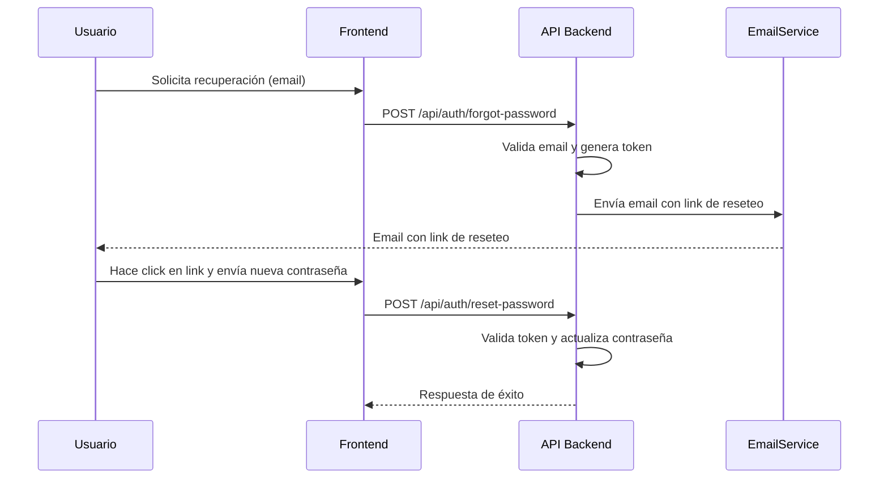

# 📧 Sistema de Notificaciones por Email

## 📋 Índice

- [🔧 Configuración](#-configuración)
- [� Flujo de Notificaciones](#-flujo-de-notificaciones)
- [�📬 Tipos de Emails](#-tipos-de-emails)
- [� Sistema de Logging](#-sistema-de-logging)
- [�🛠️ API Endpoints](#-api-endpoints)
- [📝 Templates Disponibles](#-templates-disponibles)
- [📊 Monitoreo y Logs](#-monitoreo-y-logs)
- [🔧 Troubleshooting](#-troubleshooting)

---

## 🔧 Configuración

### Variables de Entorno Requeridas

```env
# Email Configuration (Gmail)
EMAIL_SERVICE=gmail
EMAIL_USER=laivetta@gmail.com
EMAIL_PASS=your-gmail-app-password
EMAIL_SENDER_NAME=StartUp E-commerce
```

### 🔑 Configuración de Gmail

1. **Habilitar 2FA** en tu cuenta de Gmail
2. **Generar App Password:**
   - Ve a: Configuración de cuenta → Seguridad → Verificación en 2 pasos
   - Generar contraseña de aplicación
   - Usar esta contraseña en `EMAIL_PASS`

---

## 🔄 Flujo de Notificaciones Automáticas

### 💰 Email de Pago Aprobado

El sistema envía automáticamente emails cuando un pago es aprobado, **en paralelo con Telegram**:

#### 🔄 Secuencia del Flujo

1. **Webhook de MercadoPago** → `POST /api/payments/webhook`
2. **Verificación del estado** → `status === 'approved'`
3. **Búsqueda de la orden** → Por `external_reference`
4. **Actualización del estado** → Orden a "PENDIENTE PAGADO"
5. **🚀 ENVÍO PARALELO** → Email + Telegram simultáneamente

#### 📧 Contenido del Email

```html
Asunto: ✅ Pago Confirmado - Pedido #ORD123456789

Estimado/a Juan Pérez,

Su pago ha sido procesado exitosamente.

📋 Detalles del Pedido:
• Número: #ORD123456789
• Total: $25,500.00
• Estado: Pendiente de Preparación

📦 Productos:
• Producto A (x2) - $12,000.00
• Producto B (x1) - $13,500.00

📅 Fecha: 05/07/2025 20:30:15

Pronto nos contactaremos para coordinar la entrega.

Saludos,
StartUp E-commerce
```

#### 🔍 Logging Detallado del Email

```typescript
// Logs específicos del email
logger.info('📧 [EMAIL] Enviando notificación de pago aprobado', {
  to: 'customer@email.com',
  orderId: 'ORD123456789',
  paymentId: '12345678901',
  customerName: 'Juan Pérez',
  totalAmount: 25500
});

logger.info('📧 [EMAIL] Email enviado exitosamente', {
  messageId: '<abc123@gmail.com>',
  to: 'customer@email.com',
  orderId: 'ORD123456789',
  duration: '850ms',
  smtpResponse: '250 2.0.0 OK'
});
```

### 🔑 Configuración de Gmail

1. **Habilitar 2FA** en tu cuenta de Gmail
2. **Generar App Password:**
   - Ve a: Configuración de cuenta → Seguridad → Verificación en 2 pasos
   - Generar contraseña de aplicación
   - Usar esta contraseña en `MAILER_SECRET_KEY`

### 📧 Configuración del Adapter

```typescript
// src/infrastructure/adapters/nodemailer.adapter.ts
const emailService = NodemailerAdapter.getInstance();
```

---

## 📬 Tipos de Emails

### 🔐 Emails de Autenticación

#### 📝 Recuperación de Contraseña
- **Trigger:** Usuario solicita reset de contraseña
- **Contenido:** Link con token temporal (10 min)
- **Template:** Profesional con branding

#### ✅ Confirmación de Registro
- **Trigger:** Nuevo usuario se registra
- **Contenido:** Bienvenida y datos de la cuenta
- **Template:** Amigable y acogedor

### 🛒 Emails de Pedidos

#### 📦 Confirmación de Pedido
- **Trigger:** Pedido creado exitosamente
- **Contenido:** Resumen completo del pedido
- **Incluye:** Items, precios, dirección, tiempo estimado

#### 💳 Confirmación de Pago
- **Trigger:** Pago aprobado en MercadoPago
- **Contenido:** Detalles del pago y próximos pasos
- **Incluye:** Método de pago, monto, referencia

#### 🚚 Actualización de Estado
- **Trigger:** Estado del pedido cambia
- **Contenido:** Nuevo estado y información relevante
- **Estados:** Confirmado, En preparación, En camino, Entregado

### 👤 Emails Administrativos

#### 🆕 Nuevo Pedido (Admin)
- **Trigger:** Se crea un nuevo pedido
- **Destinatario:** Administradores
- **Contenido:** Resumen del pedido para gestión

#### ⚠️ Alertas de Sistema
- **Trigger:** Eventos críticos
- **Contenido:** Errores, stock bajo, pagos fallidos

---

## 🛠️ API Endpoints

### 📧 Envío de Emails

#### 🔄 Recuperación de Contraseña

```http
POST /api/auth/forgot-password
Content-Type: application/json

{
  "email": "usuario@email.com"
}
```

**Respuesta exitosa (200):**
```json
{
  "message": "Se ha enviado un enlace de recuperación a tu email"
}
```

#### � Restablecer Contraseña

```http
POST /api/auth/reset-password
Content-Type: application/json

{
  "token": "reset-token-here",
  "newPassword": "NuevaPassword123"
}
```

**Respuesta exitosa (200):**
```json
{
  "message": "Contraseña restablecida correctamente"
}
```

> **Nota:** Ambos endpoints son públicos y **no requieren autenticación**.

#### � Endpoints de administración de emails (NO IMPLEMENTADOS)

Los siguientes endpoints aparecen en la documentación pero **no están implementados actualmente** en el backend. Si el frontend los requiere, deben ser desarrollados:

- `POST /api/admin/send-test-email`
- `POST /api/admin/send-custom-email`
- `GET /api/admin/emails`
- `GET /api/admin/emails/stats`

> **Importante:** Si necesitas estos endpoints, consulta con backend para su desarrollo o elimina su uso en frontend.

### 📈 Monitoreo de Emails

> **Nota:** Los endpoints `/api/admin/emails` y `/api/admin/emails/stats` **no están implementados** en el backend actual. Si se requieren, deben ser desarrollados.
## 🗺️ Diagramas de Flujo

### 🔄 Flujo de Recuperación de Contraseña



### � Flujo de Notificación de Pago Aprobado

```mermaid
sequenceDiagram
    participant MP as MercadoPago
    participant API as API Backend
    participant Email as EmailService
    participant Telegram as TelegramService
    participant User as Usuario

    MP->>API: POST /api/payments/webhook
    API->>API: Verifica status === "approved"
    API->>API: Busca y actualiza orden
    API->>par Email y Telegram
    API->>Email: Envía email de pago aprobado
    API->>Telegram: Envía mensaje a admin
    Email-->>User: Email de confirmación de pago
    Telegram-->>API: Notificación enviada
```

---

## 📝 Templates Disponibles

### 🎨 Template Base

Todos los emails usan un template base consistente:

- **Header:** Logo y branding de la empresa
- **Body:** Contenido específico del email
- **Footer:** Información de contacto y unsubscribe

### 📧 Templates Específicos

#### 🔐 Reset de Contraseña

```html
<div class="email-container">
  <h1>Recuperación de Contraseña</h1>
  <p>Hola {{userName}},</p>
  <p>Recibimos una solicitud para restablecer tu contraseña.</p>
  
  <div class="cta-button">
    <a href="{{resetLink}}">Restablecer Contraseña</a>
  </div>
  
  <p><small>Este link expira en 10 minutos.</small></p>
</div>
```

#### 📦 Confirmación de Pedido

```html
<div class="email-container">
  <h1>¡Pedido Confirmado!</h1>
  <p>Hola {{customerName}},</p>
  
  <div class="order-summary">
    <h2>Pedido #{{orderNumber}}</h2>
    <ul>
      {{#each items}}
      <li>{{quantity}}x {{name}} - ${{price}}</li>
      {{/each}}
    </ul>
    <p><strong>Total: ${{total}}</strong></p>
  </div>
  
  <div class="delivery-info">
    <h3>Información de Entrega</h3>
    <p>{{address}}</p>
    <p>Tiempo estimado: {{estimatedTime}}</p>
  </div>
</div>
```

#### 💳 Confirmación de Pago

```html
<div class="email-container">
  <h1>¡Pago Recibido!</h1>
  <p>Hola {{customerName}},</p>
  
  <div class="payment-details">
    <h2>Detalles del Pago</h2>
    <p>Monto: ${{amount}}</p>
    <p>Método: {{paymentMethod}}</p>
    <p>Referencia: {{reference}}</p>
    <p>Fecha: {{paymentDate}}</p>
  </div>
  
  <p>Tu pedido está siendo preparado.</p>
</div>
```

---

## 📊 Monitoreo y Logs

### 📝 Sistema de Logging

Todos los emails se registran con:

```typescript
// Log de envío exitoso
logger.info('Email sent successfully', {
  to: email,
  subject: subject,
  type: emailType,
  messageId: result.messageId
});

// Log de error
logger.error('Email sending failed', {
  to: email,
  error: error.message,
  type: emailType
});
```

### 📈 Métricas Importantes

- **Tasa de entrega:** % de emails entregados exitosamente
- **Tiempo de envío:** Latencia promedio de envío
- **Errores comunes:** Bounces, credenciales, límites

### 🔍 Debugging

```bash
# Ver logs de emails
tail -f logs/combined-*.log | grep "email"

# Ver errores de envío
tail -f logs/error-*.log | grep "nodemailer"
```

---

## 🔧 Troubleshooting

### ❌ Problemas Comunes

#### 🔴 "Invalid login" - Gmail

**Solución:**
1. Verificar que 2FA esté habilitado
2. Generar nueva App Password
3. Actualizar `MAILER_SECRET_KEY`

```env
# Formato correcto
MAILER_SECRET_KEY=abcd efgh ijkl mnop  # Con espacios
```

#### 🔴 Emails no llegan

**Verificaciones:**
1. Revisar logs de error
2. Verificar spam/junk del destinatario
3. Comprobar límites de envío de Gmail

#### 🔴 Templates no renderizan

**Solución:**
1. Verificar sintaxis de Handlebars
2. Comprobar variables pasadas
3. Revisar logs de template rendering

### 📊 Límites de Gmail

- **Envíos por día:** 500 emails/día
- **Destinatarios por email:** 500 máximo
- **Rate limiting:** 100 emails/hora (recomendado)

### 🔧 Configuración Alternativa (SMTP)

```env
# Para otros proveedores SMTP
MAILER_SERVICE=smtp
MAILER_HOST=smtp.tu-proveedor.com
MAILER_PORT=587
MAILER_SECURE=false
MAILER_EMAIL=tu-email@dominio.com
MAILER_SECRET_KEY=tu-password
```

### 📞 Testing

#### 🧪 Test de Conectividad

```javascript
// Endpoint para testing
POST /api/admin/test-email-config
```

#### 📧 Email de Prueba

```javascript
// Enviar email de prueba
POST /api/admin/send-test-email
{
  "to": "test@email.com"
}
```

---

## 🚀 Mejores Prácticas

### ✅ Recomendaciones

1. **Usar App Passwords** en lugar de contraseña principal
2. **Monitorear límites** de envío diarios
3. **Implementar retry logic** para fallos temporales
4. **Personalizar templates** según marca
5. **Validar emails** antes de envío

### 🔐 Seguridad

- Credenciales en variables de entorno
- Validación de destinatarios
- Rate limiting implementado
- Logs para auditoría

---

**💡 Tip:** Para alta volumetría, considera migrar a servicios especializados como SendGrid, Mailgun o AWS SES.
