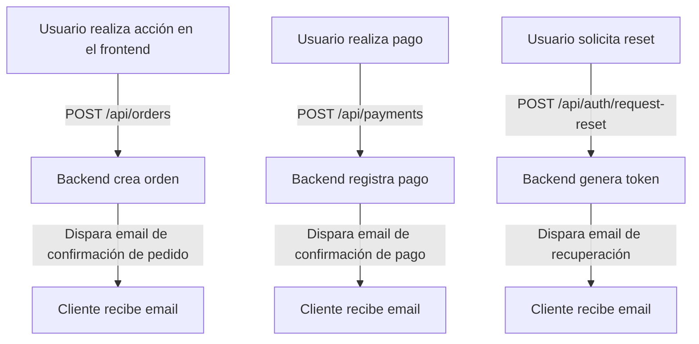

# 📧 Notificaciones por Email (Nodemailer)

Sistema completo de notificaciones por email usando Nodemailer con plantillas HTML profesionales.

## 📑 Índice

- [🔧 Configuración](#-configuración)
- [🚀 Funcionalidades](#-funcionalidades)
- [📋 API Endpoints](#-api-endpoints)
- [📧 Tipos de Emails](#-tipos-de-emails)
- [🎨 Plantillas HTML](#-plantillas-html)
- [💡 Ejemplos de Uso](#-ejemplos-de-uso)
- [⚙️ Configuración Avanzada](#-configuración-avanzada)

## 🔧 Configuración

### Variables de Entorno

```env
# Email Configuration (Nodemailer)
EMAIL_SERVICE=gmail
EMAIL_USER=your-email@gmail.com
EMAIL_PASSWORD=your-app-password
EMAIL_FROM=StartUp E-commerce <noreply@startup.com>

# Para otros proveedores
SMTP_HOST=smtp.gmail.com
SMTP_PORT=587
SMTP_SECURE=false
```

### Configuración de Gmail

1. **Habilitar autenticación de 2 factores** en tu cuenta Gmail
2. **Generar contraseña de aplicación**:
   - Ve a Configuración → Seguridad → Verificación en 2 pasos
   - Generar contraseña de aplicación
   - Usa esta contraseña en `EMAIL_PASSWORD`

### Configuración del Adapter

```typescript
// src/infrastructure/adapters/nodemailer.adapter.ts
const nodemailerAdapter = NodemailerAdapter.getInstance();
```

## 🚀 Funcionalidades

### ✅ Implementadas

- **Confirmación de registro** con bienvenida
- **Recuperación de contraseña** con token seguro
- **Confirmación de pedidos** con detalles completos
- **Notificación de cambio de estado** de pedidos
- **Confirmación de pagos** recibidos
- **Plantillas HTML** responsivas y profesionales
- **Adjuntos** (facturas, comprobantes)
- **Retry automático** en caso de fallo
- **Rate limiting** para evitar spam

### 🚧 En Desarrollo

- Templates con variables dinámicas
- Emails transaccionales avanzados
- Integración con servicios de email marketing
- Analytics de apertura y clicks


## 📋 ¿Cuándo se envía un email?



### 🚫 Endpoints de email directos

> **No existen endpoints públicos para enviar emails personalizados.**  
> Los emails se envían automáticamente como parte de los siguientes flujos:

- **Registro de usuario:** Email de bienvenida tras POST `/api/auth/register`
- **Recuperación de contraseña:** Email tras POST `/api/auth/request-reset`
- **Confirmación de pedido:** Email tras POST `/api/orders`
- **Confirmación de pago:** Email tras POST `/api/payments`

### ✅ Ejemplo de flujo real

1. **Crear orden**
   - **Request:** `POST /api/orders` con datos de la orden.
   - **Respuesta:** Orden creada.
   - **Efecto:** El backend envía automáticamente un email de confirmación al cliente.

2. **Confirmar pago**
   - **Request:** `POST /api/payments` con datos del pago.
   - **Respuesta:** Pago registrado.
   - **Efecto:** El backend envía automáticamente un email de confirmación de pago.

### 📦 Ejemplo de payload relevante

El frontend **no debe enviar HTML ni templates**. Solo los datos de la orden/pago/usuario.

```json
// Crear orden
POST /api/orders
{
  "customerId": "cus_123",
  "items": [ ... ],
  "shippingAddress": "...",
  ...
}
```

---

### 📧 Tipos de emails y triggers

| Tipo de Email                | Trigger (endpoint)           | Destinatario         |
|------------------------------|------------------------------|----------------------|
| Bienvenida                   | POST `/api/auth/register`    | Usuario              |
| Recuperación de contraseña   | POST `/api/auth/request-reset`| Usuario              |
| Confirmación de pedido       | POST `/api/orders`           | Cliente              |
| Confirmación de pago         | POST `/api/payments`         | Cliente              |
| Cambio de estado de pedido   | PATCH `/api/orders/:id/status`| Cliente              |

---

### 🔒 Autorización

- Los endpoints de órdenes y pagos requieren JWT en el header `Authorization: Bearer <token>`.
- No se requiere autorización especial para emails, ya que son automáticos.

---

### � Resumen

- **No existen endpoints directos para emails.**
- **Los emails se envían automáticamente tras las acciones principales.**
- **El frontend solo debe preocuparse por los endpoints de negocio.**

### 🎉 Bienvenida (Registro)

**Trigger:** Cuando un usuario se registra
**Template:** `welcome.html`
**Contenido:**
- Mensaje de bienvenida personalizado
- Información sobre la plataforma
- Enlaces a productos destacados
- Datos de contacto

```html
<h1>¡Bienvenido a StartUp E-commerce, {{customerName}}!</h1>
<p>Gracias por registrarte en nuestra plataforma...</p>
```

### 🔑 Recuperación de Contraseña

**Trigger:** Cuando se solicita reset de contraseña
**Template:** `password-reset.html`
**Contenido:**
- Enlace seguro para resetear contraseña
- Token con expiración (15 minutos)
- Instrucciones claras
- Advertencias de seguridad

```html
<h1>Recuperación de Contraseña</h1>
<p>Haz click en el siguiente enlace para resetear tu contraseña:</p>
<a href="{{resetLink}}">Resetear Contraseña</a>
<p>Este enlace expira en 15 minutos.</p>
```

### 📦 Confirmación de Pedido

**Trigger:** Cuando se crea un nuevo pedido
**Template:** `order-confirmation.html`
**Contenido:**
- Número de pedido y fecha
- Detalles de productos comprados
- Información de envío
- Total con impuestos
- Información de seguimiento

```html
<h1>Pedido Confirmado #{{orderId}}</h1>
<h2>Resumen de tu compra:</h2>
<table>
  {{#each items}}
  <tr>
    <td>{{name}}</td>
    <td>{{quantity}}</td>
    <td>${{price}}</td>
  </tr>
  {{/each}}
</table>
<p><strong>Total: ${{total}}</strong></p>
```

### 💳 Confirmación de Pago

**Trigger:** Cuando se confirma un pago
**Template:** `payment-confirmation.html`
**Contenido:**
- Confirmación de pago recibido
- Método de pago utilizado
- Número de transacción
- Próximos pasos
- Comprobante adjunto (PDF)

```html
<h1>¡Pago Confirmado!</h1>
<p>Hemos recibido tu pago por ${{amount}} para el pedido #{{orderId}}</p>
<p>Método de pago: {{paymentMethod}}</p>
<p>ID de transacción: {{transactionId}}</p>
```

### 📋 Cambio de Estado de Pedido

**Trigger:** Cuando cambia el estado del pedido
**Template:** `order-status-update.html`
**Estados:**
- ⏳ Procesando
- 📦 Preparando envío
- 🚚 En camino
- ✅ Entregado
- ❌ Cancelado

```html
<h1>Tu pedido #{{orderId}} está {{newStatus}}</h1>
{{#if trackingNumber}}
<p>Número de seguimiento: {{trackingNumber}}</p>
{{/if}}
```

## 🎨 Plantillas HTML

### Estructura Base

```html
<!DOCTYPE html>
<html>
<head>
  <meta charset="utf-8">
  <meta name="viewport" content="width=device-width, initial-scale=1.0">
  <title>{{title}}</title>
  <style>
    /* CSS responsivo */
    .container { max-width: 600px; margin: 0 auto; }
    .header { background: #007bff; color: white; padding: 20px; }
    .content { padding: 20px; }
    .footer { background: #f8f9fa; padding: 15px; text-align: center; }
    
    @media only screen and (max-width: 600px) {
      .container { width: 100% !important; }
    }
  </style>
</head>
<body>
  <div class="container">
    <div class="header">
      <h1>StartUp E-commerce</h1>
    </div>
    <div class="content">
      {{> content}}
    </div>
    <div class="footer">
      <p>© 2025 StartUp E-commerce. Todos los derechos reservados.</p>
      <p>📧 soporte@startup.com | 📞 +54 11 1234-5678</p>
    </div>
  </div>
</body>
</html>
```

### Variables Dinámicas

Las plantillas usan Handlebars para variables dinámicas:

```html
<!-- Variables simples -->
<p>Hola {{customerName}}</p>

<!-- Condicionales -->
{{#if hasShipping}}
<p>Tu pedido será enviado a: {{shippingAddress}}</p>
{{/if}}

<!-- Loops -->
{{#each items}}
<tr>
  <td>{{this.name}}</td>
  <td>{{this.quantity}}</td>
  <td>${{this.price}}</td>
</tr>
{{/each}}

<!-- Helpers personalizados -->
<p>Total: {{currency total}}</p>
<p>Fecha: {{formatDate createdAt}}</p>
```

## 💡 Ejemplos de Uso

### Email de Bienvenida

```typescript
// Después del registro de usuario
await emailService.sendWelcomeEmail({
  to: user.email,
  customerName: user.name,
  variables: {
    customerName: user.name,
    loginUrl: `${frontendUrl}/login`,
    featuredProducts: await getsFeaturedProducts()
  }
});
```

### Confirmación de Pedido

```typescript
// Después de crear el pedido
await emailService.sendOrderConfirmation({
  to: customer.email,
  orderId: order.id,
  customerName: customer.name,
  orderDetails: {
    items: order.items,
    total: order.totalWithTax,
    shippingAddress: order.shippingDetails.address,
    estimatedDelivery: order.estimatedDelivery
  }
});
```

### Recuperación de Contraseña

```typescript
// Cuando se solicita reset
const resetToken = generateSecureToken();
const resetUrl = `${frontendUrl}/reset-password?token=${resetToken}`;

await emailService.sendPasswordReset({
  to: user.email,
  resetUrl,
  expirationTime: '15 minutos',
  variables: {
    customerName: user.name,
    resetLink: resetUrl,
    expirationTime: new Date(Date.now() + 15 * 60 * 1000)
  }
});
```

### Confirmación de Pago con Adjunto

```typescript
// Después de confirmar pago
const invoice = await generateInvoicePDF(order);

await emailService.sendPaymentConfirmation({
  to: customer.email,
  paymentId: payment.id,
  orderId: order.id,
  amount: payment.amount,
  method: payment.method,
  attachments: [
    {
      filename: `factura-${order.id}.pdf`,
      content: invoice,
      contentType: 'application/pdf'
    }
  ]
});
```

## ⚙️ Configuración Avanzada

### Rate Limiting

```typescript
// Configuración para evitar spam
const emailRateLimit = {
  maxEmailsPerHour: 100,
  maxEmailsPerUser: 10,
  cooldownPeriod: 3600000 // 1 hora
};
```

### Retry Logic

```typescript
// Configuración de reintentos
const retryConfig = {
  maxRetries: 3,
  retryDelay: 5000, // 5 segundos
  backoffMultiplier: 2,
  retryableErrors: [
    'ETIMEDOUT',
    'ECONNRESET',
    'ENOTFOUND'
  ]
};
```

### Múltiples Proveedores (Failover)

```typescript
// Configuración de respaldo
const emailProviders = [
  {
    name: 'primary',
    service: 'gmail',
    auth: { user: process.env.EMAIL_USER, pass: process.env.EMAIL_PASSWORD }
  },
  {
    name: 'backup',
    service: 'sendgrid',
    auth: { api_key: process.env.SENDGRID_API_KEY }
  }
];
```

### Tracking y Analytics

```typescript
// Agregar tracking pixels
const trackingPixel = ``;

// Logging detallado
logger.info('Email sent successfully', {
  to: email.to,
  subject: email.subject,
  template: template.name,
  messageId: result.messageId,
  timestamp: new Date().toISOString()
});
```

### Templates Avanzados

```typescript
// Registrar helpers personalizados
Handlebars.registerHelper('currency', (amount) => {
  return new Intl.NumberFormat('es-AR', {
    style: 'currency',
    currency: 'ARS'
  }).format(amount);
});

Handlebars.registerHelper('formatDate', (date) => {
  return new Date(date).toLocaleDateString('es-AR');
});

// Usar partials para componentes reutilizables
Handlebars.registerPartial('productItem', `
  <tr>
    <td>{{name}}</td>
    <td>{{quantity}}</td>
    <td>{{currency price}}</td>
  </tr>
`);
```

## 🔧 Troubleshooting

### Problemas Comunes

**Emails no se envían:**
- Verificar credenciales de email
- Confirmar configuración SMTP
- Revisar logs de errores
- Verificar firewall/puertos

**Emails van a spam:**
- Configurar SPF, DKIM, DMARC
- Usar dominio verificado
- Evitar palabras spam en subject
- Mantener buena reputación

**Templates no se renderizan:**
- Verificar sintaxis Handlebars
- Confirmar que las variables existen
- Revisar helpers personalizados
- Debuggear datos pasados al template

### Testing

```typescript
// Test de conectividad SMTP
await emailService.testConnection();

// Test de envío
await emailService.sendTestEmail({
  to: 'test@email.com',
  subject: '🧪 Test Email',
  html: '<h1>Test successful!</h1>'
});

// Validar templates
const rendered = await emailService.renderTemplate('order-confirmation', {
  orderId: 'TEST_123',
  customerName: 'Test User',
  items: [{ name: 'Test Product', quantity: 1, price: 100 }]
});
```

---

Para más información sobre otros sistemas de notificación:
- [📱 Notificaciones de Telegram](./telegram.md)
- [💳 Integración MercadoPago](./mercadopago.md)
- [📊 Sistema de Monitoreo](./monitoring.md)
