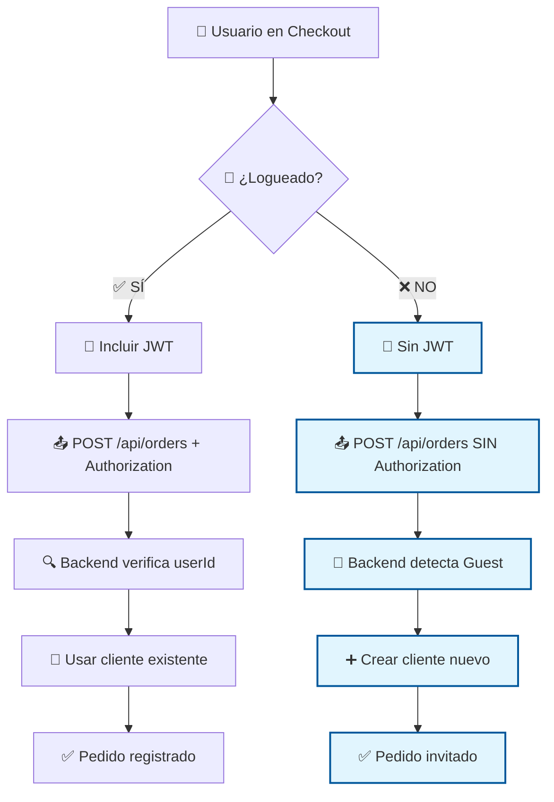
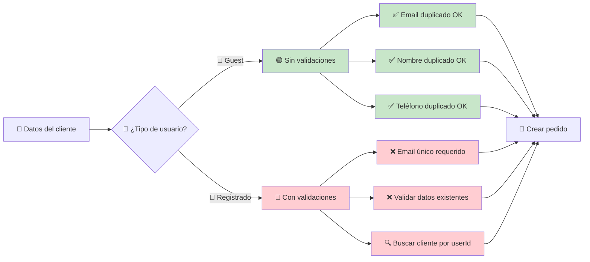
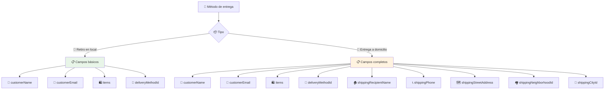
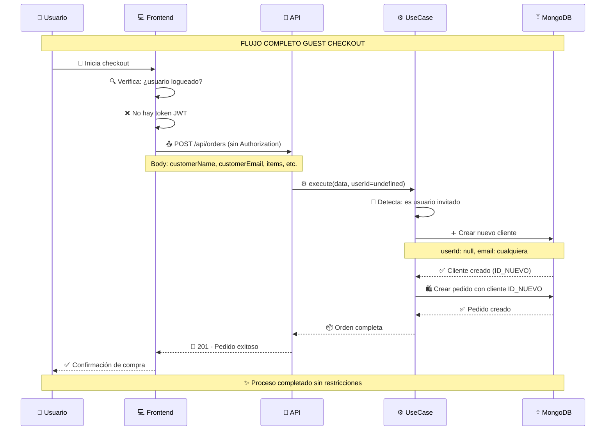
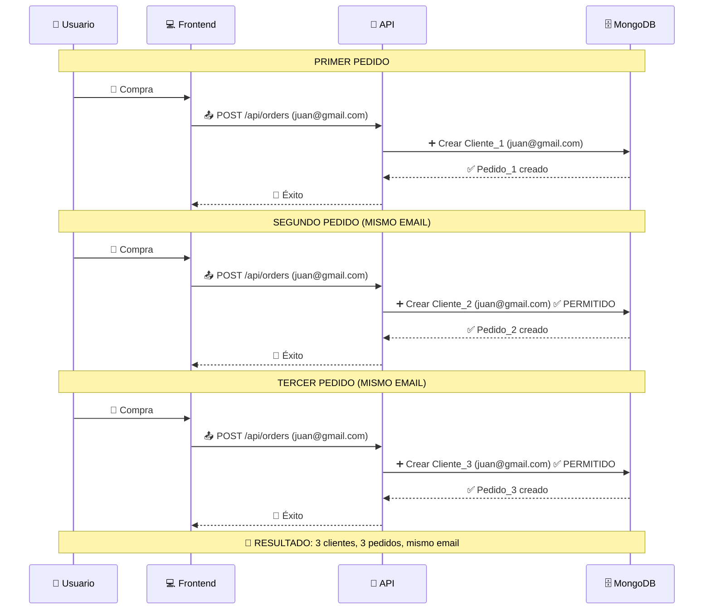
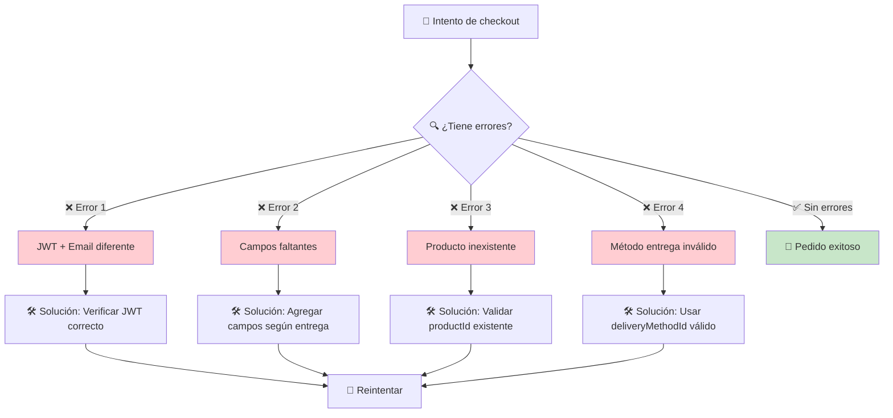
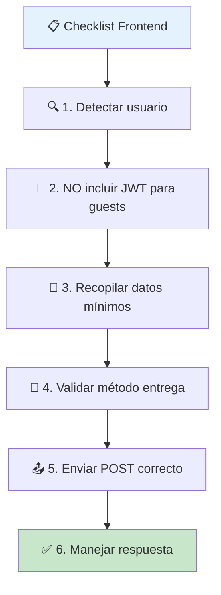
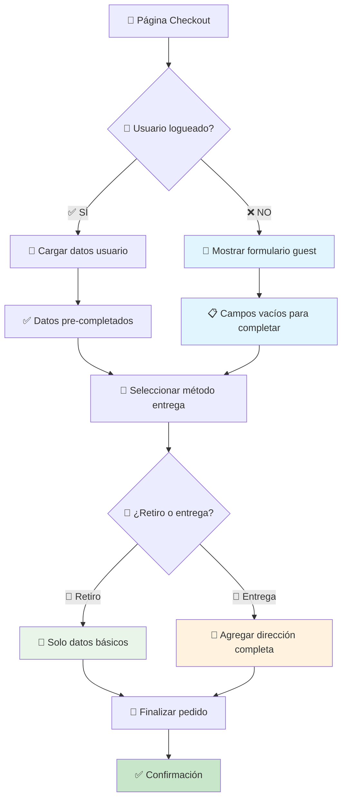

# 🔄 Diagramas de Flujo - Guest Checkout

Esta documentación proporciona diagramas visuales del flujo de checkout para usuarios invitados y registrados, diseñada específicamente para el equipo de frontend.

---

## 🎯 Flujo Principal: Guest vs Registrado



---

## 🛡️ Validaciones por Tipo de Usuario



---

## 📊 Campos Requeridos por Método de Entrega



---

## 🔄 Secuencia Detallada - Guest Checkout



---

## 🚀 Secuencia Comparativa - Múltiples Pedidos Guest



---

## ⚠️ Flujo de Errores Comunes



---

## 🛠️ Guía de Implementación Frontend

### ✅ Checklist para Implementar Guest Checkout



### 🎯 Validaciones Recomendadas Frontend

```javascript
// ✅ Función de validación recomendada
function validarFormularioGuest(datos, metodoEntrega) {
  const errores = [];
  
  // Campos siempre requeridos
  if (!datos.customerName) errores.push('Nombre requerido');
  if (!datos.customerEmail) errores.push('Email requerido');
  if (!datos.items?.length) errores.push('Productos requeridos');
  if (!datos.deliveryMethodId) errores.push('Método entrega requerido');
  
  // Solo para entrega a domicilio
  if (metodoEntrega.requiresAddress) {
    if (!datos.shippingRecipientName) errores.push('Nombre destinatario requerido');
    if (!datos.shippingPhone) errores.push('Teléfono requerido');
    if (!datos.shippingStreetAddress) errores.push('Dirección requerida');
    if (!datos.shippingNeighborhoodId) errores.push('Barrio requerido');
    if (!datos.shippingCityId) errores.push('Ciudad requerida');
  }
  
  return errores;
}
```

---

## 📱 Ejemplos de UI/UX

### Flujo Recomendado en Frontend



---

## 🎨 Diseño de Mensajes Usuario

### Mensajes Recomendados

**Para invitados (checkout rápido):**
```
🛒 Checkout Rápido
✅ Sin registro necesario
✅ Mismos datos reutilizables
🚀 Compra en segundos
```

**Diferenciar flujos:**
```
👤 ¿Ya tienes cuenta?
   [🔑 Iniciar Sesión] [👻 Continuar como invitado]

👻 Checkout como invitado:
   • No necesitas crear cuenta
   • Puedes usar el mismo email varias veces
   • Proceso más rápido
```

**Confirmación exitosa:**
```
🎉 ¡Pedido creado exitosamente!
📧 Recibirás confirmación en: juan@gmail.com
📦 Número de pedido: #12345
🕐 Estado: Pendiente
```

---

> **💡 Tip:** Este documento debe usarse como referencia rápida durante el desarrollo. Para detalles técnicos específicos, consultar `guest-checkout.md` y `api-orders.md`.

> **🔄 Actualización:** Última versión: Enero 2025 - Flujo simplificado sin validaciones de duplicidad para guests.
