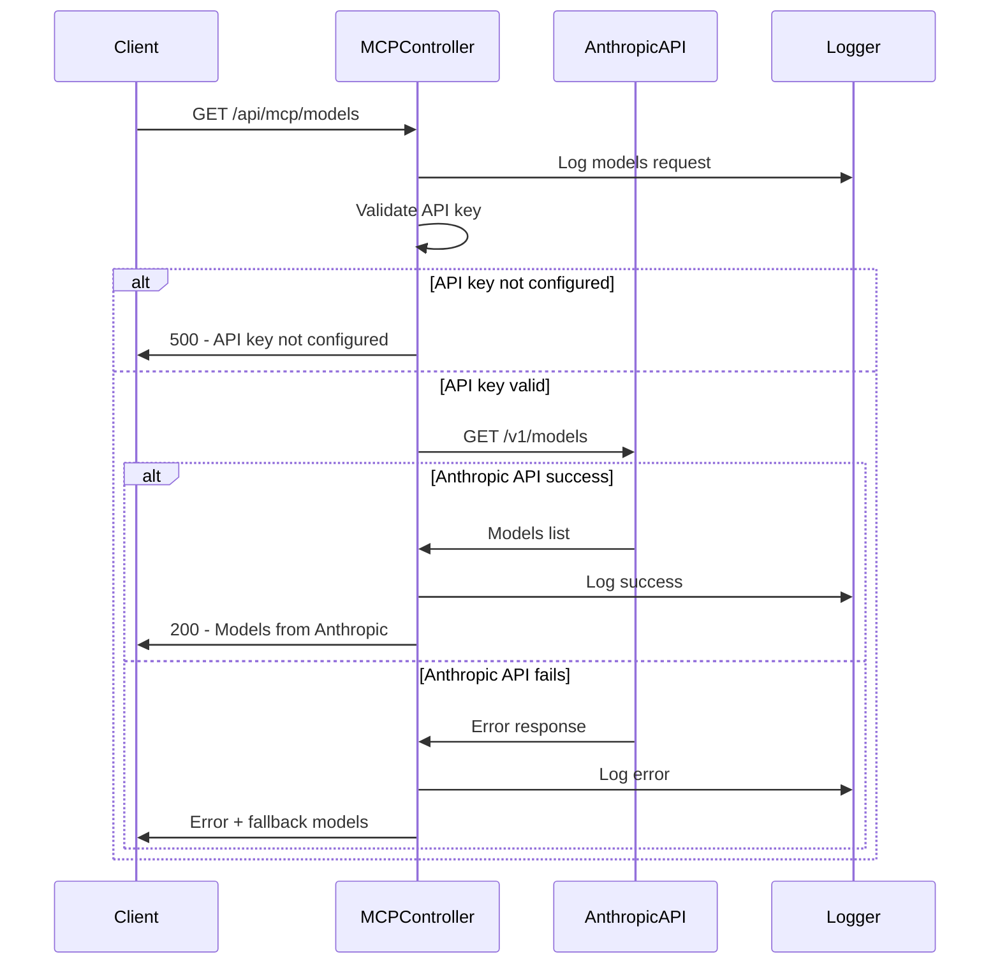
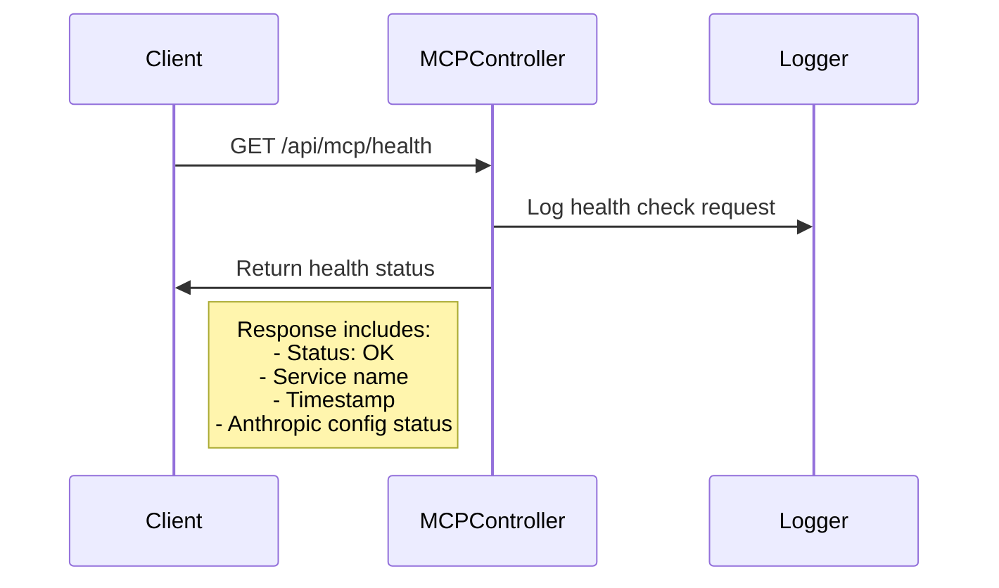
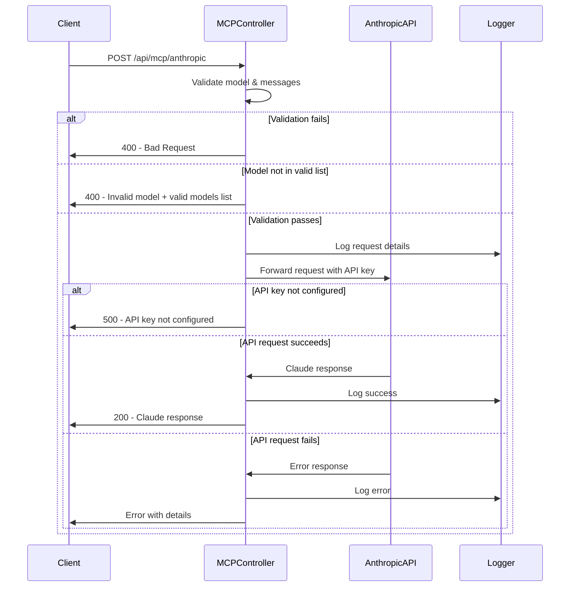
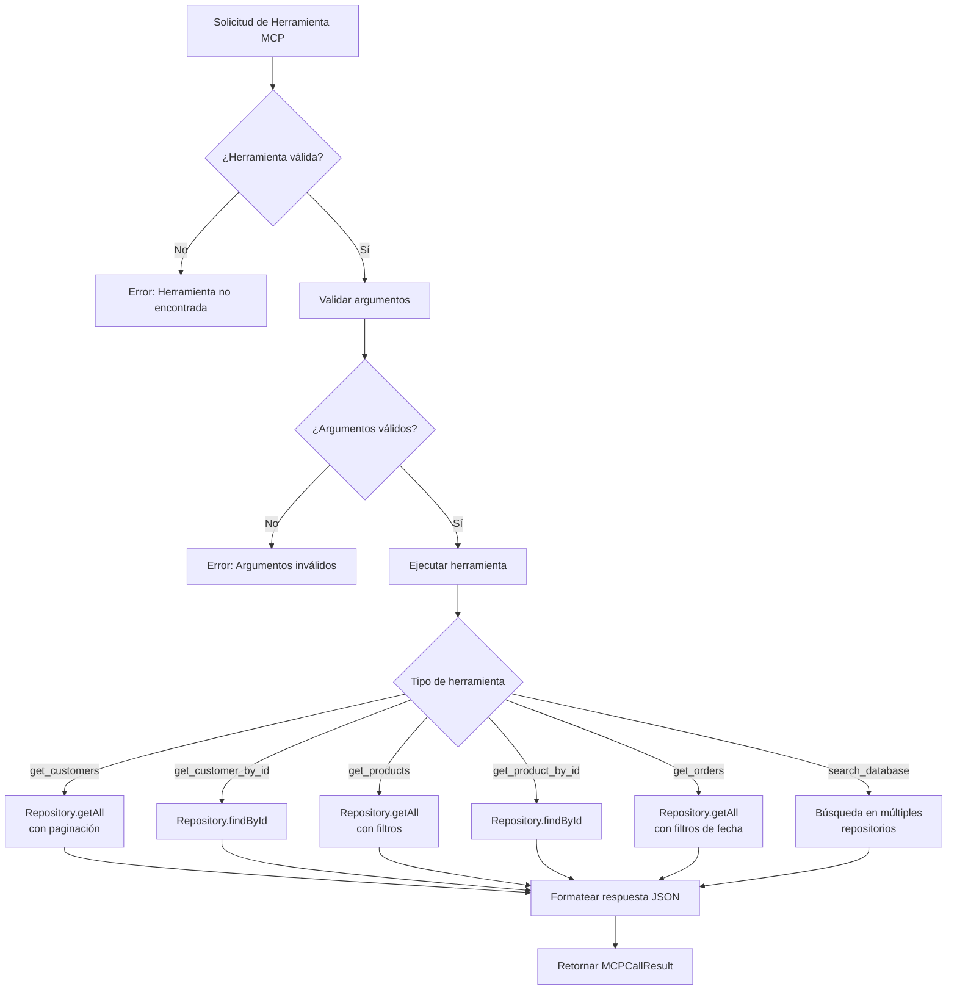
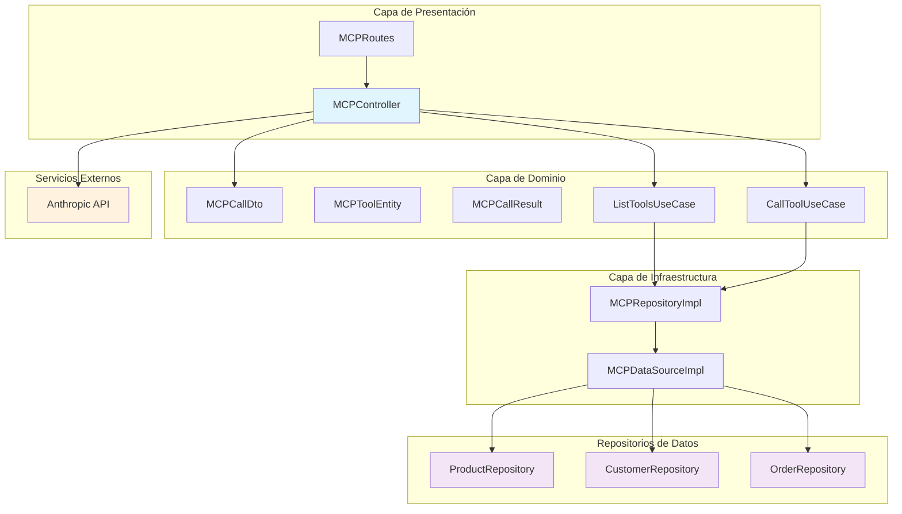

# 🔗 API MCP (Model Context Protocol)

## 📋 Resumen

El **Model Context Protocol (MCP)** es una implementación que permite la comunicación entre aplicaciones de IA y herramientas del e-commerce. Este sistema proporciona un proxy para servicios de IA como Anthropic Claude y herramientas internas para consultar datos del negocio.

### 🎯 Funcionalidades Principales

- **🛠️ Proxy Anthropic:** Comunicación directa con la API de Claude
- **📊 Herramientas de Datos:** Consulta de productos, clientes y pedidos
- **🔍 Búsqueda Inteligente:** Sistema de búsqueda avanzada en productos y clientes
- **🔗 Endpoints Públicos:** Descubrimiento y ejecución de herramientas MCP
- **💡 Integración IA:** Base para chatbots y asistentes virtuales
- **🎯 Búsquedas Especializadas:** Búsqueda por nombre, email, teléfono en clientes y productos

---

## 🔌 Endpoints de la API

### 1. **Health Check**
```http
GET /api/mcp/health
```

**Descripción:** Verifica el estado del servicio MCP y la configuración de Anthropic.

**Headers:** Ninguno requerido

**Respuesta:**
```json
{
  "status": "OK",
  "service": "MCP Service",
  "timestamp": "2024-01-15T10:30:00.000Z",
  "anthropic_configured": true
}
```

### 2. **Obtener Modelos Disponibles**
```http
GET /api/mcp/models
```

**Descripción:** Consulta directamente a la API de Anthropic para obtener la lista de modelos disponibles en tiempo real.

**Headers:** Ninguno requerido

**Respuesta exitosa (200):**
```json
{
  "status": "OK",
  "service": "MCP Service - Anthropic Models",
  "timestamp": "2024-01-15T10:30:00.000Z",
  "source": "Anthropic API",
  "data": [
    {
      "id": "claude-3-5-sonnet-20241022",
      "type": "model",
      "display_name": "Claude 3.5 Sonnet"
    },
    {
      "id": "claude-3-5-haiku-20241022",
      "type": "model", 
      "display_name": "Claude 3.5 Haiku"
    }
  ]
}
```

**Respuesta de error con fallback:**
```json
{
  "error": "Error communicating with Anthropic API",
  "details": {
    "type": "error",
    "error": {
      "type": "authentication_error",
      "message": "invalid x-api-key"
    }
  },
  "fallback_models": [
    "claude-3-5-sonnet-20241022",
    "claude-3-5-sonnet-20240620",
    "claude-3-5-haiku-20241022",
    "claude-3-opus-20240229",
    "claude-3-sonnet-20240229",
    "claude-3-haiku-20240307"
  ]
}
```

### 3. **Proxy a Anthropic Claude**
```http
POST /api/mcp/anthropic
```

**Descripción:** Proxy directo a la API de Anthropic Claude para generar respuestas de IA.

**Headers:**
```
Content-Type: application/json
```

**Body:**
```json
{
  "model": "claude-3-5-sonnet-20241022",
  "max_tokens": 1024,
  "messages": [
    {
      "role": "user", 
      "content": "¿Puedes ayudarme con información sobre productos?"
    }
  ],
  "temperature": 0.7,
  "top_p": 0.9
}
```

> **⚠️ Modelos Válidos:**  
> El endpoint valida que el modelo solicitado esté en la lista de modelos soportados:
> - `claude-3-5-sonnet-20241022` (recomendado)
> - `claude-3-5-sonnet-20240620`
> - `claude-3-5-haiku-20241022`
> - `claude-3-opus-20240229`
> - `claude-3-sonnet-20240229`
> - `claude-3-haiku-20240307`

**Respuesta exitosa (200):**
```json
{
  "id": "msg_01ABC123",
  "type": "message",
  "role": "assistant",
  "content": [
    {
      "type": "text",
      "text": "¡Por supuesto! Puedo ayudarte con información sobre productos. ¿Qué específicamente necesitas saber?"
    }
  ],
  "model": "claude-3-5-sonnet-20241022",
  "stop_reason": "end_turn",
  "usage": {
    "input_tokens": 25,
    "output_tokens": 50
  }
}
```

**Respuesta de error (400) - Modelo inválido:**
```json
{
  "error": "Invalid model: claude-3-sonnet-20240229. Valid models are: claude-3-5-sonnet-20241022, claude-3-5-sonnet-20240620, claude-3-5-haiku-20241022, claude-3-opus-20240229, claude-3-sonnet-20240229, claude-3-haiku-20240307"
}
```

**Respuesta de error (400) - Parámetros faltantes:**
```json
{
  "error": "Model and messages are required"
}
```

**Respuesta de error (500):**
```json
{
  "error": "Anthropic API key not configured"
}
```

---

## 🛠️ Endpoints de Herramientas MCP

### 4. **Información de Herramientas Disponibles**
```http
GET /api/mcp/tools/info
```

**Descripción:** Obtiene información completa sobre todas las herramientas MCP disponibles, incluyendo endpoints directos y ejemplos de uso.

**Headers:** Ninguno requerido

**Respuesta exitosa (200):**
```json
{
  "status": "OK",
  "service": "MCP Tools Info",
  "timestamp": "2025-07-23T16:16:40.355Z",
  "availableTools": [
    {
      "name": "get_products",
      "description": "Obtiene lista de productos con filtros opcionales",
      "directEndpoint": "GET /api/products",
      "mcpEndpoint": "POST /api/mcp/tools/call",
      "parameters": {
        "page": "número de página (default: 1)",
        "limit": "productos por página (default: 10)",
        "search": "término de búsqueda",
        "categoryId": "ID de categoría",
        "minPrice": "precio mínimo",
        "maxPrice": "precio máximo"
      },
      "examples": {
        "directCall": "GET /api/products?page=1&limit=10",
        "mcpCall": {
          "method": "POST",
          "url": "/api/mcp/tools/call",
          "body": {
            "toolName": "get_products",
            "args": { "page": 1, "limit": 10, "search": "laptop" }
          }
        }
      }
    },
    {
      "name": "search_products",
      "description": "Busca productos por nombre, descripción o categoría",
      "directEndpoint": "GET /api/products/search",
      "mcpEndpoint": "POST /api/mcp/tools/call",
      "parameters": {
        "q": "término de búsqueda (requerido)",
        "page": "número de página (default: 1)",
        "limit": "productos por página (default: 10)",
        "categories": "categorías separadas por coma",
        "minPrice": "precio mínimo",
        "maxPrice": "precio máximo",
        "sortBy": "campo de ordenamiento",
        "sortOrder": "asc o desc"
      },
      "examples": {
        "directCall": "GET /api/products/search?q=lomito&page=1&limit=5",
        "mcpCall": {
          "method": "POST",
          "url": "/api/mcp/tools/call",
          "body": {
            "toolName": "search_products",
            "args": { "q": "lomito", "page": 1, "limit": 5 }
          }
        }
      }
    },
    {
      "name": "search_customers",
      "description": "Busca clientes por nombre, email o teléfono",
      "directEndpoint": "GET /api/customers/search",
      "mcpEndpoint": "POST /api/mcp/tools/call",
      "parameters": {
        "q": "término de búsqueda (nombre, email, teléfono)",
        "neighborhoodId": "ID del barrio para filtrar",
        "page": "número de página (default: 1)",
        "limit": "clientes por página (default: 10)",
        "sortBy": "campo de ordenamiento",
        "sortOrder": "asc o desc"
      },
      "examples": {
        "directCall": "GET /api/customers/search?q=juan&page=1&limit=5",
        "mcpCall": {
          "method": "POST",
          "url": "/api/mcp/tools/call",
          "body": {
            "toolName": "search_customers",
            "args": { "q": "juan", "page": 1, "limit": 5 }
          }
        }
      }
    }
  ],
  "usage": {
    "note": "Puedes usar los endpoints REST directamente o a través del sistema MCP",
    "authentication": "Los endpoints de admin requieren autenticación JWT",
    "baseUrl": "http://localhost:3000"
  }
}
```

### 5. **Ejecutar Herramienta MCP**
```http
POST /api/mcp/tools/call
```

**Descripción:** Ejecuta una herramienta MCP específica con los argumentos proporcionados.

**Headers:**
```
Content-Type: application/json
```

**Body:**
```json
{
  "toolName": "search_products",
  "args": {
    "q": "lomito",
    "page": 1,
    "limit": 3
  }
}
```

**Respuesta exitosa (200):**
```json
{
  "status": "OK",
  "service": "MCP Tool Call",
  "timestamp": "2025-07-23T16:17:05.997Z",
  "toolName": "search_products",
  "result": {
    "content": [
      {
        "type": "text",
        "text": "{\n  \"total\": 3,\n  \"page\": 1,\n  \"limit\": 3,\n  \"products\": [\n    {\n      \"id\": \"6807f8ab022d7fe5f9d96200\",\n      \"name\": \"doble lomito y mas\",\n      \"description\": \"descripcion picada casera\",\n      \"price\": 5.99,\n      \"priceWithTax\": 7.25,\n      \"stock\": 12,\n      \"category\": \"Empanadas\",\n      \"unit\": \"unidad\",\n      \"tags\": [\"popular\"],\n      \"imgUrl\": \"https://res.cloudinary.com/diwctpwax/image/upload/v1749138722/products/slawgqzz3mshuqsle2xg.jpg\",\n      \"isActive\": true\n    }\n  ]\n}"
      }
    ]
  }
}
```

**Respuesta de error (400) - Herramienta no válida:**
```json
{
  "error": "Herramienta desconocida: invalid_tool_name"
}
```

**Respuesta de error (400) - Argumentos inválidos:**
```json
{
  "error": "El término de búsqueda debe tener al menos 2 caracteres"
}
```

---

## 🛠️ Herramientas MCP (Internas)

> **Nota:** Las herramientas MCP no están disponibles como endpoints HTTP públicos. Son utilizadas internamente por el sistema para consultas de datos y pueden ser accedidas a través de la integración con sistemas de chat/IA.

### Herramientas Disponibles:

### 1. `get_customers`
- **Descripción:** Obtiene lista de clientes con filtros opcionales
- **Parámetros:**
  - `page` (number, opcional, default: 1): Número de página
  - `limit` (number, opcional, default: 10): Clientes por página
  - `search` (string, opcional): Buscar por nombre o email

### 2. `get_customer_by_id`
- **Descripción:** Obtiene un cliente específico por ID
- **Parámetros:**
  - `id` (string, requerido): ID del cliente

### 3. `get_products`
- **Descripción:** Obtiene lista de productos con filtros opcionales
- **Parámetros:**
  - `page` (number, opcional, default: 1): Número de página
  - `limit` (number, opcional, default: 10): Productos por página
  - `search` (string, opcional): Término de búsqueda en nombre/descripción
  - `categoryId` (string, opcional): ID de categoría para filtrar
  - `minPrice` (number, opcional): Precio mínimo
  - `maxPrice` (number, opcional): Precio máximo

### 4. `search_products`
- **Descripción:** Busca productos por nombre, descripción o categoría con filtros avanzados
- **Parámetros:**
  - `q` (string, requerido): Término de búsqueda
  - `page` (number, opcional, default: 1): Número de página
  - `limit` (number, opcional, default: 10): Productos por página
  - `categories` (string, opcional): Categorías separadas por coma
  - `minPrice` (number, opcional): Precio mínimo
  - `maxPrice` (number, opcional): Precio máximo
  - `sortBy` (string, opcional, default: 'createdAt'): Campo de ordenamiento
  - `sortOrder` (string, opcional, default: 'desc'): Orden ascendente ('asc') o descendente ('desc')

### 5. `get_product_by_id`
- **Descripción:** Obtiene un producto específico por ID
- **Parámetros:**
  - `id` (string, requerido): ID del producto

### 6. `search_customers`
- **Descripción:** Busca clientes por nombre, email o teléfono con filtros avanzados
- **Parámetros:**
  - `q` (string, opcional): Término de búsqueda (nombre, email, teléfono)
  - `neighborhoodId` (string, opcional): ID del barrio para filtrar
  - `page` (number, opcional, default: 1): Número de página
  - `limit` (number, opcional, default: 10): Clientes por página
  - `sortBy` (string, opcional, default: 'createdAt'): Campo de ordenamiento
  - `sortOrder` (string, opcional, default: 'desc'): Orden ascendente ('asc') o descendente ('desc')

### 7. `get_orders`
- **Descripción:** Obtiene lista de pedidos con filtros opcionales
- **Parámetros:**
  - `page` (number, opcional, default: 1): Número de página
  - `limit` (number, opcional, default: 10): Pedidos por página
  - `customerId` (string, opcional): ID del cliente para filtrar
  - `status` (string, opcional): Estado del pedido
  - `dateFrom` (string, opcional): Fecha desde (YYYY-MM-DD)
  - `dateTo` (string, opcional): Fecha hasta (YYYY-MM-DD)

### 8. `search_database`
- **Descripción:** Búsqueda general en productos y clientes
- **Parámetros:**
  - `query` (string, requerido): Término de búsqueda
  - `entities` (array de string, opcional): Entidades donde buscar
    - Valores permitidos: `["products", "customers"]`
    - Default: `["products", "customers"]`

---

## 📊 Flujos de Uso (Mermaid)

### Flujo de Consulta de Modelos



### Flujo de Health Check



### Flujo de Proxy a Anthropic



### Flujo de Herramientas MCP (Interno)



### Arquitectura del Sistema MCP



---

## 💡 Ejemplos de Uso

### Ejemplo 1: Verificar salud del servicio

```bash
curl -X GET http://localhost:3000/api/mcp/health
```

**Respuesta:**
```json
{
  "status": "OK",
  "service": "MCP Service",
  "timestamp": "2024-01-15T10:30:00.000Z",
  "anthropic_configured": true
}
```

### Ejemplo 2: Obtener modelos disponibles

```bash
curl -X GET http://localhost:3000/api/mcp/models
```

**Respuesta exitosa:**
```json
{
  "status": "OK",
  "service": "MCP Service - Anthropic Models",
  "timestamp": "2024-01-15T10:30:00.000Z",
  "source": "Anthropic API",
  "data": [
    {
      "id": "claude-3-5-sonnet-20241022",
      "type": "model",
      "display_name": "Claude 3.5 Sonnet"
    }
  ]
}
```

### Ejemplo 3: Consulta a Claude con modelo actualizado

```bash
curl -X POST http://localhost:3000/api/mcp/anthropic \
  -H "Content-Type: application/json" \
  -d '{
    "model": "claude-3-5-sonnet-20241022",
    "max_tokens": 500,
    "messages": [
      {
        "role": "user",
        "content": "¿Cuáles son las mejores prácticas para un e-commerce?"
      }
    ]
  }'
```

### Ejemplo 4: Error de modelo inválido

```bash
curl -X POST http://localhost:3000/api/mcp/anthropic \
  -H "Content-Type: application/json" \
  -d '{
    "model": "modelo-inexistente",
    "max_tokens": 500,
    "messages": [
      {
        "role": "user",
        "content": "Hola"
      }
    ]
  }'
```

**Respuesta de error:**
```json
{
  "error": "Invalid model: modelo-inexistente. Valid models are: claude-3-5-sonnet-20241022, claude-3-5-sonnet-20240620, claude-3-5-haiku-20241022, claude-3-opus-20240229, claude-3-sonnet-20240229, claude-3-haiku-20240307"
}
```

### Ejemplo 5: Uso interno de herramientas (desde código)

```typescript
// Ejemplo de uso interno de herramientas MCP
import { MCPDataSourceImpl } from './infrastructure/datasources/mcp/mcp.datasource.impl';

const mcpDataSource = new MCPDataSourceImpl(
  productRepository,
  customerRepository,
  orderRepository
);

// Obtener productos
const productsResult = await mcpDataSource.callTool('get_products', {
  page: 1,
  limit: 5,
  search: 'laptop'
});

console.log(productsResult.content[0].text);

// Buscar en base de datos
const searchResult = await mcpDataSource.callTool('search_database', {
  query: 'Juan',
  entities: ['customers']
});

console.log(searchResult.content[0].text);
```

### Ejemplo 6: Respuesta de herramienta MCP

```json
{
  "content": [
    {
      "type": "text",
      "text": "{\n  \"total\": 15,\n  \"page\": 1,\n  \"limit\": 10,\n  \"products\": [\n    {\n      \"id\": \"prod_123\",\n      \"name\": \"Laptop Gaming ASUS\",\n      \"description\": \"Laptop para gaming de alta gama\",\n      \"price\": 1200,\n      \"priceWithTax\": 1320,\n      \"stock\": 5,\n      \"category\": \"Electrónicos\",\n      \"unit\": \"Unidad\",\n      \"tags\": [\"gaming\", \"laptop\", \"asus\"],\n      \"isActive\": true\n    }\n  ]\n}"
    }
  ]
}
```

---

## ⚙️ Configuración

### Variables de Entorno

```env
# Configuración de Anthropic
ANTHROPIC_API_KEY=tu-anthropic-api-key-aqui

# Configuración de MongoDB (para herramientas)
MONGO_URL=mongodb://localhost:27017/ecommerce

# Configuración del servidor
PORT=3000
NODE_ENV=production
```

### Configuración en código

```typescript
// src/configs/envs.ts
export const envs = {
  ANTHROPIC_API_KEY: process.env.ANTHROPIC_API_KEY || '',
  MONGO_URL: process.env.MONGO_URL || 'mongodb://localhost:27017/ecommerce',
  PORT: process.env.PORT || 3000,
  NODE_ENV: process.env.NODE_ENV || 'development'
};
```

---

## 🔍 Detalles Técnicos

### Estructura de Respuesta MCP

Todas las herramientas MCP retornan el siguiente formato:

```typescript
interface MCPCallResult {
  content: Array<{
    type: 'text' | 'image' | 'resource';
    text?: string;
    data?: any;
  }>;
}
```

### Manejo de Errores

```typescript
// Errores comunes en herramientas MCP
try {
  const result = await mcpDataSource.callTool(toolName, args);
  return result;
} catch (error) {
  if (error instanceof CustomError) {
    // Error de negocio conocido
    throw error;
  }
  // Error interno del sistema
  throw CustomError.internalServerError('Error ejecutando herramienta MCP');
}
```

### Validación de Parámetros

```typescript
// Ejemplo de validación en MCPCallDto
export class MCPCallDto {
  static create(object: { [key: string]: any }): [string?, MCPCallDto?] {
    const { toolName, arguments: args } = object;
    
    if (!toolName || typeof toolName !== 'string') {
      return ['Tool name is required and must be a string'];
    }
    
    if (!args || typeof args !== 'object') {
      return ['Arguments must be an object'];
    }
    
    return [undefined, new MCPCallDto(toolName.trim(), args)];
  }
}
```

---

## 🔧 Troubleshooting

### Problemas Comunes

#### 1. Error "invalid x-api-key"
```json
{
  "error": "invalid x-api-key",
  "details": {
    "type": "error",
    "error": {
      "type": "authentication_error",
      "message": "invalid x-api-key"
    }
  }
}
```

**Soluciones:**
- Verificar que `ANTHROPIC_API_KEY` esté configurada en las variables de entorno
- Asegurarse de que la API key comience con `sk-ant-api03-`
- Verificar que la API key no haya expirado
- Consultar `/api/mcp/health` para verificar la configuración

#### 2. Error "model: [modelo-nombre]"
```json
{
  "error": "model: claude-3-sonnet-20240229",
  "details": {
    "type": "error",
    "error": {
      "type": "not_found_error",
      "message": "model: claude-3-sonnet-20240229"
    }
  }
}
```

**Soluciones:**
- Usar `/api/mcp/models` para obtener la lista actualizada de modelos
- Verificar que el modelo esté en la lista de modelos válidos
- Usar `claude-3-5-sonnet-20241022` como modelo recomendado

#### 3. Error "Model and messages are required"
**Solución:** Asegúrate de incluir tanto `model` como `messages` en el body de la petición.

### Mejores Prácticas

#### Selección de Modelos
- **Desarrollo/Testing**: `claude-3-haiku-20240307` (más rápido y económico)
- **Producción General**: `claude-3-5-sonnet-20241022` (equilibrio perfecto)
- **Tareas Complejas**: `claude-3-opus-20240229` (más potente pero costoso)

#### Configuración de Parámetros
```json
{
  "model": "claude-3-5-sonnet-20241022",
  "max_tokens": 1024,
  "temperature": 0.7,
  "top_p": 0.9,
  "messages": [
    {
      "role": "system",
      "content": "Eres un asistente especializado en e-commerce."
    },
    {
      "role": "user",
      "content": "Tu pregunta aquí"
    }
  ]
}
```

#### Monitoreo
- Usar `/api/mcp/health` para verificar el estado del servicio
- Consultar `/api/mcp/models` periódicamente para modelos actualizados
- Implementar logging para troubleshooting

---

## 🧪 Testing

### Tests de Endpoints

```typescript
describe('MCP Endpoints', () => {
  test('GET /api/mcp/health should return service status', async () => {
    const response = await request(app)
      .get('/api/mcp/health')
      .expect(200);

    expect(response.body.status).toBe('OK');
    expect(response.body.service).toBe('MCP Service');
  });

  test('POST /api/mcp/anthropic should validate required fields', async () => {
    const response = await request(app)
      .post('/api/mcp/anthropic')
      .send({})
      .expect(400);

    expect(response.body.error).toBe('Model and messages are required');
  });
});
```

### Tests de Herramientas

```typescript
describe('MCP Tools', () => {
  test('get_products should return formatted product list', async () => {
    const result = await mcpDataSource.callTool('get_products', {
      page: 1,
      limit: 5
    });

    expect(result.content).toHaveLength(1);
    expect(result.content[0].type).toBe('text');
    
    const data = JSON.parse(result.content[0].text);
    expect(data).toHaveProperty('products');
    expect(data).toHaveProperty('total');
  });
});
```

---

## 🔗 Enlaces Relacionados

- [🤖 API Chatbot](./api-chatbot.md) - Integración con sistemas de chat
- [📦 API Productos](./api-products.md) - Gestión de productos
- [👥 API Clientes](./api-customers.md) - Gestión de clientes
- [📋 API Pedidos](./api-orders.md) - Gestión de pedidos
- [⚙️ API Admin](./api-admin.md) - Panel de administración

---

**Última actualización: Julio 2025** | **Versión: 2.1** | **Estado: ✅ Actualizado con validación de modelos y consulta directa a Anthropic**
