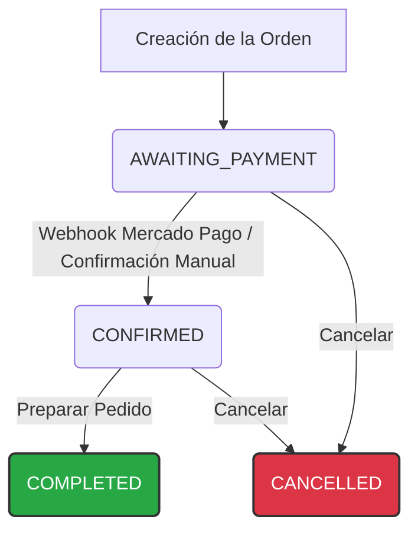
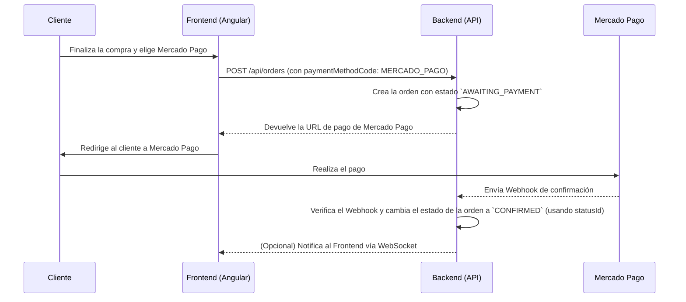
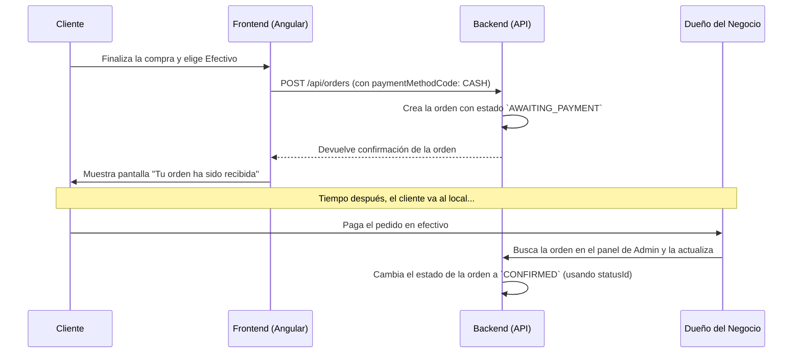

# 📄 Flujo de Estados de una Orden

Este documento es la fuente de verdad para el ciclo de vida de una orden en el sistema. Aquí se documentan los estados, transiciones, y los endpoints relacionados, incluyendo los detalles técnicos de los endpoints, los cuerpos esperados y las respuestas. **Todos los ejemplos y nombres están alineados con el backend real.**


## 📊 Diagrama de Flujo General (Estados y Transiciones)

Este diagrama muestra el recorrido completo que puede seguir una orden desde su creación hasta su finalización. **Las transiciones entre estados usan el campo `statusId` (ObjectId) y deben consultarse desde `/api/order-statuses`**.



---


## 📋 Tabla de Estados de Orden (según backend)

| CODE                 | Nombre             | Descripción                                                              | Color      | Transiciones Permitidas (`canTransitionTo`) |
| -------------------- | ------------------ | ------------------------------------------------------------------------ | ---------- | ------------------------------------------- |
| **PENDING**          | Pendiente          | El pedido está pendiente de procesamiento                                | #ffc107    | CONFIRMED, AWAITING_PAYMENT, PENDIENTE PAGADO, CANCELLED |
| **PENDIENTE PAGADO** | Pendiente Pagado   | El pedido ha sido pagado y está pendiente de procesamiento               | #28a745    | CONFIRMED, COMPLETED, CANCELLED             |
| **CONFIRMED**        | Confirmado         | El pedido ha sido confirmado pero no pagado                              | #17a2b8    | AWAITING_PAYMENT, PENDIENTE PAGADO, COMPLETED, CANCELLED |
| **AWAITING_PAYMENT** | Esperando Pago     | El pedido está esperando confirmación de pago                            | #fd7e14    | PENDIENTE PAGADO, COMPLETED, CANCELLED      |
| **COMPLETED**        | Completado         | El pedido ha sido pagado y completado                                    | #28a745    | CANCELLED                                   |
| **CANCELLED**        | Cancelado          | El pedido ha sido cancelado                                              | #dc3545    | (ninguna)                                   |

> **Nota:** El campo `canTransitionTo` es un array de **ObjectId** de estados destino. Para mostrar los nombres/códigos, consulta `/api/order-statuses` y mapea los IDs.


## 📦 Endpoints de Órdenes y Estados de Orden

### Crear una orden

**POST** `/api/orders` _(autenticación opcional)_

#### Headers
`Authorization: Bearer <token>` _(opcional)_

#### Body esperado (usuario registrado):
```json
{
  "items": [
    { "productId": "<mongoId>", "quantity": 2, "unitPrice": 100 }
  ],
  "selectedAddressId": "<mongoId>",
  "notes": "opcional"
}
```

#### Body esperado (usuario invitado):
```json
{
  "items": [
    { "productId": "<mongoId>", "quantity": 1, "unitPrice": 100 }
  ],
  "customerName": "Invitado",
  "customerEmail": "guest@mail.com",
  "shippingRecipientName": "Invitado",
  "shippingPhone": "+123456789",
  "shippingStreetAddress": "Calle 123",
  "shippingNeighborhoodId": "<mongoId>",
  "shippingCityId": "<mongoId>",
  "notes": "opcional"
}
```

#### Respuesta exitosa:
```json
{
  "success": true,
  "message": "Orden creada exitosamente",
  "data": {
    "id": "<orderId>",
    "customer": { ... },
    "items": [ ... ],
    "status": {
      "id": "<statusId>",
      "code": "PENDING",
      "name": "Pendiente",
      "color": "#ffc107",
      ...otros campos
    },
    "total": 200,
    ...otros campos
  }
}
```


### Obtener una orden por ID

**GET** `/api/orders/:id`

#### Respuesta exitosa:
```json
{
  "id": "<orderId>",
  "customer": { ... },
  "items": [ ... ],
  "status": {
    "id": "<statusId>",
    "code": "PENDING",
    ...otros campos
  },
  ...otros campos
}
```


### Listar órdenes (paginado)

**GET** `/api/orders?page=1&limit=10`

#### Respuesta:
```json
{
  "orders": [ { ... }, ... ],
  "total": 100,
  "page": 1,
  "limit": 10
}
```


### Actualizar estado de una orden

**PATCH** `/api/orders/:id/status`

#### Body esperado:
```json
{
  "statusId": "<ObjectId del estado destino>",
  "notes": "opcional"
}
```

#### Respuesta exitosa:
```json
{
  "id": "<orderId>",
  "status": {
    "id": "<statusId>",
    "code": "COMPLETED",
    ...otros campos
  },
  ...otros campos
}
```


### Listar órdenes por cliente

**GET** `/api/orders/by-customer/:customerId?page=1&limit=10`

#### Respuesta:
```json
{
  "orders": [ { ... }, ... ],
  "total": 10,
  "page": 1,
  "limit": 10
}
```


### Listar órdenes por estado

**GET** `/api/orders/status/:statusCode?page=1&limit=10`

#### Respuesta:
```json
{
  "orders": [ { ... }, ... ],
  "total": 5,
  "page": 1,
  "limit": 10
}
```


## ℹ️ Notas técnicas

- Los valores válidos para el campo `status.code` son exactamente los códigos definidos en el seeder y la tabla de arriba: `PENDING`, `PENDIENTE PAGADO`, `CONFIRMED`, `AWAITING_PAYMENT`, `COMPLETED`, `CANCELLED`.
- El campo `statusId` en los endpoints de cambio de estado debe ser un **ObjectId** válido de un estado existente (no el código).
- Todos los IDs deben ser válidos de MongoDB.
- Los endpoints devuelven errores 400 para validaciones y 404 si no se encuentra la orden.
- El campo `items` debe ser un array no vacío de objetos `{ productId, quantity, unitPrice }`.
- El campo `selectedAddressId` es obligatorio para usuarios registrados si el método de entrega lo requiere.
- Los campos de datos de cliente y envío son obligatorios para invitados.
- El campo `notes` es opcional en todos los casos.

---


## 💳 Flujo 1: Pago con Mercado Pago (Automático)

Este flujo se activa cuando el cliente elige "Mercado Pago" o cualquier método de pago online.



**Paso a Paso:**

1.  **Inicio:** El cliente finaliza la compra. El backend crea una orden con el estado `AWAITING_PAYMENT`.
2.  **Redirección:** El cliente es enviado a la pasarela de Mercado Pago para completar el pago.
3.  **Confirmación (Automática):** Una vez que el pago es exitoso, Mercado Pago envía una notificación (webhook) a nuestro backend.
4.  **Cambio de Estado:** El backend recibe esta notificación, verifica que el pago es válido y **automáticamente** actualiza el estado de la orden a `CONFIRMED`.
5.  **Acción:** El dueño ve la orden como `CONFIRMED` en su panel y sabe que debe empezar a prepararla.

---


## 💵 Flujo 2: Pago con Efectivo (Manual)

Este flujo se activa cuando el cliente elige "Efectivo" para pagar al momento de retirar el pedido.



**Paso a Paso:**

1.  **Inicio:** El cliente finaliza la compra. El backend crea una orden con el estado `AWAITING_PAYMENT`.
2.  **En Espera:** La orden permanece en este estado. El dueño la ve en su panel, pero sabe que no debe prepararla hasta que el cliente pague.
3.  **Confirmación (Manual):** El cliente llega al local y paga en efectivo.
4.  **Cambio de Estado:** El dueño del negocio, con el dinero en mano, busca la orden en su panel de administración y **manualmente** la cambia al estado `CONFIRMED`.
5.  **Acción:** Al cambiar el estado, el mismo dueño (o su equipo) ya tiene la señal para empezar a preparar el pedido.

---


## 👨‍💻 Guía para el Frontend (Angular)

Como desarrollador de frontend, debes usar el campo `status` (objeto) de la orden para mostrar el estado y las transiciones posibles. **No uses el código directamente para transiciones, usa el `statusId`**.

**1. Mostrar el Estado de la Orden al Cliente:**

Puedes usar un `switch` en tu template o un pipe de Angular para mostrar un texto amigable según el `status.code`.

```typescript
getOrderStatusText(status: { code: string }): string {
  switch (status.code) {
    case 'AWAITING_PAYMENT': return 'Esperando confirmación del pago';
    case 'CONFIRMED': return '¡Tu orden fue confirmada! La estamos preparando.';
    case 'PENDING': return 'Pendiente de procesamiento';
    case 'PENDIENTE PAGADO': return 'Pagado, pendiente de procesamiento';
    case 'COMPLETED': return '¡Pedido completado!';
    case 'CANCELLED': return 'Tu orden fue cancelada.';
    default: return 'Estado desconocido';
  }
}
```

**2. Estilos Dinámicos:**

Usa los `code` y `color` para aplicar clases CSS y colores que coincidan con los definidos en el backend.

```html
<span class="status-badge" [ngStyle]="{ backgroundColor: order.status.color }">
  {{ getOrderStatusText(order.status) }}
</span>
```

**3. Lógica del Panel de Administración:**

El campo `canTransitionTo` (array de ObjectId) es clave para mostrar solo los botones de transición válidos.

```typescript
canChangeStatus(targetStatusId: string): boolean {
  return this.currentOrder.status.canTransitionTo.includes(targetStatusId);
}
```

```html
<button [disabled]="!canChangeStatus(targetStatusId)" (click)="changeStatus(targetStatusId)">
  Cambiar estado
</button>
```

> **Recuerda:** Consulta `/api/order-statuses` para obtener todos los estados y sus IDs/códigos/nombres para armar los menús de transición.
