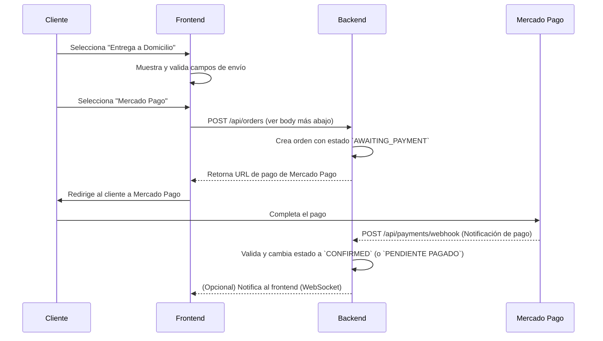
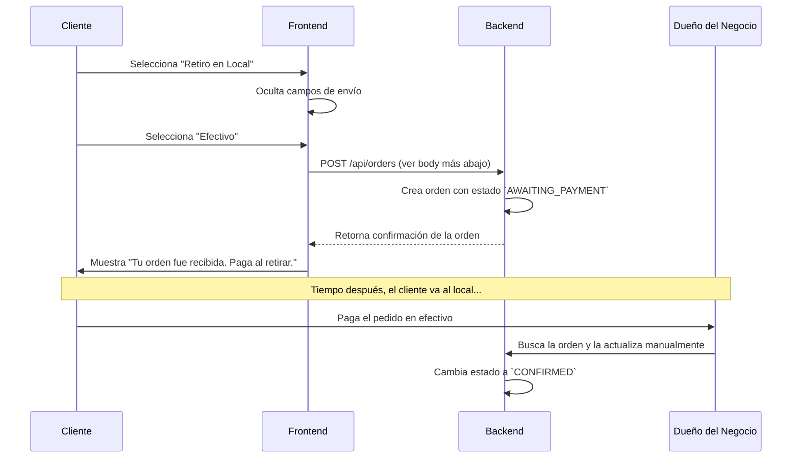
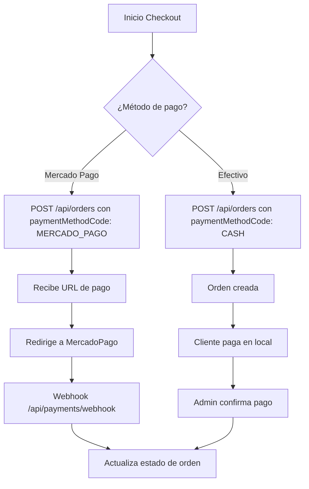

# 💳 Manual de Implementación - Métodos de Pago y Entrega

> **IMPORTANTE:** Esta documentación está alineada con el backend real. Los nombres de endpoints, campos, headers y flujos son exactos y deben usarse como referencia para el frontend y la integración.

## 🎯 Resumen General

El backend soporta un sistema integrado de **Métodos de Pago** y **Métodos de Entrega**. La lógica está centralizada para asegurar que el frontend pueda construir un flujo de checkout coherente y con validaciones automáticas.

> **Fuente de Verdad:** Para entender el ciclo de vida completo de una orden y sus estados, consulta el documento maestro: **[📄 Flujo de Estados de una Orden](./order-status-flow.md)**.

---


## 💳 Métodos de Pago Soportados

El sistema soporta múltiples métodos de pago, todos gestionados desde `/api/payment-methods`.

| code            | name         | description                                                      | requiresOnlinePayment | allowsManualConfirmation | isActive |
|-----------------|--------------|------------------------------------------------------------------|----------------------|-------------------------|----------|
| MERCADO_PAGO    | Mercado Pago | Pago online con tarjeta, débito o dinero en cuenta (MercadoPago) | true                 | false                   | true     |
| CASH            | Efectivo     | Pago en efectivo al retirar o recibir                            | false                | true                    | true     |

### 🔎 **Consulta dinámica de métodos de pago (Frontend):**

**GET** `/api/payment-methods/active`

**Respuesta:**
```json
[
  {
    "id": "<mongoId>",
    "code": "MERCADO_PAGO",
    "name": "Mercado Pago",
    "description": "Pago online con tarjeta, débito o dinero en cuenta.",
    "requiresOnlinePayment": true,
    "allowsManualConfirmation": false,
    "isActive": true
  },
  {
    "id": "<mongoId>",
    "code": "CASH",
    "name": "Efectivo",
    "description": "Pago en efectivo al momento de la entrega o retiro en el local.",
    "requiresOnlinePayment": false,
    "allowsManualConfirmation": true,
    "isActive": true
  }
]
```

> **Nota:** El frontend debe consumir este endpoint para mostrar los métodos activos y sus propiedades.

---


## 🚀 Flujos de Checkout Detallados

### 💰 **1. Flujo Online (Entrega + Mercado Pago)**

**Características:**
- Requiere dirección de envío.
- El pago se procesa automáticamente online.
- La orden no se prepara hasta que el pago es confirmado por el webhook de Mercado Pago.



#### **POST /api/orders** _(autenticación opcional)_
**Headers:**
`Authorization: Bearer <token>` _(opcional)_

**Body ejemplo:**
```json
{
  "items": [
    { "productId": "<mongoId>", "quantity": 2, "unitPrice": 100 }
  ],
  "selectedAddressId": "<mongoId>",
  "paymentMethodCode": "MERCADO_PAGO",
  "notes": "opcional"
}
```

**Respuesta exitosa:**
```json
{
  "success": true,
  "message": "Orden creada exitosamente",
  "data": {
    "id": "<orderId>",
    ...otros campos,
    "payment": {
      "preference": {
        "id": "<mp_preference_id>",
        "init_point": "<url_pago>",
        "sandbox_init_point": "<url_sandbox>"
      }
    }
  }
}
```

---

### 💵 **2. Flujo Manual (Retiro + Efectivo)**

**Características:**
- No requiere dirección de envío.
- El pago se realiza en persona.
- La orden no se prepara hasta que el dueño confirma manualmente el pago.



#### **POST /api/orders** _(autenticación opcional)_
**Headers:**
`Authorization: Bearer <token>` _(opcional)_

**Body ejemplo:**
```json
{
  "items": [
    { "productId": "<mongoId>", "quantity": 1, "unitPrice": 100 }
  ],
  "paymentMethodCode": "CASH",
  "notes": "opcional"
}
```

**Respuesta exitosa:**
```json
{
  "success": true,
  "message": "Orden creada exitosamente",
  "data": {
    "id": "<orderId>",
    ...otros campos
  }
}
```

---

## 📡 Endpoints Clave para Métodos de Pago

### Listar métodos de pago activos (para frontend)
**GET** `/api/payment-methods/active`

**Respuesta:**
```json
[
  {
    "id": "<mongoId>",
    "code": "MERCADO_PAGO",
    "name": "Mercado Pago",
    "description": "Pago online con tarjeta, débito o dinero en cuenta.",
    "requiresOnlinePayment": true,
    "allowsManualConfirmation": false,
    "isActive": true
  },
  ...
]
```

### Seleccionar método de pago para una orden existente
**PATCH** `/api/orders/:orderId/payment-method`

**Headers:**
`Authorization: Bearer <token>` _(requerido)_

**Body:**
```json
{
  "paymentMethodCode": "MERCADO_PAGO" | "CASH",
  "notes": "opcional"
}
```

**Respuesta:**
```json
{
  "success": true,
  "message": "Método de pago seleccionado exitosamente",
  "data": { ...orden actualizada... }
}
```

---

## 🔄 Webhook de Mercado Pago

**POST** `/api/payments/webhook`

**Headers:**
`x-signature`, `content-type: application/json`, ...otros de MercadoPago

**Body:**
Ver documentación oficial de MercadoPago (el backend soporta ambos formatos: query y body)

**Respuesta:**
```json
{
  "message": "Notificación procesada exitosamente",
  "paymentStatus": "approved",
  "orderUpdated": true,
  "timestamp": "2025-07-08T12:34:56.789Z"
}
```

---

## 🧩 Ejemplo de integración Frontend

```typescript
// Obtener métodos de pago activos
const response = await fetch('/api/payment-methods/active');
const methods = await response.json();

// Crear orden con método de pago
await fetch('/api/orders', {
  method: 'POST',
  headers: { 'Content-Type': 'application/json', 'Authorization': `Bearer ${token}` },
  body: JSON.stringify({
    items: [...],
    paymentMethodCode: 'MERCADO_PAGO',
    ...otrosCampos
  })
});

// Seleccionar método de pago para orden existente
await fetch(`/api/orders/${orderId}/payment-method`, {
  method: 'PATCH',
  headers: { 'Content-Type': 'application/json', 'Authorization': `Bearer ${token}` },
  body: JSON.stringify({ paymentMethodCode: 'CASH' })
});
```

---

## 📈 Diagrama General de Flujos


