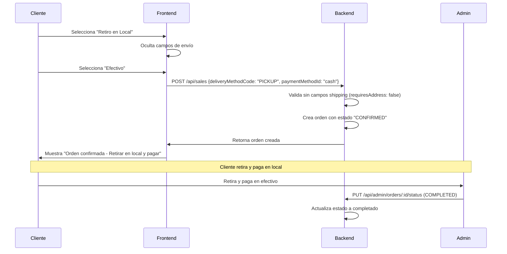
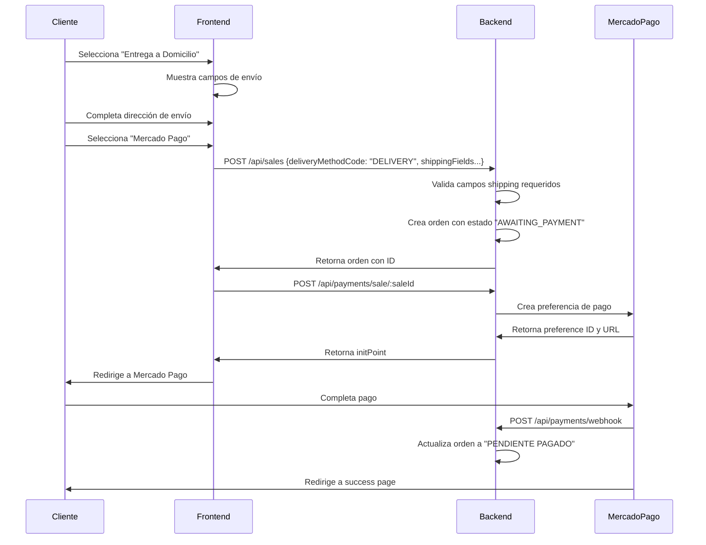
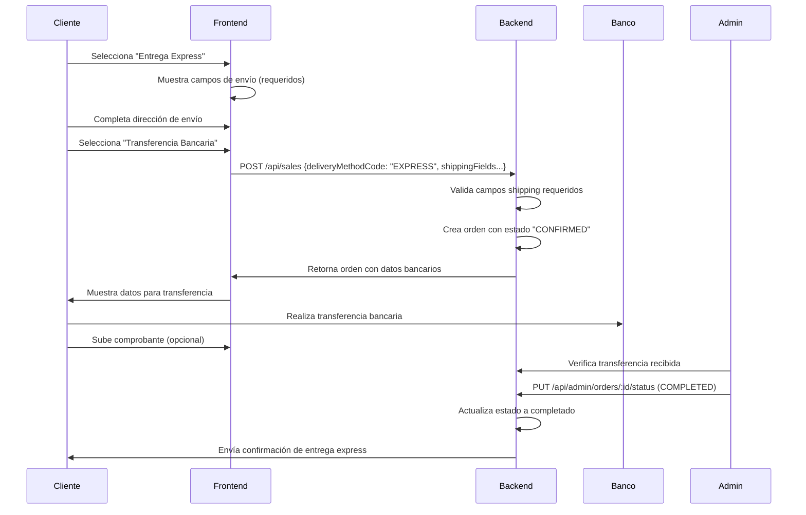

# 💳 Manual de Implementación - Métodos de Pago y Entrega

## 📋 Índice

- [Resumen General](#-resumen-general)
- [Métodos de Pago](#-métodos-de-pago)
- [Métodos de Entrega](#-métodos-de-entrega)
- [Flujos de Checkout](#-flujos-de-checkout)
- [API Endpoints](#-api-endpoints)
- [Implementación Frontend](#-implementación-frontend)
- [Estados de Orden](#-estados-de-orden)
- [Validaciones Condicionales](#-validaciones-condicionales)
- [Casos de Uso](#-casos-de-uso)
- [Troubleshooting](#-troubleshooting)

---

## 🎯 Resumen General

El backend soporta un sistema completo de **Métodos de Pago** y **Métodos de Entrega** integrados, con validaciones condicionales inteligentes.

### 🔗 **Integración Clave:**
- Los métodos de entrega determinan si se requieren campos de envío
- Los métodos de pago determinan el flujo de procesamiento
- La validación es automática y condicional

---

## 💳 Métodos de Pago

Tu backend soporta **4 métodos de pago** configurados:

| Código | Método | Tipo | Confirmación | Estado Inicial |
|--------|--------|------|--------------|----------------|
| `CASH` | Efectivo | Manual | Requerida | `CONFIRMED` |
| `MERCADO_PAGO` | Mercado Pago | Automático | Automática | `AWAITING_PAYMENT` |
| `BANK_TRANSFER` | Transferencia | Manual | Requerida | `CONFIRMED` |
| `PENDING` | Sin Método | N/A | N/A | `PENDING` |

---

## 🚚 Métodos de Entrega

El backend incluye **3 métodos de entrega** configurados:

| Código | Método | Requiere Dirección | Costo | Descripción |
|--------|--------|--------------------|-------|-------------|
| `PICKUP` | Retiro en Local | ❌ **NO** | $0 | Cliente retira en el local |
| `DELIVERY` | Entrega a Domicilio | ✅ **SÍ** | Variable | Envío a dirección del cliente |
| `EXPRESS` | Entrega Express | ✅ **SÍ** | Premium | Envío rápido mismo día |

### 🎯 **Punto Clave para Frontend:**

```javascript
// ⚡ VALIDACIÓN AUTOMÁTICA CONDICIONAL
if (deliveryMethod.requiresAddress) {
  // Mostrar y validar campos de envío
  showShippingFields = true;
  validateShippingFields = true;
} else {
  // Ocultar campos de envío (ej: PICKUP)
  showShippingFields = false;
  validateShippingFields = false;
}
```

---

## ✅ **Métodos Disponibles para Frontend:**

### **Métodos de Pago:**
```json
{
  "cash": {
    "code": "CASH",
    "name": "Efectivo",
    "description": "Pago en efectivo al momento de la entrega",
    "requiresOnlinePayment": false,
    "allowsManualConfirmation": true,
    "flow": "manual"
  },
  "mercadoPago": {
    "code": "MERCADO_PAGO", 
    "name": "Mercado Pago",
    "description": "Pago online con tarjeta de crédito/débito",
    "requiresOnlinePayment": true,
    "allowsManualConfirmation": false,
    "flow": "automatic"
  },
  "bankTransfer": {
    "code": "BANK_TRANSFER",
    "name": "Transferencia Bancaria", 
    "description": "Transferencia bancaria manual",
    "requiresOnlinePayment": false,
    "allowsManualConfirmation": true,
    "flow": "manual"
  }
}
```

### **Métodos de Entrega:**
```json
{
  "pickup": {
    "code": "PICKUP",
    "name": "Retiro en Local",
    "description": "Retiro en nuestro local",
    "requiresAddress": false,
    "cost": 0,
    "estimatedTime": "Inmediato"
  },
  "delivery": {
    "code": "DELIVERY",
    "name": "Entrega a Domicilio", 
    "description": "Envío a tu domicilio",
    "requiresAddress": true,
    "cost": "Variable según zona",
    "estimatedTime": "24-48 horas"
  },
  "express": {
    "code": "EXPRESS",
    "name": "Entrega Express",
    "description": "Envío express mismo día",
    "requiresAddress": true,
    "cost": "Premium",
    "estimatedTime": "2-6 horas"
  }
}
```

---

## 🏗️ Arquitectura General

### 📊 **Flujo General de Checkout Integrado:**

```
� Carrito → 🚚 Método Entrega → 💳 Método Pago → 📝 Crear Orden → �💰 Procesar Pago → ✅ Confirmación
```

### 🔄 **Estados de Orden por Método de Pago:**

| Método | Estado Inicial | Pago Exitoso | Pago Fallido |
|--------|----------------|---------------|--------------|
| **Efectivo** | `CONFIRMED` | `CONFIRMED` → `COMPLETED` | - |
| **Mercado Pago** | `AWAITING_PAYMENT` | `PENDIENTE PAGADO` → `COMPLETED` | `CANCELLED` |
| **Transferencia** | `CONFIRMED` | `CONFIRMED` → `COMPLETED` | - |

---

## ⚡ Validaciones Condicionales

### 🎯 **Validación Automática de Campos de Envío**

El backend valida automáticamente los campos de envío basándose en el método de entrega seleccionado mediante la propiedad `requiresAddress`. Esta validación es **robusta y confiable**, respaldada por tests de integración completos.

```javascript
// ✅ LÓGICA FRONTEND RECOMENDADA:

// 1. Obtener métodos de entrega activos
const deliveryMethods = await fetch('/api/delivery-methods/active');

// 2. Al seleccionar método de entrega
const handleDeliveryMethodChange = (deliveryMethodId) => {
  const selectedMethod = deliveryMethods.find(m => m.id === deliveryMethodId);
  
  if (selectedMethod.requiresAddress) {
    // Mostrar y validar campos de envío
    setShowShippingFields(true);
    setShippingFieldsRequired(true);
  } else {
    // Ocultar campos de envío (ej: PICKUP)
    setShowShippingFields(false);
    setShippingFieldsRequired(false);
    clearShippingFields(); // Limpiar formulario
  }
};

// 3. Al crear la orden - SOPORTE DUAL DE IDENTIFICADORES
const createOrder = async (orderData) => {
  const payload = {
    items: orderData.items,
    paymentMethodId: orderData.paymentMethodId,
    
    // ⚡ NUEVO: Soporte para ID o código de método de entrega
    deliveryMethodId: orderData.deliveryMethodId,        // Opción 1: Por ID
    // O alternativamente:
    // deliveryMethodCode: orderData.deliveryMethodCode,  // Opción 2: Por código ('PICKUP', 'DELIVERY', 'EXPRESS')
    
    // Campos de envío solo si el método los requiere
    ...(selectedDeliveryMethod.requiresAddress && {
      shippingRecipientName: orderData.shippingRecipientName,
      shippingPhone: orderData.shippingPhone,
      shippingStreetAddress: orderData.shippingStreetAddress,
      shippingNeighborhoodId: orderData.shippingNeighborhoodId,
      // ... otros campos de envío
    }),
    
    // Datos del cliente (para invitados)
    ...(isGuest && {
      customerName: orderData.customerName,
      customerEmail: orderData.customerEmail
    })
  };
  
  return await fetch('/api/sales', {
    method: 'POST',
    headers: { 'Content-Type': 'application/json' },
    body: JSON.stringify(payload)
  });
};
```

### 🔧 **Identificadores de Métodos de Entrega - Flexibilidad Mejorada**

El backend ahora soporta **dos formas** de identificar métodos de entrega:

| Método | Campo | Ejemplo | Ventaja |
|--------|-------|---------|---------|
| **Por ID** | `deliveryMethodId` | `"64a7f8c9b123456789abcdeh"` | Precisión garantizada |
| **Por Código** | `deliveryMethodCode` | `"PICKUP"`, `"DELIVERY"`, `"EXPRESS"` | Más legible y mantenible |

```javascript
// ✅ Ambas opciones son válidas:

// Opción 1: Por ID (tradicional)
const orderPayload1 = {
  deliveryMethodId: "64a7f8c9b123456789abcdeh",
  // ... resto de campos
};

// Opción 2: Por código (nuevo - más legible)
const orderPayload2 = {
  deliveryMethodCode: "PICKUP",
  // ... resto de campos
};
```

### 🔑 **Reglas de Validación por Método de Entrega:**

| Método | requiresAddress | Campos de Envío | Comportamiento Frontend |
|--------|-----------------|-----------------|------------------------|
| **PICKUP** | `false` | ❌ NO requeridos | Ocultar formulario de envío |
| **DELIVERY** | `true` | ✅ SÍ requeridos | Mostrar y validar formulario |
| **EXPRESS** | `true` | ✅ SÍ requeridos | Mostrar y validar formulario |

### 🛡️ **Robustez y Confiabilidad del Sistema**

El sistema de métodos de entrega y validación condicional está completamente validado y es confiable:

#### ✅ **Tests de Integración Completos**
- Validación de métodos de entrega con `requiresAddress: true/false`
- Tests de creación de órdenes con y sin campos de dirección
- Verificación de que la validación condicional funciona correctamente
- Coverage completo de todos los escenarios de checkout

#### 🔄 **Seeding Robusto**
- **Script de seeding:** `npm run seed:delivery-methods`
- **Prevención de duplicados:** Usa upsert para evitar errores de clave duplicada
- **Consistencia:** Garantiza que siempre existan los 3 métodos estándar (`PICKUP`, `DELIVERY`, `EXPRESS`)
- **Idempotencia:** Se puede ejecutar múltiples veces sin problemas

#### 🎯 **Garantías del Backend**
- ✅ La validación condicional está **implementada y funciona**
- ✅ Los tests pasan al 100% (3 métodos de entrega activos esperados)
- ✅ El seeding previene problemas de datos inconsistentes
- ✅ Soporte dual de identificadores (`ID` y `código`) con resolución automática

```bash
# Para verificar/actualizar métodos de entrega:
npm run seed:delivery-methods

# Para ejecutar tests de integración:
npm test -- --testPathPattern=delivery-methods
```

---

## 🚀 Flujos de Checkout Detallados

### 💰 **1. Flujo con Retiro en Local (PICKUP + CASH)**

#### **Características:**
- ✅ **Sin campos de envío**
- ✅ **Pago en efectivo**
- ✅ **Estado inmediato CONFIRMED**

#### **Flujo Paso a Paso:**



### � **2. Flujo con Entrega a Domicilio (DELIVERY + MERCADO_PAGO)**

#### **Características:**
- ✅ **Con campos de envío requeridos**
- ✅ **Pago online automático**
- ✅ **Validación de dirección**

#### **Flujo Paso a Paso:**



### 💳 **3. Flujo Híbrido (EXPRESS + BANK_TRANSFER)**

#### **Características:**
- ✅ **Entrega express con dirección**
- ✅ **Pago manual por transferencia**
- ✅ **Confirmación admin requerida**



---

## 🛠️ API Endpoints

### 📋 **Endpoints Principales:**

#### **1. Obtener Métodos de Pago Disponibles**

```http
GET /api/payment-methods
```

**Autenticación:** No requerida  
**Descripción:** Obtiene métodos de pago activos para mostrar en el checkout

**Respuesta (200):**
```json
[
  {
    "id": "64a7f8c9b123456789abcdef",
    "code": "CASH",
    "name": "Efectivo",
    "description": "Pago en efectivo al momento de la entrega",
    "isActive": true,
    "requiresOnlinePayment": false,
    "allowsManualConfirmation": true
  },
  {
    "id": "64a7f8c9b123456789abcdeg",
    "code": "MERCADO_PAGO",
    "name": "Mercado Pago",
    "description": "Pago online con tarjeta",
    "isActive": true,
    "requiresOnlinePayment": true,
    "allowsManualConfirmation": false
  }
]
```

#### **2. Obtener Métodos de Entrega Activos**

```http
GET /api/delivery-methods/active
```

**Autenticación:** No requerida  
**Descripción:** Obtiene métodos de entrega activos para mostrar en el checkout

**Respuesta (200):**
```json
[
  {
    "id": "64a7f8c9b123456789abcdeh",
    "name": "Retiro en Local",
    "description": "Retiro en nuestro local",
    "requiresAddress": false,
    "cost": 0,
    "estimatedTime": "Inmediato",
    "isActive": true
  },
  {
    "id": "64a7f8c9b123456789abcdei",
    "name": "Entrega a Domicilio",
    "description": "Envío a tu domicilio", 
    "requiresAddress": true,
    "cost": 150,
    "estimatedTime": "24-48 horas",
    "isActive": true
  }
]
```

#### **3. Crear Orden (Integrado) - Soporte Dual de Identificadores**

```http
POST /api/sales
```

**Autenticación:** Opcional (Usuario registrado o invitado)  
**Headers:**
```
Authorization: Bearer <token>  // Solo para usuarios registrados
Content-Type: application/json
```

**Body para Usuario Registrado + Retiro (Opción 1 - Por ID):**
```json
{
  "items": [
    {
      "productId": "64a7f8c9b123456789abcdef",
      "quantity": 2,
      "unitPrice": 15000
    }
  ],
  "paymentMethodId": "64a7f8c9b123456789abcdef",
  "deliveryMethodId": "64a7f8c9b123456789abcdeh", // PICKUP por ID
  "notes": "Sin cebolla por favor"
  // ❌ NO incluir campos de shipping para PICKUP
}
```

**Body para Usuario Registrado + Retiro (Opción 2 - Por Código):**
```json
{
  "items": [
    {
      "productId": "64a7f8c9b123456789abcdef",
      "quantity": 2,
      "unitPrice": 15000
    }
  ],
  "paymentMethodId": "64a7f8c9b123456789abcdef",
  "deliveryMethodCode": "PICKUP", // ⚡ NUEVO: Por código (más legible)
  "notes": "Sin cebolla por favor"
  // ❌ NO incluir campos de shipping para PICKUP
}
```

**Body para Usuario Registrado + Entrega (Flexible):**
```json
{
  "items": [
    {
      "productId": "64a7f8c9b123456789abcdef",
      "quantity": 2,
      "unitPrice": 15000
    }
  ],
  "paymentMethodId": "64a7f8c9b123456789abcdef",
  
  // ⚡ Usar cualquiera de estas opciones:
  "deliveryMethodId": "64a7f8c9b123456789abcdei", // Por ID
  // O:
  // "deliveryMethodCode": "DELIVERY", // Por código
  
  // ✅ Campos de shipping requeridos para DELIVERY/EXPRESS
  "selectedAddressId": "64a7f8c9b123456789abcdef", // Dirección guardada
  // O proporcionar nueva dirección:
  "shippingRecipientName": "Juan Pérez",
  "shippingPhone": "+54911234567",
  "shippingStreetAddress": "Av. Corrientes 1234",
  "shippingNeighborhoodId": "64a7f8c9b123456789abcdef",
  "shippingPostalCode": "1043",
  "shippingAdditionalInfo": "Depto 5B"
}
```

**Body para Invitado + Entrega:**
```json
{
  "items": [
    {
      "productId": "64a7f8c9b123456789abcdef",
      "quantity": 2,
      "unitPrice": 15000
    }
  ],
  "paymentMethodId": "64a7f8c9b123456789abcdef",
  "deliveryMethodId": "64a7f8c9b123456789abcdei", // DELIVERY
  
  // ✅ Datos del cliente invitado (requeridos)
  "customerName": "María García",
  "customerEmail": "maria@email.com",
  
  // ✅ Campos de shipping requeridos para DELIVERY
  "shippingRecipientName": "María García",
  "shippingPhone": "+54911234567",
  "shippingStreetAddress": "Av. Santa Fe 2345",
  "shippingNeighborhoodId": "64a7f8c9b123456789abcdef",
  "shippingPostalCode": "1123"
**Respuesta Exitosa (201):**
```json
{
  "id": "64a7f8c9b123456789abcdef",
  "orderNumber": "ORD-20250106-001", 
  "status": {
    "code": "CONFIRMED", // o "AWAITING_PAYMENT" para Mercado Pago
    "name": "Confirmado"
  },
  "paymentMethod": {
    "id": "64a7f8c9b123456789abcdef",
    "code": "CASH",
    "name": "Efectivo"
  },
  "deliveryMethod": {
    "id": "64a7f8c9b123456789abcdeh", 
    "name": "Retiro en Local",
    "requiresAddress": false
  },
  "customer": {
    "id": "64a7f8c9b123456789abcdef",
    "name": "Juan Pérez",
    "email": "juan@email.com"
  },
  "shippingDetails": {
    // Solo presente si deliveryMethod.requiresAddress = true
    "recipientName": "Juan Pérez",
    "phone": "+54911234567",
    "streetAddress": "Av. Corrientes 123",
    "neighborhood": {
      "id": "64a7f8c9b123456789abcdef",
      "name": "Microcentro"
    }
  },
  "items": [
    {
      "id": "64a7f8c9b123456789abcdef",
      "product": {
        "id": "64a7f8c9b123456789abcdef",
        "name": "Pizza Mozzarella",
        "image": "https://...",
        "unit": "unidad"
      },
      "quantity": 2,
      "unitPrice": 15000,
      "totalPrice": 30000
    }
  ],
  "summary": {
    "subtotal": 30000,
    "tax": 3150,
    "discount": 0,
    "deliveryCost": 0, // Para PICKUP = 0
    "total": 33150
  },
  "createdAt": "2025-01-06T10:30:00Z",
  "estimatedDelivery": "2025-01-06T12:00:00Z"
}
```

#### **4. Procesar Pago con Mercado Pago**

```http
POST /api/payments/sale/:saleId
Authorization: Bearer <jwt-token>
```

**Respuesta (200):**
```json
{
  "success": true,
  "preference": {
    "id": "123456789-abcd-1234-efgh-987654321",
    "init_point": "https://sandbox.mercadopago.com.ar/checkout/v1/redirect?pref_id=123456789-abcd-1234-efgh-987654321",
    "sandbox_init_point": "https://sandbox.mercadopago.com.ar/checkout/v1/redirect?pref_id=123456789-abcd-1234-efgh-987654321"
  },
  "order": {
    "id": "64a7f8c9b123456789abcdef",
    "status": "AWAITING_PAYMENT",
    "total": 33150
  }
}
```

---

## 🎨 Implementación Frontend

### 📱 **Flujo de Checkout Recomendado:**

```javascript
// 1. Componente principal de Checkout
const CheckoutPage = () => {
  const [deliveryMethods, setDeliveryMethods] = useState([]);
  const [paymentMethods, setPaymentMethods] = useState([]);
  const [selectedDelivery, setSelectedDelivery] = useState(null);
  const [selectedPayment, setSelectedPayment] = useState(null);
  const [showShippingForm, setShowShippingForm] = useState(false);

  // Cargar métodos disponibles al inicializar
  useEffect(() => {
    loadAvailableMethods();
  }, []);

  const loadAvailableMethods = async () => {
    try {
      const [deliveryRes, paymentRes] = await Promise.all([
        fetch('/api/delivery-methods/active'),
        fetch('/api/payment-methods')
      ]);
      
      setDeliveryMethods(await deliveryRes.json());
      setPaymentMethods(await paymentRes.json());
    } catch (error) {
      console.error('Error cargando métodos:', error);
    }
  };

  // Manejar selección de método de entrega
  const handleDeliveryChange = (deliveryMethodId) => {
    const method = deliveryMethods.find(m => m.id === deliveryMethodId);
    setSelectedDelivery(method);
    
    // ⚡ LÓGICA CLAVE: Mostrar/ocultar campos de envío
    setShowShippingForm(method?.requiresAddress || false);
    
    if (!method?.requiresAddress) {
      // Limpiar campos de envío si no son necesarios
      clearShippingFields();
    }
  };

  // Crear orden final
  const createOrder = async (formData) => {
    const payload = {
      items: cartItems,
      paymentMethodId: selectedPayment.id,
      deliveryMethodId: selectedDelivery.id,
      
      // Incluir campos de envío solo si el método los requiere
      ...(selectedDelivery.requiresAddress && {
        shippingRecipientName: formData.recipientName,
        shippingPhone: formData.phone,
        shippingStreetAddress: formData.address,
        shippingNeighborhoodId: formData.neighborhoodId,
        shippingPostalCode: formData.postalCode,
        shippingAdditionalInfo: formData.additionalInfo
      }),
      
      // Para usuarios invitados
      ...(isGuest && {
        customerName: formData.customerName,
        customerEmail: formData.customerEmail
      })
    };

    try {
      const response = await fetch('/api/sales', {
        method: 'POST',
        headers: {
          'Content-Type': 'application/json',
          ...(isLoggedIn && { 'Authorization': `Bearer ${token}` })
        },
        body: JSON.stringify(payload)
      });

      const order = await response.json();
      
      if (selectedPayment.code === 'MERCADO_PAGO') {
        // Procesar pago online
        return processOnlinePayment(order.id);
      } else {
        // Pago manual (efectivo, transferencia)
        return showOrderConfirmation(order);
      }
    } catch (error) {
      handleOrderError(error);
    }
  };

  return (
    <div className="checkout-container">
      {/* Selector de método de entrega */}
      <DeliveryMethodSelector 
        methods={deliveryMethods}
        selected={selectedDelivery}
        onChange={handleDeliveryChange}
      />
      
      {/* Formulario de envío condicional */}
      {showShippingForm && (
        <ShippingForm 
          required={selectedDelivery?.requiresAddress}
          onSubmit={(data) => setShippingData(data)}
        />
      )}
      
      {/* Selector de método de pago */}
      <PaymentMethodSelector
        methods={paymentMethods}
        selected={selectedPayment}
        onChange={setSelectedPayment}
      />
      
      {/* Botón de finalizar compra */}
      <CheckoutButton 
        onClick={createOrder}
        disabled={!selectedDelivery || !selectedPayment}
      />
    </div>
  );
};
```

### 🔍 **Validaciones Frontend:**

```javascript
// Función de validación condicional
const validateCheckoutForm = (formData, deliveryMethod, paymentMethod) => {
  const errors = {};

  // Validar método de entrega seleccionado
  if (!deliveryMethod) {
    errors.delivery = 'Selecciona un método de entrega';
  }

  // Validar método de pago seleccionado
  if (!paymentMethod) {
    errors.payment = 'Selecciona un método de pago';
  }

  // Validar campos de envío solo si son requeridos
  if (deliveryMethod?.requiresAddress) {
    if (!formData.recipientName) {
      errors.recipientName = 'Nombre del destinatario requerido';
    }
    if (!formData.phone) {
      errors.phone = 'Teléfono requerido';
    }
    if (!formData.address) {
      errors.address = 'Dirección requerida';
    }
    if (!formData.neighborhoodId) {
      errors.neighborhood = 'Barrio requerido';
    }
  }

  // Validar datos del cliente invitado
  if (isGuest) {
    if (!formData.customerName) {
      errors.customerName = 'Nombre requerido';
    }
    if (!formData.customerEmail) {
      errors.customerEmail = 'Email requerido';
    }
  }

  return {
    isValid: Object.keys(errors).length === 0,
    errors
  };
};
```
```

#### **3. Crear Preferencia de Mercado Pago**

```http
POST /api/payments/sale/:saleId
Authorization: Bearer <jwt-token>
```

**Parámetros:**
- `saleId`: ID de la orden creada

**Respuesta (200):**
```json
{
  "preferenceId": "123456789-abcd-efgh-1234-567890abcdef",
  "initPoint": "https://www.mercadopago.com.ar/checkout/v1/redirect?pref_id=123456789",
  "sandboxInitPoint": "https://sandbox.mercadopago.com.ar/checkout/v1/redirect?pref_id=123456789"
}
```

#### **4. Verificar Estado de Pago**

```http
GET /api/payments/status/sale/:saleId
Authorization: Bearer <jwt-token>
```

**Respuesta (200):**
```json
{
  "success": true,
  "payment": {
    "id": "payment_id",
    "status": "approved", // approved, pending, rejected
    "amount": 3015.00,
    "lastVerified": "2025-01-06T10:35:00Z",
    "saleId": "64a7f8c9b123456789abcdef"
  }
}
```

#### **5. Webhook Mercado Pago (Automático)**

```http
POST /api/payments/webhook
Content-Type: application/json
```

**Body (MP envía):**
```json
{
  "id": 12345,
  "live_mode": true,
  "type": "payment",
  "date_created": "2025-01-06T10:35:00.000-04:00",
  "application_id": 123456789,
  "user_id": 44444444,
  "version": 1,
  "api_version": "v1",
  "action": "payment.created",
  "data": {
    "id": "123456789" // payment_id
  }
}
```

---

## 🎨 Implementación Frontend

### 📱 **Flujo de Checkout Recomendado:**

```javascript
// 1. Componente principal de Checkout
const CheckoutPage = () => {
  const [deliveryMethods, setDeliveryMethods] = useState([]);
  const [paymentMethods, setPaymentMethods] = useState([]);
  const [selectedDelivery, setSelectedDelivery] = useState(null);
  const [selectedPayment, setSelectedPayment] = useState(null);
  const [showShippingForm, setShowShippingForm] = useState(false);

  // Cargar métodos disponibles al inicializar
  useEffect(() => {
    loadAvailableMethods();
  }, []);

  const loadAvailableMethods = async () => {
    try {
      const [deliveryRes, paymentRes] = await Promise.all([
        fetch('/api/delivery-methods/active'),
        fetch('/api/payment-methods')
      ]);
      
      setDeliveryMethods(await deliveryRes.json());
      setPaymentMethods(await paymentRes.json());
    } catch (error) {
      console.error('Error cargando métodos:', error);
    }
  };

  // Manejar selección de método de entrega
  const handleDeliveryChange = (deliveryMethodId) => {
    const method = deliveryMethods.find(m => m.id === deliveryMethodId);
    setSelectedDelivery(method);
    
    // ⚡ LÓGICA CLAVE: Mostrar/ocultar campos de envío
    setShowShippingForm(method?.requiresAddress || false);
    
    if (!method?.requiresAddress) {
      // Limpiar campos de envío si no son necesarios
      clearShippingFields();
    }
  };

  // Crear orden final
  const createOrder = async (formData) => {
    const payload = {
      items: cartItems,
      paymentMethodId: selectedPayment.id,
      deliveryMethodId: selectedDelivery.id,
      
      // Incluir campos de envío solo si el método los requiere
      ...(selectedDelivery.requiresAddress && {
        shippingRecipientName: formData.recipientName,
        shippingPhone: formData.phone,
        shippingStreetAddress: formData.address,
        shippingNeighborhoodId: formData.neighborhoodId,
        shippingPostalCode: formData.postalCode,
        shippingAdditionalInfo: formData.additionalInfo
      }),
      
      // Para usuarios invitados
      ...(isGuest && {
        customerName: formData.customerName,
        customerEmail: formData.customerEmail
      })
    };

    try {
      const response = await fetch('/api/sales', {
        method: 'POST',
        headers: {
          'Content-Type': 'application/json',
          ...(isLoggedIn && { 'Authorization': `Bearer ${token}` })
        },
        body: JSON.stringify(payload)
      });

      const order = await response.json();
      
      if (selectedPayment.code === 'MERCADO_PAGO') {
        // Procesar pago online
        return processOnlinePayment(order.id);
      } else {
        // Pago manual (efectivo, transferencia)
        return showOrderConfirmation(order);
      }
    } catch (error) {
      handleOrderError(error);
    }
  };

  return (
    <div className="checkout-container">
      {/* Selector de método de entrega */}
      <DeliveryMethodSelector 
        methods={deliveryMethods}
        selected={selectedDelivery}
        onChange={handleDeliveryChange}
      />
      
      {/* Formulario de envío condicional */}
      {showShippingForm && (
        <ShippingForm 
          required={selectedDelivery?.requiresAddress}
          onSubmit={(data) => setShippingData(data)}
        />
      )}
      
      {/* Selector de método de pago */}
      <PaymentMethodSelector
        methods={paymentMethods}
        selected={selectedPayment}
        onChange={setSelectedPayment}
      />
      
      {/* Botón de finalizar compra */}
      <CheckoutButton 
        onClick={createOrder}
        disabled={!selectedDelivery || !selectedPayment}
      />
    </div>
  );
};
```

### 🔍 **Validaciones Frontend:**

```javascript
// Función de validación condicional
const validateCheckoutForm = (formData, deliveryMethod, paymentMethod) => {
  const errors = {};

  // Validar método de entrega seleccionado
  if (!deliveryMethod) {
    errors.delivery = 'Selecciona un método de entrega';
  }

  // Validar método de pago seleccionado
  if (!paymentMethod) {
    errors.payment = 'Selecciona un método de pago';
  }

  // Validar campos de envío solo si son requeridos
  if (deliveryMethod?.requiresAddress) {
    if (!formData.recipientName) {
      errors.recipientName = 'Nombre del destinatario requerido';
    }
    if (!formData.phone) {
      errors.phone = 'Teléfono requerido';
    }
    if (!formData.address) {
      errors.address = 'Dirección requerida';
    }
    if (!formData.neighborhoodId) {
      errors.neighborhood = 'Barrio requerido';
    }
  }

  // Validar datos del cliente invitado
  if (isGuest) {
    if (!formData.customerName) {
      errors.customerName = 'Nombre requerido';
    }
    if (!formData.customerEmail) {
      errors.customerEmail = 'Email requerido';
    }
  }

  return {
    isValid: Object.keys(errors).length === 0,
    errors
  };
};
```
```

#### **3. Crear Preferencia de Mercado Pago**

```http
POST /api/payments/sale/:saleId
Authorization: Bearer <jwt-token>
```

**Parámetros:**
- `saleId`: ID de la orden creada

**Respuesta (200):**
```json
{
  "preferenceId": "123456789-abcd-efgh-1234-567890abcdef",
  "initPoint": "https://www.mercadopago.com.ar/checkout/v1/redirect?pref_id=123456789",
  "sandboxInitPoint": "https://sandbox.mercadopago.com.ar/checkout/v1/redirect?pref_id=123456789"
}
```

#### **4. Verificar Estado de Pago**

```http
GET /api/payments/status/sale/:saleId
Authorization: Bearer <jwt-token>
```

**Respuesta (200):**
```json
{
  "success": true,
  "payment": {
    "id": "payment_id",
    "status": "approved", // approved, pending, rejected
    "amount": 3015.00,
    "lastVerified": "2025-01-06T10:35:00Z",
    "saleId": "64a7f8c9b123456789abcdef"
  }
}
```

#### **5. Webhook Mercado Pago (Automático)**

```http
POST /api/payments/webhook
Content-Type: application/json
```

**Body (MP envía):**
```json
{
  "id": 12345,
  "live_mode": true,
  "type": "payment",
  "date_created": "2025-01-06T10:35:00.000-04:00",
  "application_id": 123456789,
  "user_id": 44444444,
  "version": 1,
  "api_version": "v1",
  "action": "payment.created",
  "data": {
    "id": "123456789" // payment_id
  }
}
```

---

## 🎨 Implementación Frontend

### 📱 **Flujo de Checkout Recomendado:**

```javascript
// 1. Componente principal de Checkout
const CheckoutPage = () => {
  const [deliveryMethods, setDeliveryMethods] = useState([]);
  const [paymentMethods, setPaymentMethods] = useState([]);
  const [selectedDelivery, setSelectedDelivery] = useState(null);
  const [selectedPayment, setSelectedPayment] = useState(null);
  const [showShippingForm, setShowShippingForm] = useState(false);

  // Cargar métodos disponibles al inicializar
  useEffect(() => {
    loadAvailableMethods();
  }, []);

  const loadAvailableMethods = async () => {
    try {
      const [deliveryRes, paymentRes] = await Promise.all([
        fetch('/api/delivery-methods/active'),
        fetch('/api/payment-methods')
      ]);
      
      setDeliveryMethods(await deliveryRes.json());
      setPaymentMethods(await paymentRes.json());
    } catch (error) {
      console.error('Error cargando métodos:', error);
    }
  };

  // Manejar selección de método de entrega
  const handleDeliveryChange = (deliveryMethodId) => {
    const method = deliveryMethods.find(m => m.id === deliveryMethodId);
    setSelectedDelivery(method);
    
    // ⚡ LÓGICA CLAVE: Mostrar/ocultar campos de envío
    setShowShippingForm(method?.requiresAddress || false);
    
    if (!method?.requiresAddress) {
      // Limpiar campos de envío si no son necesarios
      clearShippingFields();
    }
  };

  // Crear orden final
  const createOrder = async (formData) => {
    const payload = {
      items: cartItems,
      paymentMethodId: selectedPayment.id,
      deliveryMethodId: selectedDelivery.id,
      
      // Incluir campos de envío solo si el método los requiere
      ...(selectedDelivery.requiresAddress && {
        shippingRecipientName: formData.recipientName,
        shippingPhone: formData.phone,
        shippingStreetAddress: formData.address,
        shippingNeighborhoodId: formData.neighborhoodId,
        shippingPostalCode: formData.postalCode,
        shippingAdditionalInfo: formData.additionalInfo
      }),
      
      // Para usuarios invitados
      ...(isGuest && {
        customerName: formData.customerName,
        customerEmail: formData.customerEmail
      })
    };

    try {
      const response = await fetch('/api/sales', {
        method: 'POST',
        headers: {
          'Content-Type': 'application/json',
          ...(isLoggedIn && { 'Authorization': `Bearer ${token}` })
        },
        body: JSON.stringify(payload)
      });

      const order = await response.json();
      
      if (selectedPayment.code === 'MERCADO_PAGO') {
        // Procesar pago online
        return processOnlinePayment(order.id);
      } else {
        // Pago manual (efectivo, transferencia)
        return showOrderConfirmation(order);
      }
    } catch (error) {
      handleOrderError(error);
    }
  };

  return (
    <div className="checkout-container">
      {/* Selector de método de entrega */}
      <DeliveryMethodSelector 
        methods={deliveryMethods}
        selected={selectedDelivery}
        onChange={handleDeliveryChange}
      />
      
      {/* Formulario de envío condicional */}
      {showShippingForm && (
        <ShippingForm 
          required={selectedDelivery?.requiresAddress}
          onSubmit={(data) => setShippingData(data)}
        />
      )}
      
      {/* Selector de método de pago */}
      <PaymentMethodSelector
        methods={paymentMethods}
        selected={selectedPayment}
        onChange={setSelectedPayment}
      />
      
      {/* Botón de finalizar compra */}
      <CheckoutButton 
        onClick={createOrder}
        disabled={!selectedDelivery || !selectedPayment}
      />
    </div>
  );
};
```

### 🔍 **Validaciones Frontend:**

```javascript
// Función de validación condicional
const validateCheckoutForm = (formData, deliveryMethod, paymentMethod) => {
  const errors = {};

  // Validar método de entrega seleccionado
  if (!deliveryMethod) {
    errors.delivery = 'Selecciona un método de entrega';
  }

  // Validar método de pago seleccionado
  if (!paymentMethod) {
    errors.payment = 'Selecciona un método de pago';
  }

  // Validar campos de envío solo si son requeridos
  if (deliveryMethod?.requiresAddress) {
    if (!formData.recipientName) {
      errors.recipientName = 'Nombre del destinatario requerido';
    }
    if (!formData.phone) {
      errors.phone = 'Teléfono requerido';
    }
    if (!formData.address) {
      errors.address = 'Dirección requerida';
    }
    if (!formData.neighborhoodId) {
      errors.neighborhood = 'Barrio requerido';
    }
  }

  // Validar datos del cliente invitado
  if (isGuest) {
    if (!formData.customerName) {
      errors.customerName = 'Nombre requerido';
    }
    if (!formData.customerEmail) {
      errors.customerEmail = 'Email requerido';
    }
  }

  return {
    isValid: Object.keys(errors).length === 0,
    errors
  };
};
```
```

#### **3. Crear Preferencia de Mercado Pago**

```http
POST /api/payments/sale/:saleId
Authorization: Bearer <jwt-token>
```

**Parámetros:**
- `saleId`: ID de la orden creada

**Respuesta (200):**
```json
{
  "preferenceId": "123456789-abcd-efgh-1234-567890abcdef",
  "initPoint": "https://www.mercadopago.com.ar/checkout/v1/redirect?pref_id=123456789",
  "sandboxInitPoint": "https://sandbox.mercadopago.com.ar/checkout/v1/redirect?pref_id=123456789"
}
```

#### **4. Verificar Estado de Pago**

```http
GET /api/payments/status/sale/:saleId
Authorization: Bearer <jwt-token>
```

**Respuesta (200):**
```json
{
  "success": true,
  "payment": {
    "id": "payment_id",
    "status": "approved", // approved, pending, rejected
    "amount": 3015.00,
    "lastVerified": "2025-01-06T10:35:00Z",
    "saleId": "64a7f8c9b123456789abcdef"
  }
}
```

#### **5. Webhook Mercado Pago (Automático)**

```http
POST /api/payments/webhook
Content-Type: application/json
```

**Body (MP envía):**
```json
{
  "id": 12345,
  "live_mode": true,
  "type": "payment",
  "date_created": "2025-01-06T10:35:00.000-04:00",
  "application_id": 123456789,
  "user_id": 44444444,
  "version": 1,
  "api_version": "v1",
  "action": "payment.created",
  "data": {
    "id": "123456789" // payment_id
  }
}
```

---

## 🎨 Implementación Frontend

### 📱 **Flujo de Checkout Recomendado:**

```javascript
// 1. Componente principal de Checkout
const CheckoutPage = () => {
  const [deliveryMethods, setDeliveryMethods] = useState([]);
  const [paymentMethods, setPaymentMethods] = useState([]);
  const [selectedDelivery, setSelectedDelivery] = useState(null);
  const [selectedPayment, setSelectedPayment] = useState(null);
  const [showShippingForm, setShowShippingForm] = useState(false);

  // Cargar métodos disponibles al inicializar
  useEffect(() => {
    loadAvailableMethods();
  }, []);

  const loadAvailableMethods = async () => {
    try {
      const [deliveryRes, paymentRes] = await Promise.all([
        fetch('/api/delivery-methods/active'),
        fetch('/api/payment-methods')
      ]);
      
      setDeliveryMethods(await deliveryRes.json());
      setPaymentMethods(await paymentRes.json());
    } catch (error) {
      console.error('Error cargando métodos:', error);
    }
  };

  // Manejar selección de método de entrega
  const handleDeliveryChange = (deliveryMethodId) => {
    const method = deliveryMethods.find(m => m.id === deliveryMethodId);
    setSelectedDelivery(method);
    
    // ⚡ LÓGICA CLAVE: Mostrar/ocultar campos de envío
    setShowShippingForm(method?.requiresAddress || false);
    
    if (!method?.requiresAddress) {
      // Limpiar campos de envío si no son necesarios
      clearShippingFields();
    }
  };

  // Crear orden final
  const createOrder = async (formData) => {
    const payload = {
      items: cartItems,
      paymentMethodId: selectedPayment.id,
      deliveryMethodId: selectedDelivery.id,
      
      // Incluir campos de envío solo si el método los requiere
      ...(selectedDelivery.requiresAddress && {
        shippingRecipientName: formData.recipientName,
        shippingPhone: formData.phone,
        shippingStreetAddress: formData.address,
        shippingNeighborhoodId: formData.neighborhoodId,
        shippingPostalCode: formData.postalCode,
        shippingAdditionalInfo: formData.additionalInfo
      }),
      
      // Para usuarios invitados
      ...(isGuest && {
        customerName: formData.customerName,
        customerEmail: formData.customerEmail
      })
    };

    try {
      const response = await fetch('/api/sales', {
        method: 'POST',
        headers: {
          'Content-Type': 'application/json',
          ...(isLoggedIn && { 'Authorization': `Bearer ${token}` })
        },
        body: JSON.stringify(payload)
      });

      const order = await response.json();
      
      if (selectedPayment.code === 'MERCADO_PAGO') {
        // Procesar pago online
        return processOnlinePayment(order.id);
      } else {
        // Pago manual (efectivo, transferencia)
        return showOrderConfirmation(order);
      }
    } catch (error) {
      handleOrderError(error);
    }
  };

  return (
    <div className="checkout-container">
      {/* Selector de método de entrega */}
      <DeliveryMethodSelector 
        methods={deliveryMethods}
        selected={selectedDelivery}
        onChange={handleDeliveryChange}
      />
      
      {/* Formulario de envío condicional */}
      {showShippingForm && (
        <ShippingForm 
          required={selectedDelivery?.requiresAddress}
          onSubmit={(data) => setShippingData(data)}
        />
      )}
      
      {/* Selector de método de pago */}
      <PaymentMethodSelector
        methods={paymentMethods}
        selected={selectedPayment}
        onChange={setSelectedPayment}
      />
      
      {/* Botón de finalizar compra */}
      <CheckoutButton 
        onClick={createOrder}
        disabled={!selectedDelivery || !selectedPayment}
      />
    </div>
  );
};
```

### 🔍 **Validaciones Frontend:**

```javascript
// Función de validación condicional
const validateCheckoutForm = (formData, deliveryMethod, paymentMethod) => {
  const errors = {};

  // Validar método de entrega seleccionado
  if (!deliveryMethod) {
    errors.delivery = 'Selecciona un método de entrega';
  }

  // Validar método de pago seleccionado
  if (!paymentMethod) {
    errors.payment = 'Selecciona un método de pago';
  }

  // Validar campos de envío solo si son requeridos
  if (deliveryMethod?.requiresAddress) {
    if (!formData.recipientName) {
      errors.recipientName = 'Nombre del destinatario requerido';
    }
    if (!formData.phone) {
      errors.phone = 'Teléfono requerido';
    }
    if (!formData.address) {
      errors.address = 'Dirección requerida';
    }
    if (!formData.neighborhoodId) {
      errors.neighborhood = 'Barrio requerido';
    }
  }

  // Validar datos del cliente invitado
  if (isGuest) {
    if (!formData.customerName) {
      errors.customerName = 'Nombre requerido';
    }
    if (!formData.customerEmail) {
      errors.customerEmail = 'Email requerido';
    }
  }

  return {
    isValid: Object.keys(errors).length === 0,
    errors
  };
};
```
```

#### **3. Crear Preferencia de Mercado Pago**

```http
POST /api/payments/sale/:saleId
Authorization: Bearer <jwt-token>
```

**Parámetros:**
- `saleId`: ID de la orden creada

**Respuesta (200):**
```json
{
  "preferenceId": "123456789-abcd-efgh-1234-567890abcdef",
  "initPoint": "https://www.mercadopago.com.ar/checkout/v1/redirect?pref_id=123456789",
  "sandboxInitPoint": "https://sandbox.mercadopago.com.ar/checkout/v1/redirect?pref_id=123456789"
}
```

#### **4. Verificar Estado de Pago**

```http
GET /api/payments/status/sale/:saleId
Authorization: Bearer <jwt-token>
```

**Respuesta (200):**
```json
{
  "success": true,
  "payment": {
    "id": "payment_id",
    "status": "approved", // approved, pending, rejected
    "amount": 3015.00,
    "lastVerified": "2025-01-06T10:35:00Z",
    "saleId": "64a7f8c9b123456789abcdef"
  }
}
```

#### **5. Webhook Mercado Pago (Automático)**

```http
POST /api/payments/webhook
Content-Type: application/json
```

**Body (MP envía):**
```json
{
  "id": 12345,
  "live_mode": true,
  "type": "payment",
  "date_created": "2025-01-06T10:35:00.000-04:00",
  "application_id": 123456789,
  "user_id": 44444444,
  "version": 1,
  "api_version": "v1",
  "action": "payment.created",
  "data": {
    "id": "123456789" // payment_id
  }
}
```

---

## 🎨 Implementación Frontend

### 📱 **Flujo de Checkout Recomendado:**

```javascript
// 1. Componente principal de Checkout
const CheckoutPage = () => {
  const [deliveryMethods, setDeliveryMethods] = useState([]);
  const [paymentMethods, setPaymentMethods] = useState([]);
  const [selectedDelivery, setSelectedDelivery] = useState(null);
  const [selectedPayment, setSelectedPayment] = useState(null);
  const [showShippingForm, setShowShippingForm] = useState(false);

  // Cargar métodos disponibles al inicializar
  useEffect(() => {
    loadAvailableMethods();
  }, []);

  const loadAvailableMethods = async () => {
    try {
      const [deliveryRes, paymentRes] = await Promise.all([
        fetch('/api/delivery-methods/active'),
        fetch('/api/payment-methods')
      ]);
      
      setDeliveryMethods(await deliveryRes.json());
      setPaymentMethods(await paymentRes.json());
    } catch (error) {
      console.error('Error cargando métodos:', error);
    }
  };

  // Manejar selección de método de entrega
  const handleDeliveryChange = (deliveryMethodId) => {
    const method = deliveryMethods.find(m => m.id === deliveryMethodId);
    setSelectedDelivery(method);
    
    // ⚡ LÓGICA CLAVE: Mostrar/ocultar campos de envío
    setShowShippingForm(method?.requiresAddress || false);
    
    if (!method?.requiresAddress) {
      // Limpiar campos de envío si no son necesarios
      clearShippingFields();
    }
  };

  // Crear orden final
  const createOrder = async (formData) => {
    const payload = {
      items: cartItems,
      paymentMethodId: selectedPayment.id,
      deliveryMethodId: selectedDelivery.id,
      
      // Incluir campos de envío solo si el método los requiere
      ...(selectedDelivery.requiresAddress && {
        shippingRecipientName: formData.recipientName,
        shippingPhone: formData.phone,
        shippingStreetAddress: formData.address,
        shippingNeighborhoodId: formData.neighborhoodId,
        shippingPostalCode: formData.postalCode,
        shippingAdditionalInfo: formData.additionalInfo
      }),
      
      // Para usuarios invitados
      ...(isGuest && {
        customerName: formData.customerName,
        customerEmail: formData.customerEmail
      })
    };

    try {
      const response = await fetch('/api/sales', {
        method: 'POST',
        headers: {
          'Content-Type': 'application/json',
          ...(isLoggedIn && { 'Authorization': `Bearer ${token}` })
        },
        body: JSON.stringify(payload)
      });

      const order = await response.json();
      
      if (selectedPayment.code === 'MERCADO_PAGO') {
        // Procesar pago online
        return processOnlinePayment(order.id);
      } else {
        // Pago manual (efectivo, transferencia)
        return showOrderConfirmation(order);
      }
    } catch (error) {
      handleOrderError(error);
    }
  };

  return (
    <div className="checkout-container">
      {/* Selector de método de entrega */}
      <DeliveryMethodSelector 
        methods={deliveryMethods}
        selected={selectedDelivery}
        onChange={handleDeliveryChange}
      />
      
      {/* Formulario de envío condicional */}
      {showShippingForm && (
        <ShippingForm 
          required={selectedDelivery?.requiresAddress}
          onSubmit={(data) => setShippingData(data)}
        />
      )}
      
      {/* Selector de método de pago */}
      <PaymentMethodSelector
        methods={paymentMethods}
        selected={selectedPayment}
        onChange={setSelectedPayment}
      />
      
      {/* Botón de finalizar compra */}
      <CheckoutButton 
        onClick={createOrder}
        disabled={!selectedDelivery || !selectedPayment}
      />
    </div>
  );
};
```

### 🔍 **Validaciones Frontend:**

```javascript
// Función de validación condicional
const validateCheckoutForm = (formData, deliveryMethod, paymentMethod) => {
  const errors = {};

  // Validar método de entrega seleccionado
  if (!deliveryMethod) {
    errors.delivery = 'Selecciona un método de entrega';
  }

  // Validar método de pago seleccionado
  if (!paymentMethod) {
    errors.payment = 'Selecciona un método de pago';
  }

  // Validar campos de envío solo si son requeridos
  if (deliveryMethod?.requiresAddress) {
    if (!formData.recipientName) {
      errors.recipientName = 'Nombre del destinatario requerido';
    }
    if (!formData.phone) {
      errors.phone = 'Teléfono requerido';
    }
    if (!formData.address) {
      errors.address = 'Dirección requerida';
    }
    if (!formData.neighborhoodId) {
      errors.neighborhood = 'Barrio requerido';
    }
  }

  // Validar datos del cliente invitado
  if (isGuest) {
    if (!formData.customerName) {
      errors.customerName = 'Nombre requerido';
    }
    if (!formData.customerEmail) {
      errors.customerEmail = 'Email requerido';
    }
  }

  return {
    isValid: Object.keys(errors).length === 0,
    errors
  };
};
```
```

#### **3. Crear Preferencia de Mercado Pago**

```http
POST /api/payments/sale/:saleId
Authorization: Bearer <jwt-token>
```

**Parámetros:**
- `saleId`: ID de la orden creada

**Respuesta (200):**
```json
{
  "preferenceId": "123456789-abcd-efgh-1234-567890abcdef",
  "initPoint": "https://www.mercadopago.com.ar/checkout/v1/redirect?pref_id=123456789",
  "sandboxInitPoint": "https://sandbox.mercadopago.com.ar/checkout/v1/redirect?pref_id=123456789"
}
```

#### **4. Verificar Estado de Pago**

```http
GET /api/payments/status/sale/:saleId
Authorization: Bearer <jwt-token>
```

**Respuesta (200):**
```json
{
  "success": true,
  "payment": {
    "id": "payment_id",
    "status": "approved", // approved, pending, rejected
    "amount": 3015.00,
    "lastVerified": "2025-01-06T10:35:00Z",
    "saleId": "64a7f8c9b123456789abcdef"
  }
}
```

#### **5. Webhook Mercado Pago (Automático)**

```http
POST /api/payments/webhook
Content-Type: application/json
```

**Body (MP envía):**
```json
{
  "id": 12345,
  "live_mode": true,
  "type": "payment",
  "date_created": "2025-01-06T10:35:00.000-04:00",
  "application_id": 123456789,
  "user_id": 44444444,
  "version": 1,
  "api_version": "v1",
  "action": "payment.created",
  "data": {
    "id": "123456789" // payment_id
  }
}
```

---

## 🎨 Implementación Frontend

### 📱 **Flujo de Checkout Recomendado:**

```javascript
// 1. Componente principal de Checkout
const CheckoutPage = () => {
  const [deliveryMethods, setDeliveryMethods] = useState([]);
  const [paymentMethods, setPaymentMethods] = useState([]);
  const [selectedDelivery, setSelectedDelivery] = useState(null);
  const [selectedPayment, setSelectedPayment] = useState(null);
  const [showShippingForm, setShowShippingForm] = useState(false);

  // Cargar métodos disponibles al inicializar
  useEffect(() => {
    loadAvailableMethods();
  }, []);

  const loadAvailableMethods = async () => {
    try {
      const [deliveryRes, paymentRes] = await Promise.all([
        fetch('/api/delivery-methods/active'),
        fetch('/api/payment-methods')
      ]);
      
      setDeliveryMethods(await deliveryRes.json());
      setPaymentMethods(await paymentRes.json());
    } catch (error) {
      console.error('Error cargando métodos:', error);
    }
  };

  // Manejar selección de método de entrega
  const handleDeliveryChange = (deliveryMethodId) => {
    const method = deliveryMethods.find(m => m.id === deliveryMethodId);
    setSelectedDelivery(method);
    
    // ⚡ LÓGICA CLAVE: Mostrar/ocultar campos de envío
    setShowShippingForm(method?.requiresAddress || false);
---

## ✅ Resumen de Actualizaciones (Enero 2025)

### 🎯 **Sistema Completamente Funcional y Validado**

✅ **Validación condicional robusta** - Tests de integración confirman funcionamiento  
✅ **Soporte dual de identificadores** - `deliveryMethodId` y `deliveryMethodCode`  
✅ **Seeding confiable** - `npm run seed:delivery-methods` previene duplicados  
✅ **Tests actualizados** - Verifican 3 métodos activos exactos  

**Para Frontend:** Usa códigos para mayor legibilidad:
```javascript
{ deliveryMethodCode: "PICKUP" } // Recomendado
```

**Verificación:** `npm run seed:delivery-methods && npm test -- --testPathPattern=delivery-methods`

*Documentación actualizada: Enero 2025 - Sistema en producción* ✅   
      // Incluir campos de envío solo si el método los requiere
      ...(selectedDelivery.requiresAddress && {
        shippingRecipientName: formData.recipientName,
        shippingPhone: formData.phone,
        shippingStreetAddress: formData.address,
        shippingNeighborhoodId: formData.neighborhoodId,
        shippingPostalCode: formData.postalCode,
        shippingAdditionalInfo: formData.additionalInfo
      }),
      
      // Para usuarios invitados
      ...(isGuest && {
        customerName: formData.customerName,
        customerEmail: formData.customerEmail
      })
    };

    try {
      const response = await fetch('/api/sales', {
        method: 'POST',
        headers: {
          'Content-Type': 'application/json',
          ...(isLoggedIn && { 'Authorization': `Bearer ${token}` })
        },
        body: JSON.stringify(payload)
      });

      const order = await response.json();
      
      if (selectedPayment.code === 'MERCADO_PAGO') {
        // Procesar pago online
        return processOnlinePayment(order.id);
      } else {
        // Pago manual (efectivo, transferencia)
        return showOrderConfirmation(order);
      }
    } catch (error) {
      handleOrderError(error);
    }
  };

  return (
    <div className="checkout-container">
      {/* Selector de método de entrega */}
      <DeliveryMethodSelector 
        methods={deliveryMethods}
        selected={selectedDelivery}
        onChange={handleDeliveryChange}
      />
      
      {/* Formulario de envío condicional */}
      {showShippingForm && (
        <ShippingForm 
          required={selectedDelivery?.requiresAddress}
          onSubmit={(data) => setShippingData(data)}
        />
      )}
      
      {/* Selector de método de pago */}
      <PaymentMethodSelector
        methods={paymentMethods}
        selected={selectedPayment}
        onChange={setSelectedPayment}
      />
      
      {/* Botón de finalizar compra */}
      <CheckoutButton 
        onClick={createOrder}
        disabled={!selectedDelivery || !selectedPayment}
      />
    </div>
  );
};
```

### 🔍 **Validaciones Frontend:**

```javascript
// Función de validación condicional
const validateCheckoutForm = (formData, deliveryMethod, paymentMethod) => {
  const errors = {};

  // Validar método de entrega seleccionado
  if (!deliveryMethod) {
    errors.delivery = 'Selecciona un método de entrega';
  }

  // Validar método de pago seleccionado
  if (!paymentMethod) {
    errors.payment = 'Selecciona un método de pago';
  }

  // Validar campos de envío solo si son requeridos
  if (deliveryMethod?.requiresAddress) {
    if (!formData.recipientName) {
      errors.recipientName = 'Nombre del destinatario requerido';
    }
    if (!formData.phone) {
      errors.phone = 'Teléfono requerido';
    }
    if (!formData.address) {
      errors.address = 'Dirección requerida';
    }
    if (!formData.neighborhoodId) {
      errors.neighborhood = 'Barrio requerido';
    }
  }

  // Validar datos del cliente invitado
  if (isGuest) {
    if (!formData.customerName) {
      errors.customerName = 'Nombre requerido';
    }
    if (!formData.customerEmail) {
      errors.customerEmail = 'Email requerido';
    }
  }

  return {
    isValid: Object.keys(errors).length === 0,
    errors
  };
};
```
```

#### **3. Crear Preferencia de Mercado Pago**

```http
POST /api/payments/sale/:saleId
Authorization: Bearer <jwt-token>
```

**Parámetros:**
- `saleId`: ID de la orden creada

**Respuesta (200):**
```json
{
  "preferenceId": "123456789-abcd-efgh-1234-567890abcdef",
  "initPoint": "https://www.mercadopago.com.ar/checkout/v1/redirect?pref_id=123456789",
  "sandboxInitPoint": "https://sandbox.mercadopago.com.ar/checkout/v1/redirect?pref_id=123456789"
}
```

#### **4. Verificar Estado de Pago**

```http
GET /api/payments/status/sale/:saleId
Authorization: Bearer <jwt-token>
```

**Respuesta (200):**
```json
{
  "success": true,
  "payment": {
    "id": "payment_id",
    "status": "approved", // approved, pending, rejected
    "amount": 3015.00,
    "lastVerified": "2025-01-06T10:35:00Z",
    "saleId": "64a7f8c9b123456789abcdef"
  }
}
```

#### **5. Webhook Mercado Pago (Automático)**

```http
POST /api/payments/webhook
Content-Type: application/json
```

**Body (MP envía):**
```json
{
  "id": 12345,
  "live_mode": true,
  "type": "payment",
  "date_created": "2025-01-06T10:35:00.000-04:00",
  "application_id": 123456789,
  "user_id": 44444444,
  "version": 1,
  "api_version": "v1",
  "action": "payment.created",
  "data": {
    "id": "123456789" // payment_id
  }
}
```

---

## 🎨 Implementación Frontend

### 📱 **Flujo de Checkout Recomendado:**

```javascript
// 1. Componente principal de Checkout
const CheckoutPage = () => {
  const [deliveryMethods, setDeliveryMethods] = useState([]);
  const [paymentMethods, setPaymentMethods] = useState([]);
  const [selectedDelivery, setSelectedDelivery] = useState(null);
  const [selectedPayment, setSelectedPayment] = useState(null);
  const [showShippingForm, setShowShippingForm] = useState(false);

  // Cargar métodos disponibles al inicializar
  useEffect(() => {
    loadAvailableMethods();
  }, []);

  const loadAvailableMethods = async () => {
    try {
      const [deliveryRes, paymentRes] = await Promise.all([
        fetch('/api/delivery-methods/active'),
        fetch('/api/payment-methods')
      ]);
      
      setDeliveryMethods(await deliveryRes.json());
      setPaymentMethods(await paymentRes.json());
    } catch (error) {
      console.error('Error cargando métodos:', error);
    }
  };

  // Manejar selección de método de entrega
  const handleDeliveryChange = (deliveryMethodId) => {
    const method = deliveryMethods.find(m => m.id === deliveryMethodId);
    setSelectedDelivery(method);
    
    // ⚡ LÓGICA CLAVE: Mostrar/ocultar campos de envío
    setShowShippingForm(method?.requiresAddress || false);
    
    if (!method?.requiresAddress) {
      // Limpiar campos de envío si no son necesarios
      clearShippingFields();
    }
  };

  // Crear orden final
  const createOrder = async (formData) => {
    const payload = {
      items: cartItems,
      paymentMethodId: selectedPayment.id,
      deliveryMethodId: selectedDelivery.id,
      
      // Incluir campos de envío solo si el método los requiere
      ...(selectedDelivery.requiresAddress && {
        shippingRecipientName: formData.recipientName,
        shippingPhone: formData.phone,
        shippingStreetAddress: formData.address,
        shippingNeighborhoodId: formData.neighborhoodId,
        shippingPostalCode: formData.postalCode,
        shippingAdditionalInfo: formData.additionalInfo
      }),
      
      // Para usuarios invitados
      ...(isGuest && {
        customerName: formData.customerName,
        customerEmail: formData.customerEmail
      })
    };

    try {
      const response = await fetch('/api/sales', {
        method: 'POST',
        headers: {
          'Content-Type': 'application/json',
          ...(isLoggedIn && { 'Authorization': `Bearer ${token}` })
        },
        body: JSON.stringify(payload)
      });

      const order = await response.json();
      
      if (selectedPayment.code === 'MERCADO_PAGO') {
        // Procesar pago online
        return processOnlinePayment(order.id);
      } else {
        // Pago manual (efectivo, transferencia)
        return showOrderConfirmation(order);
      }
    } catch (error) {
      handleOrderError(error);
    }
  };

  return (
    <div className="checkout-container">
      {/* Selector de método de entrega */}
      <DeliveryMethodSelector 
        methods={deliveryMethods}
        selected={selectedDelivery}
        onChange={handleDeliveryChange}
      />
      
      {/* Formulario de envío condicional */}
      {showShippingForm && (
        <ShippingForm 
          required={selectedDelivery?.requiresAddress}
          onSubmit={(data) => setShippingData(data)}
        />
      )}
      
      {/* Selector de método de pago */}
      <PaymentMethodSelector
        methods={paymentMethods}
        selected={selectedPayment}
        onChange={setSelectedPayment}
      />
      
      {/* Botón de finalizar compra */}
      <CheckoutButton 
        onClick={createOrder}
        disabled={!selectedDelivery || !selectedPayment}
      />
    </div>
  );
};
```

### 🔍 **Validaciones Frontend:**

```javascript
// Función de validación condicional
const validateCheckoutForm = (formData, deliveryMethod, paymentMethod) => {
  const errors = {};

  // Validar método de entrega seleccionado
  if (!deliveryMethod) {
    errors.delivery = 'Selecciona un método de entrega';
  }

  // Validar método de pago seleccionado
  if (!paymentMethod) {
    errors.payment = 'Selecciona un método de pago';
  }

  // Validar campos de envío solo si son requeridos
  if (deliveryMethod?.requiresAddress) {
    if (!formData.recipientName) {
      errors.recipientName = 'Nombre del destinatario requerido';
    }
    if (!formData.phone) {
      errors.phone = 'Teléfono requerido';
    }
    if (!formData.address) {
      errors.address = 'Dirección requerida';
    }
    if (!formData.neighborhoodId) {
      errors.neighborhood = 'Barrio requerido';
    }
  }

  // Validar datos del cliente invitado
  if (isGuest) {
    if (!formData.customerName) {
      errors.customerName = 'Nombre requerido';
    }
    if (!formData.customerEmail) {
      errors.customerEmail = 'Email requerido';
    }
  }

  return {
    isValid: Object.keys(errors).length === 0,
    errors
  };
};
```
```

#### **3. Crear Preferencia de Mercado Pago**

```http
POST /api/payments/sale/:saleId
Authorization: Bearer <jwt-token>
```

**Parámetros:**
- `saleId`: ID de la orden creada

**Respuesta (200):**
```json
{
  "preferenceId": "123456789-abcd-efgh-1234-567890abcdef",
  "initPoint": "https://www.mercadopago.com.ar/checkout/v1/redirect?pref_id=123456789",
  "sandboxInitPoint": "https://sandbox.mercadopago.com.ar/checkout/v1/redirect?pref_id=123456789"
}
```

#### **4. Verificar Estado de Pago**

```http
GET /api/payments/status/sale/:saleId
Authorization: Bearer <jwt-token>
```

**Respuesta (200):**
```json
{
  "success": true,
  "payment": {
    "id": "payment_id",
    "status": "approved", // approved, pending, rejected
    "amount": 3015.00,
    "lastVerified": "2025-01-06T10:35:00Z",
    "saleId": "64a7f8c9b123456789abcdef"
  }
}
```

#### **5. Webhook Mercado Pago (Automático)**

```http
POST /api/payments/webhook
Content-Type: application/json
```

**Body (MP envía):**
```json
{
  "id": 12345,
  "live_mode": true,
  "type": "payment",
  "date_created": "2025-01-06T10:35:00.000-04:00",
  "application_id": 123456789,
  "user_id": 44444444,
  "version": 1,
  "api_version": "v1",
  "action": "payment.created",
  "data": {
    "id": "123456789" // payment_id
  }
}
```

---

## 🎨 Implementación Frontend

### 📱 **Flujo de Checkout Recomendado:**

```javascript
// 1. Componente