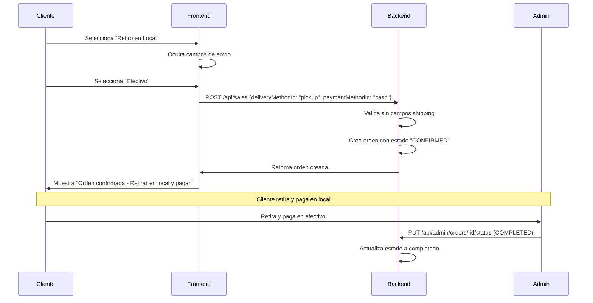
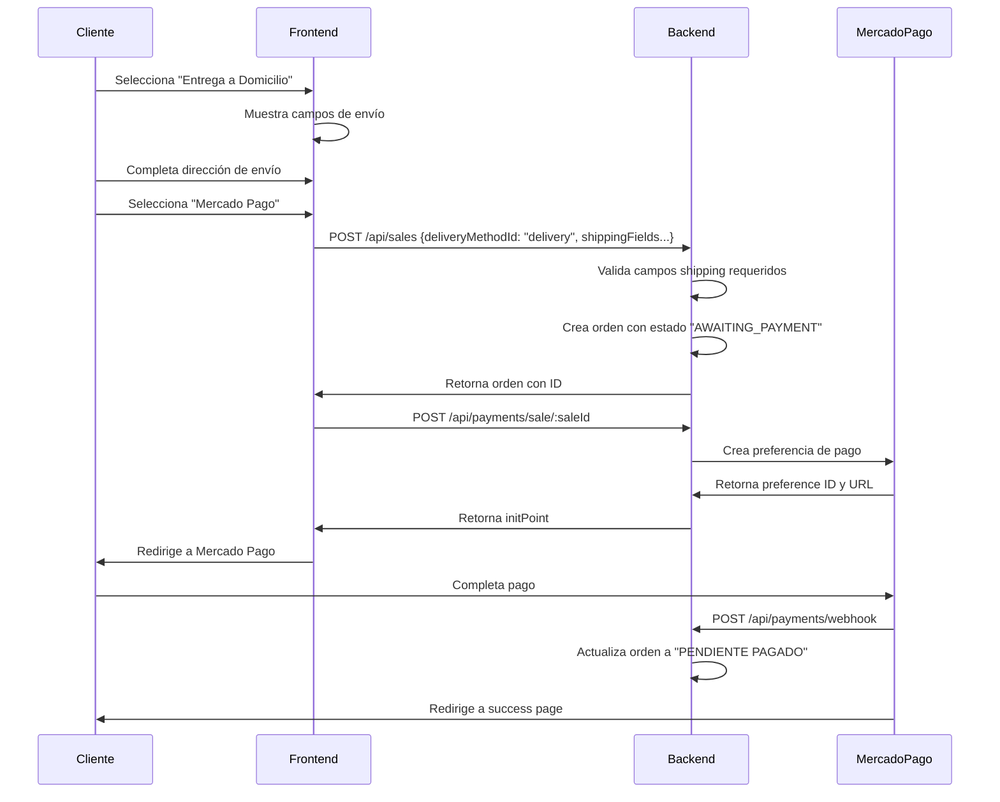
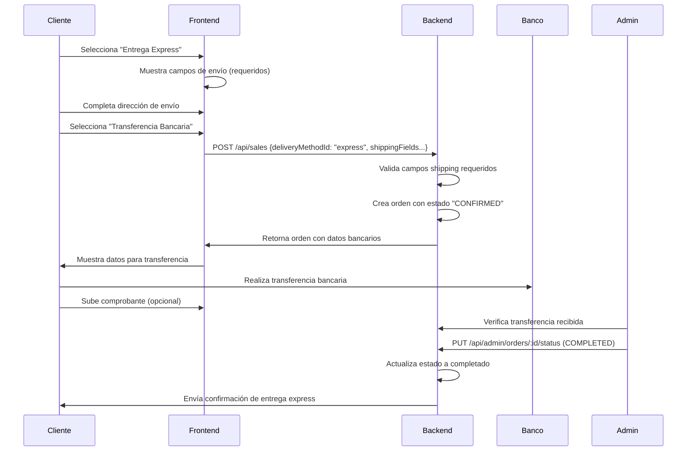
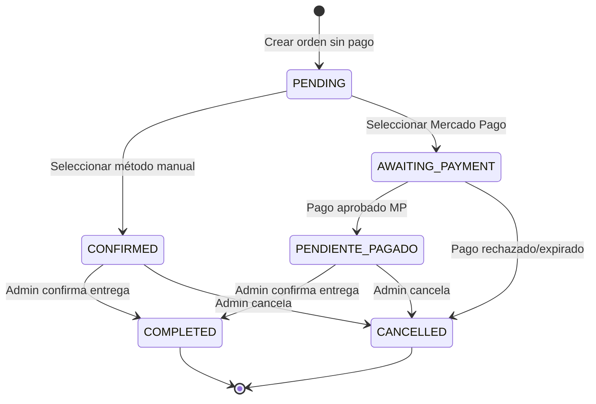
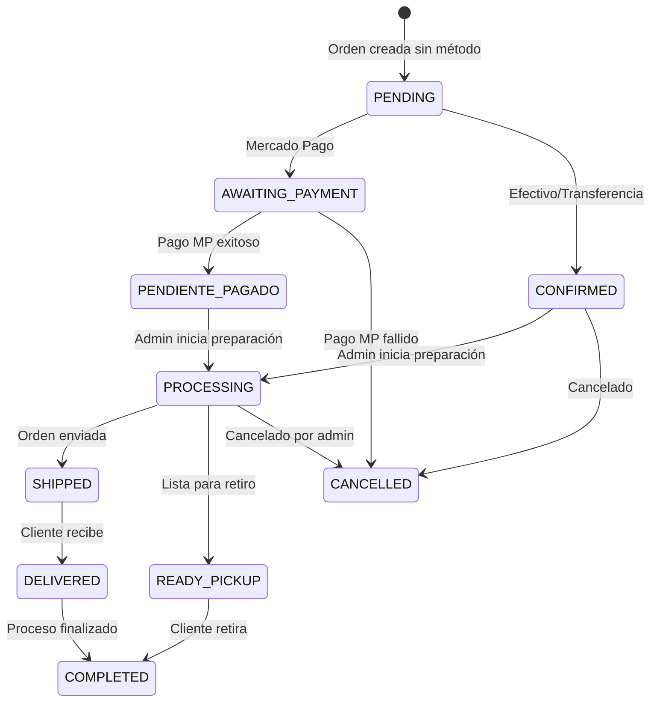
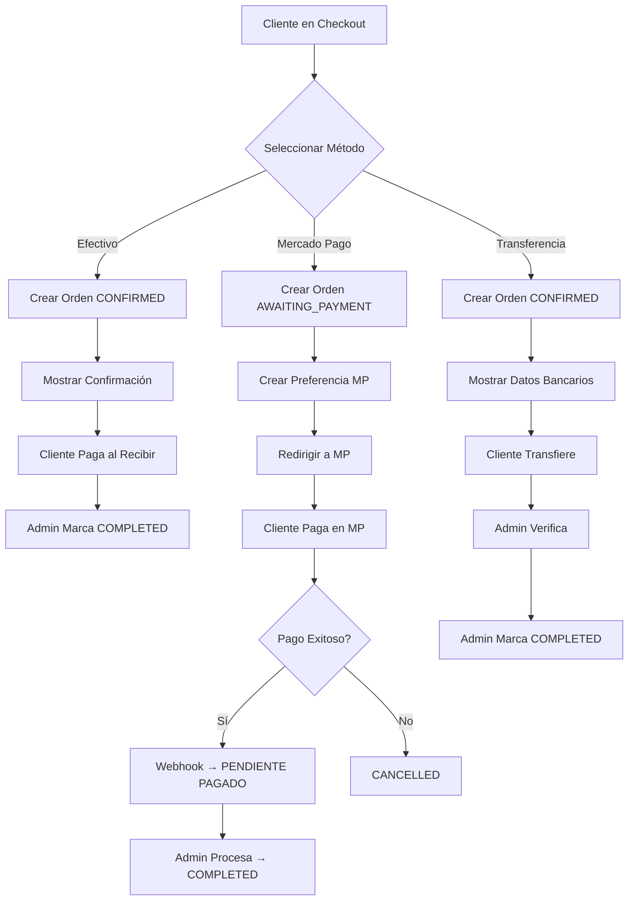
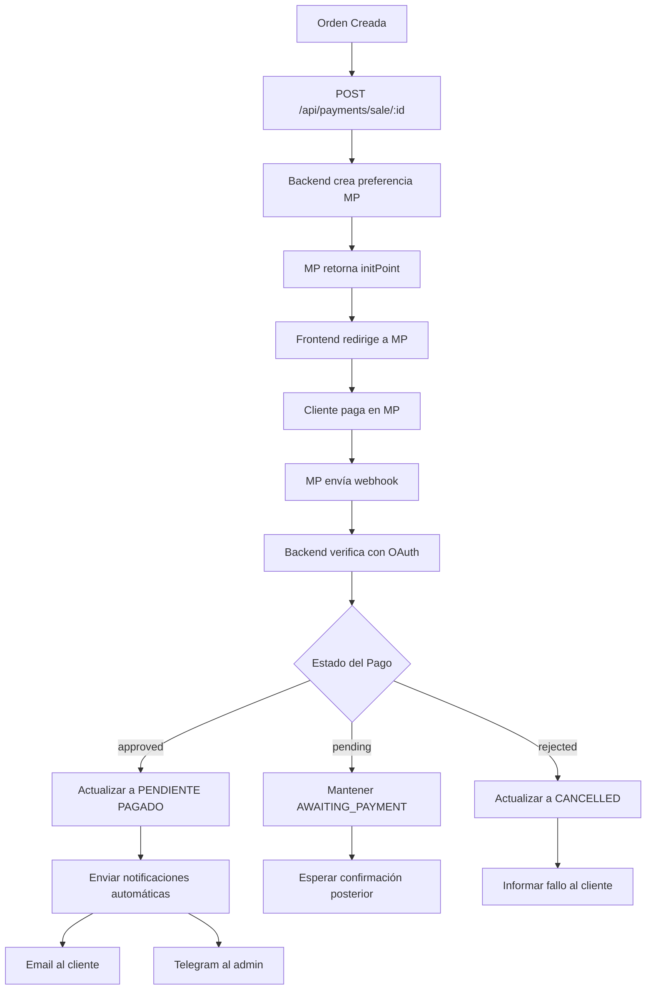

# 💳 Manual de Implementación - Métodos de Pago y Entrega

## 📋 Índice

- [Resumen General](#-resumen-general)
- [Métodos de Pago](#-métodos-de-pago)
- [Métodos de Entrega](#-métodos-de-entrega)
- [Flujos de Checkout](#-flujos-de-checkout)
- [API Endpoints](#-api-endpoints)
- [Implementación Frontend](#-implementación-frontend)
- [Estados de Orden](#-estados-de-orden)
- [Validaciones Condicionales](#-validaciones-condicionales)
- [Casos de Uso](#-casos-de-uso)
- [Troubleshooting](#-troubleshooting)

---

## 🎯 Resumen General

El backend soporta un sistema completo de **Métodos de Pago** y **Métodos de Entrega** integrados, con validaciones condicionales inteligentes.

### 🔗 **Integración Clave:**
- Los métodos de entrega determinan si se requieren campos de envío
- Los métodos de pago determinan el flujo de procesamiento
- La validación es automática y condicional

---

## 💳 Métodos de Pago

Tu backend soporta **4 métodos de pago** configurados:

| Código | Método | Tipo | Confirmación | Estado Inicial |
|--------|--------|------|--------------|----------------|
| `CASH` | Efectivo | Manual | Requerida | `CONFIRMED` |
| `MERCADO_PAGO` | Mercado Pago | Automático | Automática | `AWAITING_PAYMENT` |
| `BANK_TRANSFER` | Transferencia | Manual | Requerida | `CONFIRMED` |
| `PENDING` | Sin Método | N/A | N/A | `PENDING` |

---

## 🚚 Métodos de Entrega

El backend incluye **3 métodos de entrega** configurados:

| Código | Método | Requiere Dirección | Costo | Descripción |
|--------|--------|--------------------|-------|-------------|
| `PICKUP` | Retiro en Local | ❌ **NO** | $0 | Cliente retira en el local |
| `DELIVERY` | Entrega a Domicilio | ✅ **SÍ** | Variable | Envío a dirección del cliente |
| `EXPRESS` | Entrega Express | ✅ **SÍ** | Premium | Envío rápido mismo día |

### 🎯 **Punto Clave para Frontend:**

```javascript
// ⚡ VALIDACIÓN AUTOMÁTICA CONDICIONAL
if (deliveryMethod.requiresAddress) {
  // Mostrar y validar campos de envío
  showShippingFields = true;
  validateShippingFields = true;
} else {
  // Ocultar campos de envío (ej: PICKUP)
  showShippingFields = false;
  validateShippingFields = false;
}
```

---

## ✅ **Métodos Disponibles para Frontend:**

### **Métodos de Pago:**
```json
{
  "cash": {
    "code": "CASH",
    "name": "Efectivo",
    "description": "Pago en efectivo al momento de la entrega",
    "requiresOnlinePayment": false,
    "allowsManualConfirmation": true,
    "flow": "manual"
  },
  "mercadoPago": {
    "code": "MERCADO_PAGO", 
    "name": "Mercado Pago",
    "description": "Pago online con tarjeta de crédito/débito",
    "requiresOnlinePayment": true,
    "allowsManualConfirmation": false,
    "flow": "automatic"
  },
  "bankTransfer": {
    "code": "BANK_TRANSFER",
    "name": "Transferencia Bancaria", 
    "description": "Transferencia bancaria manual",
    "requiresOnlinePayment": false,
    "allowsManualConfirmation": true,
    "flow": "manual"
  }
}
```

### **Métodos de Entrega:**
```json
{
  "pickup": {
    "code": "PICKUP",
    "name": "Retiro en Local",
    "description": "Retiro en nuestro local",
    "requiresAddress": false,
    "cost": 0,
    "estimatedTime": "Inmediato"
  },
  "delivery": {
    "code": "DELIVERY",
    "name": "Entrega a Domicilio", 
    "description": "Envío a tu domicilio",
    "requiresAddress": true,
    "cost": "Variable según zona",
    "estimatedTime": "24-48 horas"
  },
  "express": {
    "code": "EXPRESS",
    "name": "Entrega Express",
    "description": "Envío express mismo día",
    "requiresAddress": true,
    "cost": "Premium",
    "estimatedTime": "2-6 horas"
  }
}
```

---

## 🏗️ Arquitectura General

### 📊 **Flujo General de Checkout Integrado:**

```
� Carrito → 🚚 Método Entrega → 💳 Método Pago → 📝 Crear Orden → �💰 Procesar Pago → ✅ Confirmación
```

### 🔄 **Estados de Orden por Método de Pago:**

| Método | Estado Inicial | Pago Exitoso | Pago Fallido |
|--------|----------------|---------------|--------------|
| **Efectivo** | `CONFIRMED` | `CONFIRMED` → `COMPLETED` | - |
| **Mercado Pago** | `AWAITING_PAYMENT` | `PENDIENTE PAGADO` → `COMPLETED` | `CANCELLED` |
| **Transferencia** | `CONFIRMED` | `CONFIRMED` → `COMPLETED` | - |

---

## ⚡ Validaciones Condicionales

### 🎯 **Validación Automática de Campos de Envío**

El backend valida automáticamente los campos de envío basándose en el método de entrega seleccionado:

```javascript
// ✅ LÓGICA FRONTEND RECOMENDADA:

// 1. Obtener métodos de entrega activos
const deliveryMethods = await fetch('/api/delivery-methods/active');

// 2. Al seleccionar método de entrega
const handleDeliveryMethodChange = (deliveryMethodId) => {
  const selectedMethod = deliveryMethods.find(m => m.id === deliveryMethodId);
  
  if (selectedMethod.requiresAddress) {
    // Mostrar y validar campos de envío
    setShowShippingFields(true);
    setShippingFieldsRequired(true);
  } else {
    // Ocultar campos de envío (ej: PICKUP)
    setShowShippingFields(false);
    setShippingFieldsRequired(false);
    clearShippingFields(); // Limpiar formulario
  }
};

// 3. Al crear la orden
const createOrder = async (orderData) => {
  const payload = {
    items: orderData.items,
    paymentMethodId: orderData.paymentMethodId,
    deliveryMethodId: orderData.deliveryMethodId,
    
    // Campos de envío solo si el método los requiere
    ...(selectedDeliveryMethod.requiresAddress && {
      shippingRecipientName: orderData.shippingRecipientName,
      shippingPhone: orderData.shippingPhone,
      shippingStreetAddress: orderData.shippingStreetAddress,
      shippingNeighborhoodId: orderData.shippingNeighborhoodId,
      // ... otros campos de envío
    }),
    
    // Datos del cliente (para invitados)
    ...(isGuest && {
      customerName: orderData.customerName,
      customerEmail: orderData.customerEmail
    })
  };
  
  return await fetch('/api/sales', {
    method: 'POST',
    headers: { 'Content-Type': 'application/json' },
    body: JSON.stringify(payload)
  });
};
```

### 🔑 **Reglas de Validación por Método de Entrega:**

| Método | requiresAddress | Campos de Envío | Comportamiento Frontend |
|--------|-----------------|-----------------|------------------------|
| **PICKUP** | `false` | ❌ NO requeridos | Ocultar formulario de envío |
| **DELIVERY** | `true` | ✅ SÍ requeridos | Mostrar y validar formulario |
| **EXPRESS** | `true` | ✅ SÍ requeridos | Mostrar y validar formulario |

---

## 🚀 Flujos de Checkout Detallados

### 💰 **1. Flujo con Retiro en Local (PICKUP + CASH)**

#### **Características:**
- ✅ **Sin campos de envío**
- ✅ **Pago en efectivo**
- ✅ **Estado inmediato CONFIRMED**

#### **Flujo Paso a Paso:**



### � **2. Flujo con Entrega a Domicilio (DELIVERY + MERCADO_PAGO)**

#### **Características:**
- ✅ **Con campos de envío requeridos**
- ✅ **Pago online automático**
- ✅ **Validación de dirección**

#### **Flujo Paso a Paso:**



### 💳 **3. Flujo Híbrido (EXPRESS + BANK_TRANSFER)**

#### **Características:**
- ✅ **Entrega express con dirección**
- ✅ **Pago manual por transferencia**
- ✅ **Confirmación admin requerida**



---

## 🛠️ API Endpoints

### 📋 **Endpoints Principales:**

#### **1. Obtener Métodos de Pago Disponibles**

```http
GET /api/payment-methods
```

**Autenticación:** No requerida  
**Descripción:** Obtiene métodos de pago activos para mostrar en el checkout

**Respuesta (200):**
```json
[
  {
    "id": "64a7f8c9b123456789abcdef",
    "code": "CASH",
    "name": "Efectivo",
    "description": "Pago en efectivo al momento de la entrega",
    "isActive": true,
    "requiresOnlinePayment": false,
    "allowsManualConfirmation": true
  },
  {
    "id": "64a7f8c9b123456789abcdeg",
    "code": "MERCADO_PAGO",
    "name": "Mercado Pago",
    "description": "Pago online con tarjeta",
    "isActive": true,
    "requiresOnlinePayment": true,
    "allowsManualConfirmation": false
  }
]
```

#### **2. Obtener Métodos de Entrega Activos**

```http
GET /api/delivery-methods/active
```

**Autenticación:** No requerida  
**Descripción:** Obtiene métodos de entrega activos para mostrar en el checkout

**Respuesta (200):**
```json
[
  {
    "id": "64a7f8c9b123456789abcdeh",
    "name": "Retiro en Local",
    "description": "Retiro en nuestro local",
    "requiresAddress": false,
    "cost": 0,
    "estimatedTime": "Inmediato",
    "isActive": true
  },
  {
    "id": "64a7f8c9b123456789abcdei",
    "name": "Entrega a Domicilio",
    "description": "Envío a tu domicilio", 
    "requiresAddress": true,
    "cost": 150,
    "estimatedTime": "24-48 horas",
    "isActive": true
  }
]
```

#### **3. Crear Orden (Integrado)**

```http
POST /api/sales
```

**Autenticación:** Opcional (Usuario registrado o invitado)  
**Headers:**
```
Authorization: Bearer <token>  // Solo para usuarios registrados
Content-Type: application/json
```

**Body para Usuario Registrado + Retiro:**
```json
{
  "items": [
    {
      "productId": "64a7f8c9b123456789abcdef",
      "quantity": 2,
      "unitPrice": 15000
    }
  ],
  "paymentMethodId": "64a7f8c9b123456789abcdef",
  "deliveryMethodId": "64a7f8c9b123456789abcdeh", // PICKUP
  "notes": "Sin cebolla por favor"
  // ❌ NO incluir campos de shipping para PICKUP
}
```

**Body para Usuario Registrado + Entrega:**
```json
{
  "items": [
    {
      "productId": "64a7f8c9b123456789abcdef",
      "quantity": 2,
      "unitPrice": 15000
    }
  ],
  "paymentMethodId": "64a7f8c9b123456789abcdef",
  "deliveryMethodId": "64a7f8c9b123456789abcdei", // DELIVERY
  
  // ✅ Campos de shipping requeridos para DELIVERY
  "selectedAddressId": "64a7f8c9b123456789abcdef", // Dirección guardada
  // O proporcionar nueva dirección:
  "shippingRecipientName": "Juan Pérez",
  "shippingPhone": "+54911234567",
  "shippingStreetAddress": "Av. Corrientes 1234",
  "shippingNeighborhoodId": "64a7f8c9b123456789abcdef",
  "shippingPostalCode": "1043",
  "shippingAdditionalInfo": "Depto 5B"
}
```

**Body para Invitado + Entrega:**
```json
{
  "items": [
    {
      "productId": "64a7f8c9b123456789abcdef",
      "quantity": 2,
      "unitPrice": 15000
    }
  ],
  "paymentMethodId": "64a7f8c9b123456789abcdef",
  "deliveryMethodId": "64a7f8c9b123456789abcdei", // DELIVERY
  
  // ✅ Datos del cliente invitado (requeridos)
  "customerName": "María García",
  "customerEmail": "maria@email.com",
  
  // ✅ Campos de shipping requeridos para DELIVERY
  "shippingRecipientName": "María García",
  "shippingPhone": "+54911234567",
  "shippingStreetAddress": "Av. Santa Fe 2345",
  "shippingNeighborhoodId": "64a7f8c9b123456789abcdef",
  "shippingPostalCode": "1123"
**Respuesta Exitosa (201):**
```json
{
  "id": "64a7f8c9b123456789abcdef",
  "orderNumber": "ORD-20250106-001", 
  "status": {
    "code": "CONFIRMED", // o "AWAITING_PAYMENT" para Mercado Pago
    "name": "Confirmado"
  },
  "paymentMethod": {
    "id": "64a7f8c9b123456789abcdef",
    "code": "CASH",
    "name": "Efectivo"
  },
  "deliveryMethod": {
    "id": "64a7f8c9b123456789abcdeh", 
    "name": "Retiro en Local",
    "requiresAddress": false
  },
  "customer": {
    "id": "64a7f8c9b123456789abcdef",
    "name": "Juan Pérez",
    "email": "juan@email.com"
  },
  "shippingDetails": {
    // Solo presente si deliveryMethod.requiresAddress = true
    "recipientName": "Juan Pérez",
    "phone": "+54911234567",
    "streetAddress": "Av. Corrientes 123",
    "neighborhood": {
      "id": "64a7f8c9b123456789abcdef",
      "name": "Microcentro"
    }
  },
  "items": [
    {
      "id": "64a7f8c9b123456789abcdef",
      "product": {
        "id": "64a7f8c9b123456789abcdef",
        "name": "Pizza Mozzarella",
        "image": "https://...",
        "unit": "unidad"
      },
      "quantity": 2,
      "unitPrice": 15000,
      "totalPrice": 30000
    }
  ],
  "summary": {
    "subtotal": 30000,
    "tax": 3150,
    "discount": 0,
    "deliveryCost": 0, // Para PICKUP = 0
    "total": 33150
  },
  "createdAt": "2025-01-06T10:30:00Z",
  "estimatedDelivery": "2025-01-06T12:00:00Z"
}
```

#### **4. Procesar Pago con Mercado Pago**

```http
POST /api/payments/sale/:saleId
Authorization: Bearer <jwt-token>
```

**Respuesta (200):**
```json
{
  "success": true,
  "preference": {
    "id": "123456789-abcd-1234-efgh-987654321",
    "init_point": "https://sandbox.mercadopago.com.ar/checkout/v1/redirect?pref_id=123456789-abcd-1234-efgh-987654321",
    "sandbox_init_point": "https://sandbox.mercadopago.com.ar/checkout/v1/redirect?pref_id=123456789-abcd-1234-efgh-987654321"
  },
  "order": {
    "id": "64a7f8c9b123456789abcdef",
    "status": "AWAITING_PAYMENT",
    "total": 33150
  }
}
```

---

## 🎨 Implementación Frontend

### 📱 **Flujo de Checkout Recomendado:**

```javascript
// 1. Componente principal de Checkout
const CheckoutPage = () => {
  const [deliveryMethods, setDeliveryMethods] = useState([]);
  const [paymentMethods, setPaymentMethods] = useState([]);
  const [selectedDelivery, setSelectedDelivery] = useState(null);
  const [selectedPayment, setSelectedPayment] = useState(null);
  const [showShippingForm, setShowShippingForm] = useState(false);

  // Cargar métodos disponibles al inicializar
  useEffect(() => {
    loadAvailableMethods();
  }, []);

  const loadAvailableMethods = async () => {
    try {
      const [deliveryRes, paymentRes] = await Promise.all([
        fetch('/api/delivery-methods/active'),
        fetch('/api/payment-methods')
      ]);
      
      setDeliveryMethods(await deliveryRes.json());
      setPaymentMethods(await paymentRes.json());
    } catch (error) {
      console.error('Error cargando métodos:', error);
    }
  };

  // Manejar selección de método de entrega
  const handleDeliveryChange = (deliveryMethodId) => {
    const method = deliveryMethods.find(m => m.id === deliveryMethodId);
    setSelectedDelivery(method);
    
    // ⚡ LÓGICA CLAVE: Mostrar/ocultar campos de envío
    setShowShippingForm(method?.requiresAddress || false);
    
    if (!method?.requiresAddress) {
      // Limpiar campos de envío si no son necesarios
      clearShippingFields();
    }
  };

  // Crear orden final
  const createOrder = async (formData) => {
    const payload = {
      items: cartItems,
      paymentMethodId: selectedPayment.id,
      deliveryMethodId: selectedDelivery.id,
      
      // Incluir campos de envío solo si el método los requiere
      ...(selectedDelivery.requiresAddress && {
        shippingRecipientName: formData.recipientName,
        shippingPhone: formData.phone,
        shippingStreetAddress: formData.address,
        shippingNeighborhoodId: formData.neighborhoodId,
        shippingPostalCode: formData.postalCode,
        shippingAdditionalInfo: formData.additionalInfo
      }),
      
      // Para usuarios invitados
      ...(isGuest && {
        customerName: formData.customerName,
        customerEmail: formData.customerEmail
      })
    };

    try {
      const response = await fetch('/api/sales', {
        method: 'POST',
        headers: {
          'Content-Type': 'application/json',
          ...(isLoggedIn && { 'Authorization': `Bearer ${token}` })
        },
        body: JSON.stringify(payload)
      });

      const order = await response.json();
      
      if (selectedPayment.code === 'MERCADO_PAGO') {
        // Procesar pago online
        return processOnlinePayment(order.id);
      } else {
        // Pago manual (efectivo, transferencia)
        return showOrderConfirmation(order);
      }
    } catch (error) {
      handleOrderError(error);
    }
  };

  return (
    <div className="checkout-container">
      {/* Selector de método de entrega */}
      <DeliveryMethodSelector 
        methods={deliveryMethods}
        selected={selectedDelivery}
        onChange={handleDeliveryChange}
      />
      
      {/* Formulario de envío condicional */}
      {showShippingForm && (
        <ShippingForm 
          required={selectedDelivery?.requiresAddress}
          onSubmit={(data) => setShippingData(data)}
        />
      )}
      
      {/* Selector de método de pago */}
      <PaymentMethodSelector
        methods={paymentMethods}
        selected={selectedPayment}
        onChange={setSelectedPayment}
      />
      
      {/* Botón de finalizar compra */}
      <CheckoutButton 
        onClick={createOrder}
        disabled={!selectedDelivery || !selectedPayment}
      />
    </div>
  );
};
```

### 🔍 **Validaciones Frontend:**

```javascript
// Función de validación condicional
const validateCheckoutForm = (formData, deliveryMethod, paymentMethod) => {
  const errors = {};

  // Validar método de entrega seleccionado
  if (!deliveryMethod) {
    errors.delivery = 'Selecciona un método de entrega';
  }

  // Validar método de pago seleccionado
  if (!paymentMethod) {
    errors.payment = 'Selecciona un método de pago';
  }

  // Validar campos de envío solo si son requeridos
  if (deliveryMethod?.requiresAddress) {
    if (!formData.recipientName) {
      errors.recipientName = 'Nombre del destinatario requerido';
    }
    if (!formData.phone) {
      errors.phone = 'Teléfono requerido';
    }
    if (!formData.address) {
      errors.address = 'Dirección requerida';
    }
    if (!formData.neighborhoodId) {
      errors.neighborhood = 'Barrio requerido';
    }
  }

  // Validar datos del cliente invitado
  if (isGuest) {
    if (!formData.customerName) {
      errors.customerName = 'Nombre requerido';
    }
    if (!formData.customerEmail) {
      errors.customerEmail = 'Email requerido';
    }
  }

  return {
    isValid: Object.keys(errors).length === 0,
    errors
  };
};
```
```

#### **3. Crear Preferencia de Mercado Pago**

```http
POST /api/payments/sale/:saleId
Authorization: Bearer <jwt-token>
```

**Parámetros:**
- `saleId`: ID de la orden creada

**Respuesta (200):**
```json
{
  "preferenceId": "123456789-abcd-efgh-1234-567890abcdef",
  "initPoint": "https://www.mercadopago.com.ar/checkout/v1/redirect?pref_id=123456789",
  "sandboxInitPoint": "https://sandbox.mercadopago.com.ar/checkout/v1/redirect?pref_id=123456789"
}
```

#### **4. Verificar Estado de Pago**

```http
GET /api/payments/status/sale/:saleId
Authorization: Bearer <jwt-token>
```

**Respuesta (200):**
```json
{
  "success": true,
  "payment": {
    "id": "payment_id",
    "status": "approved", // approved, pending, rejected
    "amount": 3015.00,
    "lastVerified": "2025-01-06T10:35:00Z",
    "saleId": "64a7f8c9b123456789abcdef"
  }
}
```

#### **5. Webhook Mercado Pago (Automático)**

```http
POST /api/payments/webhook
Content-Type: application/json
```

**Body (MP envía):**
```json
{
  "id": 12345,
  "live_mode": true,
  "type": "payment",
  "date_created": "2025-01-06T10:35:00.000-04:00",
  "application_id": 123456789,
  "user_id": 44444444,
  "version": 1,
  "api_version": "v1",
  "action": "payment.created",
  "data": {
    "id": "123456789" // payment_id
  }
}
```

---

## 📊 Estados de Orden

### 🔄 **Estados por Método de Pago:**

| Estado | Código | Descripción | Métodos Asociados |
|--------|--------|-------------|-------------------|
| **Pendiente** | `PENDING` | Orden creada sin método de pago | Sin método |
| **Confirmado** | `CONFIRMED` | Orden confirmada, esperando entrega | Efectivo, Transferencia |
| **Esperando Pago** | `AWAITING_PAYMENT` | Esperando pago online | Mercado Pago |
| **Pendiente Pagado** | `PENDIENTE PAGADO` | Pago recibido, procesando | Mercado Pago |
| **Completado** | `COMPLETED` | Orden finalizada y entregada | Todos |
| **Cancelado** | `CANCELLED` | Orden cancelada | Todos |

### ⚡ **Transiciones de Estado:**



---

## � Casos de Uso Específicos

### 🛍️ **Caso 1: Cliente Registrado - Retiro + Efectivo**

```javascript
// Frontend - Flujo simple sin shipping
const orderData = {
  items: [
    { productId: "64a7f8c9...", quantity: 2, unitPrice: 15000 }
  ],
  deliveryMethodId: "pickup_method_id", // requiresAddress: false
  paymentMethodId: "cash_method_id"
  // ❌ NO incluir campos de shipping
};

const response = await fetch('/api/sales', {
  method: 'POST',
  headers: {
    'Authorization': `Bearer ${token}`,
    'Content-Type': 'application/json'
  },
  body: JSON.stringify(orderData)
});

// Estado inmediato: CONFIRMED
// Cliente retira y paga en local
```

### 🏠 **Caso 2: Invitado - Entrega + Mercado Pago**

```javascript
// Frontend - Flujo completo con shipping
const orderData = {
  items: [
    { productId: "64a7f8c9...", quantity: 1, unitPrice: 25000 }
  ],
  deliveryMethodId: "delivery_method_id", // requiresAddress: true
  paymentMethodId: "mercado_pago_method_id",
  
  // ✅ Datos del cliente invitado
  customerName: "Ana Martínez",
  customerEmail: "ana@email.com",
  
  // ✅ Campos de shipping requeridos
  shippingRecipientName: "Ana Martínez",
  shippingPhone: "+54911234567",
  shippingStreetAddress: "Av. Libertador 1500",
  shippingNeighborhoodId: "palermo_id",
  shippingPostalCode: "1425"
};

// 1. Crear orden
const orderResponse = await fetch('/api/sales', {
  method: 'POST',
  headers: { 'Content-Type': 'application/json' },
  body: JSON.stringify(orderData)
});

const order = await orderResponse.json();
// Estado: AWAITING_PAYMENT

// 2. Procesar pago
const paymentResponse = await fetch(`/api/payments/sale/${order.id}`, {
  method: 'POST'
});

const payment = await paymentResponse.json();
// Redirigir a: payment.preference.init_point

// 3. Usuario paga en Mercado Pago
// 4. Webhook automático actualiza a: PENDIENTE PAGADO
// 5. Admin confirma entrega: COMPLETED
```

### 🚀 **Caso 3: Cliente VIP - Express + Transferencia**

```javascript
// Frontend - Entrega premium con pago manual
const orderData = {
  items: [
    { productId: "64a7f8c9...", quantity: 3, unitPrice: 50000 }
  ],
  deliveryMethodId: "express_method_id", // requiresAddress: true
  paymentMethodId: "bank_transfer_method_id",
  
  // ✅ Dirección guardada (usuario registrado)
  selectedAddressId: "saved_address_id"
  // ❌ NO incluir campos de shipping si usa dirección guardada
};

const response = await fetch('/api/sales', {
  method: 'POST',
  headers: {
    'Authorization': `Bearer ${vipToken}`,
    'Content-Type': 'application/json'
  },
  body: JSON.stringify(orderData)
});

// Estado inmediato: CONFIRMED
// Frontend muestra datos bancarios para transferencia
// Cliente transfiere fuera del sistema
// Admin verifica y confirma: COMPLETED
```

---

## 🎯 Mejores Prácticas Frontend

### ⚡ **1. Carga Asíncrona de Métodos**

```javascript
// Hook personalizado para métodos de pago y entrega
const useCheckoutMethods = () => {
  const [methods, setMethods] = useState({
    payment: [],
    delivery: [],
    loading: true,
    error: null
  });

  useEffect(() => {
    loadMethods();
  }, []);

  const loadMethods = async () => {
    try {
      setMethods(prev => ({ ...prev, loading: true }));
      
      const [paymentRes, deliveryRes] = await Promise.all([
        fetch('/api/payment-methods'),
        fetch('/api/delivery-methods/active')
      ]);

      if (!paymentRes.ok || !deliveryRes.ok) {
        throw new Error('Error cargando métodos');
      }

      const [paymentData, deliveryData] = await Promise.all([
        paymentRes.json(),
        deliveryRes.json()
      ]);

      setMethods({
        payment: paymentData,
        delivery: deliveryData,
        loading: false,
        error: null
      });
    } catch (error) {
      setMethods(prev => ({
        ...prev,
        loading: false,
        error: error.message
      }));
    }
  };

  return { methods, refetch: loadMethods };
};
```

### 🔄 **2. Estado de Orden en Tiempo Real**

```javascript
// Hook para tracking de orden
const useOrderTracking = (orderId) => {
  const [order, setOrder] = useState(null);
  const [loading, setLoading] = useState(true);

  useEffect(() => {
    if (!orderId) return;

    const fetchOrder = async () => {
      try {
        const response = await fetch(`/api/sales/${orderId}`);
        const orderData = await response.json();
        setOrder(orderData);
      } catch (error) {
        console.error('Error fetching order:', error);
      } finally {
        setLoading(false);
      }
    };

    fetchOrder();

    // Polling cada 30 segundos para órdenes pendientes de pago
    const interval = setInterval(fetchOrder, 30000);
    
    return () => clearInterval(interval);
  }, [orderId]);

  return { order, loading, refetch: fetchOrder };
};
```

### 🎨 **3. Componente de Estado Visual**

```jsx
// Componente para mostrar estado de orden
const OrderStatusBadge = ({ status, paymentMethod }) => {
  const getStatusConfig = () => {
    switch (status.code) {
      case 'CONFIRMED':
        return {
          color: 'blue',
          icon: '✅',
          message: paymentMethod.code === 'CASH' 
            ? 'Confirma - Pagar al recibir'
            : 'Confirmado - Pendiente transferencia'
        };
      case 'AWAITING_PAYMENT':
        return {
          color: 'yellow',
          icon: '⏳',
          message: 'Esperando pago online'
        };
      case 'PENDIENTE PAGADO':
        return {
          color: 'green',
          icon: '💰',
          message: 'Pago recibido - Procesando entrega'
        };
      case 'COMPLETED':
        return {
          color: 'green',
          icon: '🎉',
          message: 'Orden completada'
        };
      case 'CANCELLED':
        return {
          color: 'red',
          icon: '❌',
          message: 'Orden cancelada'
        };
      default:
        return {
          color: 'gray',
          icon: '❓',
          message: 'Estado desconocido'
        };
    }
  };

  const config = getStatusConfig();

  return (
    <div className={`status-badge status-${config.color}`}>
      <span className="status-icon">{config.icon}</span>
      <span className="status-text">{config.message}</span>
    </div>
  );
};
```
    switch (this.selectedPaymentMethod.code) {
      case 'CASH':
        return 'Confirmar Pedido - Pagar al Recibir';
---

## 🔧 Troubleshooting

### ❌ **Errores Comunes y Soluciones**

#### **1. Error: "Campos de envío requeridos para este método de entrega"**

```json
{
  "error": "Nombre del destinatario requerido para nueva dirección"
}
```

**Causa:** Seleccionaste un método de entrega que requiere dirección (`requiresAddress: true`) pero no enviaste los campos de shipping.

**Solución Frontend:**
```javascript
// ✅ Verificar requiresAddress antes de enviar
if (selectedDeliveryMethod.requiresAddress) {
  payload.shippingRecipientName = formData.recipientName;
  payload.shippingPhone = formData.phone;
  payload.shippingStreetAddress = formData.address;
  payload.shippingNeighborhoodId = formData.neighborhoodId;
}
```

#### **2. Error: "Usuario registrado no puede seleccionar direcciones guardadas"**

```json
{
  "error": "Invitados no pueden seleccionar direcciones guardadas"
}
```

**Causa:** Usuario invitado (sin token) intentó usar `selectedAddressId`.

**Solución Frontend:**
```javascript
// ✅ Solo para usuarios registrados
if (isLoggedIn) {
  payload.selectedAddressId = savedAddressId;
} else {
  // Para invitados: campos manuales
  payload.shippingRecipientName = formData.recipientName;
  payload.customerName = formData.customerName;
  payload.customerEmail = formData.customerEmail;
}
```

#### **3. Error: "Método de entrega no encontrado"**

```json
{
  "error": "Método de entrega no encontrado"
}
```

**Causa:** El `deliveryMethodId` no existe o está inactivo.

**Solución:**
```javascript
// ✅ Usar solo métodos activos del endpoint
const activeMethods = await fetch('/api/delivery-methods/active');
// No hardcodear IDs, usar los devueltos por la API
```

#### **4. Error: "Pago de Mercado Pago falló"**

**Causa:** Error en la integración con Mercado Pago.

**Solución:**
1. Verificar que el `ACCESS_TOKEN` esté configurado
2. Verificar que la orden esté en estado `AWAITING_PAYMENT`
3. Revisar logs del webhook `/api/payments/webhook`

#### **5. Error: "Token JWT inválido"**

**Causa:** Token expirado o malformado.

**Solución Frontend:**
```javascript
// ✅ Manejar tokens expirados
try {
  const response = await apiCall();
} catch (error) {
  if (error.status === 401) {
    // Token expirado, renovar o redirigir a login
    authService.refreshToken();
  }
}
```

### 🎯 **Validaciones Frontend Preventivas**

```javascript
// Validaciones antes de enviar orden
const validateOrder = (orderData) => {
  const errors = [];

  // 1. Verificar items
  if (!orderData.items || orderData.items.length === 0) {
    errors.push('Carrito vacío');
  }

  // 2. Verificar método de entrega
  if (!orderData.deliveryMethodId) {
    errors.push('Selecciona método de entrega');
  }

  // 3. Verificar método de pago
  if (!orderData.paymentMethodId) {
    errors.push('Selecciona método de pago');
  }

  // 4. Verificar campos condicionales
  const deliveryMethod = deliveryMethods.find(m => m.id === orderData.deliveryMethodId);
  if (deliveryMethod?.requiresAddress) {
    if (!orderData.shippingRecipientName) {
      errors.push('Nombre del destinatario requerido');
    }
    if (!orderData.shippingStreetAddress) {
      errors.push('Dirección requerida');
    }
    if (!orderData.shippingNeighborhoodId) {
      errors.push('Barrio requerido');
    }
  }

  // 5. Verificar datos de invitado
  if (!isLoggedIn) {
    if (!orderData.customerName) {
      errors.push('Nombre requerido para invitados');
    }
    if (!orderData.customerEmail) {
      errors.push('Email requerido para invitados');
    }
  }

  return {
    isValid: errors.length === 0,
    errors
  };
};
```

### 📊 **Logs y Monitoreo**

```javascript
// Sistema de logging frontend
const logCheckoutEvent = (event, data) => {
  console.log(`[CHECKOUT] ${event}:`, data);
  
  // Enviar a analytics (opcional)
  analytics.track(`checkout_${event}`, {
    timestamp: new Date().toISOString(),
    userType: isLoggedIn ? 'registered' : 'guest',
    ...data
  });
};

// Uso en flujo de checkout
logCheckoutEvent('delivery_method_selected', {
  methodId: selectedDelivery.id,
  requiresAddress: selectedDelivery.requiresAddress
});

logCheckoutEvent('payment_method_selected', {
  methodCode: selectedPayment.code,
  requiresOnlinePayment: selectedPayment.requiresOnlinePayment
});

logCheckoutEvent('order_created', {
  orderId: order.id,
  total: order.total,
  status: order.status.code
});
```

---

## 📚 Resumen Final

### ✅ **Integración Completa Implementada:**

1. **🚚 Métodos de Entrega**
   - PICKUP (sin dirección requerida)
   - DELIVERY (con dirección requerida)
   - EXPRESS (con dirección requerida)

2. **💳 Métodos de Pago**
   - CASH (manual, inmediato)
   - MERCADO_PAGO (automático, webhook)
   - BANK_TRANSFER (manual, verificación admin)

3. **⚡ Validaciones Condicionales**
   - Campos de shipping solo si `requiresAddress = true`
   - Datos de cliente para invitados
   - Estados automáticos según método de pago

4. **🔧 API Endpoints**
   - `/api/delivery-methods/active` - Métodos de entrega
   - `/api/payment-methods` - Métodos de pago
   - `/api/sales` - Crear orden integrada
   - `/api/payments/sale/:saleId` - Procesar Mercado Pago

### 🎯 **Para el Equipo Frontend:**

```javascript
// ⚡ FLUJO RECOMENDADO:
// 1. Cargar métodos disponibles
// 2. Usuario selecciona entrega → mostrar/ocultar shipping
// 3. Usuario selecciona pago → preparar flujo
// 4. Crear orden con validación condicional
// 5. Procesar pago según método seleccionado
// 6. Mostrar confirmación apropiada
```

El sistema está **completamente funcional** y listo para implementación frontend con **validaciones automáticas inteligentes** 🚀
      specialInstructions: this.specialInstructions || undefined
    };
  }
}
```

### 🔄 **2. Manejo de Callbacks de Mercado Pago**

```typescript
// payment-success.component.ts
@Component({
  selector: 'app-payment-success',
  template: `
    <div class="payment-result">
      <div *ngIf="loading" class="loading">
        <div class="spinner"></div>
        <p>Verificando tu pago...</p>
      </div>

      <div *ngIf="!loading && paymentStatus" [ngSwitch]="paymentStatus.status">
        <!-- Pago Aprobado -->
        <div *ngSwitchCase="'approved'" class="success">
          <i class="icon-success">✅</i>
          <h2>¡Pago Confirmado!</h2>
          <p>Tu pedido #{{ orderNumber }} ha sido procesado exitosamente.</p>
          <button (click)="goToOrderDetails()">Ver Detalles del Pedido</button>
        </div>

        <!-- Pago Pendiente -->
        <div *ngSwitchCase="'pending'" class="pending">
          <i class="icon-pending">⏳</i>
          <h2>Pago en Proceso</h2>
          <p>Tu pago está siendo procesado. Te notificaremos cuando se confirme.</p>
        </div>

        <!-- Pago Rechazado -->
        <div *ngSwitchCase="'rejected'" class="error">
          <i class="icon-error">❌</i>
          <h2>Pago Rechazado</h2>
          <p>No pudimos procesar tu pago. Intenta nuevamente.</p>
          <button (click)="retryPayment()">Reintentar Pago</button>
        </div>
      </div>
    </div>
  `
})
export class PaymentSuccessComponent implements OnInit {
  loading = true;
  paymentStatus: any = null;
  orderNumber: string = '';

  constructor(
    private route: ActivatedRoute,
    private router: Router,
    private paymentService: PaymentService
  ) {}

  async ngOnInit() {
    const paymentId = this.route.snapshot.queryParams['payment_id'];
    const externalReference = this.route.snapshot.queryParams['external_reference'];

    if (externalReference) {
      // Extraer saleId del external_reference (formato: "sale-{saleId}")
      const saleId = externalReference.replace('sale-', '');
      await this.verifyPaymentStatus(saleId);
    }
  }

  private async verifyPaymentStatus(saleId: string) {
    try {
      const response = await fetch(`/api/payments/status/sale/${saleId}`, {
        headers: {
          'Authorization': `Bearer ${this.authService.getToken()}`
        }
      });

      const result = await response.json();
      
      if (result.success) {
        this.paymentStatus = result.payment;
        this.orderNumber = saleId; // O buscar el order number real
      } else {
        this.paymentStatus = { status: 'error', message: result.message };
      }
    } catch (error) {
      console.error('Error verifying payment:', error);
      this.paymentStatus = { status: 'error', message: 'Error verificando el pago' };
    } finally {
      this.loading = false;
    }
  }

  goToOrderDetails() {
    this.router.navigate(['/orders', this.paymentStatus.saleId]);
  }

  retryPayment() {
    this.router.navigate(['/checkout']);
  }
}
```

### 📱 **3. Servicio de Pagos**

```typescript
// payment.service.ts
@Injectable({
  providedIn: 'root'
})
export class PaymentService {
  constructor(private http: HttpClient) {}

  getPaymentMethods(): Observable<PaymentMethod[]> {
    return this.http.get<PaymentMethod[]>('/api/payment-methods');
  }

  createOrder(orderData: any): Observable<any> {
    return this.http.post('/api/orders', orderData);
  }

  createMercadoPagoPreference(orderId: string): Observable<any> {
    return this.http.post(`/api/payments/sale/${orderId}`, {});
  }

  verifyPaymentStatus(saleId: string): Observable<any> {
    return this.http.get(`/api/payments/status/sale/${saleId}`);
  }

  // Polling para verificar estado de pago
  pollPaymentStatus(saleId: string, maxAttempts = 10): Observable<any> {
    return interval(3000).pipe(
      take(maxAttempts),
      switchMap(() => this.verifyPaymentStatus(saleId)),
      filter(result => result.success && result.payment.status !== 'pending'),
      take(1)
    );
  }
}
```

---

## 📊 Estados de Orden

### 🔄 **Ciclo de Vida de Estados:**



### 📋 **Estados Disponibles:**

| Código | Nombre | Descripción | Color | Orden |
|--------|--------|-------------|-------|-------|
| `PENDING` | Pendiente | Orden creada, esperando procesamiento | `#ffc107` | 1 |
| `AWAITING_PAYMENT` | Esperando Pago | Esperando confirmación de Mercado Pago | `#17a2b8` | 2 |
| `PENDIENTE PAGADO` | Pendiente Pagado | Pago confirmado, pendiente de procesamiento | `#28a745` | 3 |
| `CONFIRMED` | Confirmado | Orden confirmada (efectivo/transferencia) | `#007bff` | 4 |
| `PROCESSING` | En Preparación | Orden siendo preparada | `#6f42c1` | 5 |
| `SHIPPED` | Enviado | Orden en camino al cliente | `#fd7e14` | 6 |
| `READY_PICKUP` | Listo para Retiro | Orden lista en el local | `#20c997` | 7 |
| `DELIVERED` | Entregado | Orden entregada al cliente | `#198754` | 8 |
| `COMPLETED` | Completado | Proceso totalmente finalizado | `#0d6efd` | 9 |
| `CANCELLED` | Cancelado | Orden cancelada | `#dc3545` | 10 |

---

## 📊 Diagramas de Flujo

### 🔀 **Decisión de Método de Pago:**



### 💳 **Flujo Específico Mercado Pago:**



---

## 🎯 Casos de Uso

### 💼 **Caso 1: Pedido con Efectivo**

**Escenario:** Cliente quiere pagar en efectivo al recibir el pedido.

**Flujo Frontend:**
1. Cliente llena carrito
2. Va a checkout
3. Selecciona "Efectivo"
4. Completa datos de envío
5. Confirma pedido
6. Ve mensaje: "Pedido confirmado. Prepara el dinero exacto para la entrega."

**Llamadas API:**
```javascript
// 1. Crear orden
const response = await fetch('/api/orders', {
  method: 'POST',
  body: JSON.stringify({
    items: [...],
    paymentMethodId: "cash_method_id",
    // ... otros datos
  })
});

// 2. No se necesitan más llamadas
// La orden queda en estado CONFIRMED
```

### 💳 **Caso 2: Pedido con Mercado Pago**

**Escenario:** Cliente quiere pagar con tarjeta usando Mercado Pago.

**Flujo Frontend:**
1. Cliente llena carrito
2. Va a checkout  
3. Selecciona "Mercado Pago"
4. Completa datos
5. Confirma pedido
6. Es redirigido a MP
7. Paga en MP
8. Regresa al sitio con confirmación

**Llamadas API:**
```javascript
// 1. Crear orden
const orderResponse = await fetch('/api/orders', {
  method: 'POST',
  body: JSON.stringify({
    items: [...],
    paymentMethodId: "mercado_pago_method_id",
    // ... otros datos
  })
});

// 2. Crear preferencia de pago
const paymentResponse = await fetch(`/api/payments/sale/${order.id}`, {
  method: 'POST'
});

// 3. Redirigir
window.location.href = paymentResponse.initPoint;

// 4. Al regresar, verificar estado
const statusResponse = await fetch(`/api/payments/status/sale/${order.id}`);
```

### 🏦 **Caso 3: Pedido con Transferencia**

**Escenario:** Cliente prefiere transferir dinero por separado.

**Flujo Frontend:**
1. Cliente llena carrito
2. Va a checkout
3. Selecciona "Transferencia Bancaria"
4. Confirma pedido
5. Ve datos bancarios para transferir
6. Sube comprobante (opcional)

**Llamadas API:**
```javascript
// 1. Crear orden
const response = await fetch('/api/orders', {
  method: 'POST',
  body: JSON.stringify({
    items: [...],
    paymentMethodId: "transfer_method_id",
    // ... otros datos
  })
});

// 2. Obtener datos bancarios (si están separados)
const bankData = await fetch('/api/bank-details');

// 3. Subir comprobante (opcional)
const formData = new FormData();
formData.append('receipt', file);
formData.append('orderId', order.id);

await fetch('/api/upload-receipt', {
  method: 'POST',
  body: formData
});
```

---

## 🛡️ Seguridad y Validaciones

### 🔐 **Validaciones Backend:**

1. **Validación de Método de Pago:**
   ```typescript
   // Verificar que el método existe y está activo
   const paymentMethod = await PaymentMethodRepository.findById(paymentMethodId);
   if (!paymentMethod || !paymentMethod.isActive) {
     throw new Error('Método de pago no válido');
   }
   ```

2. **Validación de Mercado Pago:**
   ```typescript
   // Verificar webhook con OAuth
   const mpPayment = await mercadoPagoAdapter.getPayment(paymentId);
   if (mpPayment.external_reference !== expectedReference) {
     throw new Error('Referencia externa no coincide');
   }
   ```

3. **Validación de Estados:**
   ```typescript
   // Solo permitir transiciones válidas
   const canTransition = await orderStatusRepository.canTransitionTo(
     currentStatus.id, 
     newStatus.id
   );
   ```

### 🔒 **Autenticación Requerida:**

| Endpoint | Autenticación | Rol Requerido |
|----------|---------------|---------------|
| `GET /api/payment-methods` | ❌ No | - |
| `POST /api/orders` | ✅ Sí | USER |
| `POST /api/payments/sale/:id` | ✅ Sí | USER |
| `GET /api/payments/status/sale/:id` | ✅ Sí | USER |
| `POST /api/payments/webhook` | ❌ No | - (MP) |
| `PUT /api/admin/orders/:id/status` | ✅ Sí | ADMIN |

---

## 🚨 Troubleshooting

### ❗ **Errores Comunes:**

#### **1. Error: "Método de pago no válido"**
**Causa:** El `paymentMethodId` enviado no existe o está inactivo.
**Solución:**
```javascript
// Siempre obtener métodos actualizados antes del checkout
const methods = await fetch('/api/payment-methods').then(r => r.json());
const validMethodId = methods.find(m => m.code === 'CASH')?.id;
```

#### **2. Error: "Preferencia de MP no creada"**
**Causa:** La orden no tiene el estado correcto o faltan datos.
**Solución:**
```javascript
// Verificar que la orden existe y está en estado correcto
const order = await fetch(`/api/orders/${orderId}`).then(r => r.json());
if (order.status.code !== 'AWAITING_PAYMENT') {
  console.error('Orden no está esperando pago');
}
```

#### **3. Error: "Webhook no procesa pago"**
**Causa:** El external_reference no coincide o el pago ya fue procesado.
**Solución:**
```javascript
// Verificar logs del webhook
const logs = await fetch(`/api/admin/webhooks/logs`).then(r => r.json());
// Buscar el payment_id específico
```

### 🔍 **Debugging:**

#### **Verificar Estado de Orden:**
```javascript
const orderStatus = await fetch(`/api/orders/${orderId}/status`);
console.log('Estado actual:', orderStatus.code);
```

#### **Verificar Logs de Webhook:**
```javascript
const webhookLogs = await fetch(`/api/admin/webhooks/payment/${paymentId}`);
console.log('Procesamiento webhook:', webhookLogs);
```

#### **Forzar Verificación Manual:**
```javascript
// Para admins - verificar pago manualmente
const verification = await fetch(`/api/payments/manual-verify/${orderId}`, {
  method: 'POST'
});
```

---

## 📋 Checklist de Implementación

### ✅ **Backend (Ya implementado):**
- [x] Métodos de pago configurados
- [x] Estados de orden definidos
- [x] Endpoints de creación de orden
- [x] Integración con Mercado Pago
- [x] Webhooks automáticos
- [x] Verificación OAuth
- [x] Sistema de notificaciones

### 🔲 **Frontend (Por implementar):**
- [ ] Componente de selección de método de pago
- [ ] Integración con API de órdenes
- [ ] Flujo de Mercado Pago
- [ ] Páginas de confirmación
- [ ] Manejo de callbacks
- [ ] Verificación de estado
- [ ] UI para diferentes métodos
- [ ] Manejo de errores
- [ ] Notificaciones visuales
- [ ] Polling de estado

### 📱 **UX Recomendada:**
- [ ] Iconos claros para cada método
- [ ] Indicadores de "online" vs "manual"
- [ ] Estimación de tiempo de procesamiento
- [ ] Links de ayuda/soporte
- [ ] Confirmaciones visuales
- [ ] Estados de carga
- [ ] Manejo de errores amigable
- [ ] Información clara de siguiente paso

---

## 🎯 Conclusión

Tu backend tiene una **implementación completa y robusta** para múltiples métodos de pago:

- ✅ **Efectivo:** Flujo simple y directo
- ✅ **Mercado Pago:** Integración completa con webhooks y OAuth
- ✅ **Transferencia:** Opción manual para casos específicos
- ✅ **Flexibilidad:** Fácil agregar nuevos métodos

El frontend solo necesita implementar la UI y conectar con los endpoints ya disponibles. La arquitectura permite escalabilidad y mantenimiento sencillo.

---

**📞 Soporte:** Para dudas específicas de implementación, consultar la documentación de cada endpoint o revisar los logs del sistema.
