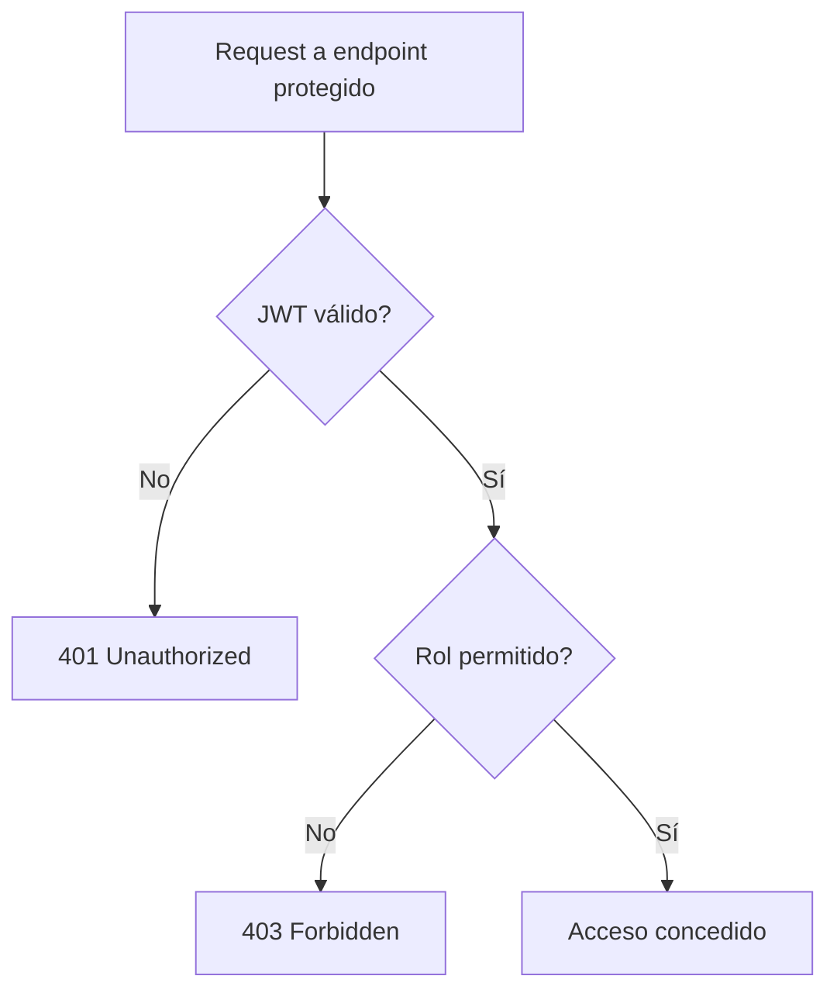

# 🔐 Mejora de Gestión de Roles y Documentación de Autorización

## Problema Identificado

Los roles de usuario (`USER_ROLE`, `ADMIN_ROLE`, `SUPER_ADMIN_ROLE`) estaban **hardcodeados** en múltiples archivos a lo largo de la aplicación, lo que creaba:

- **Riesgo de errores de tipeo**
- **Dificultad para mantenimiento**
- **Inconsistencias** entre archivos
- **Falta de centralización**

## Solución Implementada

### ✅ **Archivo de constantes centralizado**

Creado `src/configs/roles.ts` con:

```typescript
export const USER_ROLES = {
  USER: 'USER_ROLE',
  ADMIN: 'ADMIN_ROLE',
  SUPER_ADMIN: 'SUPER_ADMIN_ROLE'
} as const;

export type UserRole = typeof USER_ROLES[keyof typeof USER_ROLES];

export const ALL_ROLES = Object.values(USER_ROLES);
export const ADMIN_ROLES = [USER_ROLES.ADMIN, USER_ROLES.SUPER_ADMIN];
export const SUPER_ADMIN_ONLY = [USER_ROLES.SUPER_ADMIN];
export const ALL_USER_ROLES = [USER_ROLES.USER, USER_ROLES.ADMIN, USER_ROLES.SUPER_ADMIN];

// Helpers para validaciones
export const isValidRole = (role: string): role is UserRole => {
  return ALL_ROLES.includes(role as UserRole);
};

export const hasAdminAccess = (roles: string[]): boolean => {
  return roles.some(role =>
    role === USER_ROLES.ADMIN || role === USER_ROLES.SUPER_ADMIN
  );
};

export const hasSuperAdminAccess = (roles: string[]): boolean => {
  return roles.includes(USER_ROLES.SUPER_ADMIN);
};
```

### ✅ **Modelo de User actualizado**

```typescript
// src/data/mongodb/models/user.model.ts
import { ALL_ROLES, USER_ROLES } from "../../../configs/roles";

roles: {
    type: [String],
    default: [USER_ROLES.USER], // ✅ Ahora usa constante
    enum: ALL_ROLES             // ✅ Ahora usa array de constantes
}
```

**Nota:** El campo es `roles: string[]` (plural y array). En todos los endpoints y respuestas, reflejar este formato.

### ✅ **Rutas y Middlewares actualizados**

```typescript
// Antes (hardcodeado):
AuthMiddleware.checkRole(['ADMIN_ROLE'])

// Después (usando constantes):
import { ADMIN_ROLES, SUPER_ADMIN_ONLY } from '../../configs/roles';
AuthMiddleware.checkRole(ADMIN_ROLES)
AuthMiddleware.checkRole(SUPER_ADMIN_ONLY)
```

**En todos los endpoints protegidos:**
- Usar `AuthMiddleware.validateJwt` y luego `AuthMiddleware.checkRole(...)` con las constantes.

## Beneficios Obtenidos

1. **🎯 Consistencia**: Todos los roles están definidos en un solo lugar
2. **🔒 Tipo-seguridad**: TypeScript detecta errores de tipos
3. **🛠️ Mantenibilidad**: Cambios centralizados
4. **🚀 Escalabilidad**: Fácil agregar nuevos roles
5. **🧪 Testeable**: Helpers para validaciones comunes
6. **📚 Documentación clara para Frontend**: Los nombres y formatos de roles y headers están alineados con el backend.

## Próximos Pasos Recomendados

Para completar la centralización y facilitar la integración frontend-backend:

1. **Actualizar todos los archivos de rutas** para usar `ADMIN_ROLES` y `SUPER_ADMIN_ONLY`.
2. **Actualizar tests** para usar las constantes.
3. **Crear helpers adicionales** según necesidades.
4. **Documentar roles y autorización** en la documentación de API y ejemplos de endpoints.
5. **Asegurar que todos los ejemplos de usuario y endpoints usen `roles: string[]`**.

## Archivos Modificados

- ✅ `src/configs/roles.ts` (NUEVO)
- ✅ `src/data/mongodb/models/user.model.ts`
- ✅ `src/presentation/delivery-methods/routes.ts`
- ✅ `src/presentation/order/routes.order-status.ts`
- ✅ `src/presentation/payment/routes.payment-method.ts`
- ✅ `src/presentation/webhook/routes.webhook.ts`
- ✅ `src/presentation/monitoring/routes.monitoring.ts`

## Uso Recomendado

```typescript
// Importar constantes
import { USER_ROLES, ADMIN_ROLES, SUPER_ADMIN_ONLY, hasAdminAccess } from '../../configs/roles';

// En middlewares
AuthMiddleware.checkRole(ADMIN_ROLES)
AuthMiddleware.checkRole(SUPER_ADMIN_ONLY)

// En validaciones
if (hasAdminAccess(user.roles)) {
  // Lógica para admins
}

// En asignación de roles
const newUser = {
  ...userData,
  roles: [USER_ROLES.USER]
};
```

## Formato de Usuario en API (Request/Response)

```json
{
  "id": "64a7f8c9b123456789abcdef",
  "name": "Juan Pérez",
  "email": "juan@email.com",
  "roles": ["USER_ROLE"],
  ...
}
```

## Autorización en Endpoints Protegidos

- **Header requerido:**
  ```
  Authorization: Bearer <jwt-token>
  ```
- **Roles permitidos:**
  Usar los valores de las constantes (`ADMIN_ROLES`, `SUPER_ADMIN_ONLY`, etc).
- **Ejemplo de error 403:**
  ```json
  {
    "error": "Acceso denegado. Requiere rol: ADMIN_ROLE o SUPER_ADMIN_ROLE"
  }
  ```

## Gráfico de Flujo de Autorización



## Recomendaciones para el Frontend

- Usar SIEMPRE los nombres de roles y formato de array (`roles: string[]`).
- Mapear permisos a partir de los roles usando las constantes del backend si se requiere granularidad.
- Consultar este archivo y `src/configs/roles.ts` para mantener consistencia.

---

*Esta mejora refuerza la arquitectura, mantenibilidad y claridad documental del sistema de roles, asegurando integración precisa con el frontend.*

---

*Esta mejora mejora la arquitectura y mantenibilidad del sistema de roles sin cambiar la funcionalidad existente.*
