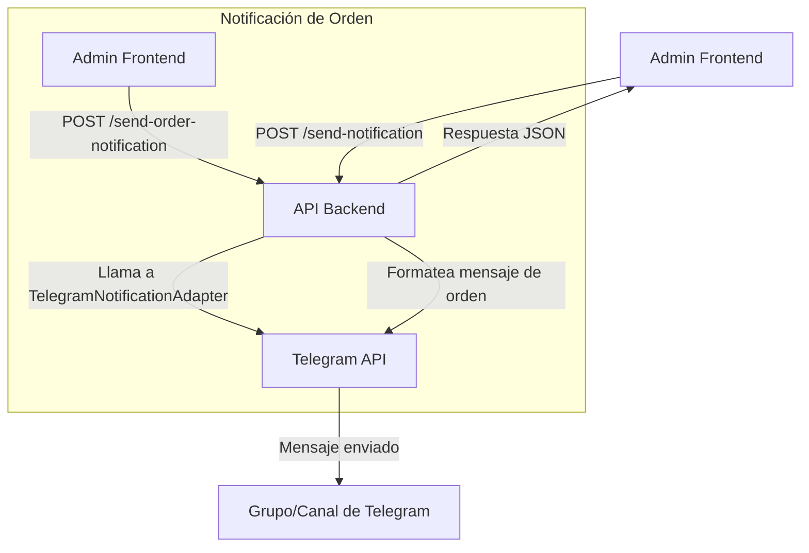

# 📱 Sistema de Notificaciones por Telegram

> **IMPORTANTE:** Esta documentación está alineada con el código backend real (al 09/07/2025). Los endpoints, bodys, respuestas y headers aquí documentados son los únicos soportados. Si el frontend necesita otros, deben implementarse primero en backend.

## 📋 Índice

- [🔧 Configuración](#-configuración)
- [🤖 Bot de Telegram](#-bot-de-telegram)
- [� Flujo de Notificaciones](#-flujo-de-notificaciones)
- [�📬 Tipos de Notificaciones](#-tipos-de-notificaciones)
- [� Sistema de Logging](#-sistema-de-logging)
- [�🛠️ API Endpoints](#-api-endpoints)
- [📊 Monitoreo y Logs](#-monitoreo-y-logs)
- [🔧 Troubleshooting](#-troubleshooting)

---

## 🔧 Configuración

### Variables de Entorno Requeridas

```env
# Telegram Bot Configuration
TELEGRAM_BOT_TOKEN=7905392744:AAHVobZq3mQtSOW41xd8js7RJSg2aOOl9Tk
TELEGRAM_CHAT_ID=736207422
```

### Variables Opcionales

```env
# Control de notificaciones (por defecto: true)
TELEGRAM_NOTIFICATIONS_ENABLED=true
```

---

## 🔄 Flujo de Notificaciones Automáticas

### 💰 Notificación de Pago Aprobado

El sistema envía automáticamente notificaciones de Telegram cuando un pago es aprobado:

#### 🔄 Secuencia del Flujo

1. **Webhook de MercadoPago** → `POST /api/payments/webhook`
2. **Verificación del estado** → `status === 'approved'`
3. **Búsqueda de la orden** → Por `external_reference`
4. **Actualización del estado** → Orden a "PENDIENTE PAGADO"
5. **🚀 ENVÍO AUTOMÁTICO** → Notificación de Telegram + Email

#### 📝 Ejemplo de Notificación Enviada

```
✅ Nuevo Pedido Pagado

📋 Orden: #ORD123456789
👤 Cliente: Juan Pérez
💰 Total: $25,500.00

📦 Productos:
• Producto A x2 - $12,000.00
• Producto B x1 - $13,500.00

⏰ 05/07/2025 20:30:15
🔗 Sistema E-commerce
```

#### 🔍 Logging Detallado

El sistema incluye logging exhaustivo para debugging:

```typescript
// Logs del flujo de notificación
logger.info('🎉 === PAGO APROBADO DETECTADO - INICIO FLUJO ===', {
  webhookTraceId: 'webhook-1720223845123-abc123',
  paymentId: '12345678901',
  orderId: 'ORD123456789',
  status: 'approved',
  amount: 25500,
  timestamp: '2025-07-05T20:30:15.123Z'
});

logger.info('📤 [TELEGRAM DEBUG] === LLAMANDO sendOrderNotification ===', {
  notificationData: {
    orderId: 'ORD123456789',
    customerName: 'Juan Pérez',
    total: 25500,
    items: [...]
  },
  dataValidation: {
    orderIdValid: true,
    customerNameValid: true,
    totalValid: true,
    itemsValid: true,
    itemsCount: 2
  }
});

logger.info('✅ [TELEGRAM DEBUG] === NOTIFICACIÓN COMPLETADA ===', {
  orderId: 'ORD123456789',
  duration: '1250ms'
});
```

### 🤖 Crear Bot de Telegram

1. **Hablar con @BotFather** en Telegram
2. **Crear nuevo bot:**
   ```
   /newbot
   Nombre: Mi E-commerce Bot
   Username: mi_ecommerce_bot
   ```
3. **Obtener token** y configurar en `TELEGRAM_BOT_TOKEN`
4. **Obtener Chat ID** del grupo/canal admin

### 📋 Obtener Chat ID

```javascript
// Método 1: Agregar bot al grupo y enviar mensaje
// Luego consultar: https://api.telegram.org/bot<TOKEN>/getUpdates

// Método 2: Usar endpoint del sistema
GET /api/admin/telegram/chat-info
```

---

## 🤖 Bot de Telegram

## 🎯 Flujo de Notificaciones de Pedidos

### ⚡ Momento Exacto de Envío

Las notificaciones de Telegram para pedidos siguen este flujo preciso:

1. **🛒 Cliente crea orden** → ❌ **NO se envía Telegram** (solo se crea la orden)
2. **💳 Cliente va a pagar** → ❌ **NO se envía Telegram** (redirection a MercadoPago)
3. **🔄 MercadoPago procesa pago** → ❌ **NO se envía Telegram** (esperando confirmación)
4. **✅ Webhook: pago = "approved"** → **🚀 SÍ SE ENVÍA TELEGRAM** (pago confirmado)

### 🔒 ¿Por qué este flujo?

- **Evita spam**: No notifica por órdenes que nunca se pagan
- **Garantiza veracidad**: Solo notifica pagos realmente confirmados
- **Mejora confiabilidad**: Usa el webhook oficial de MercadoPago
- **Previene duplicados**: Control automático de idempotencia

### 🎯 Funcionalidades del Bot

- **📦 Notificaciones de Pedidos** - Nuevos pedidos en tiempo real
- **💳 Alertas de Pagos** - Confirmaciones y fallos de pago
- **⚠️ Alertas de Sistema** - Errores críticos y eventos importantes
- **📊 Reportes** - Estadísticas diarias/semanales
- **🔧 Comandos Admin** - Gestión básica desde Telegram

### 📱 Comandos Disponibles

| Comando | Descripción | Acceso |
|---------|-------------|--------|
| `/start` | Inicializar bot | Todos |
| `/help` | Mostrar ayuda | Todos |
| `/stats` | Estadísticas del día | Admin |
| `/orders` | Pedidos recientes | Admin |
| `/status` | Estado del sistema | Admin |
| `/alerts` | Configurar alertas | Admin |

---

## 📬 Tipos de Notificaciones

### 🛒 Notificaciones de Pedidos

#### � Pedido Pagado (Pago Aprobado)

**⚡ MOMENTO DE ENVÍO:** Cuando MercadoPago confirma el pago como "approved" vía webhook

```
💰 PAGO CONFIRMADO - NUEVO PEDIDO #1234

✅ Pago aprobado por MercadoPago
👤 Cliente: Juan Pérez
📧 Email: juan@email.com
� Total: $2,500.00
📦 Items: 3 productos

🏠 Dirección:
Av. Corrientes 1234
Villa Crespo, CABA

🔗 ID Pago MP: 123456789
⏰ 15/01/2025 - 10:32 AM

[Ver Pedido] [Procesar]
```

#### ✅ Pedido Confirmado (Estados posteriores)

```
✅ PEDIDO ACTUALIZADO #1234

Estado: En preparación
Tiempo estimado: 30-45 min

[Ver Pedido] [Cambiar Estado]
```

### 💳 Notificaciones de Pagos

#### 💰 Pago Aprobado

```
💰 PAGO RECIBIDO

💳 Monto: $2,500.00
🆔 MP ID: 123456789
📋 Pedido: #1234
👤 Cliente: Juan Pérez

✅ Estado: Aprobado
⏰ 15/01/2025 - 10:32 AM

[Ver Detalles]
```

#### ❌ Pago Rechazado

```
❌ PAGO RECHAZADO

💳 Monto: $2,500.00
📋 Pedido: #1234
👤 Cliente: Juan Pérez

❌ Motivo: Tarjeta sin fondos
⏰ 15/01/2025 - 10:35 AM

[Revisar] [Contactar Cliente]
```

### ⚠️ Alertas de Sistema

#### 🚨 Error Crítico

```
🚨 ERROR CRÍTICO

🔧 Sistema: Base de Datos
📝 Error: Connection timeout
⏰ 15/01/2025 - 10:40 AM

[Ver Logs] [Revisar Sistema]
```

#### 📉 Stock Bajo

```
📉 STOCK BAJO

📦 Producto: Pizza Margherita
📊 Stock actual: 2 unidades
⚠️ Límite mínimo: 5 unidades

[Actualizar Stock] [Ver Producto]
```

### 📊 Reportes Automáticos

#### 📈 Resumen Diario

```
📈 RESUMEN DEL DÍA
📅 15/01/2025

📦 Pedidos: 25 (+15%)
💰 Ventas: $45,500 (+20%)
👥 Clientes: 23 (3 nuevos)
📱 Pagos MP: 22 exitosos, 1 fallido

[Ver Detalle] [Exportar]
```

---


## 🛠️ API Endpoints (actualizados)

Todos los endpoints requieren autenticación JWT de admin:

**Headers obligatorios:**
- `Authorization: Bearer <admin-jwt-token>`
- `Content-Type: application/json` (en POST)

---

### 📤 Enviar Notificación Manual

**POST** `/api/admin/telegram/send-notification`

**Body:**
```json
{
  "message": "Texto a enviar", // obligatorio
  "chatId": "opcional, string",
  "parseMode": "opcional, string",
  "disablePreview": "opcional, boolean"
}
```

**Respuesta exitosa:**
```json
{
  "success": true,
  "message": "Notification sent successfully",
  "timestamp": "2025-07-09T12:34:56.789Z",
  "sentTo": "chatId o 'default chat'"
}
```

**Errores posibles:**
- 400: `Message is required and must be a non-empty string`
- 400: `Message is too long. Maximum 4096 characters allowed.`
- 400: `Failed to send Telegram notification: ...`
- 500: `Internal server error while processing Telegram notification`

---

### � Enviar Notificación de Orden Manual

**POST** `/api/admin/telegram/send-order-notification`

**Body:**
```json
{
  "orderId": "string",
  "customerName": "string",
  "total": 1234.56,
  "items": [
    { "name": "Producto", "quantity": 2, "price": 100 }
  ]
}
```

**Respuesta exitosa:**
```json
{
  "success": true,
  "message": "Order notification sent successfully",
  "orderId": "..."
}
```

**Errores posibles:**
- 400: `orderId, customerName, total, and items are required`
- 400: `items must be a non-empty array`
- 400: `Failed to send Telegram notification: ...`
- 500: `Internal server error while processing Telegram notification`

---

### 🧪 Enviar Mensaje de Prueba

**POST** `/api/admin/telegram/send-test`

**Body:**
```json
{
  "message": "opcional, string"
}
```

**Respuesta exitosa:**
```json
{
  "success": true,
  "message": "Test message sent successfully",
  "timestamp": "2025-07-09T12:34:56.789Z"
}
```

---

### 🤖 Obtener Información del Bot

**GET** `/api/admin/telegram/bot-info`

**Respuesta exitosa:**
```json
{
  "success": true,
  "data": {
    "botName": "StartUp_test_luis_bot",
    "status": "active",
    "defaultChatId": "xxxx",
    "apiConfigured": true
  }
}
```

---

### ❌ Endpoints NO implementados (no usar)

- `/api/admin/telegram/send-report`
- `/api/admin/telegram/configure-alerts`
- `/api/admin/telegram/message-stats`
- `/api/admin/telegram/test-connection`
- `/api/admin/telegram/chat-info`

Si el frontend los necesita, deben implementarse primero en backend.

---

## 📊 Flujo de Envío de Notificación (Gráfico)



---

## 🛡️ Seguridad y Consideraciones

- Todos los endpoints requieren JWT de admin.
- El body y la respuesta de cada endpoint deben coincidir exactamente con lo detallado arriba.
- El endpoint `/send-notification` solo requiere `message` como obligatorio, el resto es opcional.
- El endpoint `/send-order-notification` requiere todos los campos y un array de items no vacío.
- El endpoint `/bot-info` devuelve un objeto `data` con los campos reales del bot.
- No existe endpoint para estadísticas ni para configuración de alertas por API.

---

---

## 📊 Monitoreo y Logs

### 📝 Sistema de Logging

```typescript
// Log de mensaje enviado
logger.info('Telegram message sent', {
  chatId: chatId,
  messageType: 'new_order',
  messageId: result.message_id,
  orderId: orderId
});

// Log de error
logger.error('Telegram message failed', {
  chatId: chatId,
  error: error.message,
  messageType: 'payment_notification'
});
```

### 🔍 Debugging

```bash
# Ver logs de Telegram
tail -f logs/combined-*.log | grep "telegram"

# Ver errores de bot
tail -f logs/error-*.log | grep "TelegramAdapter"
```

### 📈 Métricas Importantes

- **Tasa de entrega:** % de mensajes enviados exitosamente
- **Tiempo de respuesta:** Latencia de la API de Telegram
- **Tipos de mensaje:** Distribución por categoría
- **Errores:** Rate limits, chat no encontrado, bot bloqueado

---

## 🔧 Troubleshooting

### ❌ Problemas Comunes

#### 🔴 "Unauthorized" Error

**Causa:** Token de bot inválido
**Solución:**
1. Verificar `TELEGRAM_BOT_TOKEN` en `.env`
2. Regenerar token con @BotFather si necesario
3. Reiniciar aplicación

#### 🔴 "Chat not found"

**Causa:** `TELEGRAM_ADMIN_CHAT_ID` incorrecto
**Solución:**
1. Agregar bot al grupo/canal
2. Obtener chat ID correcto:
   ```bash
   curl "https://api.telegram.org/bot<TOKEN>/getUpdates"
   ```
3. Actualizar variable de entorno

#### 🔴 "Too Many Requests"

**Causa:** Rate limiting de Telegram (30 mensajes/segundo)
**Solución:**
- Implementar cola de mensajes
- Agregar delays entre envíos
- Agrupar notificaciones similares

#### 🔴 Bot no responde comandos

**Causa:** Permisos o configuración del bot
**Solución:**
1. Verificar que el bot tenga permisos en el grupo
2. Configurar comandos con @BotFather:
   ```
   /setcommands
   stats - Ver estadísticas del día
   orders - Pedidos recientes
   status - Estado del sistema
   ```

### 🛠️ Testing

#### 🧪 Test de Conectividad

```http
POST /api/admin/telegram/test-connection
Authorization: Bearer <admin-jwt-token>
```

#### 📱 Mensaje de Prueba

```http
POST /api/admin/telegram/send-test
Authorization: Bearer <admin-jwt-token>

{
  "message": "🧪 Test de conectividad - OK"
}
```

---

## 🚀 Configuración Avanzada

### 🎯 Múltiples Chats

```env
# Diferentes canales para diferentes tipos
TELEGRAM_ORDERS_CHAT_ID=-1001234567890    # Canal de pedidos
TELEGRAM_PAYMENTS_CHAT_ID=-1001234567891  # Canal de pagos
TELEGRAM_ALERTS_CHAT_ID=-1001234567892    # Canal de alertas
```

### ⏰ Programación de Reportes

```javascript
// Configurar reporte automático diario
{
  "dailyReport": {
    "enabled": true,
    "time": "09:00",
    "timezone": "America/Argentina/Buenos_Aires",
    "includeCharts": true
  }
}
```

### 🎨 Personalización de Mensajes

```javascript
// Templates personalizables
const templates = {
  newOrder: `
🆕 NUEVO PEDIDO #{{orderNumber}}

👤 {{customerName}}
💰 ${{total}}
📦 {{itemCount}} productos

{{#if isUrgent}}⚡ URGENTE{{/if}}
{{#if isFirstTime}}🌟 CLIENTE NUEVO{{/if}}
  `,
  
  paymentApproved: `
💰 PAGO RECIBIDO

💳 ${{amount}}
🆔 {{paymentId}}
📋 Pedido #{{orderNumber}}
  `
};
```

---

## 🔐 Seguridad

### 🛡️ Mejores Prácticas

1. **Token seguro:** Mantener token en variables de entorno
2. **Chat ID privado:** No exponer chat IDs públicamente
3. **Validación:** Verificar origen de updates
4. **Rate limiting:** Respetar límites de API
5. **Logs:** Registrar todas las interacciones

### 📊 Monitoreo de Seguridad

- Intentos de acceso no autorizados
- Cambios en configuración del bot
- Mensajes sospechosos o spam
- Rate limiting excedido

---

## 🎯 Integración con Otros Sistemas

### 📧 Combinación con Email

```javascript
// Enviar tanto email como Telegram
await Promise.all([
  emailService.sendOrderConfirmation(order),
  telegramService.notifyNewOrder(order)
]);
```

### 📊 Dashboard en Tiempo Real

- Métricas de mensajes enviados
- Estado del bot en tiempo real
- Configuración de alertas
- Historial de notificaciones

---

**💡 Tip:** Usa Telegram para notificaciones críticas en tiempo real y email para comunicación formal con clientes.
