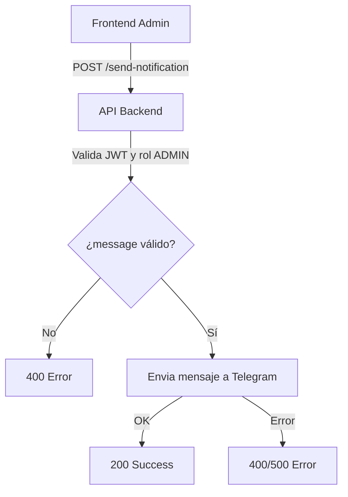

# 📱 Notificaciones de Telegram

Sistema completo de notificaciones usando Telegram Bot API para alertas en tiempo real.

## 📑 Índice

- [🔧 Configuración](#-configuración)
- [🚀 Funcionalidades](#-funcionalidades)
- [📋 API Endpoints](#-api-endpoints)
- [🔔 Tipos de Notificaciones](#-tipos-de-notificaciones)
- [💡 Ejemplos de Uso](#-ejemplos-de-uso)
- [⚙️ Configuración Avanzada](#-configuración-avanzada)

## 🔧 Configuración

### Variables de Entorno

```env
# Telegram Bot
TELEGRAM_BOT_TOKEN=your_bot_token_here
TELEGRAM_CHAT_ID=your_chat_id_here
TELEGRAM_ADMIN_CHAT_ID=admin_chat_id_here
```

### Crear Bot de Telegram

1. **Contacta a @BotFather** en Telegram
2. **Ejecuta** `/newbot` y sigue las instrucciones
3. **Obtén el token** del bot
4. **Agrega el bot** a tu grupo/chat
5. **Obtén el Chat ID** usando `/start` o herramientas online

### Configuración del Adapter

```typescript
// src/infrastructure/adapters/telegram.adapter.ts
const telegramAdapter = TelegramAdapter.getInstance();
```

## 🚀 Funcionalidades

### ✅ Implementadas y Funcionando

- **✅ Envío de mensajes** de texto con formato HTML
- **✅ Notificaciones de pedidos** automáticas (post-pago)
- **✅ Notificaciones de pagos** en tiempo real via webhook
- **✅ Mensajes administrativos** desde panel de admin
- **✅ Rate limiting** y manejo de errores robusto
- **✅ Logging detallado** para debugging y auditoría
- **✅ Tests automatizados** unitarios e integración
- **✅ Singleton pattern** para instancia única del servicio
- **✅ Configuración flexible** via variables de entorno

### 🔧 Configuradas pero Deshabilitadas

- **⚠️ Notificaciones de orden inmediatas**: Actualmente se envían solo cuando el pago es confirmado, no al crear el pedido

### 🚧 En Desarrollo / Pendientes

- **📎 Envío de archivos/imágenes**
- **⌨️ Botones interactivos** (InlineKeyboard)  
- **🤖 Comandos del bot** para interacción bidireccional
- **🔄 Webhooks de Telegram** para recibir mensajes
- **📊 Notificaciones de resúmenes** diarios/semanales automáticos
- **⚠️ Sistema de alertas** para errores críticos

## 📋 API Endpoints

### Administración de Telegram
**Base URL:** `/api/admin/telegram`
**Autenticación:** Bearer Token (rol ADMIN requerido)

> ⚠️ **IMPORTANTE:** Todos los endpoints requieren autenticación JWT válida y rol ADMIN. Si el usuario no es admin, se responde con 401/403.

---

#### `POST /api/admin/telegram/send-notification`
Envía mensaje personalizado de Telegram (solo admins).

**Headers:**
```
Authorization: Bearer <admin_token>
Content-Type: application/json
```

**Body:**
```json
{
  "message": "Mensaje a enviar",      // (obligatorio, string, máx 4096 caracteres)
  "chatId": "opcional"                // (opcional, string)
  // "parseMode" y "disablePreview" pueden enviarse pero serán ignorados
}
```

> ℹ️ **Notas:**
> - El campo `message` es obligatorio y debe ser un string no vacío (máx 4096 caracteres).
> - El campo `chatId` es opcional. Si no se envía, se usa el chatId por defecto configurado en el backend.
> - El mensaje siempre se envía en formato **HTML**. Los campos `parseMode` y `disablePreview` NO tienen efecto.

**Respuesta:**
```json
{
  "success": true,
  "message": "Notification sent successfully",
  "timestamp": "2025-07-05T17:30:00Z",
  "sentTo": "default chat"
}
```

---

#### `GET /api/admin/telegram/bot-info`
Obtiene información del bot de Telegram.

**Headers:**
```
Authorization: Bearer <admin_token>
```

**Respuesta:**
```json
{
  "success": true,
  "data": {
    "botName": "StartUp_test_luis_bot",
    "status": "active",
    "defaultChatId": "-123456789",
    "apiConfigured": true
  }
}
```

---

#### `POST /api/admin/telegram/send-test`
Envía mensaje de prueba para verificar conectividad.

**Headers:**
```
Authorization: Bearer <admin_token>
Content-Type: application/json
```

**Body (opcional):**
```json
{
  "message": "Mensaje personalizado de prueba"
}
```

**Respuesta:**
```json
{
  "success": true,
  "message": "Test message sent successfully",
  "timestamp": "2025-07-05T17:30:00Z"
}
```

---

#### `POST /api/admin/telegram/send-order-notification`
Envía notificación de orden manualmente.

**Headers:**
```
Authorization: Bearer <admin_token>
Content-Type: application/json
```

**Body:**
```json
{
  "orderId": "ORDER_123",
  "customerName": "Juan Pérez",
  "total": 2500.00,
  "items": [
    {
      "name": "Producto 1",
      "quantity": 2,
      "price": 1250.00
    }
  ]
}
```

**Respuesta:**
```json
{
  "success": true,
  "message": "Order notification sent successfully",
  "orderId": "ORDER_123"
}
```

---

### Diagrama de Flujo de Envío de Notificación



---
```


## 🔔 Tipos de Notificaciones

### 📦 Nuevo Pedido (Automática)

- **Trigger:** Cuando se confirma un pago exitoso (webhook de MercadoPago)
- **Destinatario:** Chat de administración
- **Implementación:** Automática desde `PaymentController.processWebhook()`
- **Nota:** Las notificaciones de orden se envían automáticamente **solo cuando el pago es aprobado**, no al crear el pedido inicial.

**Formato:**
```
🛒 Nueva Orden Recibida

📋 ID: ORDER_123
👤 Cliente: Juan Pérez
💰 Total: $2,500.00

📦 Items:
• Producto A x2 - $50.25
• Producto B x1 - $50.25

⏰ Fecha: 15/01/2025 10:30
```

### 💳 Pago Confirmado (Automática)

- **Trigger:** Cuando se confirma un pago via webhook de MercadoPago
- **Destinatario:** Chat de administración
- **Implementación:** Automática desde `PaymentController.processWebhook()`

**Formato:**
```
💳 Notificación de Pago

✅ Estado: APPROVED
📋 Orden: ORDER_123
💰 Monto: $2,500.00
🏦 Método: Credit Card

⏰ Fecha: 15/01/2025 10:30
```

### ⚠️ Error Crítico

- **Trigger:** Errores en el sistema que requieren atención
- **Destinatario:** Chat de administración

**Formato:**
```
🚨 ERROR CRÍTICO

📍 Módulo: PaymentController
💥 Error: Database connection timeout
📄 Detalles: Error al procesar pago ORDER_123

⏰ 15/01/2025 10:30
🔧 Requiere atención inmediata
```

### 📊 Resumen Diario (Futuro)

- **Trigger:** Automático todos los días a las 23:59
- **Destinatario:** Chat de administración

**Formato:**
```
📊 RESUMEN DEL DÍA - 15/01/2025

🛒 Pedidos: 25 nuevos
💰 Ventas: $62,500.00
📦 Productos vendidos: 150 unidades
👥 Clientes nuevos: 8

🔝 Producto más vendido: Producto A (25 unidades)
💳 Pagos procesados: 23/25
⏳ Pendientes: 2
```

## 💡 Ejemplos de Uso

### Notificación Manual (desde Admin Panel)

```typescript
// Usando el endpoint del admin panel
POST /api/admin/telegram/send-notification
{
  "message": "🎉 Promoción especial activada!",
  "chatId": "optional_specific_chat_id"
}
```

### Notificación de Pedido (Automática desde Webhook)

```typescript
// En PaymentController.processWebhook() cuando pago es aprobado
if (paymentInfo.status === 'approved') {
  const order = await this.orderRepository.findById(payment.saleId);
  
  if (order && this.notificationService) {
    await this.notificationService.sendOrderNotification({
      orderId: order.id,
      customerName: order.customer?.name || 'Cliente',
      total: order.total,
      items: order.items?.map(item => ({
        name: item.product?.name || 'Producto',
        quantity: item.quantity,
        price: item.unitPrice
      })) || []
    });
  }
}
```

### Notificación Manual de Orden (desde Admin Panel)

```typescript
// Usando el endpoint específico para órdenes
POST /api/admin/telegram/send-order-notification
{
  "orderId": "ORDER_123",
  "customerName": "Juan Pérez",
  "total": 2500.00,
  "items": [
    {
      "name": "Producto A",
      "quantity": 2,
      "price": 1250.00
    }
  ]
}
```

### Mensaje de Prueba

```typescript
// Verificar conectividad del bot
POST /api/admin/telegram/send-test
{
  "message": "🧪 Prueba personalizada del sistema" // Opcional
}
```

## ⚙️ Configuración Avanzada

### Rate Limiting

```typescript
// Configuración para evitar spam
const rateLimitConfig = {
  maxMessagesPerMinute: 20,
  burstLimit: 5,
  cooldownPeriod: 60000 // 1 minuto
};
```

### Retry Logic

```typescript
// Configuración de reintentos
const retryConfig = {
  maxRetries: 3,
  retryDelay: 1000, // 1 segundo
  backoffMultiplier: 2 // Incremento exponencial
};
```

### Formateo de Mensajes

```typescript
// Usar HTML para formato rico
const htmlMessage = `
<b>🛒 NUEVO PEDIDO</b> #${orderId}

<b>👤 Cliente:</b> ${customerName}
<b>💰 Total:</b> $${total.toFixed(2)}

<b>📋 Productos:</b>
${items.map(item => `• ${item.name} × ${item.quantity}`).join('\n')}

<i>⏰ ${new Date().toLocaleString('es-AR')}</i>
`;

await telegramService.sendMessage({
  message: htmlMessage,
  parseMode: 'HTML'
});
```

### Múltiples Chats

```typescript
// Configurar diferentes chats para diferentes tipos
const chatConfig = {
  admin: process.env.TELEGRAM_ADMIN_CHAT_ID,    // Errores críticos
  sales: process.env.TELEGRAM_SALES_CHAT_ID,    // Ventas y pedidos
  general: process.env.TELEGRAM_GENERAL_CHAT_ID // Notificaciones generales
};

// Enviar a chat específico
await telegramService.sendMessage({
  message: 'Nueva venta confirmada!',
  chatId: chatConfig.sales
});
```

### Logging y Monitoreo

```typescript
// Todas las notificaciones se loguean
logger.info('Telegram notification sent', {
  type: 'order',
  orderId,
  chatId,
  messageId: response.message_id,
  timestamp: new Date().toISOString()
});

// Métricas de notificaciones
await metrics.increment('telegram.notifications.sent', {
  type: 'order',
  status: 'success'
});
```

## 🔧 Troubleshooting

### Problemas Comunes

**Bot no envía mensajes:**
- Verificar que el token sea válido
- Confirmar que el bot esté agregado al chat
- Revisar que el chat ID sea correcto

**Mensajes con formato incorrecto:**
- Verificar sintaxis HTML/Markdown
- Escapar caracteres especiales
- Usar `parseMode` correcto

**Rate limiting de Telegram:**
- Implementar delays entre mensajes
- Usar rate limiting local
- Agrupar notificaciones cuando sea posible

### Testing

```typescript
// Test de conectividad desde admin panel
POST /api/admin/telegram/send-test
Authorization: Bearer <admin_token>

// Test de funcionalidad básica
POST /api/admin/telegram/bot-info
Authorization: Bearer <admin_token>

// Ejecutar tests automatizados
npm test -- --testNamePattern="Telegram"
```

**Estado de los Tests:**
- ✅ Tests unitarios: `telegram-notification.adapter.test.ts` - PASSING
- ✅ Tests de integración: `telegram-notification.test.ts` - PASSING
- ✅ Cobertura: Métodos principales cubiertos
- ✅ Mocks: Configurados para evitar llamadas reales en testing

**Ejemplo de salida exitosa:**
```
PASS  tests/unit/infrastructure/adapters/telegram-notification.adapter.test.ts
PASS  tests/integration/telegram-notification.test.ts

Test Suites: 3 passed
Tests: 16 passed
```

---

Para más información sobre otros sistemas de notificación:
- [📧 Notificaciones por Email](./email.md)
- [💳 Integración MercadoPago](./mercadopago.md)
- [📊 Sistema de Monitoreo](./monitoring.md)
