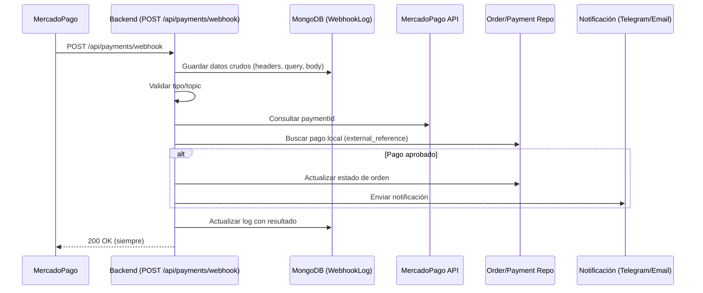

# 🔗 Sistema de Webhooks - Flujo Completo de Notificaciones

Sistema robusto para capturar webhooks de MercadoPago y activar notificaciones automáticas cuando el estado es "approved". Esta documentación está alineada con el código real y es clave para la integración frontend y monitoreo.

## 📑 Índice

- [🎯 Propósito](#-propósito)
- [🔄 Flujo Completo de Webhook a Notificación](#-flujo-completo-de-webhook-a-notificación)
- [🏗️ Arquitectura](#-arquitectura)
- [� Sistema de Logging y Trazabilidad](#-sistema-de-logging-y-trazabilidad)
- [� Endpoints Disponibles](#-endpoints-disponibles)
- [💡 Casos de Uso](#-casos-de-uso)
- [🔧 Configuración](#-configuración)
- [📊 Monitoreo](#-monitoreo)

## 🎯 Propósito

El sistema de webhooks permite:

- **🔄 Captura automática** de todos los webhooks de MercadoPago
- **💾 Almacenamiento completo** de datos crudos para auditoría
- **🔍 Procesamiento inteligente** basado en el estado del pago
- **📧 Activación automática** de notificaciones (Email + Telegram)
- **🔗 Trazabilidad total** con IDs únicos por webhook
- **📊 Análisis** de duplicados y problemas

---

## 🔄 Flujo Completo de Webhook a Notificación

### 📝 Diagrama de Flujo General



### 📝 Secuencia Paso a Paso

#### 1. 📥 **Recepción del Webhook**
```
MercadoPago → POST /api/payments/webhook
```

**Datos recibidos (pueden variar):**
```json
// Formato por query
{
  "id": "12345678901",
  "topic": "payment"
}
// Formato por body
{
  "type": "payment",
  "data": { "id": "12345678901" }
}
```

#### 2. 🔍 **Captura y Logging Inmediato**
```typescript
// Middleware guarda TODO: headers, query, body, IP, user-agent
const webhookTraceId = `webhook-${Date.now()}-${Math.random().toString(36).substr(2, 9)}`;
logger.info('🎯 Webhook recibido y datos crudos guardados:', {
  webhookLogId: req.webhookLogId,
  query: req.query,
  body: req.body,
  headers: {
    'content-type': req.headers['content-type'],
    'user-agent': req.headers['user-agent'],
    'x-forwarded-for': req.headers['x-forwarded-for'],
    'x-signature': req.headers['x-signature'],
    'x-request-id': req.headers['x-request-id']
  }
});
```


#### 3. 🔎 **Consulta a MercadoPago y procesamiento**
```typescript
// Validar tipo/topic
if (req.query.topic !== 'payment' && req.body.type !== 'payment') {
  // Ignorar y responder 200
}
// Obtener información real del pago
const paymentInfo = await paymentService.getPayment(paymentId);
logger.info('📊 Información del pago MP:', {
  id: paymentInfo.id,
  status: paymentInfo.status,
  external_reference: paymentInfo.externalReference,
  transaction_amount: paymentInfo.transactionAmount
});
// Buscar pago local
const payment = await paymentRepository.getPaymentByExternalReference(paymentInfo.externalReference);
logger.info('✅ Pago encontrado en DB:', { id: payment.id, saleId: payment.saleId, ... });
// Idempotencia: si ya está procesado, ignorar
if (payment.status === paymentInfo.status && payment.providerPaymentId === paymentInfo.id.toString()) {
  // Webhook duplicado, responder 200
}
// Actualizar estado de orden si corresponde
if (paymentInfo.status === 'approved') {
  // Buscar estado 'PENDIENTE PAGADO' dinámicamente
  const paidStatus = await orderStatusRepository.findByCode('PENDIENTE PAGADO');
  await orderRepository.updateStatus(payment.saleId, {
    statusId: paidStatus.id,
    notes: `Pago aprobado con ID ${paymentInfo.id}`
  });
  // Enviar notificación (Telegram/Email)
  await notificationService.sendOrderNotification({ ... });
}
// Actualizar log con resultado
await updateWebhookLog(req.webhookLogId, { ... });
// Siempre responder 200
res.status(200).json({ message: 'Notificación procesada exitosamente', ... });
```

#### 7. � **Activación de Notificaciones Automáticas**
```typescript
// Obtener datos completos de la orden
const order = await this.orderRepository.findById(payment.saleId);

const notificationData = {
  orderId: order.id,
  customerName: order.customer?.name || 'Cliente',
  total: order.total,
  items: order.items?.map(item => ({
    name: item.product?.name || 'Producto',
    quantity: item.quantity,
    price: item.unitPrice
  })) || []
};

logger.info('📤 [NOTIFICATION] === LLAMANDO sendOrderNotification ===', {
  notificationData: JSON.stringify(notificationData, null, 2),
  dataValidation: {
    orderIdValid: !!notificationData.orderId,
    customerNameValid: !!notificationData.customerName,
    totalValid: typeof notificationData.total === 'number',
    itemsValid: Array.isArray(notificationData.items),
    itemsCount: notificationData.items.length
  }
});

// 🔥 ENVÍO SIMULTÁNEO: Email + Telegram
await this.notificationService.sendOrderNotification(notificationData);

logger.info('✅ [NOTIFICATION] === NOTIFICACIÓN COMPLETADA ===', {
  orderId: payment.saleId,
  duration: '1250ms'
});
```

---

## 🔍 Sistema de Logging y Trazabilidad

### 🔖 Trace ID Único por Webhook

Cada webhook recibe un ID único para trazabilidad completa:

```typescript
const webhookTraceId = `webhook-${Date.now()}-${Math.random().toString(36).substr(2, 9)}`;
// Ejemplo: webhook-1720223845123-k7m9p2x
```

### 📊 Logs Estructurados

**Formato estándar:**
```json
{
  "timestamp": "2025-07-05T20:30:15.123Z",
  "level": "info",
  "service": "tu-api",
  "environment": "production",
  "webhookTraceId": "webhook-1720223845123-k7m9p2x",
  "paymentId": "12345678901",
  "orderId": "ORD123456789",
  "action": "payment_approved",
  "duration": "1250ms"
}
```

### 🔍 Búsqueda de Logs por Trace ID

```bash
# Buscar todos los logs de un webhook específico
grep "webhook-1720223845123-k7m9p2x" /opt/render/project/src/logs/*.log

# Buscar logs de pagos aprobados
grep "PAGO APROBADO DETECTADO" /opt/render/project/src/logs/*.log
```

## 🏗️ Arquitectura

### Flujo de Captura

```
Webhook MercadoPago → Middleware Logger → Base de Datos → Consulta API → Análisis
```

1. **Webhook llega** al endpoint configurado
2. **Middleware captura** automáticamente todos los datos
3. **Se almacena** en MongoDB con datos crudos
4. **Consulta opcional** a la API de MercadoPago
5. **Análisis** de trazabilidad y duplicados

### Componentes

- **`WebhookLogModel`**: Modelo MongoDB para almacenar webhooks
- **`WebhookLoggerMiddleware`**: Captura automática de webhooks
- **`WebhookController`**: Endpoints de administración y consulta
- **`MercadoPagoAdapter`**: Integración con API de MercadoPago


## 📋 Endpoints Disponibles

| Endpoint | Método | Autenticación | Descripción |
|----------|--------|---------------|-------------|
| `/api/payments/webhook` | POST | Ninguna (público para MercadoPago) | Recibe webhooks de MercadoPago. |
| `/api/webhooks` | GET | JWT + ADMIN | Listar webhooks capturados (paginado, filtrado). |
| `/api/webhooks/stats` | GET | JWT + ADMIN | Estadísticas generales de webhooks. |
| `/api/webhooks/:id` | GET | JWT + ADMIN | Detalle crudo de un webhook. |
| `/api/webhooks/:id/mercadopago-details` | GET | JWT + ADMIN | Info real y trazabilidad del pago en MP. |

### 🔐 Autenticación
- **Recepción de webhooks:** No requiere autenticación (MercadoPago debe poder acceder).
- **Consultas y administración:** Requiere JWT válido y rol `ADMIN_ROLE` en header `Authorization: Bearer <token>`.

### 1️⃣ `POST /api/payments/webhook` - Recepción de Webhooks

**Propósito:** Recibir notificaciones de MercadoPago (público, sin auth)

**Headers esperados:**
- `content-type: application/json`
- `x-signature`, `x-request-id`, `user-agent`, `x-forwarded-for` (MercadoPago)

**Body/Query posibles:**
```json
// Query: ?id=12345678901&topic=payment
// Body: { "type": "payment", "data": { "id": "12345678901" } }
```

**Respuestas posibles:**
```json
{ "message": "Notificación procesada exitosamente", "paymentStatus": "approved", ... }
{ "message": "Notificación recibida pero ignorada (topic no relevante)" }
{ "message": "Formato de notificación no reconocido" }
{ "message": "Pago no encontrado en DB, notificación ignorada." }
{ "message": "Webhook duplicado - pago ya procesado" }
{ "status": "error", "message": "Error procesando webhook" }
```
**Nota:** Siempre responde 200 OK para evitar reintentos infinitos de MercadoPago.

### 2️⃣ `GET /api/webhooks` - Listar Webhooks

**Propósito:** Ver todos los webhooks capturados con paginación y filtros

**Query Parameters:**
```
page=1               # Página (default: 1)
limit=10            # Elementos por página (default: 10)
source=mercadopago  # Filtrar por fuente
eventType=payment   # Filtrar por tipo de evento
processed=false     # Filtrar por procesados (true/false)
```

**Respuesta:**
```json
{
  "total": 150,
  "webhooks": [
    {
      "_id": "65a1b2c3d4e5f6789012345",
      "source": "mercadopago",
      "eventType": "payment",
      "httpMethod": "POST",
      "url": "/api/payments/webhook",
      "headers": {...},
      "queryParams": { "topic": "payment", "id": "123456" },
      "body": {
        "type": "payment",
        "data": { "id": "123456" }
      },
      "ipAddress": "200.115.53.25",
      "userAgent": "MercadoPago/1.0",
      "processed": false,
      "createdAt": "2025-01-15T10:30:00Z"
    }
  ],
  "pagination": {
    "page": 1,
    "limit": 20,
    "totalPages": 8
  }
}
```

### 2️⃣ `GET /api/webhooks/stats` - Estadísticas

**Propósito:** Panorama general del estado de webhooks

**Respuesta:**
```json
{
  "general": {
    "total": 1250,
    "processed": 1100,
    "successful": 1050,
    "pending": 150,
    "failed": 50
  },
  "bySource": [
    { "_id": "mercadopago", "count": 1000, "processed": 900 },
    { "_id": "stripe", "count": 250, "processed": 200 }
  ],
  "byEventType": [
    { "_id": "payment", "count": 800, "processed": 750 },
    { "_id": "refund", "count": 200, "processed": 180 }
  ]
}
```

### 3️⃣ `GET /api/webhooks/:id` - Detalle de Webhook

**Propósito:** Ver información completa y cruda de un webhook específico

**Parámetros:**
- `id`: ID del webhook en MongoDB

**Respuesta:**
```json
{
  "webhook": {
    "_id": "65a1b2c3d4e5f6789012345",
    "source": "mercadopago",
    "eventType": "payment",
    "httpMethod": "POST",
    "url": "/webhook",
    "headers": {
      "content-type": "application/json",
      "user-agent": "MercadoPago/1.0",
      "x-signature": "signature-hash"
    },
    "queryParams": { "topic": "payment", "id": "123456" },
    "body": {
      "action": "payment.updated",
      "api_version": "v1",
      "data": { "id": "123456" },
      "date_created": "2025-01-15T10:29:45.000-04:00",
      "id": 789012345,
      "live_mode": true,
      "type": "payment",
      "user_id": 987654321
    },
    "ipAddress": "200.115.53.25",
    "userAgent": "MercadoPago/1.0",
    "rawData": "{\"action\":\"payment.updated\",...}",
    "processed": true,
    "processingResult": {
      "success": true,
      "paymentId": "123456",
      "orderId": "ORDER_789"
    },
    "createdAt": "2025-01-15T10:30:00Z",
    "updatedAt": "2025-01-15T10:31:00Z"
  }
}
```

## 🔍 Endpoint Estrella


### 4️⃣ `GET /api/webhooks/:id/mercadopago-details` 🚀

**🎯 ENDPOINT MÁS IMPORTANTE**

**Propósito:** Obtener información REAL y COMPLETA del pago directamente desde MercadoPago, con análisis de duplicados y trazabilidad.

**Parámetros:**
- `id`: ID del webhook en MongoDB

**Respuesta:**
```json
{
  "webhook": {
    "id": "65a1b2c3d4e5f6789012345",
    "eventType": "payment",
    "processed": true,
    "processingResult": { "success": true, ... },
    "createdAt": "2025-01-15T10:30:00Z",
    ...
  },
  "mercadoPagoData": {
    "id": 123456789,
    "status": "approved",
    "transaction_amount": 2500.00,
    "external_reference": "ORDER_ABC123",
    ...
  },
  "analysis": {
    "idempotencyKey": "mp_123456789_ORDER_ABC123_2025-01-15",
    "linkToSale": {
      "externalReference": "ORDER_ABC123",
      "buyerInfo": { "email": "cliente@email.com", ... }
    },
    "riskLevel": "LOW",
    "trustScore": 95
  },
  "traceability": {
    "paymentId": "123456789",
    "possibleDuplicates": 0,
    ...
  }
}
```

### 🎯 Información Clave para Vincular con Ventas

**Datos de trazabilidad que obtienes:**

#### ✅ Identificación
- **`id`**: ID único del pago en MercadoPago
- **`external_reference`**: Tu referencia de orden/venta (CLAVE)
- **`metadata.uuid`**: Clave de idempotencia

#### 💰 Información Financiera
- **`transaction_amount`**: Monto exacto cobrado
- **`net_received_amount`**: Monto que recibiste (después de comisiones)
- **`fee_details`**: Detalle de comisiones
- **`installments`**: Número de cuotas

#### 📅 Fechas y Estados
- **`status`**: Estado real del pago (approved, pending, rejected)
- **`status_detail`**: Detalle específico del estado
- **`date_created`**: Cuándo se creó el pago
- **`date_approved`**: Cuándo se aprobó
- **`date_last_updated`**: Última actualización

#### 💳 Método de Pago
- **`payment_method_id`**: Tipo (visa, mastercard, efectivo)
- **`payment_type_id`**: Categoría (credit_card, debit_card, ticket)
- **`card.first_six_digits`**: Primeros 6 dígitos
- **`card.last_four_digits`**: Últimos 4 dígitos

#### 👤 Información del Pagador
- **`payer.email`**: Email del cliente
- **`payer.identification`**: DNI/documento
- **`card.cardholder.name`**: Nombre en la tarjeta


## 💡 Casos de Uso y Recomendaciones Frontend


### 🔍 Caso 1: Verificar Pago Después de Webhook
1. Listar webhooks no procesados:
   `GET /api/webhooks?processed=false&eventType=payment`
2. Obtener detalles completos del pago:
   `GET /api/webhooks/{webhook_id}/mercadopago-details`
3. Vincular con orden local usando `external_reference`.

### 🕵️ Caso 2: Investigar Discrepancia de Pago

```bash
# 1. Buscar webhook por período
GET /api/webhooks?page=1&limit=50

# 2. Consultar información real de MercadoPago
GET /api/webhooks/{webhook_id}/mercadopago-details

# 3. Comparar con registros locales
```

### 📊 Caso 3: Auditoría de Pagos

```bash
# 1. Ver estadísticas generales
GET /api/webhooks/stats

# 2. Revisar webhooks fallidos
GET /api/webhooks?processed=true&limit=100

# 3. Verificar cada pago importante
GET /api/webhooks/{webhook_id}/mercadopago-details
```


### 🔁 Caso 4: Detectar Duplicados
El endpoint `/api/webhooks/{webhook_id}/mercadopago-details` detecta automáticamente duplicados:
```json
{
  "traceability": {
    "possibleDuplicates": 2,
    ...
  }
}
```

## 🔧 Configuración


### Variables de Entorno
```env
# MercadoPago (requerido para consultas directas)
MERCADO_PAGO_ACCESS_TOKEN=your_access_token

# MongoDB (donde se almacenan los webhooks)
MONGO_URL=mongodb://localhost:27017/ecommerce

# Webhook URL (configurar en MercadoPago)
WEBHOOK_URL=https://tu-dominio.com/api/payments/webhook
```

### Configuración en MercadoPago

1. **Ir al panel de MercadoPago**
2. **Configurar webhook URL**: `https://tu-dominio.com/api/payments/webhook`
3. **Seleccionar eventos**: payment, refund, etc.
4. **El sistema capturará automáticamente** todos los webhooks

## 📊 Monitoreo

### Logs Automáticos

El sistema loguea automáticamente:
- Recepción de webhooks
- Consultas a MercadoPago
- Errores y fallos
- Análisis de trazabilidad

### Métricas Importantes

```bash
# Ver estadísticas generales
GET /api/webhooks/stats

# Alertas a monitorear:
- Webhooks no procesados > 10
- Tasa de fallos > 5%
- Pagos sin external_reference
- Duplicados frecuentes
```

### Dashboard Recomendado

**Métricas clave a monitorear:**
1. **Total webhooks/día**
2. **Tasa de procesamiento exitoso**
3. **Webhooks pendientes**
4. **Pagos sin vincular**
5. **Duplicados detectados**

---

## 🎯 Resumen

Este sistema te permite **capturar TODO** lo que llega de MercadoPago y **obtener información real** consultando directamente su API. Es **transparente** (no rompe nada), **completo** (guarda todo), y te da **trazabilidad total** para vincular cada cobro con tu venta.


**🚀 El endpoint más importante es `/api/webhooks/:id/mercadopago-details` porque es el único que va directo a MercadoPago y te trae toda la información real del pago, con análisis de duplicados y trazabilidad.**

Para más información:
- [💳 Integración MercadoPago](./mercadopago.md)
- [📊 Sistema de Monitoreo](./monitoring.md)
- [🏗️ Arquitectura](./architecture.md)
