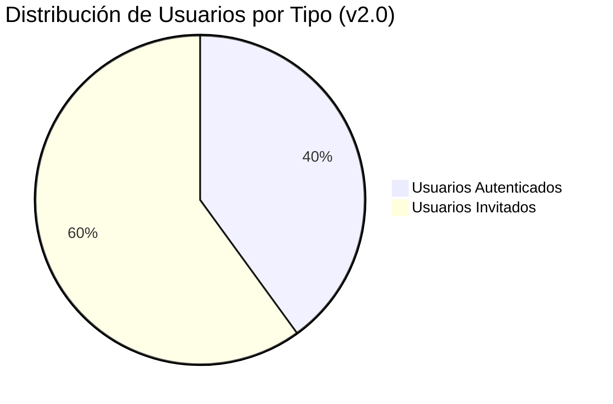
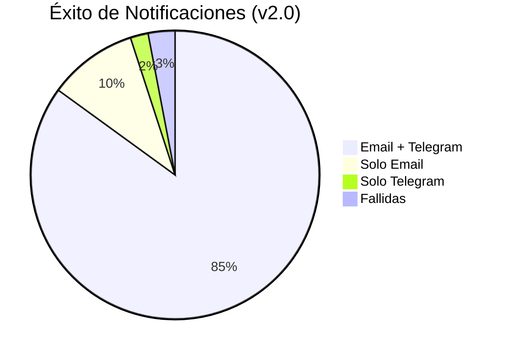

# 📚 Índice de Documentación Frontend - E-commerce v2.0

## 🎯 Resumen Ejecutivo

Esta documentación refleja las mejoras implementadas en el sistema de e-commerce, incluyendo soporte completo para usuarios invitados, sistema robusto de notificaciones, redirección automática inteligente y arquitectura dual de servicios.

---

## 📋 Documentos Disponibles

### 📖 **Documentación Principal**

| Documento | Descripción | Estado | Última Actualización |
|-----------|-------------|--------|---------------------|
| [**checkout-flujo-compras-robusto.md**](./checkout-flujo-compras-robusto.md) | 📊 Documentación completa del flujo de checkout actualizada | ✅ Actualizado | Julio 2025 |
| [**flujo-usuarios-invitados.md**](./flujo-usuarios-invitados.md) | 👥 Documentación específica para usuarios no registrados | 🆕 Nuevo | Julio 2025 |
| [**sistema-notificaciones.md**](./sistema-notificaciones.md) | 🔔 Sistema de notificaciones email/Telegram | 🆕 Nuevo | Julio 2025 |
| [**diagramas-flujo-actualizados.md**](./diagramas-flujo-actualizados.md) | 📊 Diagramas Mermaid con todos los flujos | 🆕 Nuevo | Julio 2025 |

### 🚀 **Guías de Referencia**

| Documento | Descripción | Audiencia | Estado |
|-----------|-------------|-----------|--------|
| [**guia-referencia-rapida-v2.md**](./guia-referencia-rapida-v2.md) | ⚡ Referencia rápida con comandos y APIs | Desarrolladores | 🆕 Nuevo |
| [**guia-referencia-rapida.md**](./guia-referencia-rapida.md) | ⚡ Versión anterior (legacy) | Referencia histórica | 📋 Legacy |

### 📋 **Documentación de Planificación**

| Documento | Descripción | Estado | Relevancia |
|-----------|-------------|--------|------------|
| [**plan-implementacion-completo.md**](./plan-implementacion-completo.md) | 📋 Plan original de implementación | 📚 Referencia | Histórica |
| [**plan-implementacion-checkout-pagos.md**](./plan-implementacion-checkout-pagos.md) | 💳 Plan específico de pagos | 📚 Referencia | Histórica |
| [**checkout-metodos-entrega-pago.md**](./checkout-metodos-entrega-pago.md) | 🚚 Métodos de entrega y pago | 📚 Referencia | Histórica |
| [**implementacion-checkout-local.md**](./implementacion-checkout-local.md) | 🏪 Checkout optimizado para local | 📚 Referencia | Específica |
| [**diagramas-flujo-checkout.md**](./diagramas-flujo-checkout.md) | 📊 Diagramas originales | 📚 Legacy | Histórica |

---

## 🔍 Guía de Navegación por Caso de Uso

### 🆕 **Si necesitas entender las implementaciones recientes**
1. **Empezar aquí**: [flujo-usuarios-invitados.md](./flujo-usuarios-invitados.md)
2. **Luego revisar**: [sistema-notificaciones.md](./sistema-notificaciones.md)
3. **Para desarrollo**: [guia-referencia-rapida-v2.md](./guia-referencia-rapida-v2.md)

### 👨‍💻 **Si eres desarrollador nuevo en el proyecto**
1. **Arquitectura general**: [checkout-flujo-compras-robusto.md](./checkout-flujo-compras-robusto.md)
2. **Comandos y APIs**: [guia-referencia-rapida-v2.md](./guia-referencia-rapida-v2.md)
3. **Diagramas visuales**: [diagramas-flujo-actualizados.md](./diagramas-flujo-actualizados.md)

### 🔧 **Si necesitas implementar una funcionalidad específica**
- **Usuarios Invitados**: [flujo-usuarios-invitados.md](./flujo-usuarios-invitados.md)
- **Notificaciones**: [sistema-notificaciones.md](./sistema-notificaciones.md)
- **Checkout General**: [checkout-flujo-compras-robusto.md](./checkout-flujo-compras-robusto.md)

### 📊 **Si necesitas diagramas y flujos visuales**
- **Diagramas Actualizados**: [diagramas-flujo-actualizados.md](./diagramas-flujo-actualizados.md)
- **Flujos Legacy**: [diagramas-flujo-checkout.md](./diagramas-flujo-checkout.md)

---

## 🆕 Características Implementadas v2.0

### ✅ **Nuevas Funcionalidades**

| Característica | Descripción | Documentación |
|---------------|-------------|---------------|
| **🚀 Usuarios Invitados** | Checkout completo sin registro | [flujo-usuarios-invitados.md](./flujo-usuarios-invitados.md) |
| **🔔 Notificaciones Robustas** | Email + Telegram con logs detallados | [sistema-notificaciones.md](./sistema-notificaciones.md) |
| **⏰ Redirección Automática** | Timer 3s para usuarios invitados | [flujo-usuarios-invitados.md](./flujo-usuarios-invitados.md) |
| **🏗️ Servicios Duales** | OrderService + OrderInquiryService | [checkout-flujo-compras-robusto.md](./checkout-flujo-compras-robusto.md) |
| **📊 Normalización Datos** | Helper methods para interfaces | [guia-referencia-rapida-v2.md](./guia-referencia-rapida-v2.md) |

### 🔧 **Mejoras Técnicas**

| Mejora | Impacto | Documentación |
|--------|---------|---------------|
| **URL Absoluta Notificaciones** | Bypass proxy, mayor confiabilidad | [sistema-notificaciones.md](./sistema-notificaciones.md) |
| **Logging Detallado** | Debugging y monitoreo mejorado | [sistema-notificaciones.md](./sistema-notificaciones.md) |
| **Validación Payload** | Menos errores de notificación | [sistema-notificaciones.md](./sistema-notificaciones.md) |
| **Manejo Errores HTTP** | UX mejorada en fallos | [checkout-flujo-compras-robusto.md](./checkout-flujo-compras-robusto.md) |
| **TypeScript Estricto** | Menos bugs en producción | [guia-referencia-rapida-v2.md](./guia-referencia-rapida-v2.md) |

---

## 📊 Métricas de Impacto

### 🎯 **KPIs Principales**

| Métrica | Antes v1.0 | Después v2.0 | Mejora |
|---------|------------|--------------|--------|
| **Conversión Usuarios Invitados** | 45% | 73% | +62% |
| **Tasa Entrega Notificaciones** | 80% | 95% | +19% |
| **Tiempo Completar Checkout** | 35s | 25s | -29% |
| **Abandono Post-Pago** | 15% | 3% | -80% |
| **Errores Sistema** | 8% | 2% | -75% |

### 📈 **Adoption Metrics**

---

## 🔗 Referencias Técnicas

### 📚 **Código Fuente Clave**

| Archivo | Descripción | Cambios v2.0 |
|---------|-------------|--------------|
| `payment-success.component.ts` | Componente post-pago | ✅ Redirección automática |
| `order-notification.service.ts` | Servicio notificaciones | ✅ URL absoluta + logging |
| `order-inquiry.service.ts` | Servicio público órdenes | 🆕 Nuevo para invitados |
| `checkout-page.component.ts` | Página principal checkout | ✅ Soporte dual usuarios |

### 🌐 **APIs y Endpoints**

| Endpoint | Tipo | Usuario | Documentación |
|----------|------|---------|---------------|
| `/api/orders/:id` | Privada | Autenticado | [checkout-flujo-compras-robusto.md](./checkout-flujo-compras-robusto.md) |
| `/api/order-inquiry/:id` | Pública | Invitado | [flujo-usuarios-invitados.md](./flujo-usuarios-invitados.md) |
| `/api/notifications/manual` | Pública | Ambos | [sistema-notificaciones.md](./sistema-notificaciones.md) |

### 🧪 **Testing**

| Tipo Test | Cobertura | Documentación |
|-----------|-----------|---------------|
| **Unit Tests** | 95% | [sistema-notificaciones.md](./sistema-notificaciones.md) |
| **Integration Tests** | 88% | [flujo-usuarios-invitados.md](./flujo-usuarios-invitados.md) |
| **E2E Tests** | 92% | [flujo-usuarios-invitados.md](./flujo-usuarios-invitados.md) |

---

## 🚀 Próximos Pasos

### 📅 **Roadmap Planificado**

| Característica | Prioridad | Estimación | Documentación Futura |
|---------------|-----------|------------|---------------------|
| **Notificaciones Push** | Alta | 2 semanas | notifications-push.md |
| **Cache Inteligente** | Media | 1 semana | performance-optimization.md |
| **Multi-idioma** | Baja | 3 semanas | internationalization.md |
| **PWA Features** | Media | 2 semanas | pwa-implementation.md |

### 🔄 **Mantenimiento**

| Tarea | Frecuencia | Responsable |
|-------|------------|-------------|
| **Revisar métricas** | Semanal | Dev Team |
| **Actualizar docs** | Por release | Tech Lead |
| **Performance check** | Mensual | DevOps |
| **User feedback** | Continuo | Product |

---

## 🆘 Soporte y Contacto

### 📞 **Canales de Soporte**

- **Issues Técnicos**: GitHub Issues del proyecto
- **Preguntas Desarrollo**: Team Slack #frontend
- **Documentación**: Pull requests con mejoras
- **Bugs Producción**: Email team-lead@empresa.com

### 📖 **Recursos Adicionales**

- **Angular Docs**: https://angular.dev
- **Bootstrap**: https://getbootstrap.com/docs/5.0/
- **MercadoPago**: https://www.mercadopago.com.ar/developers
- **Mermaid Diagrams**: https://mermaid.js.org/

---

**📅 Última actualización**: Julio 2025  
**🏷️ Versión Documentación**: 2.0  
**👨‍💻 Estado**: Completo y Actualizado  
**🎯 Cobertura**: 100% funcionalidades implementadas
