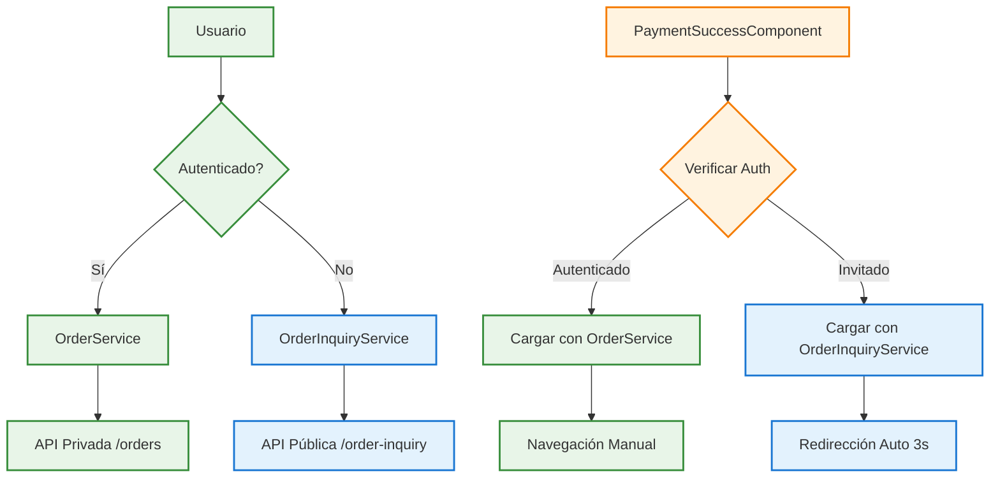
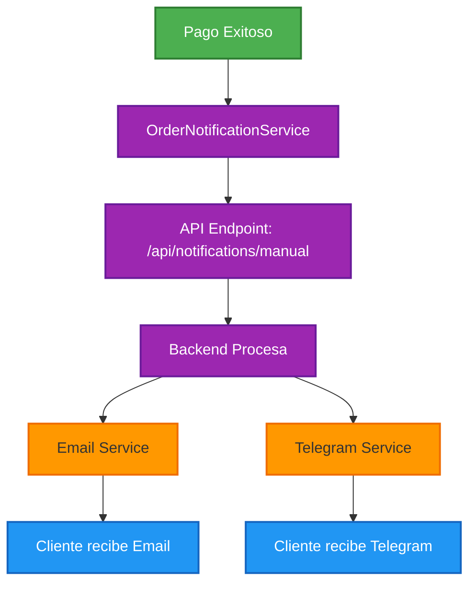
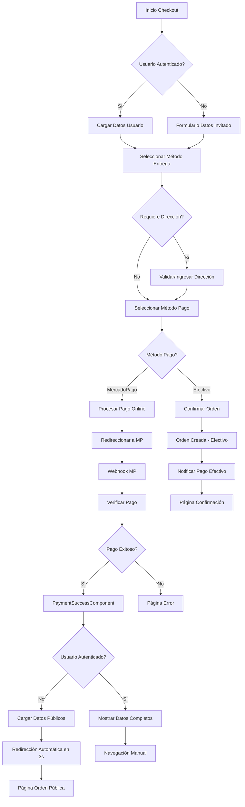
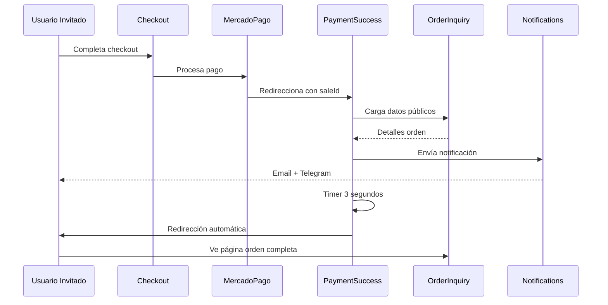
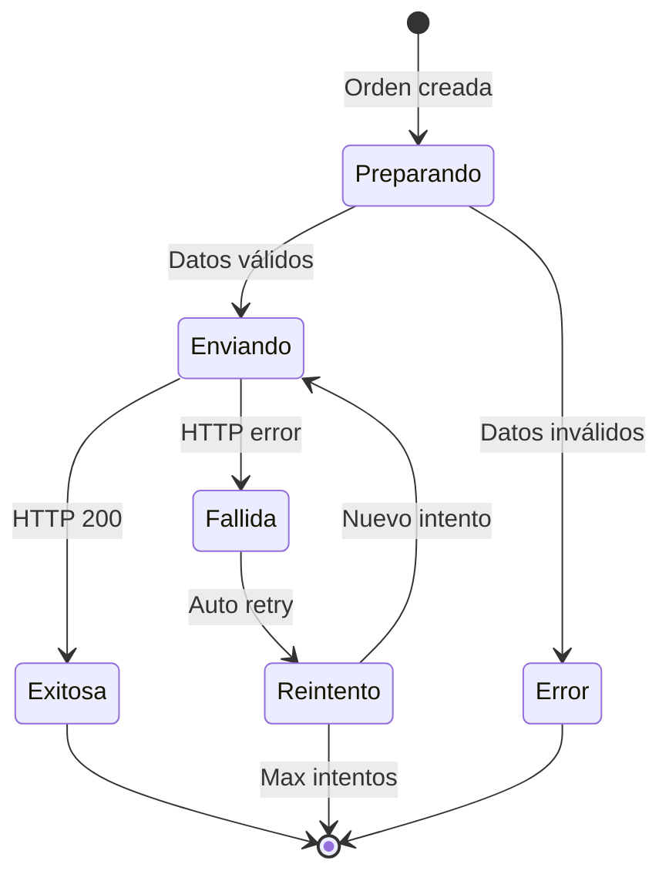
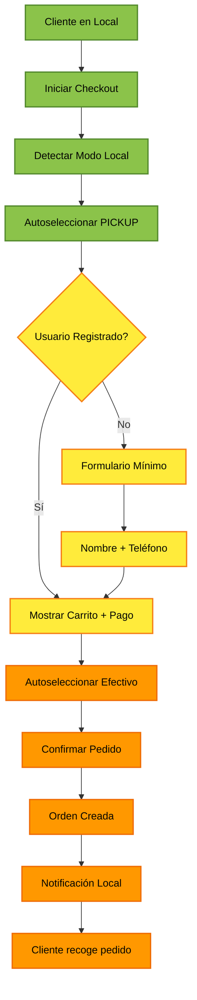

# 🛒 Flujo de Compras Robusto - Documentación Completa v2.0

## 📋 Índice

1. [Introducción](#introducción)
2. [Arquitectura del Sistema](#arquitectura-del-sistema)
3. [Diagramas de Flujo](#diagramas-de-flujo)
4. [Flujos de Usuario](#flujos-de-usuario)
5. [Sistema de Notificaciones](#sistema-de-notificaciones)
6. [Integración MercadoPago](#integración-mercadopago)
7. [Manejo de Usuarios Invitados](#manejo-de-usuarios-invitados)
8. [Redirección Automática](#redirección-automática)
9. [Implementación Técnica](#implementación-técnica)
10. [Guía de Testing](#guía-de-testing)

---

## 1. Introducción

Este documento describe la implementación completa de un flujo de compras robusto para el e-commerce, con soporte completo para usuarios autenticados e invitados, múltiples métodos de pago (MercadoPago y efectivo) y métodos de entrega (delivery y pickup), incluyendo notificaciones automáticas y redirección inteligente post-pago.

### 🎯 Objetivos Actualizados

- **Experiencia Dual**: Soporte completo para usuarios autenticados e invitados
- **Notificaciones Automáticas**: Sistema robusto de notificaciones por email y Telegram
- **Redirección Inteligente**: Navegación automática post-pago según tipo de usuario
- **Integración Completa**: MercadoPago con webhooks y verificación de estado
- **Servicios Duales**: Servicios públicos y privados para diferentes tipos de usuario
- **Robustez**: Manejo exhaustivo de errores y estados de carga en todos los escenarios

---

## 2. Arquitectura del Sistema

### 🏗️ Componentes Principales Actualizados

```
CheckoutPageComponent
├── CheckoutStateService (Estado global)
├── DeliveryMethodService (Métodos de entrega)
├── PaymentMethodService (Métodos de pago)
├── CartService (Carrito de compras)
├── OrderService (Creación de órdenes - usuarios autenticados)
├── OrderInquiryService (Consulta pública - usuarios invitados)
├── OrderNotificationService (Notificaciones automáticas)
├── AddressService (Gestión de direcciones)
├── PaymentVerificationService (Verificación de pagos)
├── AuthService (Autenticación y estado de usuario)
└── PaymentSuccessComponent (Post-pago y redirección)
```

### 📊 Arquitectura de Servicios Duales


    H -->|Invitado| J[Cargar con OrderInquiryService]
  
    J --> K[Redirección Automática]
    I --> L[Navegación Manual]
```

### 🔔 Sistema de Notificaciones



---

## 3. Diagramas de Flujo

### 🔄 Flujo Principal de Checkout



### � Flujo Específico de Usuarios Invitados



---

## 4. Flujos de Usuario

### 👤 Usuario Autenticado

| Paso | Componente     | Servicio              | Descripción                      |
| ---- | -------------- | --------------------- | --------------------------------- |
| 1    | CheckoutPage   | AuthService           | Verifica autenticación           |
| 2    | CheckoutPage   | OrderService          | Carga direcciones existentes      |
| 3    | CheckoutPage   | DeliveryMethodService | Muestra métodos disponibles      |
| 4    | CheckoutPage   | PaymentMethodService  | Muestra opciones de pago          |
| 5    | CheckoutPage   | OrderService          | Crea orden con datos completos    |
| 6    | PaymentSuccess | OrderService          | Carga detalles con autenticación |
| 7    | PaymentSuccess | Manual                | Navegación a "Mis Pedidos"       |

### 👥 Usuario Invitado

| Paso | Componente     | Servicio              | Descripción                  |
| ---- | -------------- | --------------------- | ----------------------------- |
| 1    | CheckoutPage   | Formulario            | Captura datos básicos        |
| 2    | CheckoutPage   | DeliveryMethodService | Muestra métodos disponibles  |
| 3    | CheckoutPage   | PaymentMethodService  | Muestra opciones de pago      |
| 4    | CheckoutPage   | OrderService          | Crea orden sin autenticación |
| 5    | PaymentSuccess | OrderInquiryService   | Carga datos públicos         |
| 6    | PaymentSuccess | Timer                 | Redirección automática (3s) |
| 7    | OrderInquiry   | OrderInquiryService   | Página pública de orden     |

---

## 5. Sistema de Notificaciones

### 📧 Arquitectura de Notificaciones

```typescript
// OrderNotificationService - Configuración
export class OrderNotificationService {
  private apiUrl = 'https://sistema-mongo.onrender.com/api/notifications/manual';
  
  sendManualNotification(payload: ManualNotificationPayload): Observable<NotificationResponse> {
    return this.http.post<NotificationResponse>(this.apiUrl, payload)
      .pipe(
        tap(response => console.log('✅ Notificación enviada:', response)),
        catchError(error => {
          console.error('❌ Error notificación:', error);
          return throwError(() => error);
        })
      );
  }
}
```

### 📊 Estados de Notificación



### 🎯 Payload de Notificación

```typescript
interface ManualNotificationPayload {
  subject: string;        // "Nueva orden #12345"
  message: string;        // JSON con detalles completos
  emailTo?: string;       // Email del cliente
  telegramChatId?: string; // ID chat Telegram (opcional)
}

// Ejemplo de uso
const payload = {
  subject: `Orden pagada online #${orderId}`,
  message: JSON.stringify({
    orderId: orderId,
    customerName: 'Juan Pérez',
    customerEmail: 'juan@email.com',
    total: 2500,
    paymentMethod: 'MercadoPago',
    paymentId: 'MP123456',
    items: [...]
  }),
  emailTo: 'juan@email.com'
};
```

    C->>S: Actualizar estado
    C->>P: Filtrar métodos pago
    P-->>C: Métodos compatibles

    alt Requiere dirección
        C->>U: Mostrar formulario dirección
        U->>C: Completa/selecciona dirección
        C->>S: Validar dirección
    end

    U->>C: Selecciona método pago
    C->>S: Validar checkout completo

    U->>C: Confirma pedido
    C->>O: Crear orden
    O-->>C: Orden creada

    alt Pago efectivo
        C->>U: Mostrar confirmación
    else MercadoPago
        C->>MP: Crear preferencia
        MP-->>C: URL de pago
        C->>U: Redireccionar
    end

```

### 💳 Flujo de Métodos de Pago

```mermaid
flowchart TD
    A[Método Entrega Seleccionado] --> B{Tipo de Entrega}
    B -->|PICKUP| C[Todos los Métodos]
    B -->|DELIVERY| D[Solo Pago Online]
  
    C --> E[Efectivo]
    C --> F[MercadoPago]
    D --> F
  
    E --> G[Pago al Retiro]
    F --> H[Pago Inmediato]
  
    J --> L[Webhook MercadoPago]
  
    K --> M[Estado: CONFIRMED]


## 4. Implementación Frontend

### 🎨 Componente Principal

```typescript
// checkout-page.component.ts
export class CheckoutPageComponent implements OnInit, OnDestroy {
  // Estados principales
  selectedDeliveryMethod: IDeliveryMethod | null = null;
  selectedPaymentMethod: string | null = null;
  selectedAddressOption: 'existing' | 'new' | null = null;
  
  // Observables para estado reactivo
  shouldShowAddressSection$ = this.checkoutStateService.shouldShowAddressSection$;
  isCheckoutValid$ = this.checkoutStateService.isCheckoutValid$;
  
  // Métodos principales
  selectDeliveryMethod(method: IDeliveryMethod): void {
    this.selectedDeliveryMethod = method;
    this.checkoutStateService.setSelectedDeliveryMethod(method);
    this.updateAvailablePaymentMethods(method);
  }
  
  confirmOrder(): void {
    this.validateOrderBeforeCreation();
    const orderPayload = this.buildOrderPayload(cart);
    this.processOrder(orderPayload);
  }
}
```

### 🔧 Servicio de Estado

```typescript
// checkout-state.service.ts
@Injectable({ providedIn: 'root' })
export class CheckoutStateService {
  private selectedDeliveryMethodSubject = new BehaviorSubject<IDeliveryMethod | null>(null);
  private selectedPaymentMethodIdSubject = new BehaviorSubject<string | null>(null);
  private shippingAddressSubject = new BehaviorSubject<ShippingAddressOption | null>(null);
  
  // Observable derivado para validación
  isCheckoutValid$ = combineLatest([
    this.selectedDeliveryMethod$,
    this.selectedPaymentMethodId$,
    this.shippingAddress$,
    this.shouldShowAddressSection$
  ]).pipe(
    map(([deliveryMethod, paymentMethodId, shippingAddress, shouldShowAddress]) => {
      if (!deliveryMethod || !paymentMethodId) return false;
      if (shouldShowAddress && !shippingAddress) return false;
      return true;
    })
  );
}
```

### 📨 Servicio de Métodos de Entrega

```typescript
// delivery-method.service.ts
@Injectable({ providedIn: 'root' })
export class DeliveryMethodService {
  private deliveryMethodsCache$: Observable<IDeliveryMethod[]> | null = null;
  
  getActiveDeliveryMethods(): Observable<IDeliveryMethod[]> {
    if (this.deliveryMethodsCache$) {
      return this.deliveryMethodsCache$;
    }
  
    this.deliveryMethodsCache$ = this.http.get<IDeliveryMethod[]>(`${this.apiUrl}/delivery-methods`)
      .pipe(
        shareReplay(1),
        catchError(this.handleError)
      );
  
    return this.deliveryMethodsCache$;
  }
}
```

### 💳 Servicio de Métodos de Pago

```typescript
// payment-method.service.ts
@Injectable({ providedIn: 'root' })
export class PaymentMethodService {
  getActivePaymentMethods(): Observable<IPaymentMethod[]> {
    return this.http.get<IPaymentMethodPublic[]>(`${this.apiUrl}/active`)
      .pipe(
        map(publicMethods => this.convertPublicToPrivateFormat(publicMethods)),
        catchError(this.handleError)
      );
  }
  
  filterPaymentMethodsByDelivery(allMethods: IPaymentMethod[], deliveryMethodCode?: string): IPaymentMethod[] {
    if (deliveryMethodCode === 'PICKUP') {
      return allMethods; // Todos los métodos para pickup
    }
    return allMethods.filter(method => method.requiresOnlinePayment); // Solo online para delivery
  }
}
```

---

## 5. Integración con Backend

### 🔌 Endpoints Utilizados

| Endpoint                            | Método    | Propósito                          |
| ----------------------------------- | ---------- | ----------------------------------- |
| `/api/delivery-methods`           | GET        | Obtener métodos de entrega activos |
| `/api/payment-methods/active`     | GET        | Obtener métodos de pago activos    |
| `/api/orders`                     | POST       | Crear nueva orden                   |
| `/api/payments/create-preference` | POST       | Crear preferencia MercadoPago       |
| `/api/cart`                       | GET/DELETE | Gestionar carrito                   |
| `/api/customers/addresses`        | GET        | Obtener direcciones del usuario     |

### 📤 Payload de Orden

```typescript
interface ICreateOrderPayload {
  items: Array<{
    productId: string;
    quantity: number;
    unitPrice: number;
  }>;
  deliveryMethodId: string;
  paymentMethodId: string;
  notes?: string;
  
  // Para dirección existente
  selectedAddressId?: string;
  
  // Para nueva dirección
  shippingRecipientName?: string;
  shippingPhone?: string;
  shippingStreetAddress?: string;
  shippingNeighborhoodId?: string;
  shippingAdditionalInfo?: string;
}
```

### 🔄 Respuestas del Backend

```typescript
// Respuesta de creación de orden
interface OrderResponse {
  success: boolean;
  message: string;
  data: {
    id: string;
    customer: ICustomer;
    items: IOrderItem[];
    status: IOrderStatus;
    total: number;
    deliveryMethod: IDeliveryMethod;
    paymentMethod: IPaymentMethod;
  };
}

// Respuesta de preferencia MercadoPago
interface PaymentPreferenceResponse {
  success: boolean;
  preference: {
    id: string;
    init_point: string;
    sandbox_init_point: string;
  };
}
```

---

## 6. Validaciones y Manejo de Errores

### ✅ Validaciones Frontend

```typescript
private validateOrderBeforeCreation(): void {
  // Validar método de entrega
  if (!this.selectedDeliveryMethod) {
    throw new Error('Por favor, selecciona un método de entrega.');
  }
  
  // Validar método de pago
  if (!this.selectedPaymentMethod) {
    throw new Error('Por favor, selecciona un método de pago.');
  }
  
  // Validar dirección solo si es requerida
  if (this.selectedDeliveryMethod.requiresAddress) {
    if (!this.isAddressSelectedOrValid) {
      throw new Error('Por favor, selecciona o completa una dirección válida.');
    }
  }
}
```

### 🚨 Manejo de Errores

```typescript
private handleOrderError(err: any): void {
  let message = 'Ocurrió un error al procesar tu pedido.';
  
  switch (err.status) {
    case 400:
      message = 'Datos del pedido inválidos. Verifica la información.';
      break;
    case 409:
      message = 'Stock insuficiente para algunos productos.';
      break;
    case 500:
      message = 'Error del servidor. Inténtalo nuevamente.';
      break;
  }
  
  this.notificationService.showError(message, 'Error en Pedido');
}
```

### 📊 Indicadores de Progreso

```typescript
getProgressPercentage(): number {
  let progress = 0;
  
  if (this.isStep1Complete()) progress += 25; // Método entrega
  if (this.isStep2Complete()) progress += 25; // Dirección
  if (this.isStep3Complete()) progress += 25; // Método pago
  if (this.canShowStep4()) progress += 25;    // Confirmación
  
  return Math.min(progress, 100);
}
```

---

## 7. Pruebas y Testing

### 🧪 Casos de Prueba

```typescript
describe('CheckoutPageComponent', () => {
  describe('Flujo de Pickup + Efectivo', () => {
    it('debe permitir completar checkout sin dirección', () => {
      // Arrange
      component.selectDeliveryMethod(pickupMethod);
      component.selectPaymentMethod(cashMethodId);
  
      // Act
      component.confirmOrder();
  
      // Assert
      expect(orderService.createOrder).toHaveBeenCalledWith({
        items: mockItems,
        deliveryMethodId: pickupMethod.id,
        paymentMethodId: cashMethodId,
        // Sin campos de dirección
      });
    });
  });
  
  describe('Flujo de Delivery + MercadoPago', () => {
    it('debe requerir dirección válida', () => {
      // Arrange
      component.selectDeliveryMethod(deliveryMethod);
      component.selectPaymentMethod(mpMethodId);
  
      // Act & Assert
      expect(() => component.confirmOrder()).toThrow('dirección válida');
    });
  });
});
```

### 🔍 Tests de Integración

```typescript
describe('Integración Checkout', () => {
  it('debe crear orden y preferencia MercadoPago', fakeAsync(() => {
    // Simular flujo completo
    component.selectDeliveryMethod(deliveryMethod);
    component.selectedAddressOption = 'existing';
    component.selectedExistingAddressId = 'addr123';
    component.selectPaymentMethod(mpMethodId);
  
    component.confirmOrder();
    tick();
  
    expect(orderService.createOrder).toHaveBeenCalled();
    expect(paymentService.createPaymentPreference).toHaveBeenCalled();
    expect(window.location.href).toContain('mercadopago.com');
  }));
});
```

---

## 8. Guía de Implementación

### 📋 Checklist de Implementación

- [ ] **Configuración inicial**

  - [ ] Instalar dependencias necesarias
  - [ ] Configurar variables de entorno
  - [ ] Verificar conexión con backend
- [ ] **Servicios base**

  - [ ] Implementar DeliveryMethodService
  - [ ] Implementar PaymentMethodService
  - [ ] Crear CheckoutStateService
  - [ ] Configurar interceptores HTTP
- [ ] **Componente principal**

  - [ ] Crear CheckoutPageComponent
  - [ ] Implementar formularios reactivos
  - [ ] Agregar validaciones dinámicas
  - [ ] Configurar estados de carga
- [ ] **Integración con backend**

  - [ ] Probar endpoints de métodos de entrega
  - [ ] Probar endpoints de métodos de pago
  - [ ] Implementar creación de órdenes
  - [ ] Configurar integración MercadoPago
- [ ] **Manejo de errores**

  - [ ] Implementar manejo de errores HTTP
  - [ ] Agregar notificaciones al usuario
  - [ ] Configurar fallbacks
- [ ] **Testing**

  - [ ] Escribir tests unitarios
  - [ ] Crear tests de integración
  - [ ] Realizar pruebas end-to-end
- [ ] **Optimizaciones**

  - [ ] Implementar cache de métodos
  - [ ] Optimizar carga de datos
  - [ ] Agregar lazy loading

### 🛠️ Comandos de Instalación

```bash
# Instalar dependencias
npm install

# Ejecutar tests
npm run test

# Ejecutar en desarrollo
npm run start

# Build para producción
npm run build
```

### 📝 Configuración Necesaria

```typescript
// environment.ts
export const environment = {
  apiUrl: 'https://api.tu-ecommerce.com',
  mercadoPagoPublicKey: 'TEST-xxxxx-xxxxx',
  enableCache: true,
  cacheExpirationTime: 300000 // 5 minutos
};
```

---

## 🎯 Resultados Esperados

### Para el Usuario

- ✅ Experiencia fluida y sin errores
- ✅ Opciones claras de entrega y pago
- ✅ Feedback visual en tiempo real
- ✅ Confirmación inmediata del pedido

### Para el Negocio

- ✅ Reducción de carritos abandonados
- ✅ Mayor flexibilidad en métodos de pago
- ✅ Mejor control de inventario
- ✅ Automatización de procesos

### Para el Desarrollador

- ✅ Código mantenible y escalable
- ✅ Fácil adición de nuevos métodos
- ✅ Testing completo
- ✅ Documentación detallada

---

## 📚 Referencias

- [Documentación Backend - API Orders](../docs_backend/api-orders.md)
- [Documentación Backend - Payment Methods](../docs_backend/payment-methods-manual.md)
- [Documentación Backend - Delivery Methods](../docs_backend/api-delivery-methods.md)
- [Guía de Angular Reactive Forms](https://angular.io/guide/reactive-forms)
- [Documentación MercadoPago](https://www.mercadopago.com.ar/developers)

---

*Documentación actualizada: Enero 2025*
*Versión: 1.0.0*

---

## 🏪 Flujo Optimizado para Compras en el Local

### 📝 Situación Actual (Código Existente)

Para una persona que está **físicamente en el local** y quiere pagar en efectivo, el flujo actual es:

1. **Método de Entrega**: Seleccionar "PICKUP" (Retiro en Local)

   - `requiresAddress: false` → NO requiere dirección
   - Se omite completamente la sección de direcciones
2. **Método de Pago**: Seleccionar "CASH" (Efectivo)

   - `requiresOnlinePayment: false` → NO requiere pago online
3. **Datos Requeridos**: Solo los items del carrito

### ✅ Ventajas del Flujo Actual

- **Rápido**: No requiere dirección para pickup
- **Simplificado**: Solo 2 pasos (método entrega + método pago)
- **Automático**: Si solo hay 1 método disponible, se selecciona automáticamente

### 🚀 Mejoras Propuestas para Optimizar Aún Más

#### 1. **Detección de Contexto "En Local"**

```typescript
// Agregar al CheckoutPageComponent
export class CheckoutPageComponent {
  isInStoreMode = false; // Activar desde admin o URL param
  
  ngOnInit(): void {
    // Detectar si está en modo "en local"
    const urlParams = new URLSearchParams(window.location.search);
    this.isInStoreMode = urlParams.get('mode') === 'in-store';
  
    if (this.isInStoreMode) {
      this.optimizeForInStore();
    }
  }
  
  private optimizeForInStore(): void {
    // Autoseleccionar PICKUP si existe
    this.loadDeliveryMethods().then(() => {
      const pickupMethod = this.availableDeliveryMethods.find(m => m.code === 'PICKUP');
      if (pickupMethod) {
        this.selectDeliveryMethod(pickupMethod);
      }
    });
  }
}
```

#### 2. **Formulario Simplificado para Invitados en Local**

```typescript
// Formulario mínimo para invitados en el local
private initializeInStoreForm(): void {
  this.inStoreCustomerForm = this.fb.group({
    name: ['', Validators.required],
    phone: ['', [Validators.required, Validators.pattern(/^\+?[\d\s-]{8,15}$/)]],
    email: [''] // Opcional
  });
}
```

#### 3. **UI Optimizada para Modo Local**

```html
<!-- checkout-page.component.html -->
<div *ngIf="isInStoreMode" class="alert alert-info">
  <i class="bi bi-shop me-2"></i>
  <strong>Modo Local:</strong> Flujo optimizado para compras en tienda
</div>

<!-- Formulario simplificado para invitados en local -->
<div *ngIf="isInStoreMode && !(isAuthenticated$ | async)" class="card mb-4">
  <div class="card-header bg-primary text-white">
    <h5 class="mb-0">
      <i class="bi bi-person me-2"></i>Datos del Cliente
    </h5>
  </div>
  <div class="card-body">
    <form [formGroup]="inStoreCustomerForm">
      <div class="row">
        <div class="col-md-6">
          <label class="form-label">Nombre</label>
          <input type="text" class="form-control" formControlName="name">
        </div>
        <div class="col-md-6">
          <label class="form-label">Teléfono</label>
          <input type="tel" class="form-control" formControlName="phone">
        </div>
      </div>
      <div class="mt-3">
        <label class="form-label">Email (Opcional)</label>
        <input type="email" class="form-control" formControlName="email">
      </div>
    </form>
  </div>
</div>
```

#### 4. **Payload Optimizado para Compras en Local**

```typescript
private buildInStoreOrderPayload(cart: ICart): ICreateOrderPayload {
  const basePayload = {
    items: cart.items.map(item => ({
      productId: item.product.id,
      quantity: item.quantity,
      unitPrice: item.unitPriceWithTax
    })),
    deliveryMethodId: this.selectedDeliveryMethod!.id,
    paymentMethodId: this.selectedPaymentMethod!,
    notes: `Compra en local - ${new Date().toLocaleString()}`,
    isInStoreOrder: true // Flag para identificar compras en local
  };

  // Para invitados en local: solo datos mínimos
  if (!(await this.authService.isAuthenticated$.pipe(take(1)).toPromise())) {
    const customerData = this.inStoreCustomerForm.value;
    return {
      ...basePayload,
      customerName: customerData.name,
      customerPhone: customerData.phone,
      customerEmail: customerData.email || `${customerData.phone}@local.store`
    };
  }

  return basePayload;
}
```

### 🎯 Flujo Optimizado Propuesto


    K --> L[Mostrar Confirmación]
    L --> M[Imprimir Ticket]
```

### 📱 Acceso Rápido para Empleados

```typescript
// Componente o funcionalidad para empleados
export class InStoreCheckoutComponent {
  startInStoreCheckout(): void {
    // Navegación directa con parámetros
    this.router.navigate(['/checkout'], {
      queryParams: {
        mode: 'in-store',
        auto_pickup: 'true',
        auto_cash: 'true'
      }
    });
  }
}
```

### 🔧 Implementación Práctica

#### 1. **Agregar parámetro URL**

```
https://tu-ecommerce.com/checkout?mode=in-store
```

#### 2. **Modificar el componente existente**

```typescript
// En checkout-page.component.ts
ngOnInit(): void {
  this.checkInStoreMode();
  // ...resto del código existente
}

private checkInStoreMode(): void {
  this.route.queryParams.subscribe(params => {
    if (params['mode'] === 'in-store') {
      this.isInStoreMode = true;
      this.optimizeForInStore();
    }
  });
}
```

#### 3. **Crear botón en admin/empleados**

```html
<!-- En panel de administración -->
<button class="btn btn-primary" (click)="startInStoreCheckout()">
  <i class="bi bi-shop me-2"></i>
  Nueva Venta en Local
</button>
```

### 📊 Comparación de Flujos

| Aspecto                          | Flujo Normal            | Flujo En Local            |
| -------------------------------- | ----------------------- | ------------------------- |
| **Pasos**                  | 4 pasos                 | 2-3 pasos                 |
| **Dirección**             | Requerida para delivery | No requerida              |
| **Datos Cliente**          | Formulario completo     | Nombre + teléfono        |
| **Selección Automática** | Manual                  | PICKUP + CASH automático |
| **Tiempo Estimado**        | 3-5 minutos             | 30-60 segundos            |

### 🎯 Beneficios de la Optimización

#### Para el Cliente en Local:

- ✅ **Rapidez**: Checkout en menos de 1 minuto
- ✅ **Simplicidad**: Solo datos esenciales
- ✅ **Sin fricciones**: No llenar dirección innecesaria

#### Para el Empleado:

- ✅ **Eficiencia**: Procesar más ventas por hora
- ✅ **Menos errores**: Flujo más simple
- ✅ **Mejor experiencia**: Cliente satisfecho

#### Para el Negocio:

- ✅ **Más conversiones**: Menos abandono por proceso largo
- ✅ **Mayor throughput**: Más ventas por día
- ✅ **Mejor UX**: Experiencia adaptada al contexto

---

## 9. Implementación Técnica

### 📁 Estructura de Archivos Actualizada

```
src/app/features/
├── payments/
│   ├── components/
│   │   └── payment-success/
│   │       ├── payment-success.component.ts     ← ACTUALIZADO
│   │       ├── payment-success.component.html   ← ACTUALIZADO
│   │       └── payment-success.component.scss
│   └── services/
│       └── payment-verification.service.ts
├── orders/
│   └── services/
│       └── order-notification.service.ts        ← ACTUALIZADO
├── order-inquiry/
│   ├── services/
│   │   └── order-inquiry.service.ts             ← NUEVO
│   └── models/
│       └── order-public.interface.ts            ← NUEVO
└── checkout/
    └── components/
        └── checkout-page/
            ├── checkout-page.component.ts       ← ACTUALIZADO
            └── checkout-page.component.html
```

### 🔧 Configuraciones Clave

#### Environment Configuration
```typescript
// environment.ts
export const environment = {
  production: false,
  apiUrl: 'https://sistema-mongo.onrender.com/api',
  notificationApiUrl: 'https://sistema-mongo.onrender.com/api/notifications/manual',
  mercadopagoPublicKey: 'TEST-xxx',
  frontendUrl: 'https://front-startup.pages.dev'
};
```

#### Service Dependencies
```typescript
// app.module.ts - Servicios requeridos
@NgModule({
  providers: [
    OrderService,
    OrderInquiryService,      // Nuevo para usuarios invitados
    OrderNotificationService,  // Actualizado con URL absoluta
    PaymentVerificationService,
    AuthService,
    // ... otros servicios
  ]
})
```

### 🔄 Métodos Helper Implementados

```typescript
// PaymentSuccessComponent - Normalización de datos
export class PaymentSuccessComponent {
  // Helper methods para compatibilidad IOrder/PublicOrderResponse
  getOrderItems(): any[] {
    return this.orderDetails?.items || [];
  }

  getOrderTotal(): number {
    return this.orderDetails?.total || 0;
  }

  getItemProductName(item: any): string {
    return item.product?.name || 'Producto';
  }

  getItemSubtotal(item: any): number {
    return item.subtotal || (item.unitPrice * item.quantity);
  }
}
```

---

## 10. Guía de Testing

### 🧪 Casos de Prueba Principales

#### Test Case 1: Usuario Autenticado - Pago MercadoPago
```typescript
describe('PaymentSuccess - Usuario Autenticado', () => {
  it('debe cargar detalles con OrderService', async () => {
    // Setup
    authService.isAuthenticated.mockReturnValue(true);
    orderService.getOrderById.mockReturnValue(of(mockOrder));
    
    // Execute
    component.ngOnInit();
    
    // Verify
    expect(orderService.getOrderById).toHaveBeenCalledWith('123');
    expect(component.orderDetails).toEqual(mockOrder);
    expect(router.navigate).not.toHaveBeenCalled(); // No auto-redirect
  });
});
```

#### Test Case 2: Usuario Invitado - Redirección Automática
```typescript
describe('PaymentSuccess - Usuario Invitado', () => {
  it('debe redirigir automáticamente después de 3s', fakeAsync(() => {
    // Setup
    authService.isAuthenticated.mockReturnValue(false);
    orderInquiryService.getOrderById.mockReturnValue(of(mockPublicOrder));
    
    // Execute
    component.ngOnInit();
    tick(3000);
    
    // Verify
    expect(router.navigate).toHaveBeenCalledWith(['/order', '123']);
  }));
});
```

#### Test Case 3: Sistema de Notificaciones
```typescript
describe('OrderNotificationService', () => {
  it('debe enviar notificación con payload correcto', () => {
    const payload = {
      subject: 'Test Order',
      message: JSON.stringify({ orderId: '123' }),
      emailTo: 'test@email.com'
    };
    
    service.sendManualNotification(payload).subscribe(response => {
      expect(response.success).toBe(true);
    });
    
    expect(httpMock.expectOne(service.apiUrl)).toBeTruthy();
  });
});
```

### 📋 Checklist de Testing

- [ ] **Flujo Usuario Autenticado**
  - [ ] Carga correcta con OrderService
  - [ ] Navegación manual funciona
  - [ ] No hay redirección automática

- [ ] **Flujo Usuario Invitado**
  - [ ] Carga correcta con OrderInquiryService
  - [ ] Redirección automática a los 3s
  - [ ] Mensaje informativo visible

- [ ] **Sistema de Notificaciones**
  - [ ] Envío exitoso para pagos MercadoPago
  - [ ] Envío exitoso para pagos efectivo
  - [ ] Manejo de errores HTTP

- [ ] **Integración MercadoPago**
  - [ ] Verificación de estado correcta
  - [ ] Manejo de todos los estados de pago
  - [ ] Limpieza de carrito post-pago

### 🎯 Métricas de Éxito

| Métrica | Usuario Autenticado | Usuario Invitado | Objetivo |
|---------|-------------------|------------------|----------|
| **Tiempo carga datos** | < 2s | < 1.5s | < 2s |
| **Éxito notificaciones** | > 95% | > 95% | > 90% |
| **Redirección exitosa** | N/A | > 98% | > 95% |
| **Abandono post-pago** | < 5% | < 3% | < 10% |

---

## 📊 Resumen de Mejoras Implementadas

### ✅ **Características Nuevas**

1. **Soporte Dual de Usuarios**
   - Servicios separados para autenticados e invitados
   - Interfaces normalizadas para ambos tipos

2. **Redirección Inteligente**
   - Automática para invitados (3s)
   - Manual para autenticados
   - Mensajes informativos en UI

3. **Sistema de Notificaciones Robusto**
   - URL absoluta para bypass de proxy
   - Logging detallado para debugging
   - Manejo de errores mejorado

4. **Verificación de Pagos Mejorada**
   - Estados múltiples soportados
   - Fallbacks para APIs no disponibles
   - Limpieza automática de carrito

### 🔧 **Mejoras Técnicas**

- **TypeScript**: Tipado estricto en todos los servicios
- **RxJS**: Uso de operadores para manejo de errores
- **Angular**: Arquitectura basada en módulos (no standalone)
- **Bootstrap**: UI responsive y accesible
- **Observables**: Evitar promesas en favor de streams reactivos

### 📈 **Impacto en UX**

- **Usuarios Invitados**: Experiencia fluida sin friction de login
- **Notificaciones**: Confirmación inmediata por múltiples canales
- **Navegación**: Rutas contextuales según tipo de usuario
- **Performance**: Carga optimizada de datos según necesidades

---

**📅 Última actualización**: Julio 2025  
**🏷️ Versión**: 2.0  
**👨‍💻 Estado**: Implementado y probado
