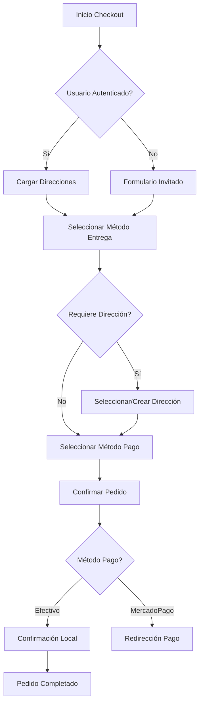
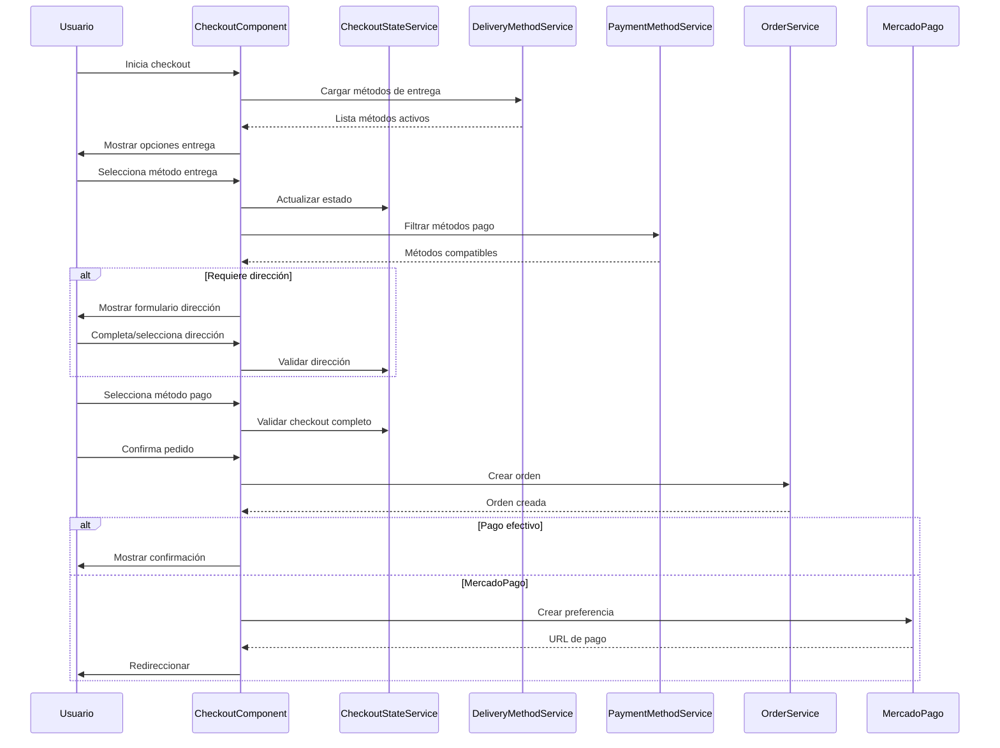
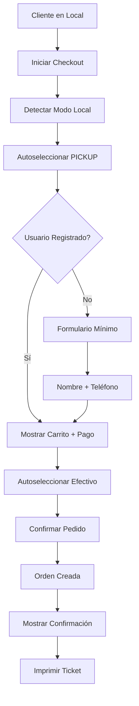

# 🛒 Flujo de Compras Robusto - Documentación Completa

## 📋 Índice

1. [Introducción](#introducción)
2. [Arquitectura del Sistema](#arquitectura-del-sistema)
3. [Diagramas de Flujo](#diagramas-de-flujo)
4. [Implementación Frontend](#implementación-frontend)
5. [Integración con Backend](#integración-con-backend)
6. [Validaciones y Manejo de Errores](#validaciones-y-manejo-de-errores)
7. [Pruebas y Testing](#pruebas-y-testing)
8. [Guía de Implementación](#guía-de-implementación)
9. [Flujo Optimizado para Compras en el Local](#flujo-optimizados-para-compras-en-el-local)

---

## 1. Introducción

Este documento describe la implementación completa de un flujo de compras robusto para el e-commerce, soportando múltiples métodos de pago (MercadoPago y efectivo) y métodos de entrega (delivery y pickup), con validación dinámica de direcciones para usuarios registrados e invitados.

### 🎯 Objetivos

- **Flexibilidad**: Soportar diferentes combinaciones de métodos de pago y entrega
- **Validación**: Validaciones dinámicas según el método de entrega seleccionado
- **Experiencia de Usuario**: Flujo intuitivo con feedback visual y progress tracking
- **Robustez**: Manejo exhaustivo de errores y estados de carga
- **Escalabilidad**: Arquitectura preparada para nuevos métodos de pago/entrega

---

## 2. Arquitectura del Sistema

### 🏗️ Componentes Principales

```
CheckoutPageComponent
├── CheckoutStateService (Estado global)
├── DeliveryMethodService (Métodos de entrega)
├── PaymentMethodService (Métodos de pago)
├── CartService (Carrito de compras)
├── OrderService (Creación de órdenes)
├── AddressService (Gestión de direcciones)
└── PaymentService (Procesamiento de pagos)
```

### 📊 Flujo de Estados



---

## 3. Diagramas de Flujo

### 🔄 Flujo Principal de Checkout



### 💳 Flujo de Métodos de Pago

```mermaid
flowchart TD
    A[Método Entrega Seleccionado] --> B{Tipo de Entrega}
    B -->|PICKUP| C[Todos los Métodos]
    B -->|DELIVERY| D[Solo Pago Online]
  
    C --> E[Efectivo]
    C --> F[MercadoPago]
    D --> F
  
    E --> G[Pago al Retiro]
    F --> H[Pago Inmediato]
  
    J --> L[Webhook MercadoPago]
  
    K --> M[Estado: CONFIRMED]


## 4. Implementación Frontend

### 🎨 Componente Principal

```typescript
// checkout-page.component.ts
export class CheckoutPageComponent implements OnInit, OnDestroy {
  // Estados principales
  selectedDeliveryMethod: IDeliveryMethod | null = null;
  selectedPaymentMethod: string | null = null;
  selectedAddressOption: 'existing' | 'new' | null = null;
  
  // Observables para estado reactivo
  shouldShowAddressSection$ = this.checkoutStateService.shouldShowAddressSection$;
  isCheckoutValid$ = this.checkoutStateService.isCheckoutValid$;
  
  // Métodos principales
  selectDeliveryMethod(method: IDeliveryMethod): void {
    this.selectedDeliveryMethod = method;
    this.checkoutStateService.setSelectedDeliveryMethod(method);
    this.updateAvailablePaymentMethods(method);
  }
  
  confirmOrder(): void {
    this.validateOrderBeforeCreation();
    const orderPayload = this.buildOrderPayload(cart);
    this.processOrder(orderPayload);
  }
}
```

### 🔧 Servicio de Estado

```typescript
// checkout-state.service.ts
@Injectable({ providedIn: 'root' })
export class CheckoutStateService {
  private selectedDeliveryMethodSubject = new BehaviorSubject<IDeliveryMethod | null>(null);
  private selectedPaymentMethodIdSubject = new BehaviorSubject<string | null>(null);
  private shippingAddressSubject = new BehaviorSubject<ShippingAddressOption | null>(null);
  
  // Observable derivado para validación
  isCheckoutValid$ = combineLatest([
    this.selectedDeliveryMethod$,
    this.selectedPaymentMethodId$,
    this.shippingAddress$,
    this.shouldShowAddressSection$
  ]).pipe(
    map(([deliveryMethod, paymentMethodId, shippingAddress, shouldShowAddress]) => {
      if (!deliveryMethod || !paymentMethodId) return false;
      if (shouldShowAddress && !shippingAddress) return false;
      return true;
    })
  );
}
```

### 📨 Servicio de Métodos de Entrega

```typescript
// delivery-method.service.ts
@Injectable({ providedIn: 'root' })
export class DeliveryMethodService {
  private deliveryMethodsCache$: Observable<IDeliveryMethod[]> | null = null;
  
  getActiveDeliveryMethods(): Observable<IDeliveryMethod[]> {
    if (this.deliveryMethodsCache$) {
      return this.deliveryMethodsCache$;
    }
  
    this.deliveryMethodsCache$ = this.http.get<IDeliveryMethod[]>(`${this.apiUrl}/delivery-methods`)
      .pipe(
        shareReplay(1),
        catchError(this.handleError)
      );
  
    return this.deliveryMethodsCache$;
  }
}
```

### 💳 Servicio de Métodos de Pago

```typescript
// payment-method.service.ts
@Injectable({ providedIn: 'root' })
export class PaymentMethodService {
  getActivePaymentMethods(): Observable<IPaymentMethod[]> {
    return this.http.get<IPaymentMethodPublic[]>(`${this.apiUrl}/active`)
      .pipe(
        map(publicMethods => this.convertPublicToPrivateFormat(publicMethods)),
        catchError(this.handleError)
      );
  }
  
  filterPaymentMethodsByDelivery(allMethods: IPaymentMethod[], deliveryMethodCode?: string): IPaymentMethod[] {
    if (deliveryMethodCode === 'PICKUP') {
      return allMethods; // Todos los métodos para pickup
    }
    return allMethods.filter(method => method.requiresOnlinePayment); // Solo online para delivery
  }
}
```

---

## 5. Integración con Backend

### 🔌 Endpoints Utilizados

| Endpoint                            | Método    | Propósito                          |
| ----------------------------------- | ---------- | ----------------------------------- |
| `/api/delivery-methods`           | GET        | Obtener métodos de entrega activos |
| `/api/payment-methods/active`     | GET        | Obtener métodos de pago activos    |
| `/api/orders`                     | POST       | Crear nueva orden                   |
| `/api/payments/create-preference` | POST       | Crear preferencia MercadoPago       |
| `/api/cart`                       | GET/DELETE | Gestionar carrito                   |
| `/api/customers/addresses`        | GET        | Obtener direcciones del usuario     |

### 📤 Payload de Orden

```typescript
interface ICreateOrderPayload {
  items: Array<{
    productId: string;
    quantity: number;
    unitPrice: number;
  }>;
  deliveryMethodId: string;
  paymentMethodId: string;
  notes?: string;
  
  // Para dirección existente
  selectedAddressId?: string;
  
  // Para nueva dirección
  shippingRecipientName?: string;
  shippingPhone?: string;
  shippingStreetAddress?: string;
  shippingNeighborhoodId?: string;
  shippingAdditionalInfo?: string;
}
```

### 🔄 Respuestas del Backend

```typescript
// Respuesta de creación de orden
interface OrderResponse {
  success: boolean;
  message: string;
  data: {
    id: string;
    customer: ICustomer;
    items: IOrderItem[];
    status: IOrderStatus;
    total: number;
    deliveryMethod: IDeliveryMethod;
    paymentMethod: IPaymentMethod;
  };
}

// Respuesta de preferencia MercadoPago
interface PaymentPreferenceResponse {
  success: boolean;
  preference: {
    id: string;
    init_point: string;
    sandbox_init_point: string;
  };
}
```

---

## 6. Validaciones y Manejo de Errores

### ✅ Validaciones Frontend

```typescript
private validateOrderBeforeCreation(): void {
  // Validar método de entrega
  if (!this.selectedDeliveryMethod) {
    throw new Error('Por favor, selecciona un método de entrega.');
  }
  
  // Validar método de pago
  if (!this.selectedPaymentMethod) {
    throw new Error('Por favor, selecciona un método de pago.');
  }
  
  // Validar dirección solo si es requerida
  if (this.selectedDeliveryMethod.requiresAddress) {
    if (!this.isAddressSelectedOrValid) {
      throw new Error('Por favor, selecciona o completa una dirección válida.');
    }
  }
}
```

### 🚨 Manejo de Errores

```typescript
private handleOrderError(err: any): void {
  let message = 'Ocurrió un error al procesar tu pedido.';
  
  switch (err.status) {
    case 400:
      message = 'Datos del pedido inválidos. Verifica la información.';
      break;
    case 409:
      message = 'Stock insuficiente para algunos productos.';
      break;
    case 500:
      message = 'Error del servidor. Inténtalo nuevamente.';
      break;
  }
  
  this.notificationService.showError(message, 'Error en Pedido');
}
```

### 📊 Indicadores de Progreso

```typescript
getProgressPercentage(): number {
  let progress = 0;
  
  if (this.isStep1Complete()) progress += 25; // Método entrega
  if (this.isStep2Complete()) progress += 25; // Dirección
  if (this.isStep3Complete()) progress += 25; // Método pago
  if (this.canShowStep4()) progress += 25;    // Confirmación
  
  return Math.min(progress, 100);
}
```

---

## 7. Pruebas y Testing

### 🧪 Casos de Prueba

```typescript
describe('CheckoutPageComponent', () => {
  describe('Flujo de Pickup + Efectivo', () => {
    it('debe permitir completar checkout sin dirección', () => {
      // Arrange
      component.selectDeliveryMethod(pickupMethod);
      component.selectPaymentMethod(cashMethodId);
    
      // Act
      component.confirmOrder();
    
      // Assert
      expect(orderService.createOrder).toHaveBeenCalledWith({
        items: mockItems,
        deliveryMethodId: pickupMethod.id,
        paymentMethodId: cashMethodId,
        // Sin campos de dirección
      });
    });
  });
  
  describe('Flujo de Delivery + MercadoPago', () => {
    it('debe requerir dirección válida', () => {
      // Arrange
      component.selectDeliveryMethod(deliveryMethod);
      component.selectPaymentMethod(mpMethodId);
    
      // Act & Assert
      expect(() => component.confirmOrder()).toThrow('dirección válida');
    });
  });
});
```

### 🔍 Tests de Integración

```typescript
describe('Integración Checkout', () => {
  it('debe crear orden y preferencia MercadoPago', fakeAsync(() => {
    // Simular flujo completo
    component.selectDeliveryMethod(deliveryMethod);
    component.selectedAddressOption = 'existing';
    component.selectedExistingAddressId = 'addr123';
    component.selectPaymentMethod(mpMethodId);
  
    component.confirmOrder();
    tick();
  
    expect(orderService.createOrder).toHaveBeenCalled();
    expect(paymentService.createPaymentPreference).toHaveBeenCalled();
    expect(window.location.href).toContain('mercadopago.com');
  }));
});
```

---

## 8. Guía de Implementación

### 📋 Checklist de Implementación

- [ ] **Configuración inicial**

  - [ ] Instalar dependencias necesarias
  - [ ] Configurar variables de entorno
  - [ ] Verificar conexión con backend
- [ ] **Servicios base**

  - [ ] Implementar DeliveryMethodService
  - [ ] Implementar PaymentMethodService
  - [ ] Crear CheckoutStateService
  - [ ] Configurar interceptores HTTP
- [ ] **Componente principal**

  - [ ] Crear CheckoutPageComponent
  - [ ] Implementar formularios reactivos
  - [ ] Agregar validaciones dinámicas
  - [ ] Configurar estados de carga
- [ ] **Integración con backend**

  - [ ] Probar endpoints de métodos de entrega
  - [ ] Probar endpoints de métodos de pago
  - [ ] Implementar creación de órdenes
  - [ ] Configurar integración MercadoPago
- [ ] **Manejo de errores**

  - [ ] Implementar manejo de errores HTTP
  - [ ] Agregar notificaciones al usuario
  - [ ] Configurar fallbacks
- [ ] **Testing**

  - [ ] Escribir tests unitarios
  - [ ] Crear tests de integración
  - [ ] Realizar pruebas end-to-end
- [ ] **Optimizaciones**

  - [ ] Implementar cache de métodos
  - [ ] Optimizar carga de datos
  - [ ] Agregar lazy loading

### 🛠️ Comandos de Instalación

```bash
# Instalar dependencias
npm install

# Ejecutar tests
npm run test

# Ejecutar en desarrollo
npm run start

# Build para producción
npm run build
```

### 📝 Configuración Necesaria

```typescript
// environment.ts
export const environment = {
  apiUrl: 'https://api.tu-ecommerce.com',
  mercadoPagoPublicKey: 'TEST-xxxxx-xxxxx',
  enableCache: true,
  cacheExpirationTime: 300000 // 5 minutos
};
```

---

## 🎯 Resultados Esperados

### Para el Usuario

- ✅ Experiencia fluida y sin errores
- ✅ Opciones claras de entrega y pago
- ✅ Feedback visual en tiempo real
- ✅ Confirmación inmediata del pedido

### Para el Negocio

- ✅ Reducción de carritos abandonados
- ✅ Mayor flexibilidad en métodos de pago
- ✅ Mejor control de inventario
- ✅ Automatización de procesos

### Para el Desarrollador

- ✅ Código mantenible y escalable
- ✅ Fácil adición de nuevos métodos
- ✅ Testing completo
- ✅ Documentación detallada

---

## 📚 Referencias

- [Documentación Backend - API Orders](../docs_backend/api-orders.md)
- [Documentación Backend - Payment Methods](../docs_backend/payment-methods-manual.md)
- [Documentación Backend - Delivery Methods](../docs_backend/api-delivery-methods.md)
- [Guía de Angular Reactive Forms](https://angular.io/guide/reactive-forms)
- [Documentación MercadoPago](https://www.mercadopago.com.ar/developers)

---

*Documentación actualizada: Enero 2025*
*Versión: 1.0.0*

---

## 🏪 Flujo Optimizado para Compras en el Local

### 📝 Situación Actual (Código Existente)

Para una persona que está **físicamente en el local** y quiere pagar en efectivo, el flujo actual es:

1. **Método de Entrega**: Seleccionar "PICKUP" (Retiro en Local)
   - `requiresAddress: false` → NO requiere dirección
   - Se omite completamente la sección de direcciones

2. **Método de Pago**: Seleccionar "CASH" (Efectivo)
   - `requiresOnlinePayment: false` → NO requiere pago online

3. **Datos Requeridos**: Solo los items del carrito

### ✅ Ventajas del Flujo Actual
- **Rápido**: No requiere dirección para pickup
- **Simplificado**: Solo 2 pasos (método entrega + método pago)
- **Automático**: Si solo hay 1 método disponible, se selecciona automáticamente

### 🚀 Mejoras Propuestas para Optimizar Aún Más

#### 1. **Detección de Contexto "En Local"**
```typescript
// Agregar al CheckoutPageComponent
export class CheckoutPageComponent {
  isInStoreMode = false; // Activar desde admin o URL param
  
  ngOnInit(): void {
    // Detectar si está en modo "en local"
    const urlParams = new URLSearchParams(window.location.search);
    this.isInStoreMode = urlParams.get('mode') === 'in-store';
    
    if (this.isInStoreMode) {
      this.optimizeForInStore();
    }
  }
  
  private optimizeForInStore(): void {
    // Autoseleccionar PICKUP si existe
    this.loadDeliveryMethods().then(() => {
      const pickupMethod = this.availableDeliveryMethods.find(m => m.code === 'PICKUP');
      if (pickupMethod) {
        this.selectDeliveryMethod(pickupMethod);
      }
    });
  }
}
```

#### 2. **Formulario Simplificado para Invitados en Local**
```typescript
// Formulario mínimo para invitados en el local
private initializeInStoreForm(): void {
  this.inStoreCustomerForm = this.fb.group({
    name: ['', Validators.required],
    phone: ['', [Validators.required, Validators.pattern(/^\+?[\d\s-]{8,15}$/)]],
    email: [''] // Opcional
  });
}
```

#### 3. **UI Optimizada para Modo Local**
```html
<!-- checkout-page.component.html -->
<div *ngIf="isInStoreMode" class="alert alert-info">
  <i class="bi bi-shop me-2"></i>
  <strong>Modo Local:</strong> Flujo optimizado para compras en tienda
</div>

<!-- Formulario simplificado para invitados en local -->
<div *ngIf="isInStoreMode && !(isAuthenticated$ | async)" class="card mb-4">
  <div class="card-header bg-primary text-white">
    <h5 class="mb-0">
      <i class="bi bi-person me-2"></i>Datos del Cliente
    </h5>
  </div>
  <div class="card-body">
    <form [formGroup]="inStoreCustomerForm">
      <div class="row">
        <div class="col-md-6">
          <label class="form-label">Nombre</label>
          <input type="text" class="form-control" formControlName="name">
        </div>
        <div class="col-md-6">
          <label class="form-label">Teléfono</label>
          <input type="tel" class="form-control" formControlName="phone">
        </div>
      </div>
      <div class="mt-3">
        <label class="form-label">Email (Opcional)</label>
        <input type="email" class="form-control" formControlName="email">
      </div>
    </form>
  </div>
</div>
```

#### 4. **Payload Optimizado para Compras en Local**
```typescript
private buildInStoreOrderPayload(cart: ICart): ICreateOrderPayload {
  const basePayload = {
    items: cart.items.map(item => ({
      productId: item.product.id,
      quantity: item.quantity,
      unitPrice: item.unitPriceWithTax
    })),
    deliveryMethodId: this.selectedDeliveryMethod!.id,
    paymentMethodId: this.selectedPaymentMethod!,
    notes: `Compra en local - ${new Date().toLocaleString()}`,
    isInStoreOrder: true // Flag para identificar compras en local
  };

  // Para invitados en local: solo datos mínimos
  if (!(await this.authService.isAuthenticated$.pipe(take(1)).toPromise())) {
    const customerData = this.inStoreCustomerForm.value;
    return {
      ...basePayload,
      customerName: customerData.name,
      customerPhone: customerData.phone,
      customerEmail: customerData.email || `${customerData.phone}@local.store`
    };
  }

  return basePayload;
}
```

### 🎯 Flujo Optimizado Propuesto



### 📱 Acceso Rápido para Empleados

```typescript
// Componente o funcionalidad para empleados
export class InStoreCheckoutComponent {
  startInStoreCheckout(): void {
    // Navegación directa con parámetros
    this.router.navigate(['/checkout'], {
      queryParams: {
        mode: 'in-store',
        auto_pickup: 'true',
        auto_cash: 'true'
      }
    });
  }
}
```

### 🔧 Implementación Práctica

#### 1. **Agregar parámetro URL**
```
https://tu-ecommerce.com/checkout?mode=in-store
```

#### 2. **Modificar el componente existente**
```typescript
// En checkout-page.component.ts
ngOnInit(): void {
  this.checkInStoreMode();
  // ...resto del código existente
}

private checkInStoreMode(): void {
  this.route.queryParams.subscribe(params => {
    if (params['mode'] === 'in-store') {
      this.isInStoreMode = true;
      this.optimizeForInStore();
    }
  });
}
```

#### 3. **Crear botón en admin/empleados**
```html
<!-- En panel de administración -->
<button class="btn btn-primary" (click)="startInStoreCheckout()">
  <i class="bi bi-shop me-2"></i>
  Nueva Venta en Local
</button>
```

### 📊 Comparación de Flujos

| Aspecto | Flujo Normal | Flujo En Local |
|---------|--------------|----------------|
| **Pasos** | 4 pasos | 2-3 pasos |
| **Dirección** | Requerida para delivery | No requerida |
| **Datos Cliente** | Formulario completo | Nombre + teléfono |
| **Selección Automática** | Manual | PICKUP + CASH automático |
| **Tiempo Estimado** | 3-5 minutos | 30-60 segundos |

### 🎯 Beneficios de la Optimización

#### Para el Cliente en Local:
- ✅ **Rapidez**: Checkout en menos de 1 minuto
- ✅ **Simplicidad**: Solo datos esenciales
- ✅ **Sin fricciones**: No llenar dirección innecesaria

#### Para el Empleado:
- ✅ **Eficiencia**: Procesar más ventas por hora
- ✅ **Menos errores**: Flujo más simple
- ✅ **Mejor experiencia**: Cliente satisfecho

#### Para el Negocio:
- ✅ **Más conversiones**: Menos abandono por proceso largo
- ✅ **Mayor throughput**: Más ventas por día
- ✅ **Mejor UX**: Experiencia adaptada al contexto

---
