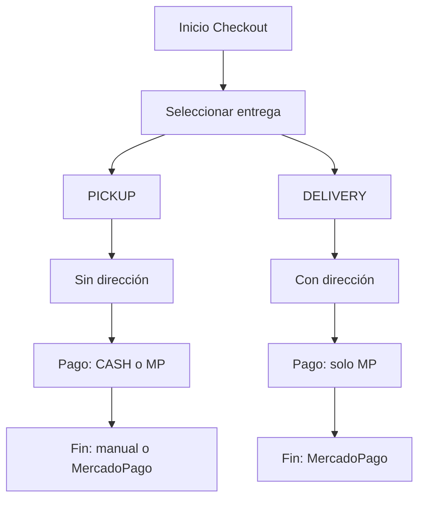
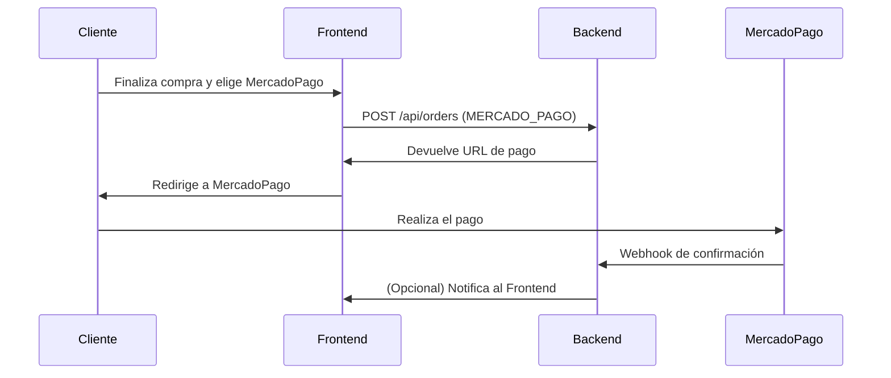
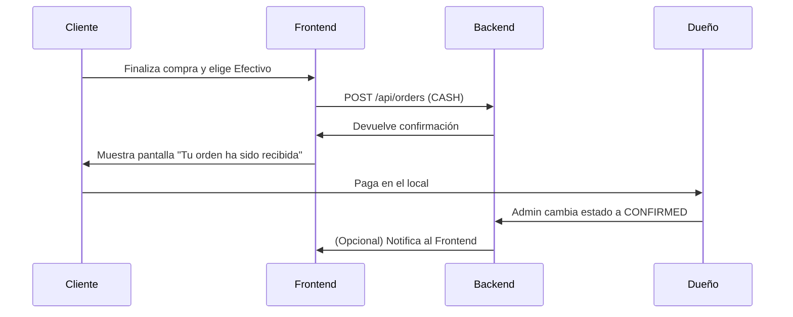

# 📝 Checkout: Métodos de Entrega y Pago (Frontend)

## 1. Diagramas de flujo

### Flujo general de checkout


### Flujo de pago con MercadoPago


### Flujo de pago en efectivo


---

## 2. Endpoints y ejemplos

### a) Obtener métodos de entrega
**GET** `/api/delivery-methods`

**Respuesta:**
```json
[
  { "code": "DELIVERY", "name": "Entrega a Domicilio", "requiresAddress": true },
  { "code": "PICKUP", "name": "Retiro en Local", "requiresAddress": false }
]
```

### b) Obtener métodos de pago activos
**GET** `/api/payment-methods/active`

**Respuesta:**
```json
[
  {
    "code": "MERCADO_PAGO",
    "name": "Mercado Pago",
    "requiresOnlinePayment": true,
    "allowsManualConfirmation": false,
    "isActive": true
  },
  {
    "code": "CASH",
    "name": "Efectivo",
    "requiresOnlinePayment": false,
    "allowsManualConfirmation": true,
    "isActive": true
  }
]
```

### c) Crear orden
**POST** `/api/orders`

**Headers:**
```
Content-Type: application/json
Authorization: Bearer <token>
```

**Body ejemplo para DELIVERY:**
```json
{
  "items": [ ... ],
  "selectedAddressId": "<addressId>",
  "deliveryMethodCode": "DELIVERY",
  "paymentMethodCode": "MERCADO_PAGO",
  "notes": "opcional"
}
```

**Body ejemplo para PICKUP:**
```json
{
  "items": [ ... ],
  "deliveryMethodCode": "PICKUP",
  "paymentMethodCode": "CASH",
  "notes": "opcional"
}
```

**Respuesta exitosa:**
```json
{
  "success": true,
  "message": "Orden creada exitosamente",
  "data": {
    "id": "orderId",
    "status": {
      "code": "AWAITING_PAYMENT",
      "name": "Esperando Pago",
      "color": "#fd7e14"
    },
    ...otros campos
  }
}
```

### d) Cambiar método de pago (opcional)
**PATCH** `/api/orders/:orderId/payment-method`

**Headers:**
```
Content-Type: application/json
Authorization: Bearer <token>
```

**Body ejemplo:**
```json
{
  "paymentMethodCode": "CASH"
}
```

**Respuesta:**
```json
{
  "success": true,
  "message": "Método de pago seleccionado exitosamente",
  "data": { ...order }
}
```

---

## 3. Estados de la orden y transiciones

| code               | name               | color     | Transiciones posibles           |
|--------------------|--------------------|-----------|---------------------------------|
| PENDING            | Pendiente          | #ffc107   | CONFIRMED, AWAITING_PAYMENT...  |
| PENDIENTE PAGADO   | Pendiente Pagado   | #28a745   | CONFIRMED, COMPLETED...         |
| CONFIRMED          | Confirmado         | #17a2b8   | COMPLETED, CANCELLED...         |
| AWAITING_PAYMENT   | Esperando Pago     | #fd7e14   | COMPLETED, CANCELLED...         |
| COMPLETED          | Completado         | #28a745   | CANCELLED                       |
| CANCELLED          | Cancelado          | #dc3545   | (ninguna)                       |

El campo `canTransitionTo` de cada estado indica a qué estados puede cambiarse desde el actual.

---

## 4. Guía paso a paso (Frontend)

1. Consultar `/api/delivery-methods` y mostrar opciones al usuario.
2. Si el método elegido requiere dirección (`requiresAddress: true`), mostrar formulario de dirección y requerirlo.
3. Consultar `/api/payment-methods/active` y mostrar solo los métodos válidos según el método de entrega:
   - Si es PICKUP: mostrar CASH y MERCADO_PAGO.
   - Si es DELIVERY: mostrar solo MERCADO_PAGO (o los que correspondan según backend).
4. Al crear la orden:
   - Si es DELIVERY, enviar `selectedAddressId` y `paymentMethodCode`.
   - Si es PICKUP, no enviar dirección y usar `paymentMethodCode` correspondiente.
5. Al seleccionar método de pago, hacer PATCH a `/api/orders/:orderId/payment-method` si es necesario.
6. Si es MERCADO_PAGO, redirigir al usuario al link de pago y esperar webhook para actualizar estado.
7. Si es CASH, mostrar confirmación manual y finalizar orden.
8. Mostrar el estado de la orden usando el campo `status` y su color.
9. En el panel admin, mostrar solo los botones de transición válidos según `canTransitionTo`.

---

**Notas:**
- Toda la lógica de visibilidad y validación debe basarse en los campos `requiresAddress`, `requiresOnlinePayment` y `canTransitionTo`.
- Consultar siempre los endpoints dinámicamente para mantener la UI sincronizada con la configuración del backend.
- Los modelos y flujos aquí documentados están alineados con la base de datos y la documentación backend.
