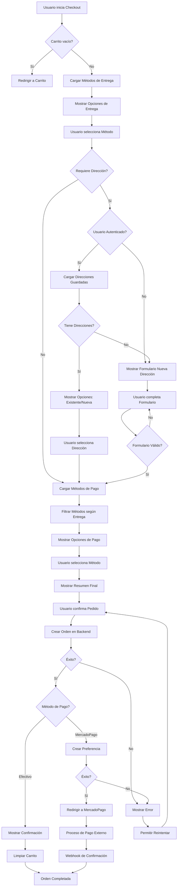
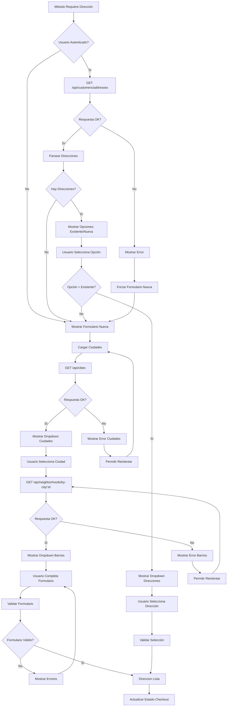
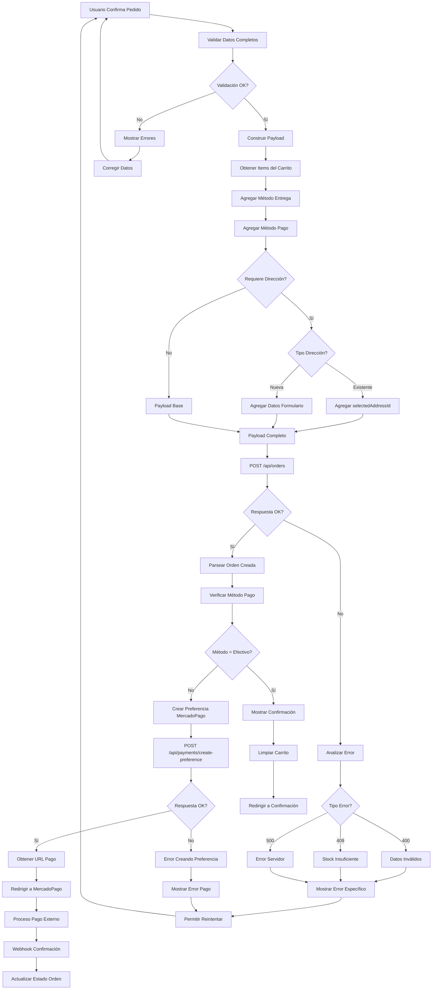
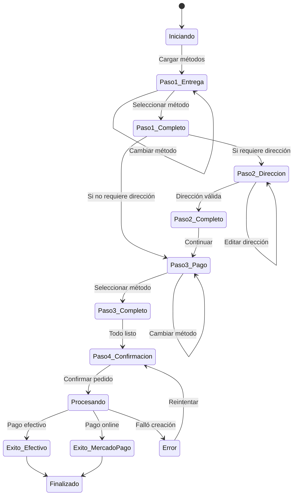
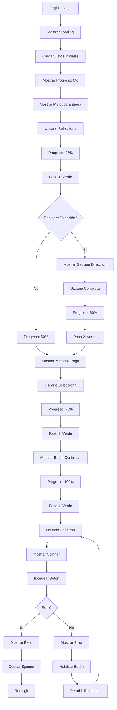
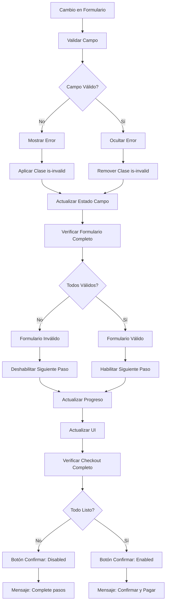
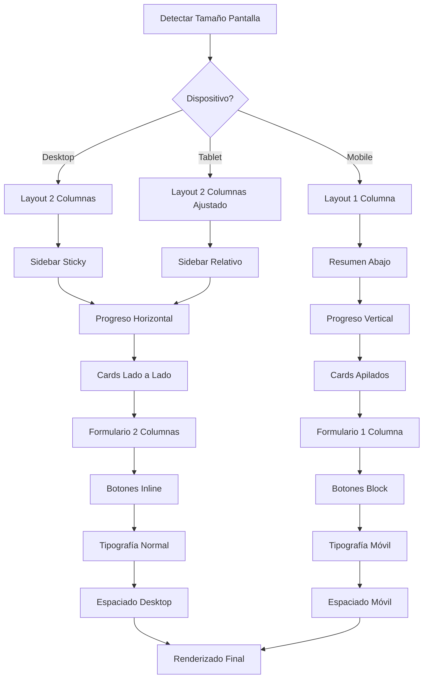

# 📊 Diagramas de Flujo - Sistema de Compras

## 🎯 Flujo General de Checkout



## 🚚 Flujo de Métodos de Entrega

```mermaid
graph TD
    A[Cargar Métodos de Entrega] --> B[GET /api/delivery-methods]
    B --> C{Respuesta OK?}
    
    C -->|No| D[Mostrar Error]
    C -->|Sí| E[Parsear Métodos]
    
    E --> F{Hay Métodos?}
    F -->|No| G[Mostrar "Sin Métodos"]
    F -->|Sí| H{Solo 1 Método?}
    
    H -->|Sí| I[Autoseleccionar]
    H -->|No| J[Mostrar Opciones]
    
    I --> K[Actualizar Estado]
    J --> L[Usuario Selecciona]
    L --> K
    
    K --> M[Verificar requiresAddress]
    M --> N{Requiere Dirección?}
    
    N -->|Sí| O[Mostrar Sección Dirección]
    N -->|No| P[Ocultar Sección Dirección]
    
    O --> Q[Filtrar Métodos de Pago]
    P --> Q
    
    Q --> R[Actualizar UI]
    
    D --> S[Botón Reintentar]
    S --> A
    G --> S
```

## 💳 Flujo de Métodos de Pago

```mermaid
graph TD
    A[Método de Entrega Seleccionado] --> B[GET /api/payment-methods/active]
    B --> C{Respuesta OK?}
    
    C -->|No| D[Usar Métodos Fallback]
    C -->|Sí| E[Parsear Métodos]
    
    E --> F[Filtrar según Método Entrega]
    F --> G{Método = PICKUP?}
    
    G -->|Sí| H[Mostrar Todos los Métodos]
    G -->|No| I[Mostrar Solo requiresOnlinePayment]
    
    H --> J{Hay Métodos?}
    I --> J
    
    J -->|No| K[Mostrar "Sin Métodos"]
    J -->|Sí| L{Solo 1 Método?}
    
    L -->|Sí| M[Autoseleccionar]
    L -->|No| N[Mostrar Opciones]
    
    M --> O[Actualizar Estado]
    N --> P[Usuario Selecciona]
    P --> O
    
    O --> Q[Verificar Validez Checkout]
    Q --> R[Actualizar UI]
    
    D --> S[Crear Método Efectivo Temporal]
    S --> T{Método = PICKUP?}
    T -->|Sí| U[Mostrar Efectivo]
    T -->|No| V[Mostrar Error]
    
    U --> O
    V --> W[Solicitar Recarga]
    W --> A
```

## 🏠 Flujo de Direcciones



## 🛒 Flujo de Creación de Orden



## 🔄 Estados de Progreso del Checkout



## 🎨 Flujo de UI y Estados Visuales



## 🔧 Flujo de Validaciones



## 📱 Flujo Responsive



---

## 🔗 Integración de Diagramas

Estos diagramas deben ser utilizados como referencia durante la implementación:

1. **Flujo General**: Guía la estructura principal del componente
2. **Flujos Específicos**: Detallan la lógica de cada servicio
3. **Estados de Progreso**: Definen la máquina de estados del checkout
4. **UI y Validaciones**: Orientan la experiencia del usuario
5. **Responsive**: Aseguran compatibilidad móvil

---

*📊 Diagramas creados: Enero 2025*
*🔄 Última actualización: Enero 2025*
*📝 Versión: 1.0.0*
