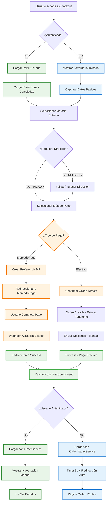
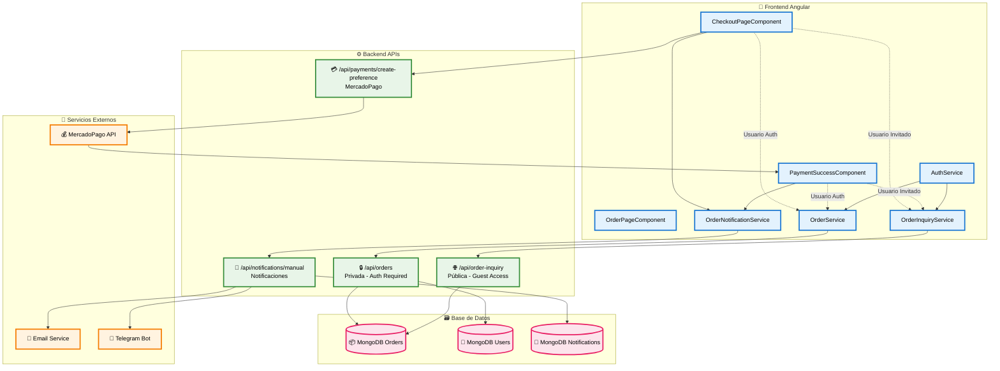
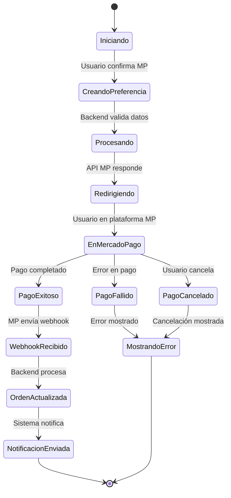
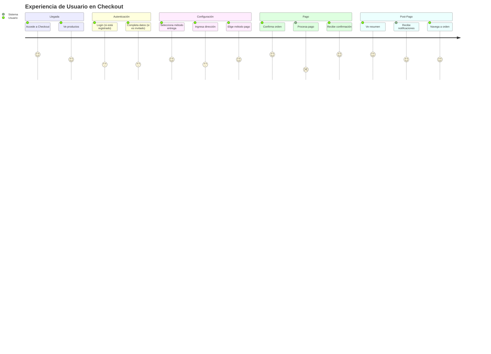

# Diagramas Mermaid Modernos v10+

Esta versión utiliza sintaxis moderna de Mermaid v10+ compatible con las extensiones más recientes.

## 🔄 Flujo Principal de Checkout (Moderno)

## 🏗️ Arquitectura Moderna con Subgrafos

## 💳 Flujo MercadoPago con Estados

## 🌊 Diagrama de Flujo de Usuario (Journey)

