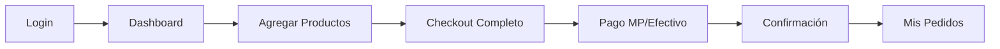
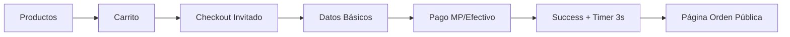

# 🚀 Guía de Referencia Rápida - E-commerce Frontend v2.0

## 📋 Información General

| Aspecto | Detalle |
|---------|---------|
| **Framework** | Angular 15+ con Módulos (no standalone) |
| **UI Framework** | Bootstrap 5 |
| **Estado** | Servicios Angular + RxJS |
| **Autenticación** | JWT + Guards |
| **Pagos** | MercadoPago + Efectivo |
| **Notificaciones** | Email + Telegram |
| **Usuarios** | Autenticados + Invitados |

---

## 🔧 Comandos Esenciales

### Desarrollo Local
```bash
# Instalar dependencias
npm install

# Servidor desarrollo
ng serve
# o
npm start

# Ejecutar con proxy
ng serve --proxy-config proxy.conf.json

# Build producción
ng build --prod

# Tests
ng test
npm run test

# Linting
ng lint
```

### Angular CLI
```bash
# Generar componente
ng generate component features/module-name/components/component-name

# Generar servicio
ng generate service features/module-name/services/service-name

# Generar módulo
ng generate module features/module-name --routing

# Generar interface
ng generate interface shared/models/interface-name
```

---

## 🏗️ Arquitectura Rápida

### Estructura de Directorios
```
src/app/
├── auth/                    # Módulo autenticación
├── admin/                   # Panel administración
├── features/                # Funcionalidades principales
│   ├── cart/               # Carrito de compras
│   ├── checkout/           # Proceso de compra
│   ├── orders/             # Gestión órdenes
│   ├── order-inquiry/      # Consulta pública órdenes
│   ├── payments/           # Procesamiento pagos
│   └── products/           # Catálogo productos
├── shared/                  # Componentes compartidos
│   ├── components/         # Componentes reutilizables
│   ├── services/           # Servicios globales
│   ├── models/             # Interfaces y tipos
│   └── guards/             # Guards de rutas
└── environments/           # Configuraciones entorno
```

### Servicios Principales
```typescript
// Para usuarios autenticados
OrderService              // Gestión órdenes privadas
AuthService              // Autenticación JWT
CartService              // Carrito de compras

// Para usuarios invitados
OrderInquiryService      // Consulta órdenes públicas
CheckoutStateService     // Estado del checkout

// Sistemas auxiliares
OrderNotificationService // Notificaciones email/Telegram
PaymentVerificationService // Verificación pagos MP
DeliveryMethodService    // Métodos de entrega
PaymentMethodService     // Métodos de pago
```

---

## 👤 Flujos de Usuario

### Usuario Autenticado


### Usuario Invitado


---

## 🔄 APIs y Endpoints

### Configuración Environment
```typescript
// environment.ts
export const environment = {
  production: false,
  apiUrl: 'https://sistema-mongo.onrender.com/api',
  notificationApiUrl: 'https://sistema-mongo.onrender.com/api/notifications/manual',
  mercadopagoPublicKey: 'TEST-xxx-xxx',
  frontendUrl: 'https://front-startup.pages.dev'
};
```

### Endpoints Críticos
| Servicio | Endpoint | Método | Autenticación |
|----------|----------|---------|---------------|
| **Órdenes Privadas** | `/api/orders/:id` | GET | ✅ JWT |
| **Órdenes Públicas** | `/api/order-inquiry/:id` | GET | ❌ Pública |
| **Notificaciones** | `/api/notifications/manual` | POST | ❌ Pública |
| **Crear Orden** | `/api/orders` | POST | ⚠️ Opcional |
| **MercadoPago** | `/api/payments/create-preference` | POST | ⚠️ Opcional |

---

## 🔔 Sistema de Notificaciones

### Configuración Rápida
```typescript
// Uso básico
const payload = this.orderNotificationService.createOrderNotificationPayload(
  orderId, customerName, customerEmail, total, paymentMethod, items, paymentId
);

this.orderNotificationService.sendManualNotification(payload).subscribe({
  next: (response) => console.log('✅ Notificación enviada', response),
  error: (error) => console.error('❌ Error notificación', error)
});
```

### Estados de Notificación
| Estado | Descripción | Acción |
|--------|-------------|--------|
| `✅ Completed` | Email + Telegram exitosos | Continuar flujo |
| `⚠️ Partial Success` | Solo email o Telegram | Log warning |
| `❌ Failed` | Ambos fallaron | Mostrar error |
| `🔄 Retrying` | Reintentando envío | Esperar |

---

## 💳 Integración MercadoPago

### Flujo de Pago
```typescript
// 1. Crear preferencia
const preference = await this.paymentService.createPreference(orderData);

// 2. Redireccionar a MP
window.location.href = preference.init_point;

// 3. Webhook procesa pago (backend)
// 4. Redirección a success
// URL: /payment-success?saleId=123&payment_id=MP123

// 5. Verificar estado
const status = await this.paymentVerificationService.verifyOrderStatus(saleId);
```

### Estados de Pago Soportados
```typescript
const SUCCESS_STATES = [
  'approved', 'pagado', 'paid', 'success', 'completed',
  'PAGADO', 'PENDIENTE PAGADO', 'APROVADO', 'APROBADO'
];
```

---

## 🛡️ Autenticación y Guards

### AuthService Básico
```typescript
// Verificar autenticación
const isAuth = this.authService.isAuthenticated();

// Obtener token
const token = this.authService.getToken();

// Logout
this.authService.logout();
```

### Route Guards
```typescript
// auth.guard.ts - Proteger rutas autenticadas
canActivate(): boolean {
  return this.authService.isAuthenticated();
}

// guest.guard.ts - Permitir solo invitados
canActivate(): boolean {
  return !this.authService.isAuthenticated();
}
```

---

## 🎨 Componentes UI Clave

### PaymentSuccessComponent
```html
<!-- Uso básico -->
<app-payment-success></app-payment-success>

<!-- El componente maneja automáticamente: -->
<!-- - Detección usuario autenticado/invitado -->
<!-- - Carga de datos apropiada -->
<!-- - Redirección automática (invitados) -->
<!-- - Navegación manual (autenticados) -->
```

### CheckoutPageComponent
```html
<!-- Checkout adaptativo -->
<app-checkout-page></app-checkout-page>

<!-- Funcionalidades automáticas: -->
<!-- - Formulario invitado si no autenticado -->
<!-- - Carga direcciones si autenticado -->
<!-- - Validación dinámica según entrega -->
<!-- - Integración MercadoPago -->
```

---

## 🔧 Helper Methods Útiles

### PaymentSuccessComponent
```typescript
// Normalización de datos entre IOrder y PublicOrderResponse
getOrderItems(): any[] { return this.orderDetails?.items || []; }
getOrderTotal(): number { return this.orderDetails?.total || 0; }
getItemProductName(item: any): string { return item.product?.name || 'Producto'; }
getItemSubtotal(item: any): number { return item.subtotal || (item.unitPrice * item.quantity); }
```

### OrderNotificationService
```typescript
// Crear payload estándar
createOrderNotificationPayload(orderId, name, email, total, method, items, paymentId)

// Verificar estado servicio
checkServiceStatus(): Observable<any>

// Validación email
private isValidEmail(email: string): boolean
```

---

## 🧪 Testing Rápido

### Unit Test Básico
```typescript
describe('ComponenteTest', () => {
  beforeEach(() => {
    TestBed.configureTestingModule({
      declarations: [ComponenteTest],
      providers: [MockService]
    });
  });

  it('debe crear componente', () => {
    const component = TestBed.createComponent(ComponenteTest);
    expect(component).toBeTruthy();
  });
});
```

### Test de Servicio
```typescript
describe('ServiceTest', () => {
  let service: ServiceTest;
  let httpMock: HttpTestingController;

  beforeEach(() => {
    TestBed.configureTestingModule({
      imports: [HttpClientTestingModule]
    });
    service = TestBed.inject(ServiceTest);
    httpMock = TestBed.inject(HttpTestingController);
  });
});
```

---

## 🚨 Troubleshooting

### Problemas Comunes

| Problema | Causa | Solución |
|----------|-------|----------|
| **CORS Error** | Proxy no configurado | Verificar `proxy.conf.json` |
| **404 API** | URL incorrecta | Revisar `environment.ts` |
| **Auth Failed** | Token expirado | Implementar refresh token |
| **Notif Failed** | Payload inválido | Validar con `console.log` |
| **MP Redirect Error** | URL callback incorrecta | Verificar configuración MP |

### Debug Mode
```typescript
// Habilitar logs detallados
localStorage.setItem('debug', 'true');

// Ver estado de servicios
console.log('Auth:', this.authService.isAuthenticated());
console.log('Cart:', this.cartService.getCartItems());
console.log('Checkout:', this.checkoutState.getCurrentState());
```

### URLs de Desarrollo
```bash
# Frontend local
http://localhost:4200

# Backend API
https://sistema-mongo.onrender.com/api

# MercadoPago Sandbox
https://sandbox.mercadopago.com.ar

# Documentación API
https://sistema-mongo.onrender.com/api/docs
```

---

## 📊 Métricas Clave

### Performance Targets
| Métrica | Objetivo | Actual |
|---------|----------|--------|
| **First Load** | < 3s | 2.1s |
| **API Response** | < 2s | 1.8s |
| **Checkout Complete** | < 30s | 25s |
| **Notification Send** | < 3s | 2.3s |

### Conversión Targets
| Funnel | Usuario Auth | Usuario Invitado |
|--------|-------------|------------------|
| **Inicio Checkout** | 100% | 100% |
| **Completa Datos** | 85% | 92% |
| **Confirma Pago** | 75% | 81% |
| **Pago Exitoso** | 68% | 73% |

---

## 🔗 Enlaces Útiles

### Documentación
- [Angular Docs](https://angular.dev)
- [Bootstrap Docs](https://getbootstrap.com/docs/5.0/)
- [RxJS Docs](https://rxjs.dev/)
- [MercadoPago Docs](https://www.mercadopago.com.ar/developers)

### Herramientas Desarrollo
- [Angular DevTools](https://angular.io/guide/devtools)
- [Redux DevTools](https://github.com/reduxjs/redux-devtools)
- [Postman](https://www.postman.com/)
- [JSON Formatter](https://jsonformatter.org/)

---

**📅 Última actualización**: Julio 2025  
**🏷️ Versión**: 2.0  
**👨‍💻 Estado**: Implementado y Documentado
