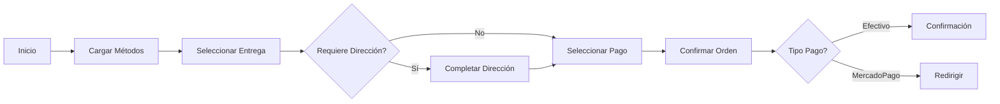

# ⚡ Guía de Referencia Rápida - Checkout E-commerce

## 🎯 Resumen Ejecutivo

Esta guía proporciona una referencia rápida para implementar el sistema de checkout robusto con múltiples métodos de pago y entrega.

---

## 🏗️ Estructura de Archivos

```
src/app/
├── features/checkout/
│   ├── components/checkout-page/
│   │   ├── checkout-page.component.ts       # Componente principal
│   │   ├── checkout-page.component.html     # Template con pasos
│   │   └── checkout-page.component.scss     # Estilos específicos
│   ├── services/
│   │   └── checkout-state.service.ts        # Estado global del checkout
│   └── models/
│       └── checkout-interfaces.ts           # Interfaces del checkout
├── shared/
│   ├── services/
│   │   ├── delivery-method.service.ts       # Métodos de entrega
│   │   └── payment-method.service.ts        # Métodos de pago
│   └── models/
│       ├── idelivery-method.ts              # Interface método entrega
│       └── ipayment-method.ts               # Interface método pago
└── docs_frontend/
    ├── checkout-flujo-compras-robusto.md    # Documentación completa
    ├── plan-implementacion-completo.md      # Plan detallado
    └── diagramas-flujo-checkout.md          # Diagramas de flujo
```

---

## 📋 Checklist de Implementación

### ✅ Paso 1: Modelos e Interfaces
```typescript
// idelivery-method.ts
export interface IDeliveryMethod {
  id: string;
  code: string;
  name: string;
  description?: string;
  requiresAddress: boolean;
  isActive: boolean;
}

// ipayment-method.ts
export interface IPaymentMethod {
  _id: string;
  name: string;
  code: string;
  description: string;
  requiresOnlinePayment: boolean;
  isActive: boolean;
}
```

### ✅ Paso 2: Servicios Core
```typescript
// delivery-method.service.ts
@Injectable({ providedIn: 'root' })
export class DeliveryMethodService {
  getActiveDeliveryMethods(): Observable<IDeliveryMethod[]> {
    return this.http.get<IDeliveryMethod[]>(`${this.apiUrl}/delivery-methods`);
  }
}

// payment-method.service.ts
@Injectable({ providedIn: 'root' })
export class PaymentMethodService {
  getActivePaymentMethods(): Observable<IPaymentMethod[]> {
    return this.http.get<IPaymentMethod[]>(`${this.apiUrl}/payment-methods/active`);
  }
  
  filterPaymentMethodsByDelivery(methods: IPaymentMethod[], deliveryCode: string): IPaymentMethod[] {
    return deliveryCode === 'PICKUP' ? methods : methods.filter(m => m.requiresOnlinePayment);
  }
}
```

### ✅ Paso 3: Estado Global
```typescript
// checkout-state.service.ts
@Injectable({ providedIn: 'root' })
export class CheckoutStateService {
  private selectedDeliveryMethodSubject = new BehaviorSubject<IDeliveryMethod | null>(null);
  private selectedPaymentMethodIdSubject = new BehaviorSubject<string | null>(null);
  
  isCheckoutValid$ = combineLatest([
    this.selectedDeliveryMethod$,
    this.selectedPaymentMethodId$,
    this.shippingAddress$
  ]).pipe(
    map(([delivery, payment, address]) => {
      if (!delivery || !payment) return false;
      if (delivery.requiresAddress && !address) return false;
      return true;
    })
  );
}
```

### ✅ Paso 4: Componente Principal
```typescript
// checkout-page.component.ts
export class CheckoutPageComponent implements OnInit {
  selectedDeliveryMethod: IDeliveryMethod | null = null;
  selectedPaymentMethod: string | null = null;
  
  selectDeliveryMethod(method: IDeliveryMethod): void {
    this.selectedDeliveryMethod = method;
    this.updateAvailablePaymentMethods(method);
  }
  
  confirmOrder(): void {
    this.validateOrderBeforeCreation();
    const orderPayload = this.buildOrderPayload();
    this.processOrder(orderPayload);
  }
}
```

---

## 🔌 Endpoints Backend

### Métodos de Entrega
```http
GET /api/delivery-methods
Response: IDeliveryMethod[]
```

### Métodos de Pago
```http
GET /api/payment-methods/active
Response: IPaymentMethod[]
```

### Crear Orden
```http
POST /api/orders
Body: ICreateOrderPayload
Response: { success: boolean, data: IOrder }
```

### Crear Preferencia MercadoPago
```http
POST /api/payments/create-preference
Body: { orderId: string }
Response: { preference: { init_point: string } }
```

---

## 🎨 Estructura del Template

```html
<!-- Progreso -->
<div class="progress-indicator">
  <div class="step" [class.completed]="isStep1Complete()">Entrega</div>
  <div class="step" [class.completed]="isStep2Complete()">Dirección</div>
  <div class="step" [class.completed]="isStep3Complete()">Pago</div>
  <div class="step" [class.completed]="canShowStep4()">Confirmar</div>
</div>

<!-- Paso 1: Método de Entrega -->
<div class="delivery-methods">
  <div *ngFor="let method of availableDeliveryMethods" 
       (click)="selectDeliveryMethod(method)"
       [class.selected]="isDeliveryMethodSelected(method)">
    {{ method.name }}
  </div>
</div>

<!-- Paso 2: Dirección (si requiere) -->
<div *ngIf="selectedDeliveryMethod?.requiresAddress">
  <form [formGroup]="newAddressForm">
    <!-- Campos de dirección -->
  </form>
</div>

<!-- Paso 3: Método de Pago -->
<div *ngIf="canShowStep3()">
  <div *ngFor="let method of availablePaymentMethods">
    <input type="radio" 
           [value]="method._id"
           (change)="selectPaymentMethod(method._id)">
    {{ method.name }}
  </div>
</div>

<!-- Paso 4: Confirmación -->
<button *ngIf="canShowStep4()" 
        (click)="confirmOrder()"
        [disabled]="isProcessingOrder">
  Confirmar Pedido
</button>
```

---

## 🔄 Flujo de Estados



---

## 🧪 Tests Críticos

### Test de Flujo Completo
```typescript
describe('Checkout Flow', () => {
  it('debe completar checkout pickup + efectivo', () => {
    component.selectDeliveryMethod(pickupMethod);
    component.selectPaymentMethod(cashMethodId);
    component.confirmOrder();
    
    expect(orderService.createOrder).toHaveBeenCalledWith({
      deliveryMethodId: pickupMethod.id,
      paymentMethodId: cashMethodId,
      items: mockItems
    });
  });
});
```

### Test de Validaciones
```typescript
describe('Validations', () => {
  it('debe requerir dirección para delivery', () => {
    component.selectDeliveryMethod(deliveryMethod);
    expect(() => component.confirmOrder()).toThrow('dirección válida');
  });
});
```

---

## 🚨 Manejo de Errores

### Errores de Validación
```typescript
private validateOrderBeforeCreation(): void {
  if (!this.selectedDeliveryMethod) {
    throw new Error('Selecciona un método de entrega');
  }
  
  if (!this.selectedPaymentMethod) {
    throw new Error('Selecciona un método de pago');
  }
  
  if (this.selectedDeliveryMethod.requiresAddress && !this.isAddressValid()) {
    throw new Error('Completa una dirección válida');
  }
}
```

### Errores de Backend
```typescript
private handleOrderError(error: any): void {
  let message = 'Error al procesar pedido';
  
  switch (error.status) {
    case 400: message = 'Datos inválidos'; break;
    case 409: message = 'Stock insuficiente'; break;
    case 500: message = 'Error del servidor'; break;
  }
  
  this.notificationService.showError(message);
}
```

---

## 📱 Responsive Design

### Breakpoints
```scss
// Desktop
@media (min-width: 992px) {
  .checkout-container {
    display: grid;
    grid-template-columns: 1fr 400px;
    gap: 2rem;
  }
}

// Mobile
@media (max-width: 991px) {
  .checkout-container {
    display: block;
  }
  
  .summary-sidebar {
    position: static;
    margin-top: 2rem;
  }
}
```

---

## ⚡ Optimizaciones

### Caching
```typescript
// delivery-method.service.ts
private cache$ = new BehaviorSubject<IDeliveryMethod[]>([]);
private cacheExpiration = 5 * 60 * 1000; // 5 minutos

getActiveDeliveryMethods(): Observable<IDeliveryMethod[]> {
  if (this.isCacheValid()) {
    return this.cache$.asObservable();
  }
  
  return this.http.get<IDeliveryMethod[]>('/api/delivery-methods')
    .pipe(tap(methods => this.cache$.next(methods)));
}
```

### Lazy Loading
```typescript
// checkout-routing.module.ts
{
  path: 'checkout',
  loadChildren: () => import('./checkout.module').then(m => m.CheckoutModule)
}
```

---

## 🔧 Configuración de Desarrollo

### Variables de Entorno
```typescript
// environment.ts
export const environment = {
  apiUrl: 'http://localhost:3000',
  mercadoPagoPublicKey: 'TEST-xxxxx',
  enableCache: true
};
```

### Comandos Útiles
```bash
# Desarrollo
npm run start

# Tests
npm run test

# Build
npm run build

# Análisis
npm run build:analyze
```

---

## 📊 Métricas de Éxito

### KPIs Técnicos
- ✅ Tiempo de carga < 3 segundos
- ✅ Tasa de error < 1%
- ✅ Cobertura de tests > 80%
- ✅ Bundle size < 500KB

### KPIs de Negocio
- ✅ Reducción de carritos abandonados
- ✅ Aumento en conversiones
- ✅ Mejora en UX score
- ✅ Reducción de tickets soporte

---

## 🔗 Enlaces Útiles

- [Documentación Completa](./checkout-flujo-compras-robusto.md)
- [Plan de Implementación](./plan-implementacion-completo.md)
- [Diagramas de Flujo](./diagramas-flujo-checkout.md)
- [API Backend - Orders](../docs_backend/api-orders.md)
- [API Backend - Payments](../docs_backend/payment-methods-manual.md)

---

## 🆘 Troubleshooting

### Problemas Comunes

**1. Métodos de entrega no cargan**
```typescript
// Verificar endpoint
console.log('API URL:', environment.apiUrl);
// Verificar respuesta
this.http.get('/api/delivery-methods').subscribe(console.log);
```

**2. Validaciones no funcionan**
```typescript
// Verificar estado del formulario
console.log('Form valid:', this.newAddressForm.valid);
console.log('Form errors:', this.newAddressForm.errors);
```

**3. Orden no se crea**
```typescript
// Verificar payload
console.log('Order payload:', orderPayload);
// Verificar headers
console.log('Auth header:', this.authService.getToken());
```

---

*⚡ Guía de referencia - Enero 2025*
*📝 Versión: 1.0.0*
