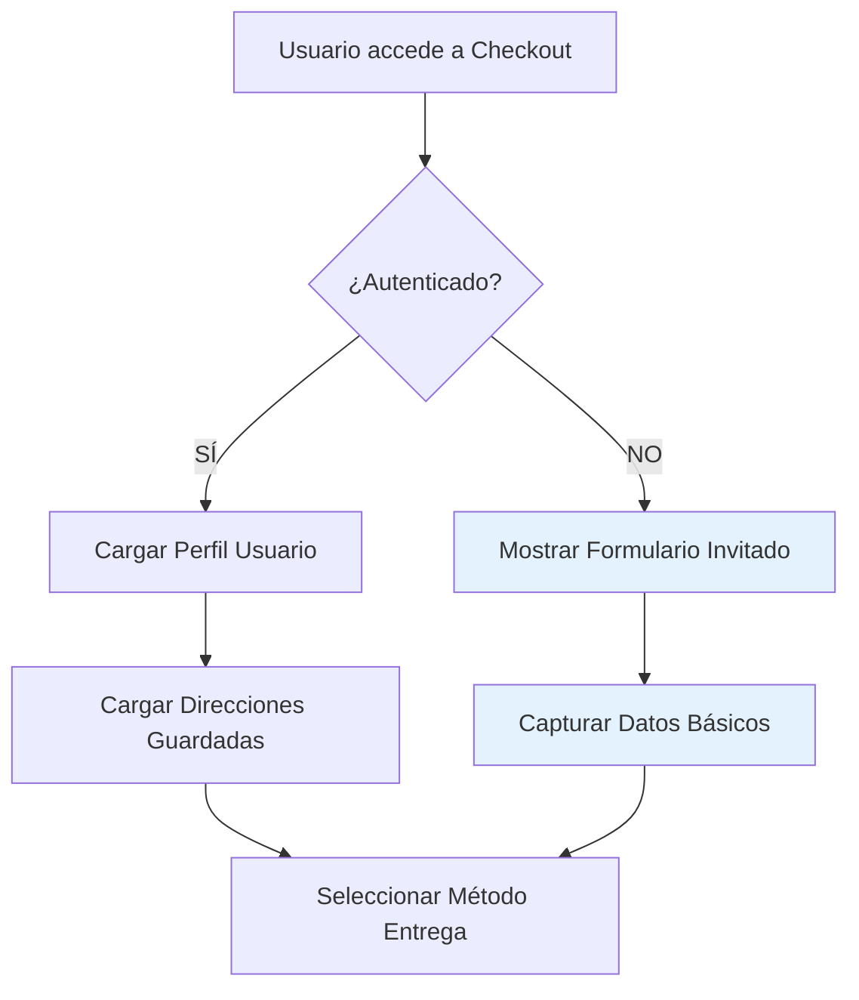
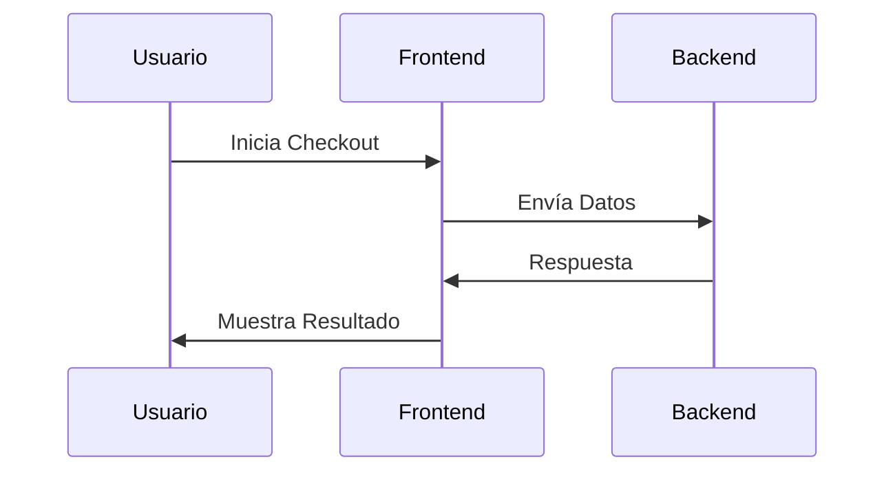

# Test Mermaid 8.8.0 Compatibility

Este archivo es solo para probar la compatibilidad con Mermaid 8.8.0.

## Test 1: Graph TD (Funciona en 8.8.0)



## Test 2: Sequence Diagram (Funciona en 8.8.0)



## Test 3: Graph TB (Funciona en 8.8.0)

```mermaid
graph TB
    subgraph "Frontend Angular"
        A[CheckoutPageComponent]
        B[PaymentSuccessComponent]
    end
    
    subgraph "Backend APIs"
        C[/api/orders]
        D[/api/payments]
    end
    
    A --> C
    B --> D
    
    style A fill:#c8e6c9
    style B fill:#e1f5fe
```
